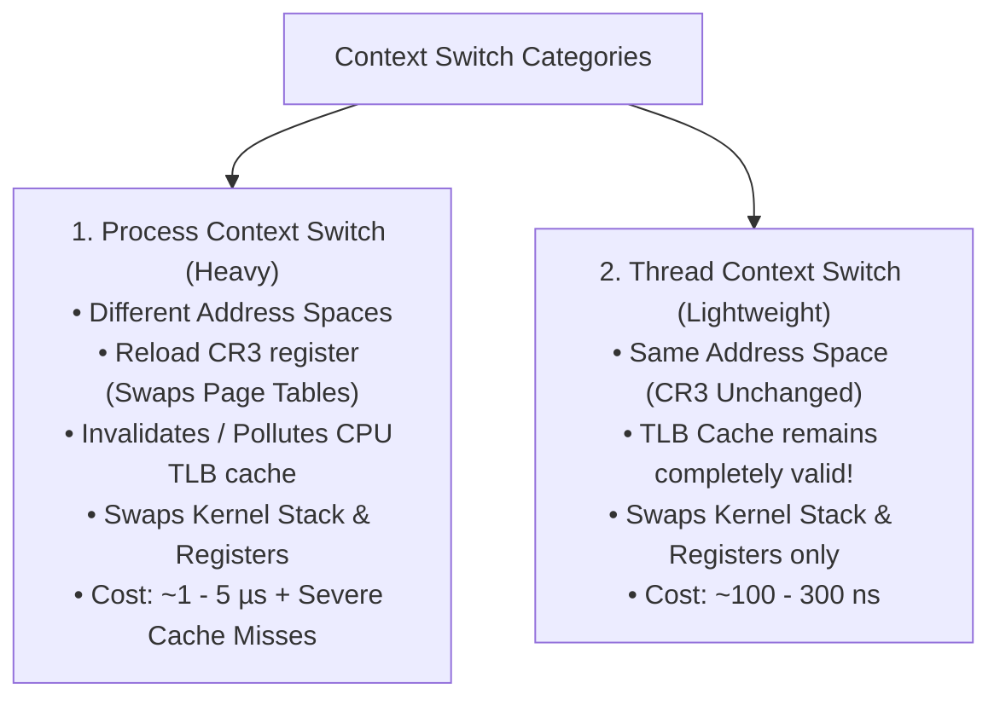
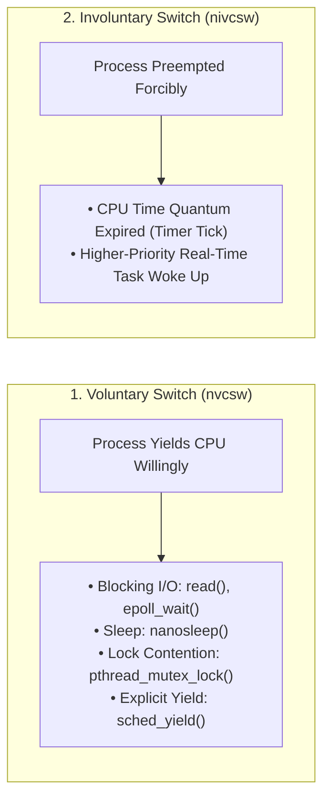
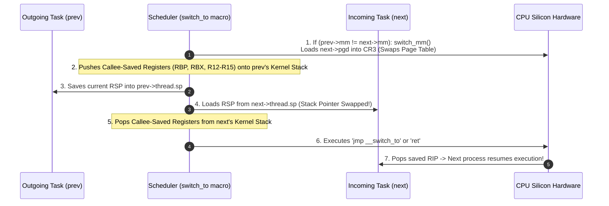

# Context Switching

> [!abstract] Mental Model
> A Context Switch is the **computational sleight of hand that enables multitasking**. The CPU pauses an executing thread, freezes its exact register state into its [[Process Control Block|PCB]], swaps the CPU's stack pointer and page table root, and unfreezes another thread. This occurs thousands of times per second per core, creating the seamless illusion that hundreds of programs are running simultaneously on a handful of physical CPU cores.

---

## Process Context Switch vs Thread Context Switch

One of the most foundational architectural distinctions in systems design:



| Dimension | Process Context Switch | Thread Context Switch |
| :--- | :--- | :--- |
| **Virtual Address Space (`CR3`)** | **Swapped** to new process page tables. | **Unchanged** (Threads share the same `mm_struct`). |
| **TLB Cache Impact** | **Flushed / Invalidated** (unless PCID is active). | **Preserved** (Zero TLB shootdown or flush). |
| **CPU Cache Pollution** | **Severe**: Displaces L1/L2 data & instruction lines. | **Low**: Threads often operate on shared memory/code. |
| **Hardware State Swapped** | `CR3`, `RSP`, `RIP`, GPRs, FPU/AVX state. | `RSP`, `RIP`, GPRs, FPU/AVX state. |
| **Direct Hardware Latency** | ~1.0 – 5.0 $\mu\text{s}$ | ~0.1 – 0.3 $\mu\text{s}$ |

---

## Voluntary vs Involuntary Context Switches

Every context switch is classified by its triggering mechanism:



- **Voluntary Context Switches (`nvcsw`)**: Occur when a task cannot make computational progress because it is waiting for a resource.
- **Involuntary Context Switches (`nivcsw`)**: Occur when a task *wants* to keep computing, but the OS scheduler forcefully preempts it to ensure fairness.

---

## Step-by-Step Assembly Mechanics of `switch_to()` (x86-64)

In Linux, when the scheduler calls `__schedule()`, it selects the `next` task and calls `context_switch()`:



```nasm
; Simplified x86-64 Linux switch_to Assembly Routine:
ENTRY(__switch_to_asm)
    ; 1. Save outgoing process's registers onto its own kernel stack
    pushq   %rbp
    pushq   %rbx
    pushq   %r12
    pushq   %r13
    pushq   %r14
    pushq   %r15

    ; 2. Swap stack pointers in task_struct
    movq    %rsp, TASK_threadsp(%rdi)     ; prev->thread.sp = RSP
    movq    TASK_threadsp(%rsi), %rsp     ; RSP = next->thread.sp (STACK SWAPPED!)

    ; 3. Restore incoming process's registers from its own kernel stack
    popq    %r15
    popq    %r14
    popq    %r13
    popq    %r12
    popq    %rbx
    popq    %rbp

    ; 4. Return to the instruction address saved on next's stack
    retq
```

---

## The Hidden Cost: CPU Cache Pollution & TLB Invalidation

The direct CPU instruction cost of saving and restoring 16 registers is only **~50 nanoseconds**. The real, devastating performance cost of context switching is **Indirect Cache Pollution**:

```text
CPU Cache Hierarchy Disruption:
+-------------------------------------------------------------------------------+
| 1. L1 Instruction & Data Cache (32 KB):                                       |
|    Process A fills L1 cache with hot loop variables and array buffers.        |
+-------------------------------------------------------------------------------+
| 2. Context Switch to Process B:                                               |
|    Process B runs, completely evicting Process A's cache lines from L1 & L2.  |
+-------------------------------------------------------------------------------+
| 3. Context Switch back to Process A:                                          |
|    Process A resumes, but EVERY memory read now misses L1/L2, stalling the   |
|    CPU pipeline for 200+ cycles while fetching from main DRAM!               |
+-------------------------------------------------------------------------------+
```

### Hardware Optimization: PCID (Process Context Identifiers)
Historically, reloading the `CR3` register flushed the entire **Translation Lookaside Buffer (TLB)**, requiring slow page table walks for every subsequent memory access. Modern x86-64 CPUs feature **PCID (tagged TLB)**:
- The CPU tags TLB cache entries with a 12-bit Process ID (0..4095).
- Reloading `CR3` with PCID enabled **does NOT flush the TLB**, allowing cached translations from previous processes to remain valid when switched back!

---

## Production Problem: Thread Thrashing in Backend Services

A frequent high-concurrency production anti-pattern:

```text
The Thread Pool Explosion Failure:
1. A Java/Python backend service receives 10,000 concurrent HTTP requests.
2. The server spawns 10,000 OS threads (1 thread per request).
3. With only 16 physical CPU cores, each core must juggle ~625 threads.
4. The system spends 80% of its CPU time executing context switches (high %sy),
   and only 20% executing actual business logic (%us).
5. CONSEQUENCE: p99 latency spikes from 10ms to 5,000ms (Throughput collapses!).
```

### The Architectural Remedy:
- Replace thread-per-request models with **Non-Blocking Event Loops** (Node.js, Nginx, Netty) or **Lightweight Green Threads / Goroutines** (Go, Java Project Loom), where millions of user-space tasks run on a fixed pool of $N$ OS threads (where $N = \text{number of CPU cores}$).

---

## Practical Diagnostics & Observability Commands

```bash
# 1. View voluntary vs involuntary context switches for a specific process every 1 second
pidstat -w -p <PID> 1

# Example Output:
# Time    UID   PID   cswch/s   nvcswch/s  Command
# 11:40   1000  1042  15240.00  12.00      java (High voluntary = Lock contention / I/O)
# 11:40   1000  2045  15.00     8500.00    ffmpeg (High involuntary = CPU saturated)

# 2. System-wide context switch rate per second
vmstat 1
# Inspect the 'cs' (Context Switches) column:
# Healthy: < 10,000 cs/sec per core. Saturated/Thrashing: > 100,000 cs/sec.

# 3. Measure hardware CPU cache misses caused by context switching
sudo perf stat -e context-switches,cpu-migrations,cache-misses,L1-dcache-load-misses -p <PID> sleep 5
```

---

## Active Recall & Interview Perspective

### Reasoning Prompts
1. *What is the difference between voluntary (`cswch/s`) and involuntary (`nvcswch/s`) context switches in `pidstat` output?*
   - **Answer**: Voluntary context switches occur when a thread blocks on an external resource (waiting for network I/O, disk read, mutex lock, or sleeping). Involuntary context switches occur when a thread is compute-bound and wants to keep executing, but the scheduler forcefully preempts it because its CPU time quantum expired or a higher-priority task became runnable.
2. *Why is a thread context switch significantly faster than a process context switch?*
   - **Answer**: Threads in the same process share the same virtual address space (`mm_struct`). Therefore, a thread context switch does not modify the CPU's `CR3` page table register, avoiding expensive TLB cache invalidation and minimizing L1/L2 cache displacement. It only swaps CPU registers, stack pointers (`RSP`), and program counters (`RIP`).
3. *What is PCID (Process Context Identifier) and how does it optimize context switching?*
   - **Answer**: PCID is a CPU hardware feature in x86-64 that tags TLB cache entries with a process identifier. Without PCID, every process context switch requires flushing the entire TLB cache when `CR3` is reloaded. With PCID, the CPU preserves existing TLB entries across switches, dramatically reducing page table walk latency when switching back to recently run processes.

---

## Key Takeaways
- A **Context Switch** saves the active execution state into the PCB and restores another task.
- **Process context switches** reload `CR3` and invalidate memory mappings; **thread context switches** maintain the same address space.
- The largest performance penalty is **indirect CPU cache pollution** and TLB invalidation, making thread over-provisioning a major production bottleneck.

---

## Related Notes
- [[Operating System]] — CPU multiplexing.
- [[Kernel]] — Scheduler dispatch loops in Ring 0.
- [[User Mode vs Kernel Mode]] — Distinguishing mode switches from context switches.
- [[Process Control Block]] — `task_struct->thread` register preservation.
- [[CPU Scheduler and Dispatcher]] — Scheduling algorithms triggering context switches.
- [[Translation Lookaside Buffer - TLB]] — Hardware MMU caching and PCID tags.
- [[Thread Pools and Worker Queues]] — Sizing thread pools to prevent context switch thrashing.
- [[Operating Systems MOC]] — Master table of contents for Operating Systems.
