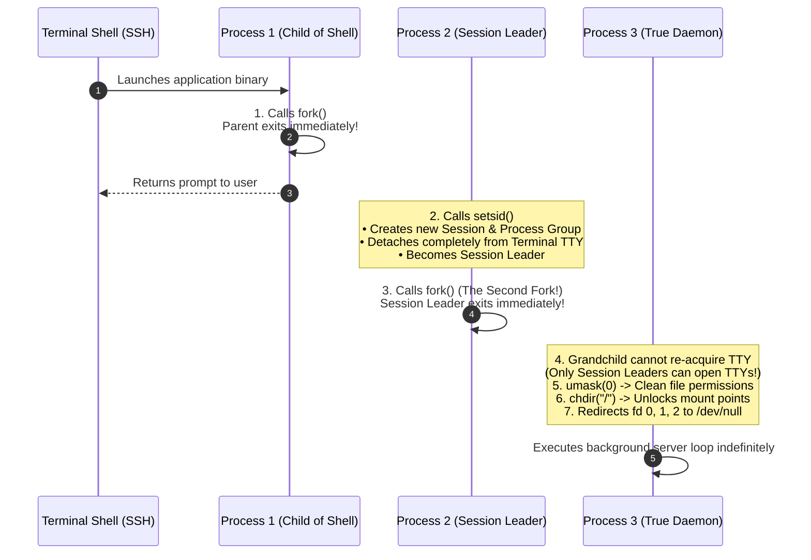
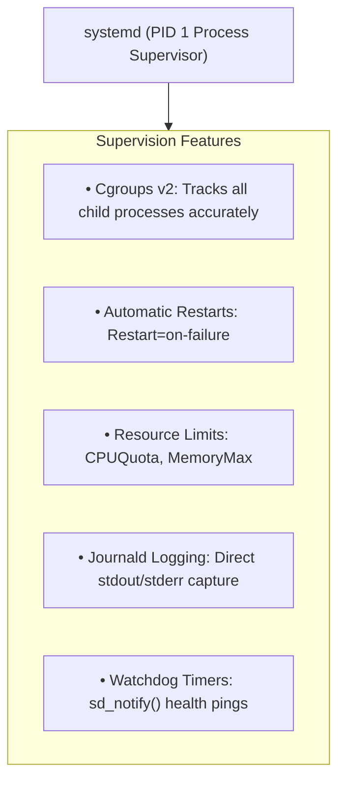

# Daemons and Background Services

> [!abstract] Mental Model
> A **Daemon** is a **headless, background background process running without an attached controlling terminal (TTY)**. Daemons start during system boot or background dispatch and sleep silently until awakened by an incoming network packet, a scheduled timer tick, or a filesystem event (e.g., `sshd`, `systemd`, `mysqld`, `crond`).

---

## Why Daemons Exist

Standard interactive processes are bound to a **Controlling Terminal (TTY/PTY)**. If you start a web server inside an SSH session and close your laptop:
1. The kernel detects the broken network connection.
2. The terminal driver sends a **Hangup Signal (`SIGHUP`)** to the Session Leader.
3. The signal cascades down the Process Group, **terminating the web server**.

Daemons exist to **decouple long-running services from interactive terminal sessions**, ensuring background execution persists indefinitely regardless of user logins or SSH disconnects.

---

## The Classic Unix "Double-Fork" Daemonization Idiom

Historically, converting a normal process into a true daemon required a strict 6-step ritual:



---

## Step-by-Step Breakdown of the Classical Ritual

### 1. The First `fork()` & Parent `exit()`
The parent process terminates immediately, returning control to the user's terminal prompt. The child continues running in the background as an orphan (adopted by `PID 1`).

### 2. `setsid()` (Create New Session & Detach TTY)
The child calls `setsid()`:
- Becomes the leader of a brand-new Session.
- Becomes the leader of a brand-new Process Group.
- **Completely detaches from the controlling terminal (TTY)**, immunizing the process from terminal `SIGHUP` and `SIGINT` signals.

### 3. The Second `fork()` (Prevent TTY Re-Acquisition)
In System V Unix, if a Session Leader opens a terminal device file (e.g., `/dev/tty`), that terminal automatically becomes the controlling terminal for the session.
- By calling `fork()` a second time and letting the Session Leader die, the grandchild is **no longer a Session Leader**.
- The grandchild **can never accidentally acquire a controlling terminal**, even if it opens a modem or serial port device!

### 4. `umask(0)`
Resets the file creation permission mask inherited from the user's shell so the daemon can explicitly create files with intended permissions (`0644`, `0755`).

### 5. `chdir("/")`
Changes working directory to the filesystem root. If the daemon remained in `/mnt/data/app` and an admin tried to unmount `/mnt/data`, the kernel would block the unmount with `Device or resource busy`.

### 6. Closing & Redirecting Standard I/O (Descriptors 0, 1, 2)
```c
close(STDIN_FILENO);
close(STDOUT_FILENO);
close(STDERR_FILENO);
// Re-open descriptors to /dev/null to prevent crashing libraries that write to stdout
int null_fd = open("/dev/null", O_RDWR);
dup2(null_fd, STDIN_FILENO);
dup2(null_fd, STDOUT_FILENO);
dup2(null_fd, STDERR_FILENO);
```

---

## Modern Production Paradigm: `systemd` Unit Services

In modern Linux distributions, the classical double-fork ritual is considered an **anti-pattern**. Instead, services run as foreground processes managed cleanly by **`systemd`**:



### Production `systemd` Unit File (`/etc/systemd/system/backend.service`):
```ini
[Unit]
Description=Production Payment Dispatcher Daemon
After=network.target postgresql.service
Wants=postgresql.service

[Service]
Type=notify
ExecStart=/usr/local/bin/payment-service --config /etc/payment.conf
Restart=always
RestartSec=5s
User=appuser
Group=appgroup

# Security & Sandboxing
ProtectSystem=strict
ProtectHome=true
NoNewPrivileges=true
PrivateTmp=true

# Resource Governance via Cgroups v2
MemoryMax=2G
CPUQuota=200%

# Watchdog Health Checking (Ping every 10 seconds)
WatchdogSec=10s

[Install]
WantedBy=multi-user.target
```

---

## Signal Handling in Production Daemons

Daemons must handle standard POSIX signals to enable zero-downtime maintenance:

```text
+-------------------+-----------------------------------------------------------+
| Signal            | Standard Production Daemon Action                         |
+-------------------+-----------------------------------------------------------+
| SIGHUP (1)        | Reload Configuration files & rotate log files in-memory   |
|                   | without dropping active client connections (Zero-Downtime)|
+-------------------+-----------------------------------------------------------+
| SIGTERM (15)      | Graceful Shutdown: Stop accepting new requests, finish    |
|                   | in-flight database transactions, and exit with code 0.    |
+-------------------+-----------------------------------------------------------+
| SIGQUIT (3)       | Graceful Worker Termination (used by Nginx/Gunicorn).     |
+-------------------+-----------------------------------------------------------+
| SIGUSR1 / SIGUSR2 | Custom application triggers (e.g., dump heap/goroutines). |
+-------------------+-----------------------------------------------------------+
```

---

## Production Diagnostics & Observability Commands

```bash
# 1. View all running daemons with no controlling terminal (indicated by '?' in TTY column)
ps -eo pid,ppid,tty,stat,user,comm | awk '$3 == "?" {print $0}' | head -n 25

# 2. Inspect real-time status and cgroup hierarchy of a systemd background daemon
systemctl status nginx.service

# 3. Stream live logs from a specific daemon via journald
journalctl -u nginx.service -f -n 50

# 4. Trigger zero-downtime configuration reload via SIGHUP
sudo systemctl reload nginx
# OR manually:
sudo kill -HUP $(cat /var/run/nginx.pid)

# 5. Inspect CPU and memory cgroup usage for active systemd service units
systemd-cgtop
```

---

## Active Recall & Interview Perspective

### Reasoning Prompts
1. *Why does the classical Unix daemonization process perform `fork()` twice instead of once?*
   - **Answer**: The first `fork()` detaches the process from the parent terminal. Calling `setsid()` makes the child a **Session Leader** with no controlling terminal. However, on System V Unix systems, a Session Leader can automatically re-acquire a controlling terminal if it ever opens a TTY device. The second `fork()` ensures that the running daemon process is a child of the Session Leader and **not a Session Leader itself**, making it mathematically impossible for the process to ever re-acquire a controlling terminal.
2. *Why is classical double-forking discouraged in modern systemd environments?*
   - **Answer**: When a process double-forks, it disconnects from its parent hierarchy, making it difficult for a process supervisor to track its final PID. If the daemon spawns worker processes and crashes, the supervisor cannot know which PIDs to clean up. `systemd` solves this by using **Cgroups v2** to contain all child processes within a dedicated cgroup slice, tracking every process unambiguously regardless of how many times it forks.
3. *What is `SIGHUP` used for in production web servers like Nginx or Apache?*
   - **Answer**: When Nginx receives `SIGHUP`, the master process parses and validates the updated configuration file. If valid, it spawns new worker processes with the new configuration, binds to existing listening sockets, and sends `SIGQUIT` to the old workers (instructing them to drain existing client connections and gracefully terminate). This achieves seamless **zero-downtime configuration reloading**.

---

## Key Takeaways
- **Daemons** are long-running background services detached from controlling terminals (`TTY = ?`).
- The classical **double-fork idiom** uses `fork()`, `setsid()`, and a second `fork()` to completely sever terminal linkages.
- Modern Linux manages background services declaratively via **`systemd`**, leveraging **Cgroups v2** for process tracking, automated restarts, and resource caps.

---

## Related Notes
- [[Operating System]] — OS service architectures.
- [[Process States and Lifecycle]] — `TASK_INTERRUPTIBLE` background states.
- [[Process Control Block]] — `task_struct` session and process group linkage.
- [[Process Creation and Termination - fork, exec, wait, exit]] — `fork()` and `setsid()` mechanics.
- [[Zombie and Orphan Processes]] — Orphan reparenting and subreapers.
- [[OS-Level Virtualization - Linux Namespaces and cgroups]] — Cgroups powering systemd service isolation.
- [[Operating Systems MOC]] — Master table of contents for Operating Systems.
