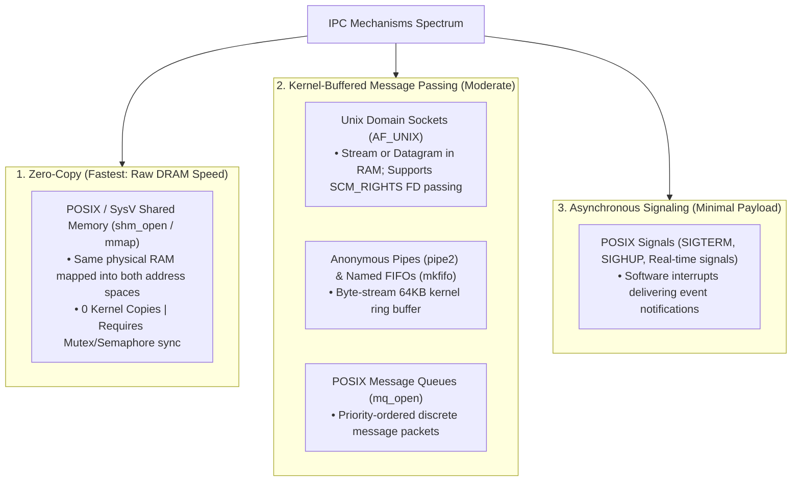
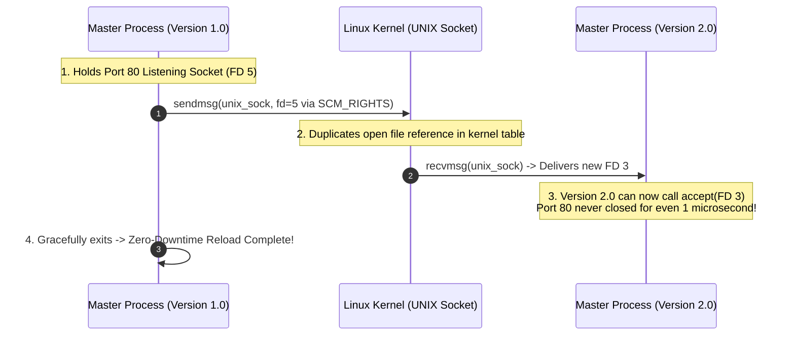

# Inter-Process Communication (IPC)

> [!abstract] Mental Model
> While the OS enforces strict [[Process Address Space|Virtual Address Space Isolation]] to prevent rogue processes from corrupting each other, modern multi-process software (such as databases, browsers, and container engines) requires high-speed data exchange. **Inter-Process Communication (IPC)** provides the safe, controlled transport bridges—ranging from simple kernel-buffered byte pipes to raw **zero-copy shared memory regions** executing at the speed of the hardware memory bus.

---

## Architectural Comparison of IPC Mechanisms



---

## Comprehensive IPC Performance & Capabilities Matrix

| Mechanism | Data Model | Kernel Copies | Latency | Scope | Synchronization | Best Production Use Case |
| :--- | :--- | :--- | :--- | :--- | :--- | :--- |
| **Shared Memory (`shm`)** | Raw Memory (Shared RAM) | **0 Copies** (Direct DRAM) | **$< 50\text{ ns}$** | Single Host | Manual (POSIX Mutex / Sem) | Ultra-high throughput data pipelines (PostgreSQL shared buffers, video streams). |
| **Unix Domain Sockets (UDS)** | Byte Stream / Datagram | 2 Copies (User $\rightarrow$ Kernel $\rightarrow$ User) | ~1.0 – 2.5 $\mu\text{s}$ | Single Host | Automatic (Blocking / epoll) | Microservice communication (Docker daemon, Redis local connection, Envoy proxy). |
| **Anonymous Pipes (`pipe`)** | Unidirectional Byte Stream | 2 Copies | ~1.5 – 3.0 $\mu\text{s}$ | Parent $\leftrightarrow$ Child | Automatic (Kernel Buffer) | CLI pipeline chaining (`cat file \| grep err \| wc -l`). |
| **Named Pipes (`FIFO`)** | Unidirectional Byte Stream | 2 Copies | ~1.5 – 3.0 $\mu\text{s}$ | Unrelated Local Procs| Automatic (Kernel Buffer) | Simple local service communication without socket network overhead. |
| **POSIX Message Queues** | Priority Packets | 2 Copies | ~2.0 – 5.0 $\mu\text{s}$ | Single Host | Automatic (Queue locks) | Asynchronous task handoff requiring strict message priority ordering. |
| **Network Sockets (TCP/IP)** | Byte Stream across Network | 2 Copies + NIC Ring Buffers | ~50 – 250 $\mu\text{s}$ | Cross-Host / Network | Automatic (TCP ACKs / Flow) | Distributed microservices (HTTP, gRPC, distributed consensus). |

---

## 1. Anonymous Pipes (`pipe()`) & Named Pipes (`mkfifo()`)

### Anonymous Pipes
An anonymous pipe is a unidirectional data channel managed by a **64 KB circular buffer in kernel RAM**:
- Created with `int pipe(int pipefd[2])`: `pipefd[0]` is the read end; `pipefd[1]` is the write end.
- When the pipe buffer is full ($64\text{ KB}$), subsequent `write()` calls **block** until the reader drains data.
- When the write end is closed, reading returns `0` (`EOF`). If a process writes to a pipe with no active reader, the kernel raises **`SIGPIPE`** (terminating the writer with `EPIPE`).

```c
// Example: Parent sending data to Child via Anonymous Pipe
int pipefd[2];
pipe(pipefd);

if (fork() == 0) {
    close(pipefd[1]); // Close unused write end in child
    char buf[128];
    read(pipefd[0], buf, sizeof(buf));
    printf("Child received: %s\n", buf);
    close(pipefd[0]);
    _exit(0);
} else {
    close(pipefd[0]); // Close unused read end in parent
    write(pipefd[1], "Production Config Payload", 25);
    close(pipefd[1]); // Triggers EOF in child
    wait(NULL);
}
```

---

## 2. Unix Domain Sockets (`AF_UNIX` / `AF_LOCAL`)

Unix Domain Sockets provide the familiar POSIX socket API (`socket()`, `bind()`, `listen()`, `accept()`, `connect()`), but operate **entirely inside kernel memory without touching the network subsystem**:
- **Zero Network Overhead**: Bypasses IP routing tables, ARP resolution, TCP three-way handshakes, sequence numbering, and packet checksum calculations.
- **Filesystem Permissions**: Bound to a filesystem path (e.g., `/var/run/docker.sock`), allowing access to be governed by standard Unix file permissions (`chmod 0660`).

### Passing File Descriptors across Processes (`SCM_RIGHTS`)
One of the most powerful features of Unix Domain Sockets in production systems: Process A can send an **active open file descriptor or listening TCP socket** to Process B over a domain socket using `sendmsg()`:



---

## 3. Shared Memory (`shm_open` + `mmap`): The Zero-Copy Peak

Shared Memory is the fastest IPC mechanism because it completely eliminates user $\leftrightarrow$ kernel buffer copies:

```text
Process A Address Space                     Process B Address Space
+--------------------------+               +--------------------------+
| Heap / Stack / Code      |               | Heap / Stack / Code      |
+--------------------------+               +--------------------------+
| Virtual Addr: 0x7fff1000 |               | Virtual Addr: 0x7f9a2000 |
+-------------+------------+               +-------------+------------+
              \                                          /
               \                                        /
                v                                      v
          +--------------------------------------------------+
          | Physical RAM Frame (Physical DRAM: 0x4A2000)     |
          | Read/Write access at raw memory bus speeds       |
          +--------------------------------------------------+
```

### Implementing POSIX Shared Memory in C:
```c
// 1. Create or open shared memory object in /dev/shm
int shm_fd = shm_open("/prod_telemetry_shm", O_CREAT | O_RDWR, 0660);
ftruncate(shm_fd, 4096); // Set size to 4 KB

// 2. Map physical pages directly into process virtual address space
struct telemetry_data *shared_mem = mmap(NULL, 4096, PROT_READ | PROT_WRITE, MAP_SHARED, shm_fd, 0);

// 3. Process A writes directly to memory:
shared_mem->requests_per_sec = 45000; // Immediate zero-copy write!

// 4. Process B (having mapped the same /prod_telemetry_shm) reads instantly:
printf("Live RPS: %lu\n", shared_mem->requests_per_sec);
```

> [!warning] Synchronization Obligation
> Because Shared Memory bypasses the kernel, the OS **provides zero synchronization**. If Process A writes while Process B reads, data corruption (torn reads) will occur. Developers must protect shared memory using **Process-Shared POSIX Mutexes (`PTHREAD_PROCESS_SHARED`)** or **POSIX Semaphores (`sem_open`)**.

---

## Production Diagnostics & Observability Commands

```bash
# 1. View all active Unix Domain Sockets and their holding processes
sudo ss -x -p -a

# 2. Inspect active POSIX Shared Memory objects (mapped under /dev/shm tmpfs)
ls -la /dev/shm/
df -h /dev/shm/

# 3. View System V IPC resources (Shared Memory, Semaphores, Message Queues)
ipcs -a

# 4. Remove a leaked/stale System V shared memory segment
ipcrm -m <SHMID>

# 5. Measure IPC throughput and latency using standard benchmarks
perf bench ipc pipe
```

---

## Active Recall & Interview Perspective

### Reasoning Prompts
1. *Why are Unix Domain Sockets faster than TCP loopback (`127.0.0.1`) sockets?*
   - **Answer**: TCP loopback connections still execute the entire TCP/IP network stack: packet encapsulation, checksum computation, TCP flow control, sliding window management, and congestion control algorithms. Unix Domain Sockets operate directly as memory buffers inside kernel space, avoiding all protocol headers, checksumming, and socket state machine overhead, delivering $\approx 2\times$ higher throughput and lower latency.
2. *Why is Shared Memory the only zero-copy IPC mechanism?*
   - **Answer**: Pipes, sockets, and message queues operate via message passing: the sending process copies data from its user space into a kernel buffer (`copy_from_user`), and the receiving process copies data from the kernel buffer into its own user space (`copy_to_user`) (2 memory copies). Shared Memory maps the *exact same physical DRAM frames* into both processes' virtual address spaces; writes made by one process are immediately visible to the other at memory bus speeds with zero intermediate kernel buffering.
3. *How does `SCM_RIGHTS` enable zero-downtime hot reloading in web servers like Nginx or Envoy?*
   - **Answer**: `SCM_RIGHTS` allows a running process to pass open file descriptors across a Unix Domain Socket to a newly launched version of the server. The old server transfers the open listening socket (bound to port 80/443) to the new binary. The new binary begins accepting connections on that existing socket immediately, allowing the old process to gracefully drain and terminate without ever closing the listening port or dropping a single incoming TCP connection.

---

## Key Takeaways
- **IPC mechanisms** bridge process memory isolation, spanning **Pipes (64KB stream)**, **Unix Domain Sockets (FD passing & microservices)**, and **Shared Memory (Zero-copy DRAM speed)**.
- **Shared Memory** offers unmatched performance ($<50\text{ ns}$) but mandates external synchronization (semaphores/mutexes).
- **Unix Domain Sockets (`AF_UNIX`)** provide secure, ultra-fast socket communication and zero-downtime reloads via **`SCM_RIGHTS`**.

---

## Related Notes
- [[Operating System]] — Resource virtualization.
- [[Process Address Space]] — Virtual memory isolation that IPC bridges.
- [[Process Creation and Termination - fork, exec, wait, exit]] — Inheriting file descriptors and pipes.
- [[File Descriptors and File Tables]] — How IPC descriptors resolve in the kernel.
- [[Zero-Copy IO - sendfile, splice, io_uring]] — Kernel bypass and zero-copy data streaming.
- [[Operating Systems MOC]] — Master table of contents for Operating Systems.
