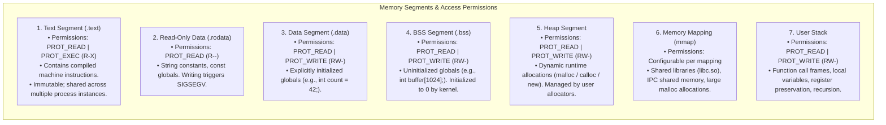
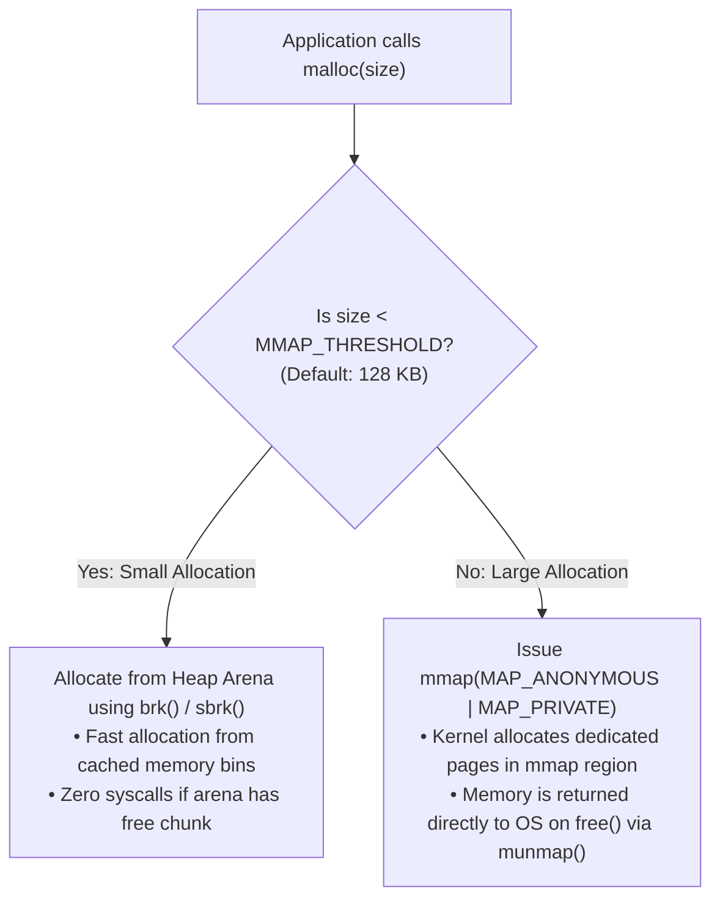

# Process Address Space

> [!abstract] Mental Model
> The Process Address Space is a **contiguous 64-bit virtual memory illusion** presented to each running process. Every single process believes it has exclusive ownership of a vast, private memory range spanning from address `0x0000000000000000` up to `0x00007FFFFFFFFFFF` (128 Terabytes in x86-64). In physical reality, these virtual addresses do not exist contiguously in RAM; the hardware [[Paging Architecture|MMU and Page Tables]] transparently map them to scattered 4 KB physical frames across DRAM or NVMe swap space.

---

## The Canonical 64-bit Virtual Memory Layout

Below is the standard virtual memory layout of an x86-64 Linux user-space process:

```text
High Address  0xFFFFFFFFFFFFFFFF +------------------------------------------+
                                 |                                          |
                                 |        KERNEL SPACE (Upper Half)         |
                                 |  - Kernel Code, Data, Page Tables        |
                                 |  - Direct Physical Memory Mapping        |
                                 |  (Restricted to Ring 0 / Supervisor)     |
                                 |                                          |
              0xFFFF800000000000 +------------------------------------------+
                                 |       NON-CANONICAL ADDRESS HOLE         |
                                 |        (Addressing Gap: Trap if touched) |
              0x00007FFFFFFFFFFF +------------------------------------------+
                                 | Environment Variables & Arguments (envp) |
                                 +------------------------------------------+
                                 |               USER STACK                 |
                                 |  - Local variables, Return RIP frames    |
                                 |  - Managed via RSP register              |
                                 |  | (Grows DOWNWARD toward lower memory)  |
                                 |  v                                       |
                                 + - - - - - - - - - - - - - - - - - - - - -+
                                 |          Guard Page (Unmapped)           |
                                 +------------------------------------------+
                                 |                                          |
                                 |        MEMORY MAPPING REGION (mmap)      |
                                 |  - Shared Libraries (libc.so, libm.so)   |
                                 |  - Memory-Mapped Files (mmap)            |
                                 |  - Thread Stacks (pthread_create)        |
                                 |                                          |
                                 + - - - - - - - - - - - - - - - - - - - - -+
                                 |  ^ (Grows UPWARD via brk / sbrk)         |
                                 |  |                                       |
                                 |               HEAP SEGMENT               |
                                 |  - Dynamic Allocations (malloc, new)     |
                                 |  - Managed by glibc ptmalloc / jemalloc  |
                                 +------------------------------------------+
                                 |               BSS SEGMENT                |
                                 |  - Uninitialized Global & Static Vars   |
                                 |  - Anonymous zeroed pages (RW)           |
                                 +------------------------------------------+
                                 |               DATA SEGMENT               |
                                 |  - Initialized Global & Static Vars      |
                                 |  - Read / Write (RW-)                    |
                                 +------------------------------------------+
                                 |              RODATA SEGMENT              |
                                 |  - String Literals & Constants (R--)     |
                                 +------------------------------------------+
                                 |               TEXT SEGMENT               |
                                 |  - Executable Machine Instructions (R-X) |
                                 +------------------------------------------+
Low Address   0x0000000000000000 |         NULL POINTER GUARD PAGE          |
                                 |  - Unmapped memory (0x0 - 0x10000)       |
                                 |  - Traps NULL dereferences -> SIGSEGV    |
                                 +------------------------------------------+
```

---

## Detailed Memory Segment Breakdown



---

## Deep Dive: Stack vs Heap Mechanics

Understanding the internal mechanical differences between the Stack and the Heap is fundamental to high-performance systems engineering:

| Dimension | User Stack | Heap |
| :--- | :--- | :--- |
| **Allocation Mechanism** | **Single CPU Instruction**: `sub rsp, 32` (Decrements Stack Pointer). | Complex allocator algorithms (Buddy, Free-lists, Arenas, Thread-caches). |
| **Deallocation** | **Instantaneous**: `add rsp, 32` or `ret` (Restores Stack Pointer). | Manual (`free()`, `delete`) or Garbage Collected. |
| **Performance** | Blazing fast ($< 1$ CPU cycle). Always hot in L1 CPU Cache. | Slower (~10–100+ CPU cycles). Can suffer cache misses and lock contention. |
| **Size Limitation** | Fixed limit (typically **8 MB** in Linux; configured via `ulimit -s`). | Bound only by available Virtual Address Space + Physical RAM/Swap. |
| **Fragmentation** | **Zero Fragmentation** (Strict LIFO order). | Susceptible to **Internal and External Fragmentation**. |
| **Growth Direction** | Grows **DOWNWARD** toward lower addresses. | Grows **UPWARD** toward higher addresses (via `brk`). |
| **Failure Mode** | **Stack Overflow** (`SIGSEGV` when hitting Guard Page). | **Out of Memory** (`ENOMEM` / OOM Killer invocation). |

---

## How Memory Allocators (`malloc`) Work Under the Hood

The standard C library `malloc()` is **not a system call**; it is a user-space memory management library (`ptmalloc3` in glibc, `jemalloc`, `tcmalloc`) that manages memory pools to minimize kernel transitions:



1. **Small Allocations ($< 128\text{ KB}$)**:
   - `malloc` satisfies the allocation from pre-allocated heap memory pools.
   - If the heap is full, it issues a single `brk()` system call to increment the program break boundary by a large chunk (e.g., 1 MB).
2. **Large Allocations ($\ge 128\text{ KB}$)**:
   - `malloc` bypasses the heap entirely and invokes `mmap(NULL, size, PROT_READ|PROT_WRITE, MAP_PRIVATE|MAP_ANONYMOUS, -1, 0)`.
   - When freed, the memory is immediately unmapped and released back to the OS via `munmap()`, preventing large heap fragmentation.

---

## ASLR (Address Space Layout Randomization)

**ASLR** is a critical hardware/kernel security defense mechanism against **Buffer Overflow and Return-Oriented Programming (ROP) exploits**:

```text
Without ASLR (Predictable Memory Layout):
Process Run 1: Stack Base = 0x7ffffffde000 | Libc Base = 0x7ffff7a0d000
Process Run 2: Stack Base = 0x7ffffffde000 | Libc Base = 0x7ffff7a0d000
-> Attacker can hardcode payload return address to libc system() function.

With ASLR Enabled (Randomized Offsets on every execve):
Process Run 1: Stack Base = 0x7ffd5a3b2000 | Libc Base = 0x7f2a18840000
Process Run 2: Stack Base = 0x7ffcd89f1000 | Libc Base = 0x7f83e2190000
-> Attacker's hardcoded jump address hits unmapped memory -> Immediate SIGSEGV Crash!
```

### Checking and Controlling ASLR in Linux
```bash
# Check ASLR status (0 = Disabled, 1 = Partial/mmap, 2 = Full Randomization)
cat /proc/sys/kernel/randomize_va_space
# Output: 2
```

---

## Memory Safety Vulnerabilities & Failure Modes

| Vulnerability / Bug | Root Cause | Symptoms | Mitigation |
| :--- | :--- | :--- | :--- |
| **Stack Overflow** | Deep/infinite recursion or allocating massive arrays on the stack (`char buf[10*1024*1024]`). | Process crashes instantly with `SIGSEGV` when `RSP` breaches the stack guard page. | Allocate large structures on the heap; verify recursion base cases; tune `ulimit -s`. |
| **Buffer Overflow (Stack Smashing)** | Writing past an array boundary on the stack (`strcpy(buf, input)`), overwriting the saved Return `RIP`. | Arbitrary code execution or crash with `*** stack smashing detected ***`. | Compile with Stack Canaries (`-fstack-protector-strong`), ASLR, and Non-Executable Stack (`NX`/`DEP` bit). |
| **Use-After-Free (UAF)** | Dereferencing a pointer to a heap chunk that was already passed to `free()`. | Silent memory corruption or unexpected behavior when the chunk is reallocated. | Set pointers to `NULL` after freeing; use smart pointers (`std::unique_ptr`); AddressSanitizer. |
| **Memory Fragmentation** | Allocating and freeing millions of mixed-size objects over days, leaving holes in the heap. | Process RSS grows continuously despite low active data; OS suffers memory pressure. | Use specialized allocators like `jemalloc` or `mimalloc`; use object pools. |

---

## Practical Diagnostics & Observability Commands

```bash
# 1. View all active memory segments, permissions, and addresses for a running process
cat /proc/<PID>/maps | head -n 25

# Example Output:
# 00400000-00452000 r-xp 00000000 08:01 123456  /usr/bin/nginx (Text)
# 00651000-00652000 r--p 00051000 08:01 123456  /usr/bin/nginx (ROData)
# 00652000-00656000 rw-p 00052000 08:01 123456  /usr/bin/nginx (Data/BSS)
# 010d3000-01115000 rw-p 00000000 00:00 0       [heap]
# 7f83e2000000-7f83e21b0000 r-xp ...            /lib/x86_64-linux-gnu/libc.so.6
# 7ffcd89d0000-7ffcd89f1000 rw-p 00000000 00:00 0 [stack]

# 2. View human-readable memory distribution and mapping sizes
pmap -x <PID>

# 3. Compile C/C++ code with AddressSanitizer to detect memory leaks and illegal accesses at runtime
gcc -fsanitize=address -g main.c -o main

# 4. Profile heap allocations and detect memory leaks using Valgrind
valgrind --leak-check=full --show-leak-kinds=all ./main
```

---

## Active Recall & Interview Perspective

### Reasoning Prompts
1. *Why does the User Stack grow downward while the Heap grows upward?*
   - **Answer**: Historical architecture efficiency. In early computers with a single contiguous virtual address space, the heap was anchored at the bottom (just above the data segment) and grew upward, while the stack was anchored at the top of memory and grew downward. This maximized the shared unallocated memory space between them, preventing either from running out of room until total memory was exhausted.
2. *What is a Stack Guard Page and how does it prevent stack smashing from corrupting the heap?*
   - **Answer**: A Guard Page is an unmapped 4 KB virtual memory page placed directly below the bottom boundary of the User Stack with page permissions set to `PROT_NONE` (No Read, No Write, No Execute). If a thread overflows its stack allocation, the next stack write hits this guard page, causing the hardware MMU to trigger an immediate **Page Fault (`#PF`)**, which kills the process with `SIGSEGV` before it can silently overwrite adjacent heap or library memory.
3. *Why does `malloc()` switch from `brk()` to `mmap()` for allocations greater than 128 KB?*
   - **Answer**: Memory allocated via `brk()` extends the top of the heap. Because the heap is contiguous, if a 10 MB buffer is allocated with `brk()` and then a 1 KB buffer is allocated above it, freeing the 10 MB buffer *cannot* return that memory to the OS (the heap cannot shrink because the 1 KB buffer blocks the top). By using `mmap()` for large allocations, each buffer gets an independent memory region that can be immediately unmapped and returned to the OS via `munmap()`, eliminating massive heap fragmentation.

---

## Key Takeaways
- The **Process Address Space** provides a private 128 TB virtual memory illusion, segmented into **Text (R-X)**, **Data (RW)**, **BSS (RW)**, **Heap**, **Memory Mappings (mmap)**, and **Stack**.
- The **Stack** is fast, fixed-size, and managed by CPU `RSP`; the **Heap** is dynamic, flexible, and managed by user-space allocators via `brk()` and `mmap()`.
- **ASLR** randomizes the base addresses of stack, heap, and libraries on every execution to defend against code-injection exploits.

---

## Related Notes
- [[Operating System]] — Resource virtualization.
- [[Program vs Process]] — Transformation from ELF disk binary to RAM address space.
- [[Process Control Block]] — Kernel structures storing memory descriptor pointers (`mm_struct`).
- [[Logical vs Physical Address Space]] — Virtual-to-physical address translation.
- [[Paging Architecture]] — Hardware page tables and MMU translation.
- [[Demand Paging and Page Faults]] — How pages are loaded into the address space on demand.
- [[Operating Systems MOC]] — Master table of contents for Operating Systems.
