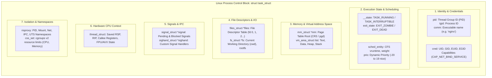

# Process Control Block (PCB)

> [!abstract] Mental Model
> The Process Control Block (PCB) is the **master passport and medical dossier of an executing process** maintained inside privileged [[Kernel|Kernel Memory]]. It is the single source of truth the OS kernel consults whenever it schedules a thread, translates a virtual address, checks file permissions, delivers a signal, or swaps execution contexts between CPU cores.

---

## Why This Exists

When the CPU preempts Process A to run Process B, the kernel must be able to restore Process A at a later time with **100% identical state** down to the exact machine registers, memory mappings, file offsets, and signal masks. 

Without a structured, centralized record:
1. **Context Switching would be impossible**: The kernel would have no place to save `RIP`, `RSP`, and CPU flags.
2. **Security would collapse**: The kernel would not know which `UID`/`GID` or Linux Capabilities own an open socket or file write operation.
3. **Resource accounting would fail**: The scheduler could not track CPU runtime, memory limits, or open file descriptor limits.

The PCB represents the **living identity of a process inside the OS**.

---

## PCB Architecture: Theoretical Model vs Linux `task_struct`

In OS theory, the PCB is an abstract container. In Linux, it is implemented as the famous **`struct task_struct`** (defined in `<linux/sched.h>`), a massive C structure (~6–9 KB) allocated from the specialized **`task_struct_cachep` SLUB cache**:



---

## Deep Dive into Core `task_struct` Substructures

### 1. Memory Management (`struct mm_struct *mm`)
Points to the process's virtual memory descriptor:
- `pgd`: Pointer to the top-level Page Global Directory (loaded into CPU `CR3` register on context switch).
- `mmap`: Linked list and red-black tree of **Virtual Memory Areas (`vm_area_struct`)** describing the start/end virtual addresses and permissions (`PROT_READ`, `PROT_WRITE`, `PROT_EXEC`) for `.text`, `.data`, heap, and stack.
- *Note for Kernel Threads*: Kernel background threads (like `kswapd`) have `mm == NULL` because they do not have a user-space address space; they borrow the `active_mm` of whatever process was previously running!

### 2. File Descriptor Table (`struct files_struct *files`)
Manages open files, sockets, and pipes:
- Contains `struct fdtable`: An array of pointers to open file objects (`struct file *`).
- Indexing into this array (`files->fdt->fd[3]`) resolves File Descriptor integer `3` into the kernel's open file description, which contains the current file offset and pointer to the filesystem inode.

### 3. Process Credentials (`struct cred *cred`)
Enforces all security and access controls:
- Real UID / GID (`uid`, `gid`): Who launched the process.
- Effective UID / GID (`euid`, `egid`): Used for permission checks (e.g., elevated via `setuid`).
- Linux Capabilities (`cap_effective`): Fine-grained privileges (e.g., `CAP_NET_RAW`, `CAP_SYS_ADMIN`, `CAP_SYS_PTRACE`).

### 4. Process Hierarchy Links
Processes form a strict genealogical tree rooted at `PID 1`:
- `parent`: Pointer to the parent `task_struct`.
- `children`: Doubly linked list of all child processes spawned via `fork()`.
- `sibling`: Linked list of sibling processes sharing the same parent.

---

## How the Kernel Accesses the Current PCB: The `current` Macro

During a system call or interrupt, kernel code frequently needs to know: *"Which process is currently executing on this CPU core?"*

In modern Linux x86-64, the kernel does **not** perform an expensive hash table lookup. It uses a **Per-CPU variable** loaded directly through the `GS` segment register:

```text
x86-64 Per-CPU Register Lookup:
Kernel reads offset 0 from the GS segment:
  mov %gs:current_task, %rax

Result:
Register RAX instantly contains the pointer to the active struct task_struct* 
in exactly ONE CPU cycle (O(1) lookup).
```

---

## Memory Overhead of PCBs in Production

A common production scaling bottleneck in containerized environments:

```text
Memory Cost of task_struct:
- Base task_struct: ~6 KB
- Associated kernel structures (mm_struct, files_struct, cred, signal): ~4 KB
- Per-process Kernel Stack: 16 KB (x86-64)
Total Memory per Process / Thread: ~26 KB to 32 KB
```

If a misconfigured microservice spawns **50,000 OS threads**:
$$\text{Memory Burn} = 50{,}000 \times 32\text{ KB} \approx \mathbf{1.6\text{ GB of Unswappable Kernel RAM}}$$
This kernel memory overhead cannot be swapped to disk, directly starving the OS and triggering the Out-of-Memory (OOM) Killer.

---

## Practical Diagnostics & Observability Commands

```bash
# 1. Inspect live PCB metadata exposed by the kernel in /proc
cat /proc/<PID>/status | head -n 30

# Example Output:
# Name:   nginx
# State:  S (sleeping)
# Tgid:   1042
# Pid:    1042
# PPid:   1
# Uid:    33      33      33      33
# Gid:    33      33      33      33
# FDSize: 1024
# Threads: 1

# 2. View process resource limits stored in task_struct->signal->rlim
cat /proc/<PID>/limits

# 3. Inspect kernel SLUB allocation statistics for task_struct
sudo slabtop -s c | grep task_struct
# Shows active count, total objects, and memory consumed by task_struct in RAM

# 4. View process parent-child hierarchy tree
pstree -p -s <PID>
```

---

## Failure Modes & Edge Cases

| Failure Mode | Root Cause | Symptoms | Mitigation |
| :--- | :--- | :--- | :--- |
| **PID Table Exhaustion (`fork: Resource temporarily unavailable`)** | Leaked Zombie processes or runaway fork loops creating more `task_struct` instances than `pid_max`. | New processes cannot spawn; SSH logins fail; critical alerts fire. | Increase `/proc/sys/kernel/pid_max` (up to 4,194,304); set `pids.max` limits in cgroups v2. |
| **Kernel Stack Corruption** | Deep kernel-space recursion overwriting memory adjacent to the per-process kernel stack. | System crash with Double Fault (`#DF`) or General Protection Fault (`#GP`). | Use `-fstack-protector` and compile with `VIRTUAL_STACKS` (`CONFIG_VMAP_STACK`). |
| **Zombie Accumulation (PCB Leak)** | Parent process exits without calling `wait()`, or fails to handle `SIGCHLD`. | `task_struct` remains allocated in SLUB cache indefinitely. | Implement subreaper with `prctl(PR_SET_CHILD_SUBREAPER)` or let `systemd` adopt and reap. |

---

## Active Recall & Interview Perspective

### Reasoning Prompts
1. *Why does a terminated (Zombie) process still have a `task_struct` in kernel memory?*
   - **Answer**: Even after a process terminates and its user address space (code, stack, heap) and open files are deallocated, its parent process may need to inspect its termination status (e.g., did it exit normally with code `0`, or was it killed by `SIGSEGV`?). The kernel keeps the minimal `task_struct` containing `exit_code` and resource usage metrics in memory until the parent collects it via `waitpid()`.
2. *What is the difference between a process `PID` and `TGID` in Linux?*
   - **Answer**: In the Linux kernel, every schedulable entity (process or thread) is represented by a distinct `task_struct` with its own unique `pid`. However, POSIX mandates that all threads within the same multithreaded process share the same Process ID. Linux solves this by defining `tgid` (Thread Group ID): for the main thread, `pid == tgid`; for spawned child threads, each has a unique `pid`, but all share the `tgid` of the main thread. User-space tools (`ps`, `getpid()`) display the `tgid` as the process PID.
3. *How does the Linux kernel optimize `task_struct` lookups on multi-core systems?*
   - **Answer**: Modern Linux stores the pointer to the running CPU core's `task_struct` in a dedicated **Per-CPU variable** referenced via the `GS` segment register (`%gs:current_task`). This allows any kernel function or interrupt handler to retrieve the pointer to the active process in a single CPU cycle ($O(1)$) without taking locks or searching a global process list.

---

## Key Takeaways
- The **Process Control Block (PCB)** (represented by `struct task_struct` in Linux) is the master kernel data structure tracking process identity, scheduling state, memory mappings, open file descriptors, and credentials.
- The `current` macro retrieves the active `task_struct` in $O(1)$ time via **Per-CPU registers (`%gs:current_task`)**.
- Each process consumes **~26–32 KB of unswappable kernel RAM** (including its 16 KB kernel stack and `task_struct`), making uncontrolled thread creation a severe memory hazard.

---

## Related Notes
- [[Operating System]] — Global architecture.
- [[Kernel]] — Kernel memory structures and SLUB allocators.
- [[Program vs Process]] — Transformation from binary to PCB.
- [[Process Address Space]] — The `mm_struct` virtual memory descriptor.
- [[Process States and Lifecycle]] — State flags (`__state`) stored inside the PCB.
- [[Context Switching]] — How the kernel saves and restores PCB hardware registers.
- [[Operating Systems MOC]] — Master table of contents for Operating Systems.
