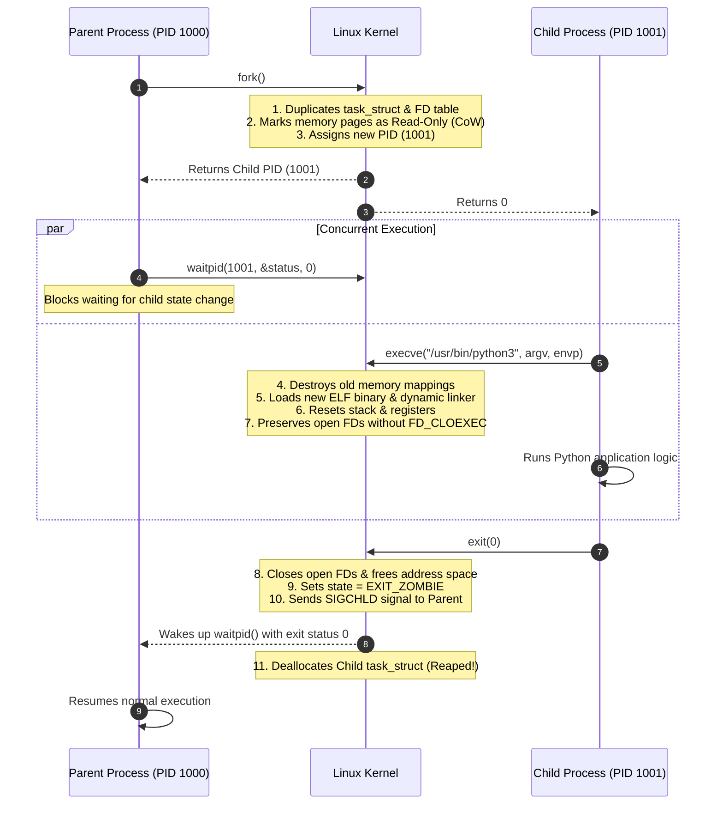
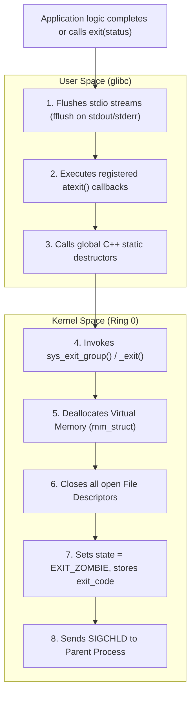

# Process Creation and Termination: `fork`, `exec`, `wait`, `exit`

> [!abstract] Mental Model
> The Unix process lifecycle is defined by a quartet of fundamental system calls:
> - **`fork()` clones identity**: It produces a near-exact replica of the parent process with a new PID and shared [[Copy-on-Write - CoW|Copy-on-Write (CoW)]] memory.
> - **`execve()` replaces the soul**: It wipes out the calling process's address space and loads a completely new executable binary image into the existing PID.
> - **`exit()` leaves the body**: It releases all RAM and open files, leaving a lightweight corpse (the [[Process Control Block|PCB]] Zombie).
> - **`wait()` delivers the inheritance**: It collects the child's exit status code and permanently deallocates the child's PCB from kernel memory.

---

## The Unix Process Lifecycle Architecture



---

## 1. Process Creation: `fork()`, `vfork()`, and `clone()`

### The Mechanics of `fork()`
When a process executes `fork()`:
1. **PCB Duplication**: The kernel creates a new `struct task_struct` for the child, copying parent credentials, signal masks, priority, and namespace configuration.
2. **File Descriptor Duplication**: The child receives a duplicate of the parent's file descriptor table. The open file table entries have their reference counts incremented.
3. **Copy-on-Write (CoW)**: Rather than copying all physical RAM pages (which would be catastrophically slow), the kernel copies the **page table entries only**, marking all shared pages as **Read-Only (`PROT_READ`)**.
4. **Return Value Splitting**:
   - Inside the **Parent Process**: `fork()` returns the **child's PID** ($> 0$).
   - Inside the **Child Process**: `fork()` returns **`0`**.
   - On Failure: Returns **`-1`** and sets `errno = EAGAIN` (PID table or RAM exhausted).

```c
pid_t pid = fork();
if (pid < 0) {
    perror("fork failed");
    exit(EXIT_FAILURE);
} else if (pid == 0) {
    // Child Execution Path
    printf("Child Process: PID = %d, Parent PPID = %d\n", getpid(), getppid());
    execlp("/bin/ls", "ls", "-la", NULL);
    _exit(127); // Reached only if exec fails
} else {
    // Parent Execution Path
    printf("Parent Process: Child PID is %d\n", pid);
    int status;
    waitpid(pid, &status, 0); // Wait for child to finish
}
```

---

### The Power of `clone()` (The Engine of Threads & Containers)
In Linux, both `fork()` and `pthread_create()` are wrappers around the generic **`clone()` system call**. By passing different bitmask flags, `clone()` controls exactly what state is shared between parent and child:

```text
Linux clone() Flags Matrix:
+-------------------+-----------------------------------------------------------+
| Flag              | Consequence when Set                                      |
+-------------------+-----------------------------------------------------------+
| CLONE_VM          | Shares Virtual Memory address space (Creates a Thread!)   |
| CLONE_FS          | Shares filesystem root, cwd, and umask                     |
| CLONE_FILES       | Shares File Descriptor Table (FD mutations visible to all)|
| CLONE_SIGHAND     | Shares signal handlers and blocked signal tables          |
| CLONE_NEWPID      | Creates isolated PID Namespace (Creates a Container!)     |
| CLONE_NEWNET      | Creates isolated Network Namespace (Virtual Interfaces)   |
| CLONE_NEWNS       | Creates isolated Mount Namespace (Private filesystem mount|
+-------------------+-----------------------------------------------------------+
```

---

## 2. Program Execution: `execve()`

The `execve()` system call transforms an existing process into a completely new program without changing its Process ID (`PID`):

```c
int execve(const char *pathname, char *const argv[], char *const envp[]);
```

### What `execve()` Does:
1. **Destroys Old Address Space**: Completely unmaps all existing text, data, BSS, heap, and user stack pages.
2. **Loads New Binary**: Reads the target ELF binary, maps `.text` (R-X), `.data` (RW), and `.rodata` (R--).
3. **Sets Up New User Stack**: Populates the top of memory with the new `argv` argument strings, `envp` environment variables, and ELF auxiliary vectors (`auxv`).
4. **Signal Reset**: Signals caught by custom handlers are reset to default actions (`SIG_DFL`), because the custom handler functions no longer exist in the new binary's memory.
5. **FD Retention & `FD_CLOEXEC`**: Open file descriptors remain open across `execve()` **unless** the `FD_CLOEXEC` (Close-on-Exec) flag was set!

> [!danger] Critical Security Practice: Always Set `O_CLOEXEC`
> If a parent process opens an encrypted database connection or private TLS socket and subsequently forks and executes an untrusted helper script (`execve()`), that child script **inherits full read/write access to the database socket** unless `O_CLOEXEC` was passed to `open()` / `socket()`.

---

## 3. Process Termination: `exit()` vs `_exit()`



- **`exit(code)`**: Standard C library wrapper. Cleans up user-space buffers before entering the kernel.
- **`_exit(code)` / `_Exit(code)`**: Direct system call. Instantly terminates without executing `atexit` hooks or flushing user buffers (used in the child branch of `fork()` when `execve()` fails).

---

## 4. Child Reaping: `wait()` and `waitpid()`

A parent process reaps terminated child processes to inspect their return code and free their PCB:

```c
pid_t waitpid(pid_t pid, int *wstatus, int options);
```

### Parameter Semantics:
- `pid > 0`: Wait specifically for child with this PID.
- `pid == -1`: Wait for **any** child process (identical to `wait()`).
- `options = WNOHANG`: **Non-blocking poll**. Returns `0` immediately if no child has exited, allowing the parent event loop to continue without freezing.

### Decoding Child Status Macros:
```c
int status;
pid_t reaped_pid = waitpid(child_pid, &status, 0);

if (WIFEXITED(status)) {
    printf("Child exited normally with status = %d\n", WEXITSTATUS(status));
} else if (WIFSIGNALED(status)) {
    printf("Child killed by signal %d (%s)\n", WTERMSIG(status), strsignal(WTERMSIG(status)));
    if (WCOREDUMP(status)) {
        printf("Core dump file was generated.\n");
    }
}
```

---

## Production Diagnostics & Tracing

```bash
# 1. Trace process creation, execution, and exit events across all child threads
strace -f -e trace=clone,execve,wait4,exit_group -p <PID>

# 2. View process execution tree with PIDs and arguments
pstree -a -p <PID>

# 3. Monitor system-wide process spawning in real time with bpftrace
sudo bpftrace -e 'tracepoint:sched:sched_process_exec { printf("Exec: %s (PID %d)\n", str(args->filename), pid); }'

# 4. Check for unhandled zombie processes created by a parent
ps -eo ppid,pid,stat,comm | grep -w "Z"
```

---

## Active Recall & Interview Perspective

### Reasoning Prompts
1. *Why does `fork()` return `0` to the child process but the child's `PID` to the parent process?*
   - **Answer**: The child process can always discover its own PID by calling `getpid()` and its parent's PID via `getppid()`. However, the parent process may spawn dozens of child processes; without `fork()` returning the specific new child's PID, the parent would have no identifier to track, signal, or wait on that specific child.
2. *Why is `fork()` followed by `execve()` considered inefficient in high-performance applications, and what is the modern replacement?*
   - **Answer**: Even with Copy-on-Write, `fork()` must duplicate all parent page tables, which can consume hundreds of megabytes of memory for large parent processes (like Redis or JVMs). When `execve()` is called immediately afterward, all those newly duplicated page tables are instantly discarded. Modern systems use **`posix_spawn()`** (or `vfork()`), which avoids duplicating page tables entirely by suspending the parent until the child loads the new binary image.
3. *What happens to open network sockets when a process calls `fork()`?*
   - **Answer**: The socket file descriptors are duplicated into the child's file descriptor table, pointing to the exact same underlying open socket object in the kernel. Both parent and child can read and write to the socket concurrently. If only the child is intended to handle the network connection (e.g., in a prefork server model), the parent must explicitly `close(client_fd)` in its branch to prevent socket descriptor leaks.

---

## Key Takeaways
- **`fork()`** clones the process with Copy-on-Write memory; **`execve()`** replaces the memory image with a new binary inside the same PID.
- In Linux, both processes and threads are created using the versatile **`clone()` system call** with different sharing flags.
- Terminated processes become **Zombies** until their parent collects their exit status via **`waitpid()`**, at which point their PCB is permanently freed.

---

## Related Notes
- [[Operating System]] — Architecture and resource management.
- [[Program vs Process]] — Transformation from binary to executing instance.
- [[Process Address Space]] — Virtual memory regions replaced by `execve()`.
- [[Process States and Lifecycle]] — State transitions during process lifecycle.
- [[Process Control Block]] — `task_struct` allocation and destruction.
- [[Zombie and Orphan Processes]] — In-depth analysis of unreaped children and adoption.
- [[Copy-on-Write - CoW]] — Memory optimization powering fast `fork()` execution.
- [[Operating Systems MOC]] — Master table of contents for Operating Systems.
