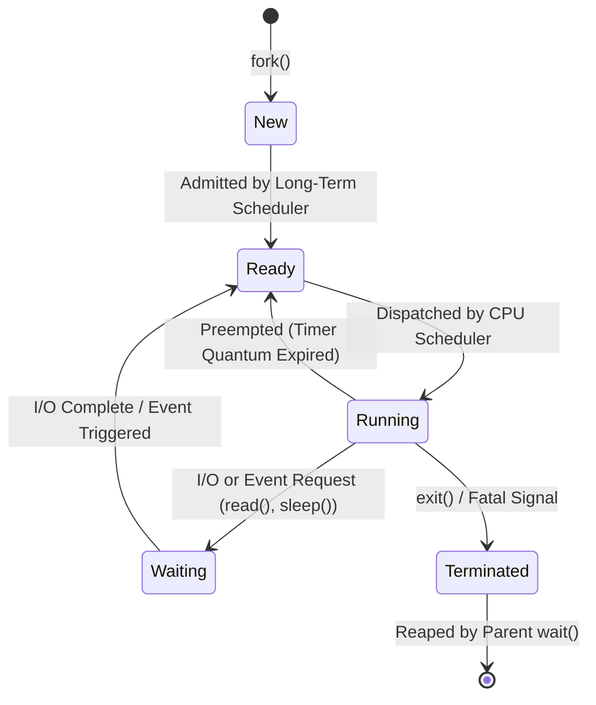
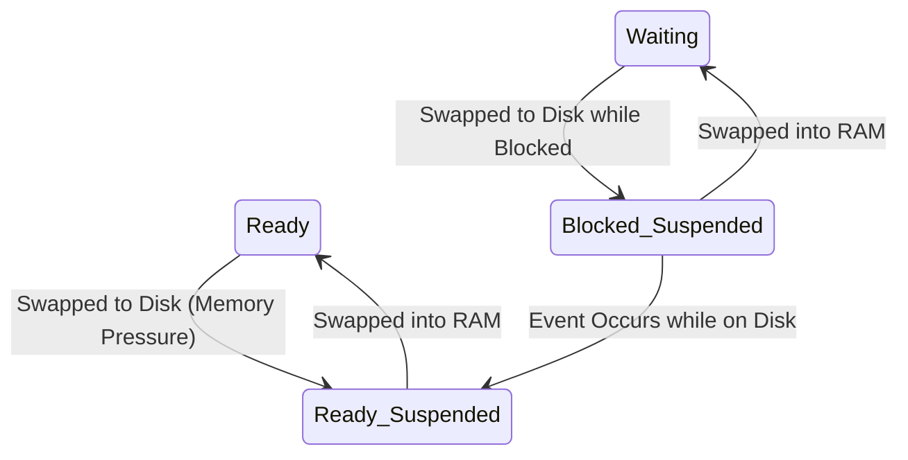
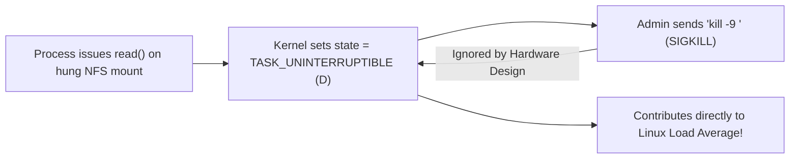

# Process States and Lifecycle

> [!abstract] Mental Model
> A process is not a static calculation; it is a **dynamic Finite State Machine**. As a process requests disk data, waits for network packets, gets preempted by timer interrupts, or finishes execution, the OS scheduler transitions its internal state in the [[Process Control Block|PCB]] and moves it between different kernel wait queues and CPU runqueues.

---

## Theoretical State Models: 5-State vs 7-State

### 1. The Classic 5-State Model
In pure operating system theory, every process exists in one of five canonical states:



---

### 2. The 7-State Model (Virtual Memory & Swapping)
When physical RAM is completely exhausted, the OS medium-term scheduler swaps dormant processes to disk, creating **Suspended States**:



---

## Production Reality: Linux Task States (`task_struct->__state`)

In modern Linux systems, process states are represented as bitmask flags inside `struct task_struct`:

```text
Linux Kernel Task States (Mapped to 'ps' / 'top' Status Codes):
+-------------------------------------------------------------------------------+
| Code | State Name              | Description & Behavior                       |
+-------------------------------------------------------------------------------+
| R    | TASK_RUNNING            | Actively executing on a CPU core OR sitting  |
|      |                         | in the scheduler's runqueue ready to run.    |
+------+-------------------------+----------------------------------------------+
| S    | TASK_INTERRUPTIBLE      | Interruptible Sleep. Waiting for I/O, event, |
|      |                         | or timer. WAKES UP immediately on signals.   |
+------+-------------------------+----------------------------------------------+
| D    | TASK_UNINTERRUPTIBLE    | Deep Uninterruptible Sleep. Waiting for      |
|      |                         | hardware I/O (disk DMA). IGNORES ALL SIGNALS |
|      |                         | (including 'kill -9'!).                      |
+------+-------------------------+----------------------------------------------+
| T    | TASK_STOPPED            | Suspended by signal (SIGSTOP / Ctrl+Z).      |
+------+-------------------------+----------------------------------------------+
| t    | TASK_TRACED             | Paused under debugger (gdb / ptrace).        |
+------+-------------------------+----------------------------------------------+
| Z    | EXIT_ZOMBIE             | Process finished execution, freed all RAM,   |
|      |                         | but PCB retained for parent wait() exit code.|
+------+-------------------------+----------------------------------------------+
| X    | EXIT_DEAD               | Final state: PCB being deallocated by kernel.|
+-------------------------------------------------------------------------------+
```

---

## State Transition Mechanics & Triggers

```text
+-----------------------+-----------------------+-------------------------------+
| From State            | To State              | Hardware / Syscall Trigger    |
+-----------------------+-----------------------+-------------------------------+
| New                   | Ready (TASK_RUNNING)  | fork() / clone() completes    |
| Ready (TASK_RUNNING)  | Running (TASK_RUNNING)| CFS picks process from RB-tree|
| Running (TASK_RUNNING)| Ready (TASK_RUNNING)  | Timer interrupt ticks (preempt|
| Running (TASK_RUNNING)| Sleeping (TASK_INTERR)| Blocking read(), nanosleep()  |
| Running (TASK_RUNNING)| Deep Sleep (TASK_UNINT| Page fault read, NVMe sync I/O|
| Sleeping (TASK_INTERR)| Ready (TASK_RUNNING)  | Network packet arrives via IRQ|
| Deep Sleep (TASK_UNINT| Ready (TASK_RUNNING)  | Disk DMA transfer finishes    |
| Running (TASK_RUNNING)| Stopped (TASK_STOPPED)| SIGSTOP / SIGTSTP signal      |
| Running (TASK_RUNNING)| Zombie (EXIT_ZOMBIE)  | exit() / SIGKILL / SIGSEGV    |
| Zombie (EXIT_ZOMBIE)  | Dead (EXIT_DEAD)      | Parent calls wait() / waitpid |
+-----------------------+-----------------------+-------------------------------+
```

---

## Production Deep Dive: The Dreaded `D-State` (Uninterruptible Sleep)

### What is a D-State Process?
When a process issues a synchronous I/O request (such as reading from an NVMe drive or querying a remote NFS mount), the kernel puts the task into `TASK_UNINTERRUPTIBLE` while waiting for the hardware controller interrupt.



### Why `kill -9` Cannot Kill a D-State Process
If the kernel allowed a process to be terminated while waiting for a hardware DMA transfer:
1. The process memory pages would be freed.
2. The hardware disk controller would eventually complete the DMA transfer, writing raw data into memory that has now been reassigned to another process, causing **fatal physical memory corruption**.
3. Therefore, the CPU hardware design mandates that the process **cannot handle signals until the hardware I/O finishes or fails with a timeout**.

---

## Understanding Linux Load Average

A classic production puzzle: *"Why is my server's Load Average 45.0, but CPU utilization is only 2%?"*

```text
Linux Load Average Formula:
Load Average = (Active Processes in TASK_RUNNING) + (Processes in TASK_UNINTERRUPTIBLE)
```

In Linux (unlike BSD/Solaris), Load Average counts **both CPU-bound tasks and Disk/NFS I/O-bound tasks in D-state**:
- If 40 threads are blocked on a frozen network storage share (NFS / SAN), the Load Average will show **40.0**, even if all CPU cores are 98% idle!

---

## Production Diagnostics & Observability Commands

```bash
# 1. View all processes sorted by state, identifying D-state and Zombie processes
ps -eo pid,ppid,user,stat,wchan:20,comm | grep -E "STAT|D|Z"

# 2. Identify the exact kernel function where a D-state process is blocked
cat /proc/<PID>/wchan
# Example output: nfs_wait_bit_uninterruptible

# 3. View detailed kernel stack backtrace of a hung D-state process
sudo cat /proc/<PID>/stack

# 4. Filter top by process state
top -b -n 1 | head -n 20

# 5. Find all Zombie processes on the host
ps aux | awk '$8 ~ /Z/ {print $2, $8, $11}'
```

---

## Active Recall & Interview Perspective

### Reasoning Prompts
1. *Why does Linux have both `TASK_INTERRUPTIBLE` and `TASK_UNINTERRUPTIBLE` sleeping states?*
   - **Answer**: `TASK_INTERRUPTIBLE` is used for slow, indefinite events (waiting for user input, network socket data, or timers). It wakes up when a signal arrives so the application can handle `SIGINT` (Ctrl+C) or terminate. `TASK_UNINTERRUPTIBLE` is used for short hardware-level device transactions (like disk DMA transfers) where terminating the process midway would leave hardware controller buffers and physical memory frames in an unrecoverable, corrupted state.
2. *Can a process transition directly from `Waiting` (Blocked) to `Running` without passing through `Ready`?*
   - **Answer**: No. When the I/O event completes, the hardware interrupt moves the process from the device wait queue into the scheduler's **Ready Queue** (`TASK_RUNNING`). The process must wait in the Ready Queue until the CPU scheduler selects it based on priority and CPU time quantum.
3. *Why does a Zombie process (`Z`) consume zero CPU and zero RAM, yet poses a critical threat to production systems?*
   - **Answer**: A zombie process has already freed its virtual memory address space (text, data, heap, stack) and closed its file descriptors. However, its entry in the kernel's process table (`task_struct`) is retained until its parent calls `wait()`. If a buggy parent continually forks and fails to reap children, the system exhausts the kernel's limited Process ID space (`/proc/sys/kernel/pid_max`), preventing any new processes from spawning.

---

## Key Takeaways
- The process lifecycle transitions between **New $\rightarrow$ Ready $\rightarrow$ Running $\rightarrow$ Waiting $\rightarrow$ Terminated**.
- In Linux, `TASK_RUNNING` encompasses both running and ready-to-run threads; `TASK_UNINTERRUPTIBLE` (`D`) protects hardware DMA operations but ignores signals.
- **Linux Load Average** measures both CPU runnable tasks and D-state I/O waiting tasks.

---

## Related Notes
- [[Operating System]] — Global process management.
- [[Program vs Process]] — Transformation into executing process.
- [[Process Control Block]] — The `task_struct` fields storing process state.
- [[CPU Scheduler and Dispatcher]] — Scheduling algorithms moving tasks between Ready and Running.
- [[Context Switching]] — Mechanics of swapping running tasks.
- [[Zombie and Orphan Processes]] — In-depth mitigation of zombie state leaks.
- [[Operating Systems MOC]] — Master table of contents for Operating Systems.
