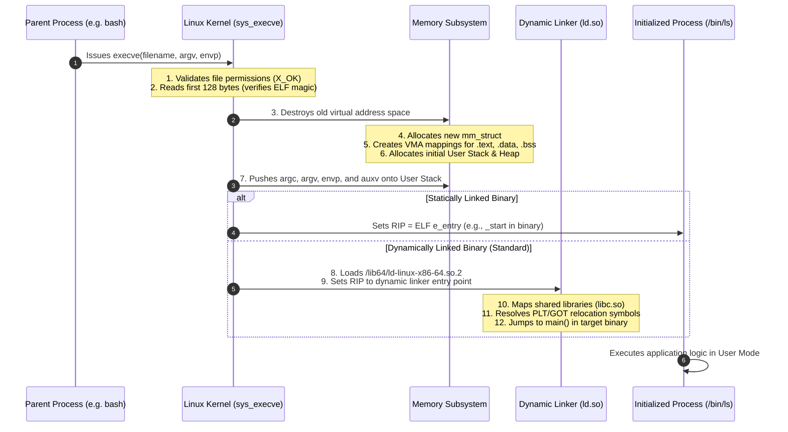

# Program vs Process

> [!abstract] Mental Model
> A **Program** is a **passive recipe**: a static, compiled sequence of machine instructions and data structures stored as dead bytes inside an executable file on disk (such as an ELF or PE binary). A **Process** is the **active kitchen**: a dynamic, stateful, executing instance in RAM equipped with dedicated CPU registers, an isolated virtual address space, memory pages, open file descriptors, security credentials, and a lifecycle managed by the OS kernel.

---

## Why This Distinction Matters

The separation of the passive binary from the active executing process enables modern multi-tenancy and high memory efficiency:
1. **Concurrency & Multiplexing**: One single `/usr/bin/bash` binary stored once on disk can back 500 concurrent user processes running simultaneously.
2. **State Isolation**: When Process A crashes due to a null-pointer dereference, Process B (running the exact same program) is completely unaffected because its runtime state (stack, heap, registers) resides in a distinct [[Process Address Space|Virtual Address Space]].
3. **RAM Optimization via Code Sharing**: The OS loads the executable code section (`.text`) of a program into physical RAM **only once**. All 500 running instances of `bash` share the exact same physical memory frames for code, while maintaining private, isolated pages for their heap and stack.

---

## Architectural Comparison: Program vs Process

```mermaid
flowchart TD
    subgraph Storage [Persistent Storage: Program (Passive)]
        ELF["ELF Binary on NVMe Disk (/bin/nginx)<br/>• ELF Header & Program Headers<br/>• .text (Machine Instructions)<br/>• .rodata (Constant Strings)<br/>• .data (Initialized Globals)"]
    end

    subgraph Memory [DRAM: Active Processes (Dynamic)]
        P1["Process 1 (PID 1042)<br/>• Registers (RIP, RSP)<br/>• Private Heap & Stack<br/>• Open Sockets (FD 3, 4)<br/>• CPU State: Running"]
        P2["Process 2 (PID 1043)<br/>• Registers (RIP, RSP)<br/>• Private Heap & Stack<br/>• Open Sockets (FD 3, 5)<br/>• CPU State: Waiting"]
    end

    ELF -->|execve() System Call| P1
    ELF -->|execve() System Call| P2
    
    P1 -.->|Shares Physical .text Code Pages| ELF
    P2 -.->|Shares Physical .text Code Pages| ELF
```

| Dimension | Program | Process |
| :--- | :--- | :--- |
| **Nature** | Passive entity (Stored byte file) | Active entity (Executing computation) |
| **Location** | Secondary storage (NVMe, SSD, Disk) | Primary memory (RAM) + CPU registers |
| **Lifetime** | Permanent (Exists until deleted from disk) | Ephemeral (Exists from `fork()` until `exit()`) |
| **Resource Ownership** | Only consumes disk blocks | Consumes CPU time, RAM pages, file descriptors, sockets |
| **State** | Fixed / Static byte arrays | Dynamic state machine (New, Ready, Running, Blocked, Terminated) |
| **Identifier** | File path / Inode number | Unique **PID (Process ID)** assigned by OS |

---

## The Anatomy of an Executable File (ELF Format)

On Linux/Unix, programs are stored in the **ELF (Executable and Linkable Format)**. On Windows, they use **PE (Portable Executable)**:

```text
ELF Binary Structure on Disk:
+-------------------------------------------------------------------------------+
| ELF Header         : Magic Number (0x7F 'E' 'L' 'F'), Architecture, Entry Point|
+-------------------------------------------------------------------------------+
| Program Header     : Maps file offsets to Virtual Memory Segments (LOAD flags)|
+-------------------------------------------------------------------------------+
| .text Section      : Compiled binary machine instructions (Read + Execute)    |
+-------------------------------------------------------------------------------+
| .rodata Section    : String literals and const global variables (Read-Only)   |
+-------------------------------------------------------------------------------+
| .data Section      : Initialized global & static variables (Read + Write)     |
+-------------------------------------------------------------------------------+
| .bss Section       : Uninitialized globals (Takes 0 bytes on disk; zeroed RAM)|
+-------------------------------------------------------------------------------+
| .got / .plt        : Global Offset Table / Procedure Linkage (Dynamic Linking)|
+-------------------------------------------------------------------------------+
| Section Header     : Metadata describing all sections for linkers and debuggers|
+-------------------------------------------------------------------------------+
```

---

## The Metamorphosis: How `execve()` Turns a Program into a Process

When an application calls `execve("/bin/ls", argv, envp)`:



---

## Memory Footprint of Multiple Processes

Consider running 100 workers of a Python or Nginx service:

```text
Physical RAM Layout:
+-------------------------------------------------------------------------------+
| Shared Read-Only Physical Frame (0x1000): Nginx .text code section (Shared)  |
+-------------------------------------------------------------------------------+
| Shared Read-Only Physical Frame (0x2000): Libc.so .text code section (Shared) |
+-------------------------------------------------------------------------------+
| Private Physical Frame (0x3000): Nginx Worker #1 .data + Heap (Private)       |
+-------------------------------------------------------------------------------+
| Private Physical Frame (0x4000): Nginx Worker #2 .data + Heap (Private)       |
+-------------------------------------------------------------------------------+
| Private Physical Frame (0x5000): Nginx Worker #3 .data + Heap (Private)       |
+-------------------------------------------------------------------------------+
```

- **VSS (Virtual Set Size)**: Total virtual memory allocated (e.g., 200 MB per worker = 20,000 MB).
- **RSS (Resident Set Size)**: Actual physical memory mapped into the process's page table.
- **PSS (Proportional Set Size)**: Private memory + (Shared memory / Number of sharing processes).
- **USS (Unique Set Size)**: Private memory exclusively used by this single process (memory returned if process dies).

---

## Production Diagnostics & Observability Commands

```bash
# 1. Inspect ELF binary headers, entry point, and architecture
readelf -h /bin/ls

# 2. View segment sizes of a compiled program binary (Text vs Data vs BSS)
size /bin/ls
# Example Output:
#    text    data     bss     dec     hex filename
#  138865    4968    4896  148729   244f9 /bin/ls

# 3. View the live virtual memory mappings of an active process
pmap -x <PID> | head -n 20

# 4. Inspect detailed memory consumption (PSS / USS / Shared / Private) from smaps
sudo cat /proc/<PID>/smaps_rollup

# 5. List all open file descriptors, sockets, and memory-mapped files for a process
lsof -p <PID>
```

---

## Active Recall & Interview Perspective

### Reasoning Prompts
1. *Why does the `.bss` section occupy zero bytes inside the compiled binary file on disk?*
   - **Answer**: The `.bss` (Block Started by Symbol) section contains uninitialized global and static variables, which are mandated by C/C++ standards to be initialized to zero at runtime. Rather than wasting disk space storing millions of zeros inside the ELF binary file, the ELF header merely records the *size* required. When `execve()` loads the program into RAM, the kernel allocates anonymous zero-filled pages on demand.
2. *Can two processes share the exact same physical memory address?*
   - **Answer**: Yes. In modern operating systems, two different processes can map the same physical RAM frame into their respective virtual address spaces. This occurs for shared libraries (`libc.so`), the read-only `.text` code section of identical program binaries, and explicit inter-process shared memory regions (`shmget` / `mmap(MAP_SHARED)`).
3. *What is the difference between RSS and USS when measuring a microservice's memory footprint?*
   - **Answer**: **RSS (Resident Set Size)** measures all physical RAM pages currently mapped to the process, including shared libraries used by other processes. **USS (Unique Set Size)** measures strictly private pages owned exclusively by that process. If you terminate the process, the exact amount of RAM returned to the OS is the USS, not the RSS.

---

## Key Takeaways
- A **Program** is a static file on disk (ELF/PE binary); a **Process** is a live, stateful, executing instance in RAM with CPU registers and resources.
- `execve()` transforms an executable binary into an active process by constructing virtual memory areas, setting up the stack, and handing control to the dynamic linker or entry point.
- The OS optimizes physical RAM by **sharing read-only code segments (`.text`)** across all processes executing the same program binary.

---

## Related Notes
- [[Operating System]] — Resource multiplexer.
- [[Kernel]] — Kernel process management.
- [[Process Address Space]] — Deep dive into Text, Data, BSS, Heap, and Stack memory regions.
- [[Process States and Lifecycle]] — State transitions from creation to termination.
- [[Process Control Block]] — Kernel data structures (`task_struct`) tracking active processes.
- [[Process Creation and Termination - fork, exec, wait, exit]] — Mechanics of `fork()` and `execve()`.
- [[Operating Systems MOC]] — Master table of contents for Operating Systems.
