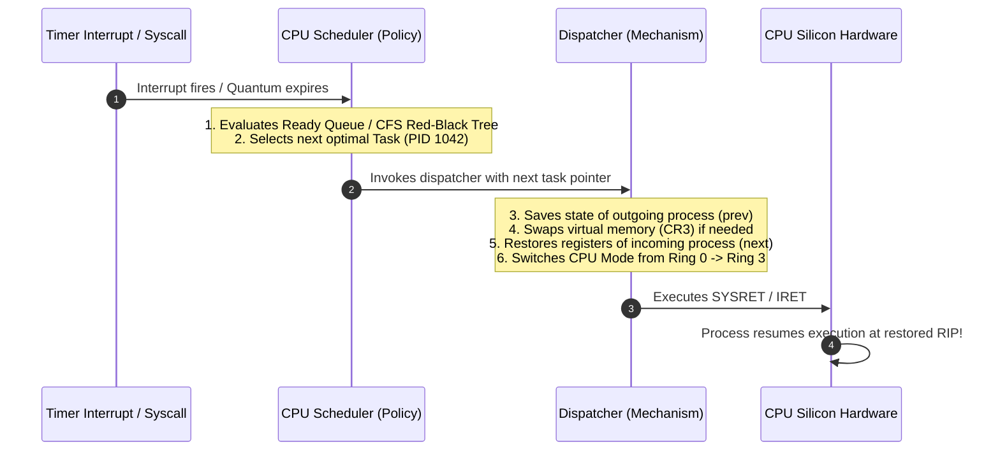
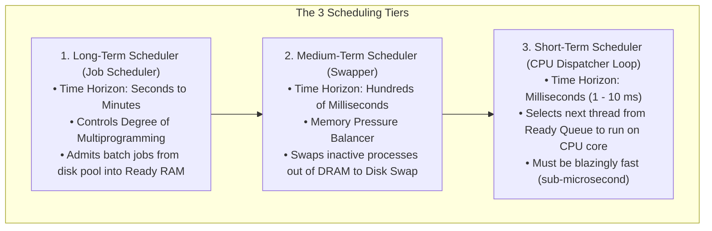
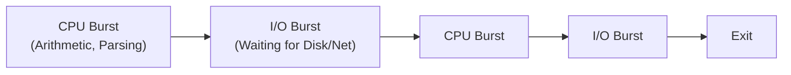
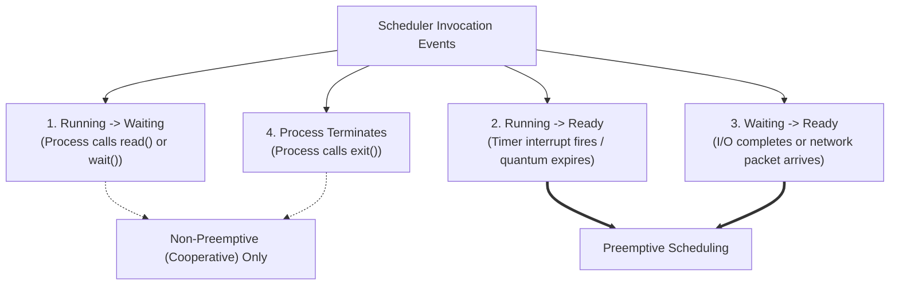

# CPU Scheduler and Dispatcher

> [!abstract] Mental Model
> Multitasking requires a brain to decide and a hand to execute:
> - The **CPU Scheduler is the Brain (Policy Engine)**: It analyzes the ready queues, priorities, and algorithm heuristics to decide **which** process should run next and for how long.
> - The **Dispatcher is the Muscle (Execution Engine)**: It performs the low-level mechanical work—switching CPU privilege rings, executing the register swap, loading page tables into `CR3`, and jumping to the process's instruction pointer.

---

## Architectural Decomposition: Scheduler vs Dispatcher



---

## The Three Scheduler Time Horizons

Operating systems divide scheduling responsibilities across three distinct time scales:



| Scheduler Tier | Frequency | Primary Objective | Location |
| :--- | :--- | :--- | :--- |
| **Long-Term (Job)** | Rare (Sec / Min) | Balances CPU-bound and I/O-bound mix; controls system load. | Disk Spool $\rightarrow$ RAM |
| **Medium-Term (Swapper)**| Medium (100 ms) | Relieves RAM starvation by moving inactive processes to swap. | RAM $\leftrightarrow$ Swap Space |
| **Short-Term (CPU)** | Frequent (1–10 ms) | Allocates CPU cores to maximize throughput and minimize latency. | RAM Ready Queue $\rightarrow$ CPU |

---

## The Dispatcher Deep Dive & Dispatch Latency

The Dispatcher is invoked on every single context switch. Its execution steps must be optimized down to the bare silicon clock cycle:

```text
The Dispatcher Routine:
1. Context Switch: Save registers of outgoing task into its PCB (task_struct->thread).
2. Memory Map Switch: Load new process's Page Global Directory into CR3 register.
3. User Mode Switch: Transition CPU hardware privilege from Ring 0 (Kernel) to Ring 3 (User).
4. Jump to Target Instruction: Load RIP with the saved instruction address to resume execution.
```

### Dispatch Latency
**Dispatch Latency** is the total time required for the dispatcher to stop one process and start another:

$$\text{Dispatch Latency} = T_{\text{save\_context}} + T_{\text{switch\_page\_tables}} + T_{\text{restore\_context}} + T_{\text{mode\_switch}}$$

In general-purpose operating systems (Linux/Windows), dispatch latency is **$\approx 1\text{ to }5\text{ }\mu\text{s}$**. In **Real-Time Operating Systems (RTOS)** like QNX or VxWorks, dispatch latency is hard real-time bounded to **$< 500\text{ ns}$**.

---

## The CPU-I/O Burst Cycle

Processes alternate perpetually between two states throughout their execution:



### CPU-Bound vs I/O-Bound Workloads:
1. **I/O-Bound Processes** (e.g., Web servers, database backends, UI applications):
   - Characterized by **many very short CPU bursts** ($< 2\text{ ms}$) followed by long I/O waits.
   - Schedulers must give **highest priority to I/O-bound processes**! When an I/O burst finishes, giving them immediate CPU access triggers their next I/O burst quickly, keeping disk controllers and network NICs 100% utilized.
2. **CPU-Bound Processes** (e.g., Video transcoding, matrix multiplication, cryptography):
   - Characterized by **few, very long CPU bursts** (hundreds of milliseconds).
   - Schedulers allocate large time slices to minimize context-switch overhead.

---

## When Does the Scheduler Run? (The 4 Scheduling Events)

The CPU scheduler is invoked under four specific operational conditions:



- When scheduling occurs **only under conditions 1 and 4**, the system is **Non-Preemptive (Cooperative)**.
- When scheduling occurs under **conditions 2 and 3**, the system is **Preemptive**.

---

## Production Diagnostics & Observability Commands

```bash
# 1. Trace real-time scheduling events and context switches using ftrace / trace-cmd
sudo trace-cmd record -e sched:sched_switch -e sched:sched_wakeup
sudo trace-cmd report | head -n 30

# 2. Inspect CPU scheduling policy and dynamic priority of a process
chrt -p <PID>
# Output: pid 1042's current scheduling policy: SCHED_OTHER (CFS)
#         pid 1042's current priority: 0

# 3. Change process scheduling policy to Real-Time Round Robin (SCHED_RR) with priority 50
sudo chrt -r -p 50 <PID>

# 4. Measure scheduling delay / dispatch latency using perf sched
sudo perf sched record -- sleep 2
sudo perf sched latency
# Shows maximum and average scheduling delay (time spent waiting in Ready Queue)
```

---

## Active Recall & Interview Perspective

### Reasoning Prompts
1. *What is the difference between the CPU Scheduler and the Dispatcher?*
   - **Answer**: The CPU Scheduler is the decision-making algorithm that selects which thread from the ready queue should run next based on priority, fairness, and execution history. The Dispatcher is the low-level hardware execution module that performs the actual context switch: saving the outgoing registers, updating the `CR3` page table root, switching privilege from Kernel Mode (Ring 0) to User Mode (Ring 3), and jumping to the restored instruction pointer (`RIP`).
2. *Why should an OS scheduler favor I/O-bound processes over CPU-bound processes?*
   - **Answer**: I/O-bound processes only require a few microseconds of CPU time before blocking on their next I/O request (disk read or network write). By scheduling them immediately, the CPU quickly dispatches their I/O operations to hardware controllers (DMA/NIC), keeping disk and network hardware fully saturated while allowing compute-bound processes to utilize the remaining CPU cycles. Favoring I/O-bound tasks also maximizes UI responsiveness.
3. *What constitutes "Dispatch Latency" and why is it critical in Real-Time Operating Systems (RTOS)?*
   - **Answer**: Dispatch Latency is the time interval between stopping one task and starting the execution of the next. In an RTOS controlling automotive brakes, avionics, or medical equipment, tasks have strict deterministic deadlines. High or unpredictable dispatch latency could cause the system to miss critical real-time deadlines, resulting in catastrophic physical failure.

---

## Key Takeaways
- The **Scheduler** selects *which* task to run; the **Dispatcher** performs the *mechanical context switch* into User Mode.
- Schedulers prioritize **I/O-bound processes** to maximize hardware device utilization and interactive responsiveness.
- **Dispatch Latency** is the hardware context-switch overhead, strictly bounded to sub-microseconds in RTOS.

---

## Related Notes
- [[Operating System]] — Resource multiplexing.
- [[Kernel]] — Scheduler loops inside Ring 0.
- [[User Mode vs Kernel Mode]] — Privilege transitions during dispatching.
- [[Process States and Lifecycle]] — `TASK_RUNNING` and ready queue state transitions.
- [[Context Switching]] — Register and memory swapping details.
- [[Preemptive vs Non-Preemptive Scheduling]] — Preemption mechanisms.
- [[Scheduling Metrics - Turnaround, Response, Waiting Time]] — Measuring scheduler quality.
- [[Linux CFS - Completely Fair Scheduler]] — Production implementation in Linux.
- [[Operating Systems MOC]] — Master table of contents for Operating Systems.
