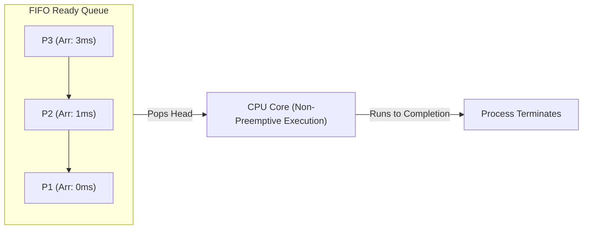
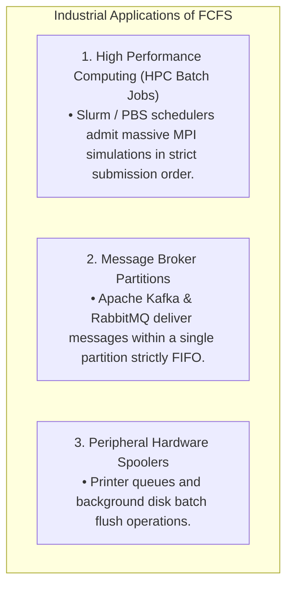

# First-Come First-Served (FCFS)

> [!abstract] Mental Model
> FCFS is the **standard single-line grocery store checkout**: customers are served strictly in the chronological order of their arrival. It is simple, deterministic, and fair on paper, but if the customer at the front of the line has ten overflowing shopping carts (a long CPU burst), every customer holding a single carton of milk (short I/O-bound tasks) is forced to wait indefinitely—a phenomenon known as the **Convoy Effect**.

---

## Algorithm Mechanics: Non-Preemptive FIFO Queue



1. **Queue Architecture**: The Ready Queue is implemented as a standard **FIFO (First-In, First-Out) Linked List or Ring Buffer**.
2. **Admission**: When a process becomes runnable, its PCB is appended to the **tail** of the queue ($O(1)$ insertion).
3. **Dispatch**: The scheduler selects the process at the **head** of the queue ($O(1)$ selection) and assigns the CPU.
4. **Execution Policy**: Strictly **Non-Preemptive**. The running process retains exclusive control of the CPU until it either terminates or voluntarily blocks on I/O.

---

## The Convoy Effect: Mathematical Proof of Inefficiency

The primary weakness of FCFS is its extreme sensitivity to the arrival order of long vs short tasks.

### Scenario A: Long Process Arrives First ($P_1 \rightarrow P_2 \rightarrow P_3$)
- $P_1$: Arrival = $0$, Burst = $24\text{ ms}$ (CPU-bound)
- $P_2$: Arrival = $0$, Burst = $3\text{ ms}$ (I/O-bound)
- $P_3$: Arrival = $0$, Burst = $3\text{ ms}$ (I/O-bound)

```text
Gantt Chart (Scenario A):
[                 P1 (0 to 24)                 ][  P2 (24-27)  ][  P3 (27-30)  ]
0                                             24              27              30
```

- **Waiting Times**: $WT(P_1) = 0$, $WT(P_2) = 24$, $WT(P_3) = 27$
- **Average Waiting Time**:
  $$\text{Avg } WT = \frac{0 + 24 + 27}{3} = \mathbf{17.0\text{ ms}}$$

---

### Scenario B: Short Processes Arrive First ($P_2 \rightarrow P_3 \rightarrow P_1$)
Suppose the arrival order was reversed:

```text
Gantt Chart (Scenario B):
[  P2 (0-3)  ][  P3 (3-6)  ][                 P1 (6 to 30)                 ]
0            3             6                                              30
```

- **Waiting Times**: $WT(P_2) = 0$, $WT(P_3) = 3$, $WT(P_1) = 6$
- **Average Waiting Time**:
  $$\text{Avg } WT = \frac{0 + 3 + 6}{3} = \mathbf{3.0\text{ ms}}$$

$$\text{Efficiency Gain} = \frac{17.0 - 3.0}{17.0} \times 100\% = \mathbf{82.3\%\text{ Reduction in Waiting Time!}}$$

> [!danger] The Convoy Effect in Production
> When a CPU-bound process monopolizes the CPU under FCFS, all I/O-bound processes stall in the ready queue. Consequently, disk controllers, network cards, and GPUs sit **completely idle**. When the CPU-bound task finally yields, all I/O-bound tasks rush to the I/O devices at once, leaving the CPU idle. This leads to **abysmal hardware utilization**.

---

## Detailed Algorithm Trade-Off Matrix

| Dimension | First-Come First-Served (FCFS) |
| :--- | :--- |
| **Scheduling Type** | Non-Preemptive |
| **Time Complexity** | $O(1)$ Enqueue / $O(1)$ Dequeue |
| **Starvation Risk** | **Zero (Starvation-Free)**: Every process eventually reaches the head. |
| **Average Waiting Time** | **High & Unpredictable**: Highly dependent on arrival ordering. |
| **Interactive Responsiveness**| **Extremely Poor**: Unsuitable for desktop/mobile UIs. |
| **Overhead** | **Minimal**: Zero timer interrupts, minimal context switching. |

---

## Where FCFS Is Used in Real-World Systems

Despite being unsuitable for general-purpose OS schedulers, FCFS is the foundational model in several production domains:



---

## Active Recall & Interview Perspective

### Reasoning Prompts
1. *What is the Convoy Effect and what conditions trigger it?*
   - **Answer**: The Convoy Effect occurs in non-preemptive FCFS scheduling when a CPU-intensive process with a large burst time precedes multiple short, I/O-intensive processes in the ready queue. The short tasks are blocked behind the long task, causing their response times to spike while peripheral hardware devices (disks, network cards) sit completely idle, degrading overall system throughput.
2. *Can a process experience starvation under FCFS scheduling?*
   - **Answer**: No. Starvation is impossible under pure FCFS assuming all processes have finite burst times. Because the ready queue is a strict FIFO structure, no newly arriving process can ever jump ahead of existing processes; every task is guaranteed to reach the head of the queue and execute.
3. *Why is FCFS almost never used as the primary CPU scheduler in modern interactive operating systems?*
   - **Answer**: Interactive operating systems require low and predictable **Response Times** ($RT$) to maintain smooth 60–120 FPS user interfaces and rapid keystroke feedback. Under FCFS, if a background task (like a file decompression) starts executing, the UI thread would freeze until the decompression completes, rendering the system completely unresponsive.

---

## Key Takeaways
- **FCFS** is the simplest scheduling algorithm: **non-preemptive, FIFO ordering, $O(1)$ complexity**.
- It is **starvation-free**, but suffers severely from the **Convoy Effect**, resulting in high average waiting times and poor device utilization.
- It is ideal for **batch HPC workloads and message brokers**, but unusable for interactive operating systems.

---

## Related Notes
- [[Operating System]] — Resource scheduling.
- [[CPU Scheduler and Dispatcher]] — Dispatching loops.
- [[Preemptive vs Non-Preemptive Scheduling]] — Preemption trade-offs.
- [[Scheduling Metrics - Turnaround, Response, Waiting Time]] — Performance calculations.
- [[Shortest Job First - SJF and SRTF]] — The mathematical solution to FCFS's high waiting time.
- [[Round Robin Scheduling]] — Preemptive counterpart to FCFS.
- [[Operating Systems MOC]] — Master table of contents for Operating Systems.
