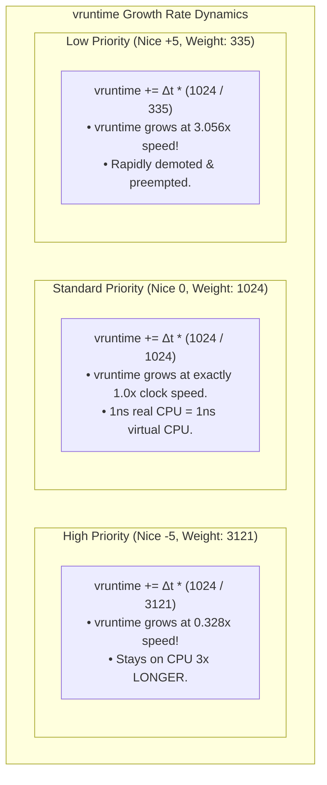

# Linux CFS (Completely Fair Scheduler)

> [!abstract] Mental Model
> The Completely Fair Scheduler (CFS) models an **Ideal Multi-tasking Hardware CPU** where $N$ processes run simultaneously in parallel, each advancing at $1/N$-th of full CPU speed. Because real physical silicon can only execute one thread per core at a time, CFS tracks how much virtual CPU time each process *ought* to have received using a single counter: **`vruntime` (Virtual Runtime)**. 
> CFS is simple and elegant: **the CPU is always awarded to the process that has accumulated the least `vruntime`**.

---

## The Core Mathematical Foundations of CFS

### 1. Virtual Runtime (`vruntime`) Formula

Whenever a task executes on a CPU core for physical clock duration $\Delta \text{exec\_time}$, its `vruntime` is updated:

$$\mathbf{vruntime \mathrel{+}= \Delta \text{exec\_time} \times \left( \frac{\text{NICE\_0\_LOAD}}{\text{task\_weight}} \right)}$$

- $\text{NICE\_0\_LOAD} = 1024$ (The base weight of a standard Nice 0 process).
- $\text{task\_weight}$: The mathematical weight mapped from the process's Nice value via the kernel `prio_to_weight` table.



---

### 2. The Linux `prio_to_weight` Array

Linux defines weights on a geometric progression where **each nice level difference corresponds to an $\approx 10\%$ differential in CPU share**:

```c
// Linux kernel source: kernel/sched/core.c
const int prio_to_weight[40] = {
 /* -20 */     88761,     71755,     56483,     46273,     36291,
 /* -15 */     29154,     23254,     18705,     14949,     11916,
 /* -10 */      9548,      7620,      6100,      4904,      3906,
 /*  -5 */      3121,      2501,      1991,      1586,      1277,
 /*   0 */      1024,       820,       655,       526,       423,
 /*   5 */       335,       272,       215,       172,       137,
 /*  10 */       110,        87,        70,        56,        45,
 /*  15 */        36,        29,        23,        18,        15,
};
```

---

### 3. Dynamic Time Slice Allocation (Latency Targeting)

Unlike Round Robin with a static time quantum, CFS calculates dynamic time slices based on **Target Scheduling Latency (`sched_latency`)**:

$$\mathbf{\text{time\_slice}_i = \text{sched\_latency} \times \left( \frac{\text{weight}_i}{\sum_{j=1}^{N} \text{weight}_j} \right)}$$

- **Target Latency (`sysctl_sched_latency`)**: The target time window during which *every runnable task* should run at least once (default: $\approx 6\text{ to }24\text{ ms}$).
- **Minimum Granularity (`sysctl_sched_min_granularity`)**: Enforces a floor (e.g., $0.75\text{ to }3\text{ ms}$) on time slices to prevent context-switch thrashing when hundreds of processes run concurrently.

---

## Ready Queue Data Structure: The Cached Red-Black Tree

CFS organizes all runnable tasks inside a self-balancing **Red-Black Tree (`struct rb_root_cached`)**:

```mermaid
graph TB
    subgraph RBTree ["CFS Runqueue (Red-Black Tree keyed by vruntime)"]
        direction TB
        Root["Node (vruntime: 12.4ms)"]
        N1["Node (vruntime: 8.1ms)"]
        N2["Node (vruntime: 18.9ms)"]
        Leftmost["LEFTMOST NODE (vruntime: 4.2ms)<br/>• Cached Pointer in struct cfs_rq<br/>• O(1) Instant Fetch for Next Task!"]
        N4["Node (vruntime: 10.5ms)"]
        
        Root --> N1
        Root --> N2
        N1 --> Leftmost
        N1 --> N4
    end

    Leftmost -->|O(1) Pick Next| CPU["Dispatched to CPU Core"]
    CPU -->|Executes -> Updates vruntime -> Reinserts O(log N)| RBTree
```

### Algorithmic Complexities:
- **Pick Next Task**: **$O(1)$** (The kernel caches a direct pointer `rb_leftmost` to the minimum node).
- **Re-insert / Delete Task**: **$O(\log N)$** (Standard self-balancing tree rotation).

---

## Handling Sleeping Tasks & CFS Anti-Starvation

If a process sleeps on I/O for 20 seconds, its physical execution stops while other processes continue advancing their `vruntime`.

### The Hazard:
When the sleeping process wakes up, its `vruntime` would be 20 seconds in the past! If CFS naively inserted it, it would **monopolize the CPU core for 20 continuous seconds**, starving all other apps.

### The Linux Kernel Solution:
When a sleeping task wakes up, CFS normalizes its `vruntime` to:

$$\mathbf{vruntime_{\text{woken}} = \max(vruntime_{\text{old}}, \text{min\_vruntime} - \Delta_{\text{latency}})}$$

- `min_vruntime`: The smallest `vruntime` among all currently running/runnable tasks.
- This gives the waking I/O-bound task a **slight latency advantage** (so it can process network packets or UI clicks immediately), while preventing it from monopolizing the CPU.

---

## Evolution in Modern Linux: CFS $\rightarrow$ EEVDF (Linux 6.6+)

In Linux Kernel 6.6 (late 2023), kernel maintainer Peter Zijlstra replaced CFS with **EEVDF (Earliest Eligible Virtual Deadline First)**:

```text
Why EEVDF Replaced CFS:
1. CFS Latency Flaw: To give a task low latency in CFS, engineers had to give it high
   CPU weight (nice -20), which also gave it excessive CPU throughput.
2. EEVDF Decoupling: EEVDF separates "Throughput Weight" from "Latency Deadline".
3. Virtual Deadlines: Tasks declare latency sensitivity. The scheduler guarantees
   microsecond wakeup dispatching for audio/gaming without granting disproportionate CPU share.
```

---

## Production Diagnostics & Observability Commands

```bash
# 1. Inspect detailed CFS scheduler statistics for a specific process
cat /proc/<PID>/sched | head -n 25

# Key Metrics to Inspect:
# se.vruntime           : Virtual runtime accumulator (ns)
# se.exec_start         : Timestamp when task started current burst
# se.sum_exec_runtime   : Cumulative physical CPU time on silicon (ms)
# nr_switches           : Total context switches

# 2. View system-wide CFS tunable parameters
sysctl kernel.sched_latency_ns
sysctl kernel.sched_min_granularity_ns
sysctl kernel.sched_wakeup_granularity_ns

# 3. Live monitoring of CFS task execution latency via perf sched
sudo perf sched record -- sleep 2
sudo perf sched latency
```

---

## Active Recall & Interview Perspective

### Reasoning Prompts
1. *Why does a low-priority task (Nice +19) accumulate `vruntime` much faster than a high-priority task (Nice -20)?*
   - **Answer**: `vruntime` represents virtual CPU time. The update formula scales physical time inversely with weight: $\text{vruntime} \mathrel{+}= \Delta t \times (\text{NICE\_0\_LOAD} / \text{weight})$. A Nice +19 task has a very small weight ($15$), making the multiplier $(1024 / 15) \approx 68.2$. Every millisecond on the CPU advances its `vruntime` by $68.2\text{ ms}$, rapidly pushing it to the right of the Red-Black tree and triggering preemption.
2. *How does CFS achieve $O(1)$ complexity when picking the next task to run despite using an $O(\log N)$ Red-Black Tree?*
   - **Answer**: CFS maintains a cached pointer (`rb_leftmost`) inside `struct cfs_rq` that directly points to the leftmost node of the Red-Black tree (the task with the lowest `vruntime`). When `pick_next_task()` is called, it simply dereferences this cached pointer in $O(1)$ time without traversing the tree. Re-insertion after execution takes $O(\log N)$.
3. *Why did Linux 6.6 introduce EEVDF to replace CFS?*
   - **Answer**: CFS tightly coupled priority (nice levels) with both CPU throughput share and scheduling latency. A latency-sensitive task (like audio rendering or UI events) could only get fast execution by setting a high-priority nice value, which also gave it an undesirably large share of total CPU bandwidth. EEVDF (Earliest Eligible Virtual Deadline First) decouples throughput weights from virtual deadlines, allowing tasks to receive guaranteed low-latency wakeups without distorting long-term CPU fairness.

---

## Key Takeaways
- **Linux CFS** guarantees fairness by tracking **`vruntime`**; the task with the smallest `vruntime` is always dispatched next.
- Tasks are indexed in a **Red-Black Tree** with $O(1)$ cached leftmost retrieval and $O(\log N)$ updates.
- Nice values map to geometric weights (`prio_to_weight`), and Linux 6.6+ evolves CFS into **EEVDF** for decoupled latency guarantees.

---

## Related Notes
- [[Operating System]] — CPU resource virtualization.
- [[CPU Scheduler and Dispatcher]] — The dispatch loop executing CFS tasks.
- [[Preemptive vs Non-Preemptive Scheduling]] — Preemption and timer ticks in CFS.
- [[Priority Scheduling and Aging]] — Linux nice values and priority scales.
- [[Multilevel Queue and MLFQ]] — The historical multi-tier alternative.
- [[Real-Time Scheduling - Rate Monotonic and EDF]] — Real-time alternatives (`SCHED_FIFO`/`SCHED_DEADLINE`).
- [[OS-Level Virtualization - Linux Namespaces and cgroups]] — Cgroups CPU bandwidth enforcement (`cpu.cfs_quota_us`).
- [[Operating Systems MOC]] — Master table of contents for Operating Systems.
