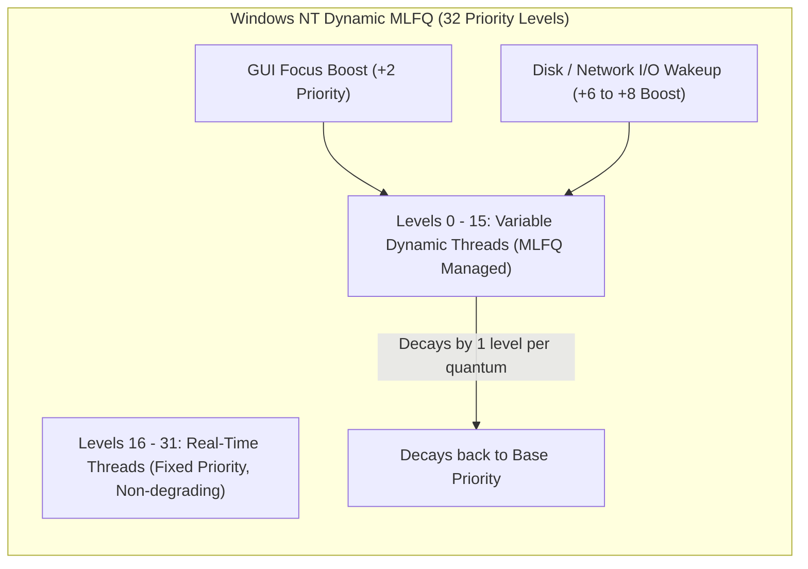

# Multilevel Queue (MLQ) and Multilevel Feedback Queue (MLFQ)

> [!abstract] Mental Model
> - **Multilevel Queue (MLQ)** is a **hotel with permanently segregated elevators**: VIP guests always ride the express elevator; economy guests are permanently locked to the freight elevator.
> - **Multilevel Feedback Queue (MLFQ)** is an **intelligent self-adjusting triage system**: every patient begins in the Emergency Room (highest priority, tiny time slice). If a doctor discovers the patient requires a 10-hour surgery (a compute-bound CPU hog), they are gradually moved down to outpatient recovery (larger time slice, lower priority). If a patient merely needs an aspirin (interactive I/O), they finish in the ER immediately!

---

## Architectural Comparison: MLQ vs MLFQ

```mermaid
flowchart TD
    subgraph MLQ ["1. Static Multilevel Queue (MLQ)"]
        direction TB
        Q_Sys["Queue 0: System / Real-Time Tasks (Highest Priority)"]
        Q_Int["Queue 1: Interactive GUI Tasks (Medium Priority)"]
        Q_Batch["Queue 2: Background Batch Jobs (Lowest Priority)"]
        
        Q_Sys -->|Fixed Strict Priority| Q_Int -->|Fixed Strict Priority| Q_Batch
        Note1["Tasks are permanently bound to their queue.<br/>High starvation risk for batch queue!"]
    end

    subgraph MLFQ ["2. Multilevel Feedback Queue (MLFQ)"]
        direction TB
        MLFQ_Q0["Queue 0: High Priority | Quantum = 10ms (Interactive Tasks)"]
        MLFQ_Q1["Queue 1: Medium Priority | Quantum = 20ms"]
        MLFQ_Q2["Queue 2: Low Priority | Quantum = 40ms (Compute Tasks)"]
        
        NewJob["New Task Arrives"] --> MLFQ_Q0
        MLFQ_Q0 -->|Uses full 10ms quantum (Demoted)| MLFQ_Q1
        MLFQ_Q1 -->|Uses full 20ms quantum (Demoted)| MLFQ_Q2
        
        Boost["Periodic Global Priority Boost (Every S seconds)"] -.->|Promotes ALL tasks back to Q0!| MLFQ_Q0
    end
```

---

## The Five Foundational Rules of MLFQ

Invented by Fernando Corbató (Turing Award winner for CTSS/Multics), the standard MLFQ is governed by five definitive rules:

| Rule | Description & Purpose |
| :--- | :--- |
| **Rule 1** | **If $\text{Priority}(A) > \text{Priority}(B)$**, process $A$ executes; process $B$ does not. |
| **Rule 2** | **If $\text{Priority}(A) == \text{Priority}(B)$**, $A$ and $B$ execute in **Round Robin (RR)** using the queue's specific time quantum. |
| **Rule 3** | When a new job enters the system, it is **placed at the highest priority queue (Queue 0)** (Optimistic assumption: assumes every task is short/interactive). |
| **Rule 4 (Anti-Gaming CPU Accounting)** | Once a job consumes its allotted time budget at a given priority level (regardless of how many times it voluntarily yields for I/O), its priority is **demoted down one queue**. |
| **Rule 5 (Periodic Priority Boost)** | After some time threshold $S$, the kernel **promotes all processes in the system back to the highest priority queue (Queue 0)** (Prevents starvation & adapts to changing workloads). |

---

## Why MLFQ Approximates Optimal SJF Without Predicting the Future

Recall that **[[Shortest Job First - SJF and SRTF|Shortest Job First (SJF)]]** produces the provably minimum average waiting time, but requires the OS to predict future burst times.

**MLFQ solves this without clairvoyance**:
1. It **optimistically assumes every task is short** by placing it in Queue 0 ($q = 10\text{ ms}$).
2. If it is genuinely short (e.g., handling a mouse click or keyboard interrupt), it finishes in $< 10\text{ ms}$ and exits with minimal response time.
3. If it is actually a long compute task (e.g., matrix math), it exhausts its $10\text{ ms}$ quantum, proves itself to be compute-bound, and is **demoted to lower queues**.
4. Lower queues provide **progressively larger time slices** ($20\text{ ms} \rightarrow 40\text{ ms} \rightarrow 80\text{ ms}$), maximizing CPU throughput and minimizing context switch overhead for batch tasks.

---

## The Attack: Gaming the Scheduler & The Fix

### The Exploit (In Naive MLFQ implementations):
In a naive MLFQ, Rule 4 only demoted a process if it used its *entire quantum in a single burst*.
- A malicious process could execute CPU-heavy calculations for **$9.9\text{ ms}$**, then perform an unnecessary `write()` to `/dev/null` or sleep for $1\text{ ms}$.
- The process voluntarily yields before the $10\text{ ms}$ timer expires, fooling the OS into thinking it is an "interactive" task!
- **Consequence**: The rogue task retains Queue 0 priority indefinitely, stealing **99% of CPU capacity** from all other processes.

```text
Naive MLFQ Exploit:
[ Compute 9.9ms ][ Yield 0.1ms ][ Compute 9.9ms ][ Yield 0.1ms ] -> Stays in Queue 0 Forever!
```

---

### The Production Remedy (Cumulative Time Allotment):
Modern Rule 4 tracks **cumulative CPU consumption** per priority level across all bursts:

```c
// Kernel CFS / MLFQ Accounting logic
if (task->current_queue_cpu_time >= queue_allotment[current_prio]) {
    task->priority++; // Demote to lower queue
    task->current_queue_cpu_time = 0; // Reset allotment for new tier
}
```
Whether a process executes in one $10\text{ ms}$ block or one hundred $0.1\text{ ms}$ slices, once its total CPU time in Queue 0 reaches $10\text{ ms}$, it is **strictly demoted**.

---

## Production Implementations: Windows NT & BSD UNIX



- **Windows NT / 10 / 11**: Uses 32 priority levels. Threads associated with the active foreground window receive an immediate dynamic priority boost (+2) and a tripled time quantum to guarantee 144 Hz gaming and UI fluidity.
- **Classic BSD UNIX (4.4BSD)**: Used dynamic decay priorities calculated every second via:
  $$\text{Priority} = \text{Base} + \left(\frac{\text{CPU Usage}}{2}\right) + 2 \times \text{Nice}$$

---

## Active Recall & Interview Perspective

### Reasoning Prompts
1. *Why does MLFQ place every newly arriving process in the highest priority queue?*
   - **Answer**: MLFQ acts optimistically without knowing whether a new process is a short interactive task or a long-running batch job. By starting at the highest priority with a small time quantum, short tasks can finish almost instantaneously, achieving the low response times characteristic of Shortest Job First. Long tasks quickly exhaust their initial quantum and are demoted, naturally separating interactive tasks from batch tasks.
2. *Why is the Periodic Priority Boost (Rule 5) essential in MLFQ design?*
   - **Answer**: Priority Boost solves two critical problems. First, it **completely eliminates starvation**: if a system is flooded with interactive tasks, long batch jobs stuck in low-priority queues would starve; the periodic boost guarantees they occasionally receive CPU time. Second, it allows a batch process that transitions into an interactive phase (e.g., a compiler waiting for user input) to regain high responsiveness.
3. *How does the time quantum typically vary across the queues in an MLFQ?*
   - **Answer**: High-priority queues have **small time quanta** (e.g., $10\text{ ms}$) to ensure rapid response times and fast preemption for interactive I/O tasks. Low-priority queues have **large time quanta** (e.g., $50–100\text{ ms}$) to minimize context-switch overhead and maximize cache locality for long-running CPU-bound compute jobs.

---

## Key Takeaways
- **MLQ** uses static queue boundaries with high starvation hazards; **MLFQ** uses dynamic priority feedback based on observed CPU burst history.
- MLFQ optimizes **both Response Time ($RT$) for interactive tasks and Throughput for batch jobs**, approximating optimal SJF without future knowledge.
- Cumulative CPU time accounting prevents scheduler gaming, and **Priority Boosting (Rule 5)** prevents starvation.

---

## Related Notes
- [[Operating System]] — Scheduling policy architecture.
- [[CPU Scheduler and Dispatcher]] — Scheduling mechanisms.
- [[Preemptive vs Non-Preemptive Scheduling]] — Preemption models.
- [[Round Robin Scheduling]] — Algorithm used within individual MLFQ tiers.
- [[Shortest Job First - SJF and SRTF]] — The theoretical optimality MLFQ approximates.
- [[Priority Scheduling and Aging]] — Starvation prevention fundamentals.
- [[Linux CFS - Completely Fair Scheduler]] — The modern Linux evolution replacing MLFQ.
- [[Operating Systems MOC]] — Master table of contents for Operating Systems.
