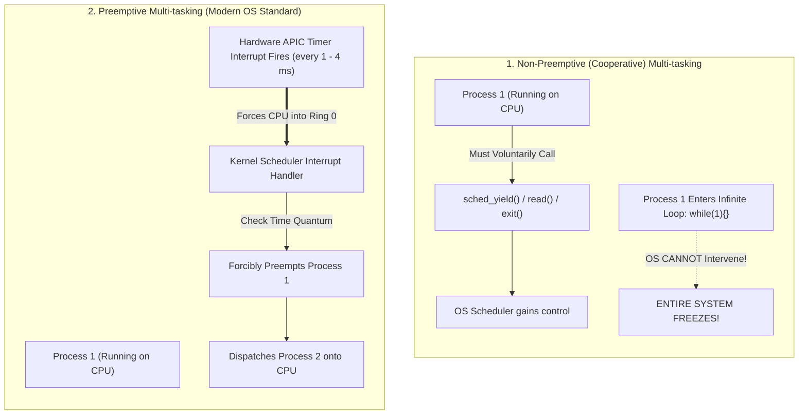
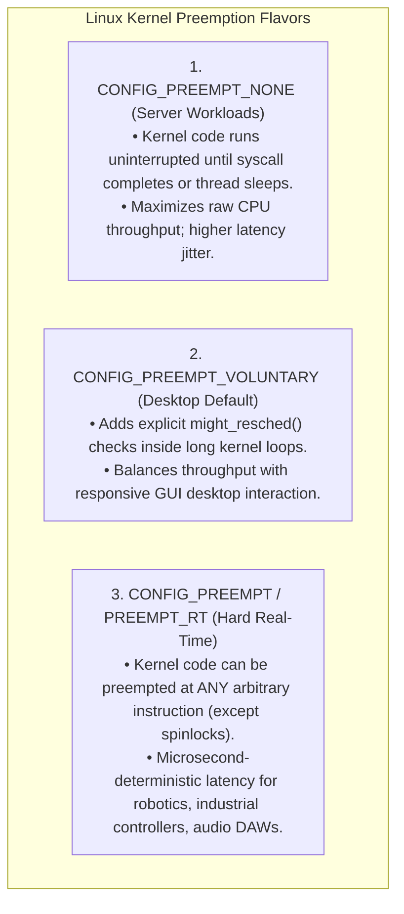
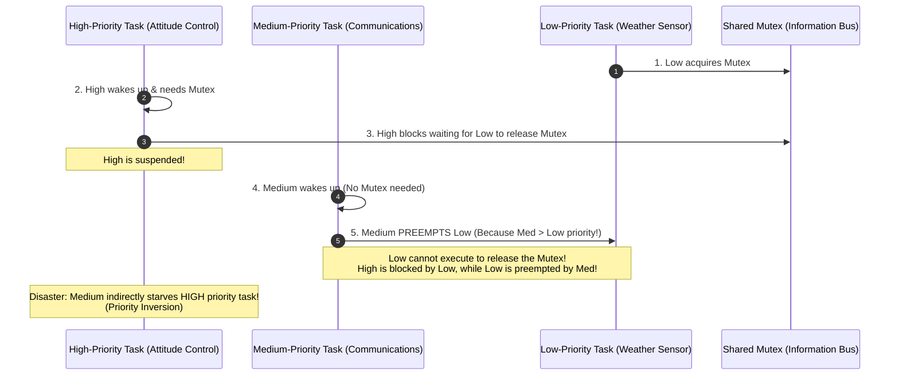

# Preemptive vs Non-Preemptive Scheduling

> [!abstract] Mental Model
> - **Non-Preemptive (Cooperative) Scheduling** is an **unsupervised public telephone booth**: once a user steps inside and begins talking, they keep the phone until they decide to hang up or leave (`exit()` or `read()`). If one user falls asleep inside with the phone to their ear (an infinite loop), everyone waiting outside is starved indefinitely.
> - **Preemptive Scheduling** is an **authoritative traffic cop with a stopwatch**: when your allotted time slice expires or an emergency vehicle arrives (a higher-priority task wakes up), the cop physically pulls you out of the booth, pushes you to the back of the queue, and awards the booth to the next person.

---

## Architectural Comparison: Cooperative vs Preemptive



---

## Detailed Dimension-by-Dimension Matrix

| Dimension | Non-Preemptive (Cooperative) | Preemptive |
| :--- | :--- | :--- |
| **CPU Relinquishment** | **Voluntary**: The running process must explicitly yield or block on I/O. | **Involuntary**: The OS forcibly strips CPU control via timer interrupts. |
| **System Responsiveness** | **Poor**: High response times; responsive UI depends entirely on well-behaved code. | **Excellent**: Low, predictable response times; guarantees interactive smoothness. |
| **Crash / Hang Resilience** | **Zero**: A single process infinite loop freezes the entire operating system. | **Total**: A runaway process is throttled to its fair share; other apps run unharmed. |
| **Context Switch Overhead** | **Very Low**: Context switches occur only when a process naturally yields. | **Higher**: Regular timer interrupts and involuntary context switches add CPU tax. |
| **Concurrency / Data Races** | **Simple**: Code between yields cannot be interrupted by other threads. | **Complex**: Requires mutexes, spinlocks, and memory barriers to prevent data corruption. |
| **Canonical Systems** | Windows 3.1, Mac OS 9, JavaScript Event Loop, Cooperative Coroutines. | Linux, Windows NT, macOS, FreeBSD, iOS, Android. |

---

## Kernel-Space Preemption: `CONFIG_PREEMPT` Deep Dive

While all modern operating systems support **User-Space Preemption**, modern Linux kernels can also configure **Kernel-Space Preemption** (how the kernel behaves when a thread is executing privileged Ring 0 syscall code):



---

## Preemption Triggers in Modern Operating Systems

A running process is preempted under three primary hardware and kernel events:

```text
The 3 Preemption Triggers:
+-------------------------------------------------------------------------------+
| 1. Quantum Expiration:                                                        |
|    The CPU hardware timer generates a local APIC interrupt. The kernel CFS    |
|    accounting updates process vruntime. If vruntime > ideal_runtime, the      |
|    need_resched flag is set, triggering context_switch().                     |
+-------------------------------------------------------------------------------+
| 2. High-Priority Wakeup:                                                      |
|    A hardware interrupt (e.g., NIC receives network packet or disk DMA finishes)|
|    wakes a sleeping high-priority real-time process. The kernel immediately   |
|    preempts the active lower-priority compute task.                           |
+-------------------------------------------------------------------------------+
| 3. Syscall Return:                                                            |
|    Upon completing a system call, before returning from Ring 0 to Ring 3      |
|    (SYSRET), the kernel checks if TIF_NEED_RESCHED is set on current PCB.    |
+-------------------------------------------------------------------------------+
```

---

## The Danger of Preemption: Priority Inversion & The Mars Pathfinder Disaster

While preemption provides responsiveness, it introduces complex concurrency failure modes:



### The Solution: Priority Inheritance
When High-Priority Task blocks on a lock held by Low-Priority Task, the kernel **temporarily elevates Low's priority to match High**. This prevents Medium from preempting Low, allowing Low to quickly finish and release the lock to High.

---

## Production Diagnostics & Observability Commands

```bash
# 1. Inspect kernel preemption model of running Linux system
zcat /proc/config.gz | grep PREEMPT
# Outputs: CONFIG_PREEMPT_VOLUNTARY=y OR CONFIG_PREEMPT=y

# 2. View involuntary context switches (preemptions) vs voluntary yields
pidstat -w 1

# 3. Check for latency spikes caused by disabled preemption (Ftrace)
sudo trace-cmd record -p preemptirqsoff sleep 5
sudo trace-cmd report
# Reports maximum time interrupts or preemption were disabled by kernel spinlocks
```

---

## Active Recall & Interview Perspective

### Reasoning Prompts
1. *Why was cooperative multitasking acceptable in early operating systems like Windows 3.1, and what forced the industry to abandon it?*
   - **Answer**: Early systems ran single-user, single-tasking workloads where cooperative scheduling minimized CPU context-switch overhead on slow 16-bit hardware. However, as applications grew complex, a single software bug or infinite loop in any third-party program would freeze the entire operating system, requiring a physical power reboot. Preemptive scheduling became mandatory to ensure system reliability and security isolation.
2. *What is `TIF_NEED_RESCHED` in the Linux kernel?*
   - **Answer**: `TIF_NEED_RESCHED` is a thread information flag set in the `task_struct` by the scheduler (e.g., during a timer interrupt when a time slice expires or when a higher-priority task wakes up). When the CPU finishes servicing an interrupt or is about to return from a system call to user space, the kernel checks this bit; if set, it calls `schedule()` to perform a context switch.
3. *What is Priority Inversion and how does Priority Inheritance resolve it?*
   - **Answer**: Priority Inversion occurs when a low-priority task holds a shared resource required by a high-priority task, and an unrelated medium-priority task preempts the low-priority task. This prevents the low-priority task from finishing and releasing the lock, indirectly starving the high-priority task. Priority Inheritance solves this by dynamically boosting the low-priority task's priority to match the blocked high-priority task until the lock is released.

---

## Key Takeaways
- **Non-Preemptive (Cooperative)** scheduling relies on voluntary process yields; a single freeze halts the OS.
- **Preemptive scheduling** uses hardware timer interrupts and priority wakeups to forcibly swap tasks, guaranteeing responsiveness and resilience.
- Preemption introduces concurrency hazards (**Priority Inversion**), solved via kernel **Priority Inheritance**.

---

## Related Notes
- [[Operating System]] — Resource allocation.
- [[Interrupts and Interrupt Handling]] — Hardware APIC timer interrupts.
- [[Context Switching]] — Hardware register and stack transitions.
- [[CPU Scheduler and Dispatcher]] — Scheduling algorithms.
- [[Scheduling Metrics - Turnaround, Response, Waiting Time]] — Quantifying scheduling efficiency.
- [[Priority Scheduling and Aging]] — Priority inversion mitigations.
- [[Linux CFS - Completely Fair Scheduler]] — Preemptive CFS architecture.
- [[Operating Systems MOC]] — Master table of contents for Operating Systems.
