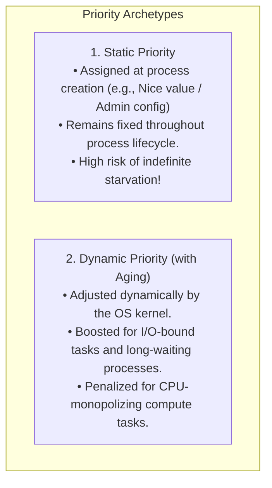
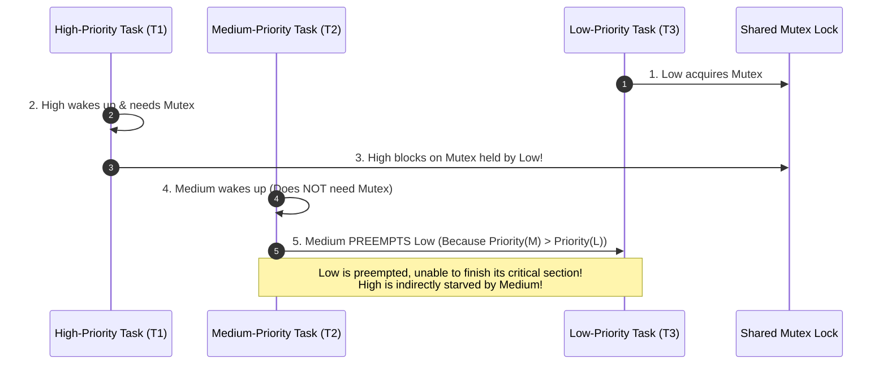
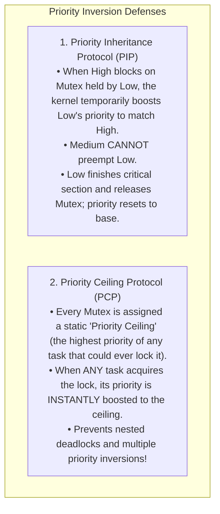

# Priority Scheduling and Aging

> [!abstract] Mental Model
> Priority Scheduling is the **VIP fast-track security lane at an international airport**: high-status passengers (critical OS kernel tasks, audio engines, and UI compositors) bypass standard queues. However, to prevent economy passengers from being stranded in the airport terminal forever, the OS introduces **Aging**: every 10 minutes an economy passenger sits waiting, their boarding pass is stamped with a priority upgrade until they eventually become a VIP themselves.

---

## Algorithm Mechanics: Static vs Dynamic Priorities



### Priority Numbering Conventions:
- **Unix / Linux Convention**: **Smaller Number = Higher Priority** (e.g., Real-time `0` is highest; Nice `-20` is higher priority than `+19`).
- **Windows / RTOS Convention**: **Larger Number = Higher Priority** (e.g., Priority `31` is Real-Time; `0` is System Idle).

---

## The Starvation Hazard (Indefinite Blocking)

In a pure static priority scheduler, if there is a steady influx of high-priority processes, **low-priority processes may wait forever**:

> [!warning] The MIT Mainframe Incident (1973)
> When MIT shut down its IBM 7094 mainframe in 1973, system operators discovered a low-priority batch job submitted in **1967** that had been sitting in the ready queue for **6 years without ever running a single instruction** because higher-priority jobs continuously arrived!

---

## The Aging Solution: Mathematical Formulation

**Aging** is the standard technique to guarantee starvation freedom in priority-based schedulers by **gradually increasing the priority of processes that wait in the ready queue for long periods**:

$$\mathbf{P_{\text{dynamic}}(t) = P_{\text{base}} - \left\lfloor \frac{t - t_{\text{arrival}}}{\Delta t} \right\rfloor \times k}$$

*(Using the Unix convention where lower values indicate higher priority)*

- $P_{\text{base}}$: The original static priority assigned to the process.
- $t - t_{\text{arrival}}$: The total cumulative elapsed time the process has been waiting in the ready queue.
- $\Delta t$: The aging time quantum (e.g., every $100\text{ ms}$).
- $k$: The priority step increment (e.g., $1$ priority rank per interval).

```text
Aging Progression Example (Process Base Priority = 100):
Time = 0ms   -> Dynamic Priority = 100 (Low Priority)
Time = 500ms -> Dynamic Priority = 95
Time = 2000ms-> Dynamic Priority = 80
Time = 5000ms-> Dynamic Priority = 50 (Competes directly with high-priority tasks!)
```

Eventually, any starving process will climb to the highest priority tier in the system and execute.

---

## Fatal Concurrency Hazard: Priority Inversion & Solutions

When priority scheduling interacts with mutual exclusion locks, it can trigger **Priority Inversion**:



---

### The Two Industrial Mitigations:



---

## Linux Production Reality: Nice Values and Real-Time Priorities

The Linux kernel decomposes process priority into two distinct spectrums:

```text
Linux Kernel Priority Scale (0 to 139):
+-------------------------------------------------------------------------------+
| Real-Time Priority Range (0 to 99)     | Standard CFS Nice Range (100 to 139) |
| Managed by SCHED_FIFO & SCHED_RR       | Managed by Completely Fair Scheduler |
| Real-Time priority 0 is HIGHEST        | Nice -20 (prio 100) to +19 (prio 139)|
+-------------------------------------------------------------------------------+
```

### Nice Values (`-20` to `+19`):
- **Nice `-20`**: Highest user priority (consumes large CPU share; "not nice" to others).
- **Nice `0`**: Default user process priority.
- **Nice `+19`**: Lowest user priority (relinquishes CPU to everyone else; "very nice").

---

## Production Diagnostics & Observability Commands

```bash
# 1. Launch a CPU-intensive task with low priority (high nice value)
nice -n 19 tar -czf backup.tar.gz /var/log/

# 2. Renice a running database worker process to high priority (requires sudo for negative nice)
sudo renice -n -10 -p <PID>

# 3. View process Real-Time Priority (RTPRIO) and Nice value (NI)
ps -eo pid,tid,class,rtprio,ni,pri,comm | grep -E "nginx|java"

# 4. View real-time lock contention and priority inheritance events via ftrace
sudo trace-cmd record -e rtmutex:rt_mutex_setprio
```

---

## Active Recall & Interview Perspective

### Reasoning Prompts
1. *What is the difference between Priority Inheritance Protocol (PIP) and Priority Ceiling Protocol (PCP)?*
   - **Answer**: Under Priority Inheritance, a low-priority task's priority is boosted only **reactively** when a higher-priority task actually attempts to acquire the lock and blocks. Under Priority Ceiling, every lock has a predefined maximum priority ceiling, and any task acquiring the lock is **proactively** elevated to that ceiling immediately upon acquisition. PCP mathematically eliminates deadlock and guarantees that a high-priority task is blocked by at most one lower-priority critical section.
2. *Why is static priority scheduling unacceptable for general-purpose cloud servers?*
   - **Answer**: In cloud multi-tenant environments, static priorities allow high-priority services to completely starve lower-priority background tasks (log shipping, metrics scrapers, health checks). If a web server experiences a traffic surge, static priority starvation can cause monitoring daemons to miss heartbeats, triggering false node failure alerts in Kubernetes. Dynamic priority scheduling with aging ensures all tasks make progress.
3. *Why can normal users only increase their nice value (lowering priority), while only root can decrease it (raising priority)?*
   - **Answer**: Lowering a nice value (e.g., from `0` to `-20`) grants a process a disproportionately large share of CPU time and higher preemption preference over other users. If unprivileged users could lower their own nice values, any rogue user could set their programs to `-20`, effectively causing a Denial of Service (DoS) for all other users on the multi-user system.

---

## Key Takeaways
- **Priority Scheduling** dispatches tasks based on importance, but risks **indefinite starvation** without dynamic **Aging**.
- **Aging** boosts the priority of waiting tasks over time: $\mathbf{P_{\text{dynamic}} = P_{\text{base}} - (t / \Delta t) \times k}$.
- Preemption plus mutual exclusion creates **Priority Inversion**, mitigated in production kernels via **Priority Inheritance (`rt_mutex`)**.

---

## Related Notes
- [[Operating System]] — Resource scheduling policies.
- [[CPU Scheduler and Dispatcher]] — Scheduling mechanisms.
- [[Preemptive vs Non-Preemptive Scheduling]] — Preemption and priority wakeups.
- [[Scheduling Metrics - Turnaround, Response, Waiting Time]] — Measuring waiting times.
- [[Multilevel Queue and MLFQ]] — Multi-tier priority feedback queues.
- [[Linux CFS - Completely Fair Scheduler]] — How nice values translate to CFS weights.
- [[Producer-Consumer Pattern - Bounded Queues and Condition Variables]] — Priority inheritance on shared mutexes.
- [[Operating Systems MOC]] — Master table of contents for Operating Systems.
