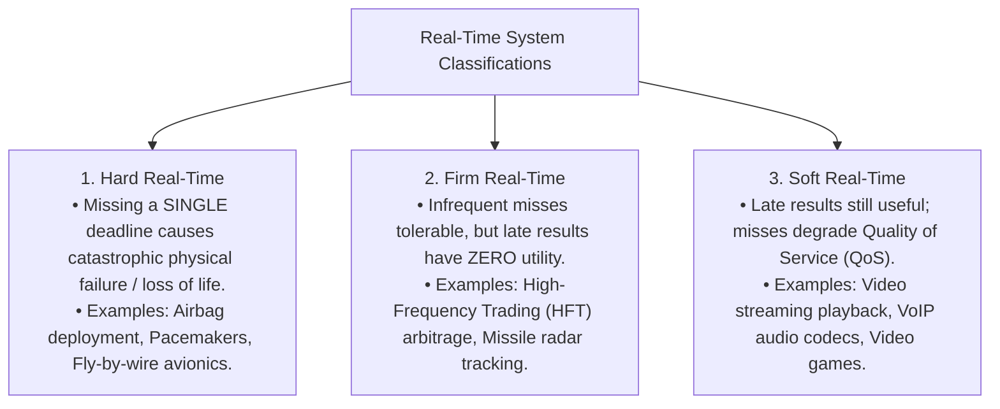
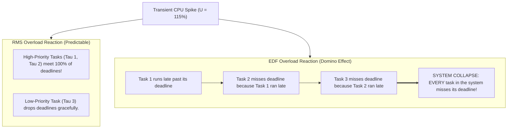

# Real-Time Scheduling: Rate Monotonic (RMS) and Earliest Deadline First (EDF)

> [!abstract] Mental Model
> In a general-purpose operating system, calculating a matrix multiplication in $500\text{ ms}$ instead of $50\text{ ms}$ is merely a performance annoyance. In a **Hard Real-Time Operating System (RTOS)** controlling an automotive anti-lock brake system or aircraft flight surface, deploying an actuator $500\text{ ms}$ late instead of $5\text{ ms}$ is a **catastrophic total system failure**.
> Real-time scheduling treats **time as a hard correctness constraint**, guaranteeing that execution deadlines are deterministically satisfied.

---

## Real-Time Taxonomy: Hard vs Firm vs Soft



---

## The Periodic Real-Time Task Model

Real-time tasks are modeled as periodic cyclic processes:

```mermaid
gantt
    title Periodic Real-Time Task Parameters
    dateFormat  X
    axisFormat %s
    section Task Tau_i
    Period Start (Release t=0) :milestone, 0, 0
    Execution Burst (C_i = 2)  :crit, 0, 2
    Idle Waiting for Next Period :active, 2, 5
    Deadline & Next Period (T_i = 5) :milestone, 5, 5
```



- **Period ($T_i$)**: The time interval between successive job releases.
- **Computation Time ($C_i$)**: The Worst-Case Execution Time (WCET) required on the CPU.
- **Deadline ($D_i$)**: The absolute timestamp by which execution must finish (typically $D_i = T_i$).
- **CPU Utilization ($U_i$)**: The fraction of CPU bandwidth consumed by task $i$:
  $$\mathbf{U_i = \frac{C_i}{T_i}}$$
- **Total System Utilization ($U$)**:
  $$\mathbf{U = \sum_{i=1}^{n} \frac{C_i}{T_i}}$$

---

## 1. Rate Monotonic Scheduling (RMS)

Pioneered by C. L. Liu and James Layland (1973), RMS is the gold standard of **Static-Priority Real-Time Scheduling**:

> [!important] The Rate Monotonic Rule
> **Tasks with shorter periods (higher frequencies) are assigned higher static priorities.**
> If $T_1 < T_2$, then $\text{Priority}(\tau_1) > \text{Priority}(\tau_2)$. Priority is assigned at design time and never changes.

---

### The Liu & Layland Schedulability Bound

For $n$ periodic tasks, a task set is **guaranteed to be schedulable without missing any deadlines** under RMS if total CPU utilization satisfies:

$$\mathbf{U = \sum_{i=1}^{n} \frac{C_i}{T_i} \le n \left( 2^{1/n} - 1 \right)}$$

```text
Liu-Layland Utilization Bounds by Task Count (n):
+-------------------+-----------------------------------------------------------+
| Task Count (n)    | Maximum Guaranteed Schedulability Utilization Bound (U)   |
+-------------------+-----------------------------------------------------------+
| n = 1             | U <= 1.0 (100.0%)                                         |
| n = 2             | U <= 2 * (sqrt(2) - 1) ≈ 0.828 (82.8%)                    |
| n = 3             | U <= 3 * (cbrt(2) - 1) ≈ 0.779 (77.9%)                    |
| n = 5             | U <= 5 * (2^(1/5) - 1) ≈ 0.743 (74.3%)                    |
| n -> Infinity     | lim(n->inf) n * (2^(1/n) - 1) = ln(2) ≈ 0.693 (69.3%)     |
+-------------------+-----------------------------------------------------------+
```

> [!tip] Sufficiency vs Necessity of the Bound
> The Liu-Layland test is a **sufficient condition, but NOT a necessary condition**:
> - If $U \le \ln(2) \approx \mathbf{69.3\%}$: The task set is **100% guaranteed schedulable**.
> - If $69.3\% < U \le 100\%$: The set **may still be schedulable** (verified via Exact Response Time Analysis).
> - If $U > 100\%$: The system is over-utilized and **no algorithm can schedule it**.

---

## 2. Earliest Deadline First (EDF)

EDF is a **Dynamic-Priority Real-Time Algorithm**:

> [!important] The EDF Rule
> **The task with the closest absolute deadline ($d_i$) is assigned the highest priority at runtime.**
> Whenever a scheduling event occurs, the CPU is dispatched to the task whose deadline is nearest in time.

---

### Schedulability Condition: 100% Theoretical Utilization

> [!tip] Optimality Theorem
> EDF is **provably optimal** for dynamic priority scheduling on single-core systems. A task set is schedulable under EDF if and only if:
> $$\mathbf{U = \sum_{i=1}^{n} \frac{C_i}{T_i} \le 1.0 \quad (100\%)}$$

Unlike RMS (which caps guaranteed utilization at $69.3\%$), EDF can **drive CPU hardware to 100% saturation without missing a single deadline**.

---

## Detailed Comparison: RMS vs EDF

| Dimension | Rate Monotonic Scheduling (RMS) | Earliest Deadline First (EDF) |
| :--- | :--- | :--- |
| **Priority Assignment** | **Static** (Fixed at compile-time by period $T$). | **Dynamic** (Recalculated at runtime by deadline $d$). |
| **Maximum Schedulable Load** | $U \le n(2^{1/n}-1) \approx \mathbf{69.3\%}$ | $U \le \mathbf{100\%}$ |
| **Runtime Overhead** | **Extremely Low**: Simple static priority lookup. | **Moderate**: Requires dynamic min-heap deadline sorting. |
| **Transient Overload Behavior**| **Graceful**: Low-priority tasks drop; high-priority tasks **always meet deadlines**. | **Catastrophic (Domino Effect)**: A single late task can cause a cascade where **all tasks miss deadlines**. |
| **Implementation Complexity** | Trivial (Supported on any OS with static priorities). | Requires dedicated kernel deadline tracking. |

---

## Transient Overload: The EDF "Domino Effect" Hazard



Because RMS statically shields high-priority tasks from low-priority spikes, safety-critical aerospace and automotive systems heavily prefer **RMS** despite its lower theoretical utilization.

---

## Linux Implementation: `SCHED_DEADLINE`

In Linux Kernel 3.14+, real-time EDF is implemented as the **`SCHED_DEADLINE`** policy using the Constant Bandwidth Server (CBS) algorithm:

```c
#include <linux/sched.h>
#include <sys/syscall.h>

// Linux sched_attr struct for SCHED_DEADLINE
struct sched_attr {
    __u32 size;
    __u32 sched_policy;    // SCHED_DEADLINE
    __u64 sched_flags;
    __s32 sched_nice;
    __u32 sched_priority;
    __u64 sched_runtime;   // Execution Budget (e.g. 10ms = 10,000,000 ns)
    __u64 sched_deadline;  // Relative Deadline (e.g. 30ms = 30,000,000 ns)
    __u64 sched_period;    // Task Period (e.g. 30ms = 30,000,000 ns)
};

// Set thread to SCHED_DEADLINE
struct sched_attr attr = {
    .size = sizeof(attr),
    .sched_policy = 6, // SCHED_DEADLINE
    .sched_runtime = 10 * 1000 * 1000,
    .sched_deadline = 30 * 1000 * 1000,
    .sched_period = 30 * 1000 * 1000,
};
syscall(SYS_sched_setattr, 0, &attr, 0);
```

---

## Active Recall & Interview Perspective

### Reasoning Prompts
1. *Why is Rate Monotonic priority assignment strictly static while EDF is dynamic?*
   - **Answer**: In RMS, priorities are assigned solely based on task period lengths ($T_i$). Because the period is a fixed structural property of the task, its priority never changes throughout execution. In EDF, priority is assigned based on the *absolute deadline* ($d_i = \text{release\_time} + D_i$) of the current instance. As time elapses and new jobs are released, a task with a long period can suddenly have an absolute deadline closer than a task with a short period, dynamically reordering priorities.
2. *If a system has two periodic tasks $\tau_1(C_1=2, T_1=5)$ and $\tau_2(C_2=4, T_2=10)$, is it schedulable under RMS and EDF?*
   - **Answer**: 
     - Total Utilization $U = \frac{2}{5} + \frac{4}{10} = 0.40 + 0.40 = \mathbf{0.80\text{ (80\%)}}$.
     - **For RMS**: The 2-task Liu-Layland bound is $2(2^{1/2}-1) \approx \mathbf{0.828\text{ (82.8\%)}}$. Since $0.80 \le 0.828$, the task set is **100% guaranteed schedulable under RMS**.
     - **For EDF**: Since $U = 0.80 \le 1.0$, the task set is **100% guaranteed schedulable under EDF**.
3. *Why is RMS preferred over EDF in life-critical avionics systems despite EDF's higher theoretical utilization?*
   - **Answer**: Under unexpected transient CPU overloads (e.g., sensor storms during turbulence), EDF suffers from the catastrophic **Domino Effect**, where missing one deadline delays the next task, causing *every* task in the system to miss deadlines. RMS provides deterministic **fault isolation**: even if utilization exceeds 100%, the highest-priority tasks (e.g., flight attitude control) are mathematically guaranteed to meet 100% of their deadlines, sacrificing only non-critical telemetry tasks.

---

## Key Takeaways
- **Rate Monotonic (RMS)** uses static priorities ($T_i$ inversely proportional to priority) with a guaranteed utilization bound of **$\approx 69.3\%$** ($\ln 2$).
- **Earliest Deadline First (EDF)** uses dynamic absolute deadlines, achieving **$100\%$ optimal utilization**.
- In transient overload, RMS offers **predictable degradation**, while EDF suffers from the **Domino Effect**.

---

## Related Notes
- [[Operating System]] — Resource allocation.
- [[CPU Scheduler and Dispatcher]] — Scheduling mechanisms.
- [[Preemptive vs Non-Preemptive Scheduling]] — Preemption models.
- [[Scheduling Metrics - Turnaround, Response, Waiting Time]] — Deadlines and latency.
- [[Priority Scheduling and Aging]] — Static and dynamic priority models.
- [[Linux CFS - Completely Fair Scheduler]] — General-purpose scheduling.
- [[Operating Systems MOC]] — Master table of contents for Operating Systems.
