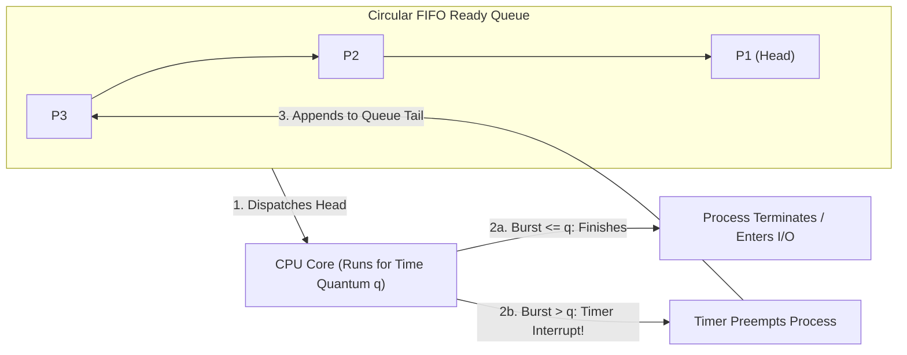
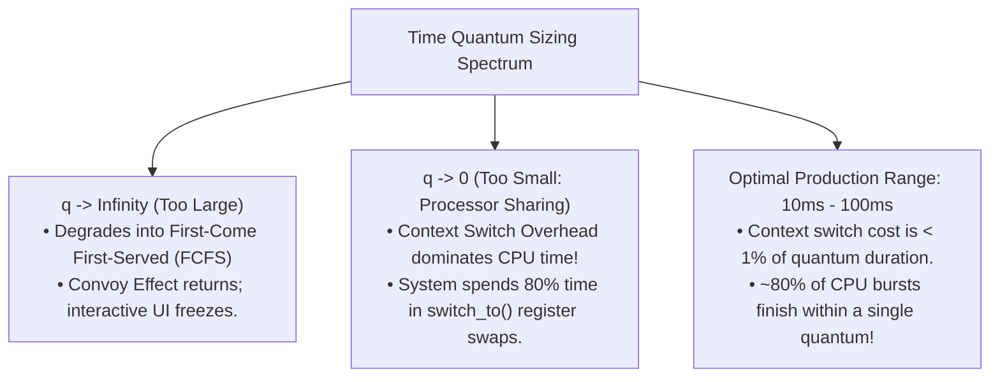

# Round Robin Scheduling (RR)

> [!abstract] Mental Model
> Round Robin is a **fair circular carousel**: every child on the playground gets to ride the carousel for exactly **$q$ seconds (the Time Quantum)**. When your timer dings, you must hop off, walk to the very back of the line, and wait your turn while the next child rides. No single child can monopolize the ride, guaranteeing that every passenger receives prompt, regular attention.

---

## Algorithm Architecture: Preemptive Circular FIFO Queue



### Execution Mechanics:
1. **Ready Queue**: Maintained as a circular First-In, First-Out (FIFO) queue of runnable PCBs.
2. **Timer Initialization**: The scheduler sets a hardware timer interrupt for a duration equal to the **Time Quantum ($q$)** (typically **$10\text{ to }100\text{ ms}$** in general-purpose systems).
3. **Dispatch**: The process at the head of the ready queue is dispatched to the CPU core.
4. **Preemption / Completion**:
   - **Case A (Burst $< q$)**: The process finishes compute before the quantum expires, voluntarily yielding the CPU via `exit()` or blocking on I/O. The timer is reset and the next process is dispatched immediately.
   - **Case B (Burst $> q$)**: The hardware timer interrupt fires. The kernel forces a mode switch into Ring 0, moves the running process to the **tail of the ready queue**, and executes a [[Context Switching|Context Switch]] to the next process.

---

## The Critical Dilemma: Sizing the Time Quantum ($q$)

The performance of Round Robin is heavily governed by the choice of the time quantum $q$:



### The 80% Rule of Thumb
> [!tip] Golden Design Rule
> The time quantum $q$ should be chosen such that **at least 80% of typical CPU bursts are shorter than $q$**. This allows the vast majority of short, interactive tasks to complete in a single time slice without suffering preemption context-switch penalties.

---

## Comparative Gantt Chart Walkthrough ($q = 4\text{ ms}$)

Consider three processes arriving simultaneously at $t = 0$:

| Process | Arrival Time ($AT$) | Burst Time ($BT$) |
| :--- | :--- | :--- |
| **$P_1$** | $0\text{ ms}$ | $24\text{ ms}$ |
| **$P_2$** | $0\text{ ms}$ | $3\text{ ms}$ |
| **$P_3$** | $0\text{ ms}$ | $3\text{ ms}$ |

### Execution Trace:
- $t=0\text{ to }4$: $P_1$ runs for 4 ms (Remaining: 20 ms) $\rightarrow$ Preempted to tail.
- $t=4\text{ to }7$: $P_2$ runs for 3 ms (Burst $< 4$) $\rightarrow$ **$P_2$ Terminates at $t=7$!**
- $t=7\text{ to }10$: $P_3$ runs for 3 ms (Burst $< 4$) $\rightarrow$ **$P_3$ Terminates at $t=10$!**
- $t=10\text{ to }30$: $P_1$ runs remaining 20 ms in successive 4 ms slices to completion.

```text
Round Robin (q = 4ms) Gantt Chart:
[ P1 (0-4) ][ P2 (4-7) ][ P3 (7-10) ][          P1 (10 to 30)          ]
0          4           7           10                                  30
```

### Calculation Table:
| Process | $AT$ | $BT$ | $ST$ | $CT$ | $TAT = CT - AT$ | $WT = TAT - BT$ | $RT = ST - AT$ |
| :--- | :--- | :--- | :--- | :--- | :--- | :--- | :--- |
| **$P_1$** | 0 | 24 | 0 | 30 | $30 - 0 = \mathbf{30\text{ ms}}$ | $30 - 24 = \mathbf{6\text{ ms}}$ | $0 - 0 = \mathbf{0\text{ ms}}$ |
| **$P_2$** | 0 | 3 | 4 | 7 | $7 - 0 = \mathbf{7\text{ ms}}$ | $7 - 3 = \mathbf{4\text{ ms}}$ | $4 - 0 = \mathbf{4\text{ ms}}$ |
| **$P_3$** | 0 | 3 | 7 | 10 | $10 - 0 = \mathbf{10\text{ ms}}$ | $10 - 3 = \mathbf{7\text{ ms}}$ | $7 - 0 = \mathbf{7\text{ ms}}$ |

### Average System Metrics:
- **Average Waiting Time**: $\frac{6 + 4 + 7}{3} = \mathbf{5.66\text{ ms}}$ *(Compared to $17.0\text{ ms}$ in FCFS!)*
- **Average Response Time**: $\frac{0 + 4 + 7}{3} = \mathbf{3.66\text{ ms}}$ *(Every process received immediate CPU attention within 7 ms!)*

---

## Detailed Algorithm Trade-Off Matrix

| Dimension | Round Robin (RR) |
| :--- | :--- |
| **Scheduling Type** | **Preemptive** (Hardware Timer Driven) |
| **Starvation Risk** | **Zero (Starvation-Free)**: Every process gets CPU time within $(n-1) \times q$ time units. |
| **Response Time ($RT$)** | **Superb**: Maximum response time bounded to $(n-1) \times q$. |
| **Turnaround Time ($TAT$)** | **Moderate to High**: Interleaving long tasks increases completion times compared to SJF. |
| **Context Switch Overhead** | **Moderate**: Depends inversely on time quantum $q$. |
| **Implementation Complexity**| **Low**: Circular FIFO queue with timer interrupt handling. |

---

## Production Context: POSIX Real-Time Policy (`SCHED_RR`)

In modern Linux, Round Robin is implemented as the **`SCHED_RR` Real-Time Scheduling Policy**:

```c
#include <sched.h>

// Assign a process to Real-Time Round Robin scheduling with priority 80
struct sched_param param;
param.sched_priority = 80;

if (sched_setscheduler(0, SCHED_RR, &param) == -1) {
    perror("sched_setscheduler failed");
}

// Inspect default RR time slice interval (typically 100ms in Linux)
struct timespec tp;
sched_rr_get_interval(0, &tp);
printf("Linux SCHED_RR Time Slice: %ld ms\n", tp.tv_nsec / 1000000);
```

---

## Active Recall & Interview Perspective

### Reasoning Prompts
1. *Why does Round Robin provide excellent Response Time but often worse Average Turnaround Time than Shortest Job First?*
   - **Answer**: Round Robin slices execution evenly across all active tasks. This guarantees that every process receives a CPU slice very quickly (minimizing Response Time $RT$). However, because long processes are continuously paused to let other processes take slices, they take much longer to reach final completion than they would under SJF, which pushes the Average Turnaround Time ($TAT$) higher.
2. *What is Processor Sharing in CPU scheduling theory?*
   - **Answer**: Processor Sharing is the theoretical limit of Round Robin as the time quantum $q \to 0$. In a system with $n$ active processes and an infinitesimally small quantum, all $n$ processes appear to run concurrently on the CPU, each advancing at exactly $1/n$-th of the total CPU clock speed. In real hardware, processor sharing is impossible due to non-zero context-switch overhead.
3. *If there are $n$ processes in the ready queue and the time quantum is $q$, what is the maximum time any process must wait before getting its next CPU slice?*
   - **Answer**: The maximum wait time is bounded by **$(n - 1) \times q$** time units. No process will ever wait longer than this bound before receiving its next time slice, guaranteeing absolute starvation freedom and deterministic interactive responsiveness.

---

## Key Takeaways
- **Round Robin** is the canonical preemptive scheduling algorithm: **fair, starvation-free, circular FIFO queue**.
- The time quantum $q$ balances responsiveness and context switch overhead; production systems follow the **80% Rule of Thumb** ($q \approx 10–100\text{ ms}$).
- Round Robin prioritizes **low Response Time ($RT$)** over optimal Turnaround Time ($TAT$).

---

## Related Notes
- [[Operating System]] — CPU multiplexing.
- [[Interrupts and Interrupt Handling]] — Hardware timer interrupt mechanisms.
- [[Context Switching]] — Context switch cost trade-offs with small quanta.
- [[CPU Scheduler and Dispatcher]] — Scheduling architectures.
- [[Preemptive vs Non-Preemptive Scheduling]] — Timer preemption fundamentals.
- [[First-Come First-Served - FCFS]] — The non-preemptive counterpart ($q \to \infty$).
- [[Shortest Job First - SJF and SRTF]] — Optimizing turnaround time vs fairness.
- [[Operating Systems MOC]] — Master table of contents for Operating Systems.
