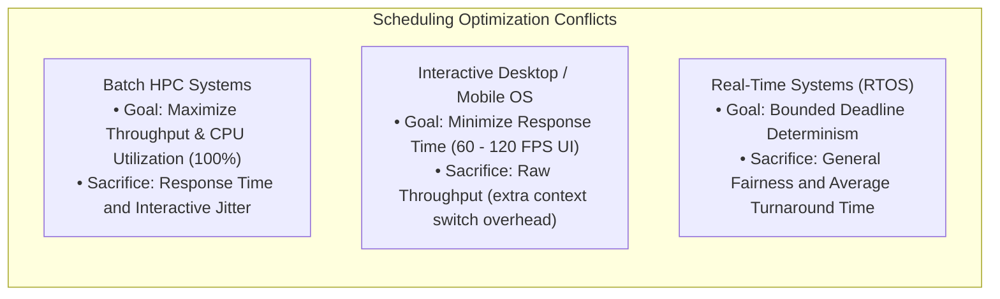

# Scheduling Metrics: Turnaround, Response, and Waiting Time

> [!abstract] Mental Model
> Evaluating a CPU scheduler is like measuring the performance of an airport terminal. We track passengers through distinct milestones:
> - **Arrival Time ($AT$)**: When the passenger arrives at the airport gate (enters Ready Queue).
> - **Response Time ($RT$)**: How long before they first speak to an airline agent (first CPU allocation).
> - **Waiting Time ($WT$)**: The total idle time spent sitting in waiting rooms across their entire journey.
> - **Turnaround Time ($TAT$)**: The total elapsed time from arriving at the airport to final takeoff ($CT - AT$).

---

## The Core Mathematical Definitions & Formulas

```mermaid
gantt
    title Process Lifecycle Timeline Breakdown
    dateFormat  X
    axisFormat %s
    section Process P1
    Arrives at AT (0)       :milestone, 0, 0
    Waiting in Ready Queue  :active, 0, 2
    First CPU Burst (RT=2)  :crit, 2, 4
    Preempted (Waiting)     :active, 4, 6
    Final CPU Burst         :crit, 6, 9
    Terminates at CT (9)    :milestone, 9, 9
```



### 1. Fundamental Time Milestones:
- **Arrival Time ($AT$)**: The timestamp when a process enters the Ready Queue in RAM.
- **Burst Time ($BT$)**: The total duration of CPU execution required to complete the task.
- **Start Time ($ST$)**: The timestamp when the process is **allocated the CPU for the very first time**.
- **Completion Time ($CT$)**: The timestamp when the process finishes execution and terminates.

---

### 2. Derived Performance Formulas:

$$\mathbf{\text{Turnaround Time } (TAT) = CT - AT}$$
*The total lifespan of the process in the system.*

$$\mathbf{\text{Waiting Time } (WT) = TAT - BT}$$
*Total cumulative time the process spent sitting in the Ready Queue waiting for CPU access.*

$$\mathbf{\text{Response Time } (RT) = ST - AT}$$
*The latency between process arrival and its very first execution slice (critical for interactive UIs).*

---

### 3. System-Wide Throughput & Utilization:
- **CPU Utilization**: The fraction of time the CPU cores are actively executing application or kernel instructions:
  $$\text{CPU Utilization} = \frac{\text{Busy Time}}{\text{Total Time}} \times 100\%$$
- **Throughput**: The rate of completed processes per unit time:
  $$\text{Throughput} = \frac{\text{Total Completed Processes}}{\text{Total Time Elapsed}}$$

---

## Step-by-Step Gantt Chart Calculation Walkthrough

Consider a set of three processes scheduled on a single CPU core:

| Process | Arrival Time ($AT$) | Burst Time ($BT$) |
| :--- | :--- | :--- |
| **$P_1$** | $0\text{ ms}$ | $6\text{ ms}$ |
| **$P_2$** | $1\text{ ms}$ | $4\text{ ms}$ |
| **$P_3$** | $2\text{ ms}$ | $2\text{ ms}$ |

### Execution Schedule (Non-Preemptive First-Come First-Served):
```text
Gantt Chart:
[      P1 (0 to 6)      ][   P2 (6 to 10)   ][ P3 (10 to 12) ]
0                       6                  10               12
```

### Calculation Table:
| Process | $AT$ | $BT$ | $ST$ | $CT$ | $TAT = CT - AT$ | $WT = TAT - BT$ | $RT = ST - AT$ |
| :--- | :--- | :--- | :--- | :--- | :--- | :--- | :--- |
| **$P_1$** | 0 | 6 | 0 | 6 | $6 - 0 = \mathbf{6\text{ ms}}$ | $6 - 6 = \mathbf{0\text{ ms}}$ | $0 - 0 = \mathbf{0\text{ ms}}$ |
| **$P_2$** | 1 | 4 | 6 | 10 | $10 - 1 = \mathbf{9\text{ ms}}$ | $9 - 4 = \mathbf{5\text{ ms}}$ | $6 - 1 = \mathbf{5\text{ ms}}$ |
| **$P_3$** | 2 | 2 | 10 | 12 | $12 - 2 = \mathbf{10\text{ ms}}$ | $10 - 2 = \mathbf{8\text{ ms}}$ | $10 - 2 = \mathbf{8\text{ ms}}$ |

### Average System Metrics:
- **Average Turnaround Time**: $\frac{6 + 9 + 10}{3} = \mathbf{8.33\text{ ms}}$
- **Average Waiting Time**: $\frac{0 + 5 + 8}{3} = \mathbf{4.33\text{ ms}}$
- **Average Response Time**: $\frac{0 + 5 + 8}{3} = \mathbf{4.33\text{ ms}}$

---

## Conflicting Optimization Goals (The Engineering Trade-Offs)

An operating system cannot maximize all metrics simultaneously. Schedulers represent an explicit optimization trade-off:



---

## Production Diagnostics & Observability: Measuring Runqueue Delay

In production Linux servers, high waiting time is known as **Runqueue Latency** (the time runnable threads spend stalled in the kernel ready queue waiting for an available CPU core):

```bash
# 1. Measure runqueue latency distribution using BCC/eBPF runqlat tool
sudo /usr/share/bcc/tools/runqlat 1 5

# Example Output:
#     usecs               : count     distribution
#         0 -> 1          : 1540     |****************************************|
#         2 -> 3          : 450      |***********                             |
#         4 -> 7          : 120      |***                                     |
#      1024 -> 2047       : 4        |                                        |
# High latency buckets (>1000 µs) indicate severe CPU core starvation!

# 2. View per-process CPU time metrics from /proc/<PID>/schedstat
cat /proc/<PID>/schedstat
# Field 1: Total CPU execution time (ns)
# Field 2: Total time spent waiting on ready runqueue (ns) [CUMULATIVE WAITING TIME]
# Field 3: Number of CPU time slices executed
```

---

## Active Recall & Interview Perspective

### Reasoning Prompts
1. *What is the critical difference between Waiting Time ($WT$) and Response Time ($RT$)?*
   - **Answer**: Response Time ($RT = ST - AT$) measures only the initial latency from when a process is submitted until it receives its **very first** CPU slice. In contrast, Waiting Time ($WT = TAT - BT$) is the **cumulative sum** of all idle periods the process spends stalled in the Ready Queue across its entire lifecycle, including all preemptions between successive CPU bursts. In interactive systems (GUIs), Response Time is the metric that governs perceived UI snappiness.
2. *Can Waiting Time ever be greater than Turnaround Time?*
   - **Answer**: No. Since $WT = TAT - BT$ and Burst Time ($BT$) is strictly non-negative ($BT \ge 0$), Waiting Time can at most be equal to Turnaround Time (which occurs if $BT = 0$, though practically $BT > 0$, making $WT < TAT$ always).
3. *Why does minimizing Average Turnaround Time not necessarily result in a good interactive user experience?*
   - **Answer**: Algorithms that minimize Average Turnaround Time (such as Shortest Job First) favor short batch jobs. If a user launches a background compilation task that has a long burst time, SJF will starve it indefinitely whenever short tasks arrive. In interactive desktop environments, users prefer a scheduler (like Round Robin or CFS) that gives immediate, frequent slices to all tasks, minimizing **Response Time** even if Average Turnaround Time is slightly higher due to context-switch overhead.

---

## Key Takeaways
- **Turnaround Time ($CT - AT$)** measures total elapsed time in the system; **Waiting Time ($TAT - BT$)** measures cumulative idle queue time.
- **Response Time ($ST - AT$)** measures the delay to the very first CPU execution, governing interactive GUI smoothness.
- Production systems monitor **Runqueue Latency** via eBPF (`runqlat`) to detect CPU starvation before application p99 latency spikes.

---

## Related Notes
- [[Operating System]] — Resource allocation.
- [[Process States and Lifecycle]] — State transitions between Ready and Running.
- [[CPU Scheduler and Dispatcher]] — Scheduling mechanisms.
- [[Preemptive vs Non-Preemptive Scheduling]] — Preemption impacts on metrics.
- [[First-Come First-Served - FCFS]] — Calculating metrics on FCFS queues.
- [[Shortest Job First - SJF and SRTF]] — Mathematically optimal turnaround time.
- [[Round Robin Scheduling]] — Optimizing response time for interactive tasks.
- [[Operating Systems MOC]] — Master table of contents for Operating Systems.
