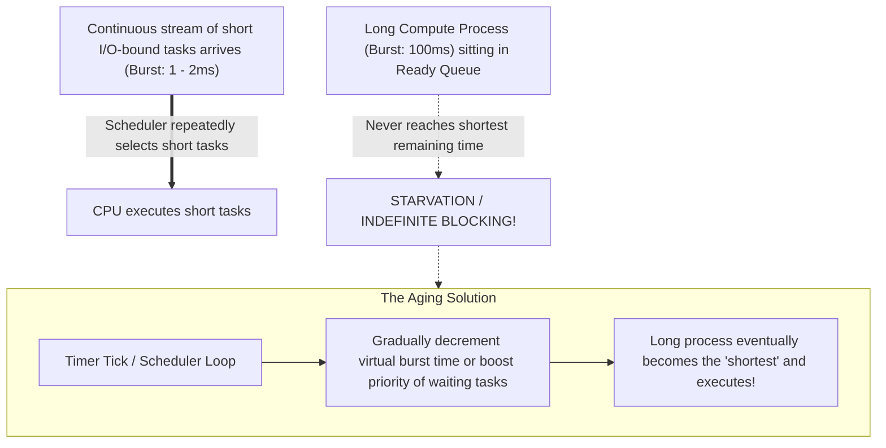

# Shortest Job First (SJF) and Shortest Remaining Time First (SRTF)

> [!abstract] Mental Model
> SJF is the **supermarket express checkout lane taken to its ultimate mathematical limit**: if the cashier always prioritizes the customer with the fewest items, the **total cumulative waiting time of all customers is mathematically minimized**. 
> - **Non-Preemptive SJF**: Once a process begins, it runs its full burst to completion.
> - **Preemptive SJF (SRTF)**: If a newcomer arrives with an even shorter remaining burst than what the active process has left, the active process is **instantly preempted**.

---

## Architectural Comparison: Non-Preemptive SJF vs Preemptive SRTF

```mermaid
flowchart TD
    subgraph SJF_NonPreempt ["1. Non-Preemptive SJF"]
        direction TB
        NP1["Process P1 (Burst: 10ms) starts running at t=0"]
        NP_New["New Process P2 (Burst: 2ms) arrives at t=2"]
        NP1 -.->|P1 CANNOT be interrupted| NP_Wait["P2 must wait in Ready Queue until t=10!"]
    end

    subgraph SRTF_Preempt ["2. Preemptive SJF (SRTF)"]
        direction TB
        P1["Process P1 (Remaining: 8ms) running at t=2"]
        P_New["New Process P2 (Remaining: 2ms) arrives at t=2"]
        P_New ==>|Preempts P1! (2ms < 8ms)| PreemptAction["P1 suspended to Ready Queue<br/>P2 immediately dispatched to CPU!"]
    end
```

---

## Mathematical Proof of Optimality

> [!tip] Theorem
> For any fixed set of processes with known burst times arriving simultaneously, **Shortest Job First is provably optimal**, giving the **minimum average waiting time ($\text{Avg } WT$)** of any scheduling algorithm.

### Intuition by Exchange Argument:
Suppose a scheduler executes Process $A$ (Burst $a$) immediately before Process $B$ (Burst $b$), where $a > b$:
- In order $[A, B]$:
  - $WT(A) = 0$
  - $WT(B) = a$
  - $\text{Total Waiting Time} = a$
- In swapped order $[B, A]$:
  - $WT(B) = 0$
  - $WT(A) = b$
  - $\text{Total Waiting Time} = b$

Since $b < a$, swapping the shorter job ahead strictly reduces total waiting time by $(a - b)$. Repeating this pairwise swap until all jobs are sorted in ascending order of burst time yields the absolute minimum average waiting time.

---

## Comparative Gantt Chart Walkthrough

Consider the following processes arriving at different times:

| Process | Arrival Time ($AT$) | Burst Time ($BT$) |
| :--- | :--- | :--- |
| **$P_1$** | $0\text{ ms}$ | $8\text{ ms}$ |
| **$P_2$** | $1\text{ ms}$ | $4\text{ ms}$ |
| **$P_3$** | $2\text{ ms}$ | $9\text{ ms}$ |
| **$P_4$** | $3\text{ ms}$ | $5\text{ ms}$ |

---

### Case 1: Non-Preemptive SJF
- At $t=0$: Only $P_1$ has arrived $\rightarrow$ $P_1$ runs to completion from $0$ to $8\text{ ms}$.
- At $t=8$: $P_2 (BT=4)$, $P_3 (BT=9)$, and $P_4 (BT=5)$ are all in the ready queue.
- Shortest is $P_2 (4\text{ ms}) \rightarrow$ runs $8$ to $12\text{ ms}$.
- Next shortest is $P_4 (5\text{ ms}) \rightarrow$ runs $12$ to $17\text{ ms}$.
- Final is $P_3 (9\text{ ms}) \rightarrow$ runs $17$ to $26\text{ ms}$.

```text
Non-Preemptive SJF Gantt Chart:
[        P1 (0-8)        ][   P2 (8-12)   ][   P4 (12-17)  ][        P3 (17-26)        ]
0                        8               12               17                          26
```

- **Waiting Times**:
  - $WT(P_1) = 0 - 0 = 0\text{ ms}$
  - $WT(P_2) = 8 - 1 = 7\text{ ms}$
  - $WT(P_4) = 12 - 3 = 9\text{ ms}$
  - $WT(P_3) = 17 - 2 = 15\text{ ms}$
- **Average Waiting Time**: $\frac{0 + 7 + 9 + 15}{4} = \mathbf{7.75\text{ ms}}$

---

### Case 2: Preemptive SRTF (Shortest Remaining Time First)
- At $t=0$: $P_1$ begins running (Remaining: $8\text{ ms}$).
- At $t=1$: $P_2$ arrives ($BT=4$). Since $4 < 7$ ($P_1$'s remaining time), **$P_1$ is PREEMPTED!** $P_2$ runs.
- At $t=2$: $P_3$ arrives ($BT=9$). $P_2$ remaining ($3$) $< 9 \rightarrow P_2$ continues.
- At $t=3$: $P_4$ arrives ($BT=5$). $P_2$ remaining ($2$) $< 5 \rightarrow P_2$ continues.
- At $t=5$: $P_2$ finishes! Ready Queue has: $P_4 (5\text{ ms})$, $P_1 (7\text{ ms})$, $P_3 (9\text{ ms})$. $P_4$ runs next ($5$ to $10$).
- At $t=10$: $P_4$ finishes! $P_1$ runs next ($10$ to $17$).
- At $t=17$: $P_1$ finishes! $P_3$ runs last ($17$ to $26$).

```text
Preemptive SRTF Gantt Chart:
[ P1 ][   P2 (1-5)   ][   P4 (5-10)  ][      P1 (10-17)      ][        P3 (17-26)        ]
0    1               5              10                      17                          26
```

- **Waiting Times**:
  - $WT(P_2) = 1 - 1 = 0\text{ ms}$
  - $WT(P_4) = 5 - 3 = 2\text{ ms}$
  - $WT(P_1) = (0 - 0) + (10 - 1) = 9\text{ ms}$
  - $WT(P_3) = 17 - 2 = 15\text{ ms}$
- **Average Waiting Time**: $\frac{0 + 2 + 9 + 15}{4} = \mathbf{6.50\text{ ms}}$ ($\approx 16\%$ faster than Non-Preemptive SJF!).

---

## The Practical Implementation Hurdle: Predicting CPU Bursts

In general-purpose operating systems, the kernel cannot look into the future to know the exact length of a process's next CPU burst. 

Instead, the OS estimates the next burst $\tau_{n+1}$ using **Exponential Smoothing (Moving Average)** of past bursts:

$$\mathbf{\tau_{n+1} = \alpha t_n + (1 - \alpha)\tau_n}$$

- $t_n$: The **actual duration** of the most recent ($n$-th) CPU burst.
- $\tau_n$: The **predicted duration** of the $n$-th CPU burst.
- $\tau_{n+1}$: The predicted duration of the **next** ($n+1$-th) CPU burst.
- $\alpha$: Smoothing weight factor ($0 \le \alpha \le 1$, typically $\alpha = 0.5$).

### Mathematical Expansion:
$$\tau_{n+1} = \alpha t_n + (1-\alpha)\alpha t_{n-1} + (1-\alpha)^2\alpha t_{n-2} + \dots + (1-\alpha)^{n+1}\tau_0$$
Because $(1-\alpha) < 1$, recent bursts have high weight while older bursts decay exponentially, creating an adaptive predictor.

---

## The Fatal Flaw: Starvation & The Aging Mitigation



---

## Detailed Algorithm Trade-Off Matrix

| Dimension | Shortest Job First (SJF / SRTF) |
| :--- | :--- |
| **Optimality** | **Provably Optimal** for minimum average waiting time. |
| **Preemption** | Non-Preemptive (SJF) or Preemptive (SRTF). |
| **Starvation Hazard** | **Severe**: Long jobs starve if short jobs arrive continuously. |
| **Implementation Feasibility** | **Theoretical / Approximation**: Future burst lengths must be estimated. |
| **Time Complexity** | $O(\log N)$ with Min-Heap or Red-Black Tree ready queues. |

---

## Active Recall & Interview Perspective

### Reasoning Prompts
1. *Why is Shortest Remaining Time First (SRTF) rarely implemented in pure form in general-purpose desktop operating systems?*
   - **Answer**: First, the OS cannot know future CPU burst times with certainty; it can only estimate them via exponential smoothing, which adds computational overhead. Second, SRTF suffers from catastrophic **starvation** for long-running CPU-bound processes if there is a steady stream of short tasks. Third, aggressive preemption creates frequent context switches, adding CPU cache pollution penalties that erode the theoretical waiting time advantages.
2. *How does Exponential Smoothing prevent single outlier bursts from permanently ruining scheduling predictions?*
   - **Answer**: Because the recurrence relation $\tau_{n+1} = \alpha t_n + (1-\alpha)\tau_n$ weights older execution history with exponentially decaying powers of $(1-\alpha)$. A single abnormally long burst will temporarily increase $\tau$, but as soon as the process returns to short bursts, the influence of the outlier drops off exponentially ($0.5^1, 0.5^2, 0.5^3\dots$), allowing the predictor to quickly recalibrate.
3. *What is the difference in Preemption between SJF and Round Robin?*
   - **Answer**: SJF/SRTF preempts a process based on **task duration comparisons** (when a newly arrived task has a shorter remaining burst than the running task). Round Robin preempts based strictly on **time elapsed** (when the hardware timer quantum expires), regardless of how long the process or its competitors need to finish.

---

## Key Takeaways
- **SJF / SRTF** is **provably optimal** for minimizing average waiting time.
- **SRTF** is the preemptive variant of SJF, preempting active tasks whenever a shorter remaining job arrives.
- Future burst lengths must be estimated via **Exponential Smoothing ($\tau_{n+1} = \alpha t_n + (1-\alpha)\tau_n$)**, and starvation must be mitigated with **Aging**.

---

## Related Notes
- [[Operating System]] — CPU multiplexing.
- [[CPU Scheduler and Dispatcher]] — Scheduler architecture.
- [[Preemptive vs Non-Preemptive Scheduling]] — Preemptive mechanics.
- [[Scheduling Metrics - Turnaround, Response, Waiting Time]] — Average waiting time metrics.
- [[First-Come First-Served - FCFS]] — The non-optimal predecessor to SJF.
- [[Round Robin Scheduling]] — Fairness-oriented scheduling.
- [[Priority Scheduling and Aging]] — Starvation prevention techniques.
- [[Operating Systems MOC]] — Master table of contents for Operating Systems.
