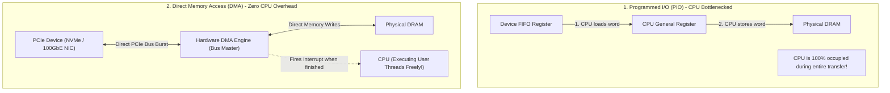
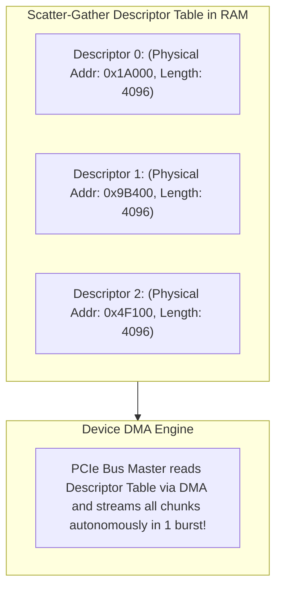
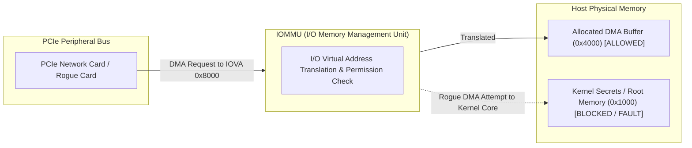
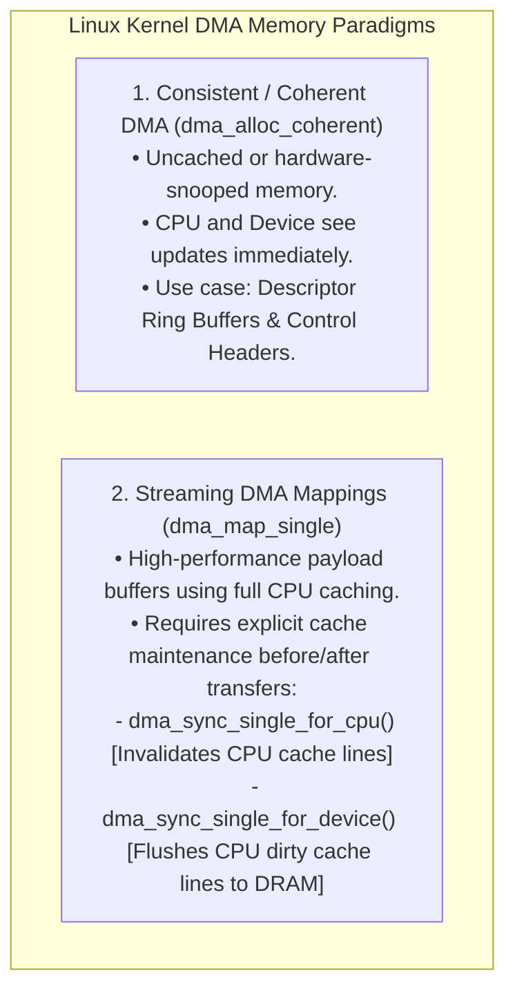

# Direct Memory Access (DMA)

> [!abstract] Mental Model
> Direct Memory Access is **an automated freight forklift vs a CEO manually carrying boxes**:
> - **Programmed I/O (PIO - The CEO carrying boxes)**: To read $1\text{ GB}$ from disk, the CPU executes a loop of $250,000,000$ assembly instructions, reading 4 bytes from the device register and storing them into RAM. The CPU sits at $100\%$ utilization acting as a glorified data-copying mule.
> - **Direct Memory Access (DMA - The Automated Forklift)**: The CPU hands a hardware co-processor (**Bus Master / DMA Engine**) a transfer manifest (*"Copy 1 GB from NVMe to RAM at Address 0x8000_0000"*), and immediately returns to executing user processes. The DMA engine streams data directly across the system bus and fires a single hardware interrupt when finished (**Interrupt on Completion**).

---

## PIO vs DMA Architectural Comparison



---

## Scatter-Gather DMA (Vectored DMA)

In modern operating systems with virtual memory paging, a contiguous $1\text{ MB}$ application buffer is almost always split into **$256$ non-contiguous $4\text{ KB}$ physical page frames** scattered across physical RAM.

Without Scatter-Gather, the kernel would need 256 separate DMA commands. **Scatter-Gather DMA** solves this using an in-memory **Descriptor Table (Scatterlist)**:



---

## Hardware Ring Buffers (NIC RX/TX Rings & NVMe Queues)

High-performance PCIe peripherals use circular **DMA Ring Buffers** residing in shared physical memory:

```mermaid
sequenceDiagram
    autonumber
    participant Driver as Kernel Device Driver (CPU)
    participant Ring as In-RAM Circular DMA Ring Buffer
    participant NIC as 100GbE PCIe Hardware ASIC

    Driver->>Ring: 1. Allocates empty packet buffers and writes descriptors to Ring
    Driver->>NIC: 2. Rings MMIO "Doorbell Register" (writel) to alert hardware
    NIC->>Ring: 3. DMA reads ring descriptors to find free memory buffers
    Note over NIC: Network packet arrives from optical fiber
    NIC->>Ring: 4. DMA writes incoming packet payload directly to host DRAM!
    NIC->>Driver: 5. Asserts Hardware MSI-X Interrupt to notify kernel
    Driver->>Ring: 6. Driver consumes packet; replenishes ring slot with fresh buffer
```

---

## Hardware Protection: The IOMMU (I/O Memory Management Unit)

Modern enterprise motherboards include an **IOMMU** (Intel VT-d / AMD-Vi) between the PCIe bus and DRAM:



### Critical IOMMU Capabilities:
1. **Security & DMA Attack Protection**: Prevents malicious PCIe/Thunderbolt devices from hijacking kernel physical memory (Thunderclap vulnerability mitigation).
2. **Virtual Machine Direct Device Pass-Through**: Allows a Guest OS in KVM/QEMU to perform direct, un-emulated DMA into its own guest physical memory without host hypervisor interception.

---

## The DMA Cache Coherency Dilemma

CPU cores maintain L1/L2/L3 caches between the execution units and DRAM. Because DMA engines write directly to DRAM over the PCIe bus, CPU caches might hold **stale cached data**:



---

## Linux Kernel Driver Implementation Snippet

```c
// 1. Allocate Coherent Memory for the Descriptor Ring:
struct ring_desc *ring = dma_alloc_coherent(dev, RING_SIZE * sizeof(struct ring_desc),
                                            &dma_handle, GFP_KERNEL);

// 2. Map a Streaming Payload Buffer for Outgoing Network Packet:
dma_addr_t dma_buf = dma_map_single(dev, skb->data, skb->len, DMA_TO_DEVICE);

// Check for IOMMU mapping failure:
if (dma_mapping_error(dev, dma_buf)) {
    pr_err("IOMMU DMA mapping failed!\n");
    return -ENOMEM;
}

// 3. Write DMA address to Descriptor and ring Doorbell:
ring[tail].phys_addr = dma_buf;
writel(tail, dev_mmio_bar + DOORBELL_REG);

// 4. Unmap after Hardware TX Interrupt Fires:
dma_unmap_single(dev, dma_buf, skb->len, DMA_TO_DEVICE);
```

---

## Active Recall & Interview Perspective

### Reasoning Prompts
1. *What is Scatter-Gather DMA, and why is it mandatory in modern virtual memory operating systems?*
   - **Answer**: In virtual memory systems, large logical application buffers are broken across scattered, non-contiguous physical page frames throughout RAM. Standard DMA controllers require a single contiguous physical memory range. **Scatter-Gather DMA** allows the device driver to pass a table of multiple non-contiguous physical memory address/length pairs (**Scatterlist**) to the device's DMA controller. The hardware DMA engine iterates through all listed physical chunks autonomously, streaming the entire logical buffer across the PCIe bus in a single uninterrupted operation without requiring the kernel to copy data into a contiguous temporary buffer.
2. *What is the difference between Coherent DMA and Streaming DMA in Linux driver programming?*
   - **Answer**: **Coherent DMA (`dma_alloc_coherent`)** allocates physical memory that is guaranteed to be synchronously visible to both the CPU and the device at all times (typically mapped as uncached or relying on hardware bus snooping), making it ideal for shared control structures like ring buffer descriptors. **Streaming DMA (`dma_map_single`)** maps normal, highly-cacheable DRAM pages for data payload transfers (e.g. file chunks or network packets); to maintain cache coherency, the driver must explicitly flush or invalidate CPU cache lines using barrier APIs before and after hardware transactions.
3. *How does an IOMMU protect an enterprise cloud server against rogue PCIe devices and Thunderbolt DMA attacks?*
   - **Answer**: Without an IOMMU, any peripheral device that masters the PCIe bus can issue DMA reads or writes to *any physical memory address* on the motherboard, including the Linux kernel code, cryptographic keys, and other virtual machines' memory. The **IOMMU (I/O Memory Management Unit)** intercepts all PCIe bus transactions and translates I/O Virtual Addresses (IOVA) to physical addresses using dedicated page tables. If a peripheral device attempts to access a memory address not explicitly mapped in its IOMMU table, the IOMMU blocks the transaction and triggers a hardware page fault, preventing rogue memory hijacking.

---

## Key Takeaways
- **DMA** offloads bulk data transfers between peripherals and RAM, reducing CPU utilization from $100\%$ to near $0\%$.
- **Scatter-Gather DMA** natively streams non-contiguous physical page frames via descriptor lists.
- **IOMMU** enforces hardware memory isolation, preventing DMA attacks and enabling VM PCI device pass-through.

---

## Related Notes
- [[Operating System]] — Storage and I/O subsystem.
- [[Logical vs Physical Address Space]] — Virtual-to-physical address translation.
- [[IO Hardware - Port-Mapped vs Memory-Mapped IO]] — Device MMIO and BARs.
- [[Polling vs Interrupt-Driven IO]] — Interrupt on completion handling.
- [[Memory Ordering and Memory Barriers]] — Cache flushing barriers.
- [[Zero-Copy IO - sendfile, splice, io_uring]] — High-performance DMA bypass.
- [[Operating Systems MOC]] — Master table of contents for Operating Systems.
