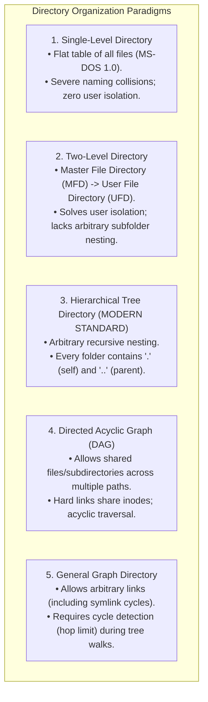
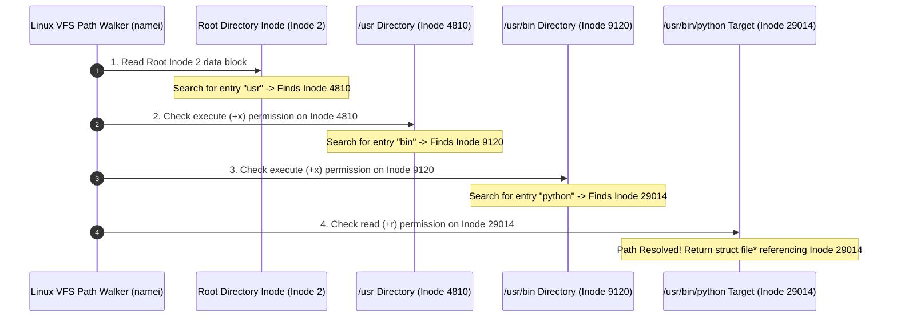
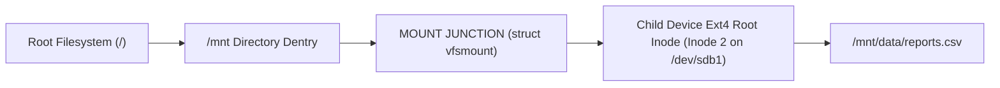

# Directory Structures and Path Resolution

> [!abstract] Mental Model
> A directory is not a physical container; it is a **signpost ledger**:
> - A directory is simply a **special file whose data payload is an associative array of names and Inode pointers**: `[("main.c", Inode 481), ("Makefile", Inode 482)]`.
> - **Path Resolution** is a walking journey along a chain of signposts: starting from the root Inode (`/` = Inode 2 in ext4), reading each directory file's data block to discover the next Inode, until the target file is reached.
> - The **Linux Dentry Cache (dcache)** acts as high-speed GPS memory, caching recently walked path intersections directly in RAM to resolve complex paths in **nanoseconds**.

---

## Directory Hierarchy Taxonomy



---

## Step-by-Step Path Resolution Walk: `/usr/bin/python`

When an application calls `open("/usr/bin/python", O_RDONLY)`, how does the Linux kernel find the target data on disk?



---

## The Linux Performance Engine: The Dentry Cache (dcache)

Walking 5-10 directory inodes from disk storage on every file open would throttle filesystem throughput. Linux introduces the **`dcache` (Directory Entry Cache - `fs/dcache.c`)**:

```mermaid
flowchart TD
    Path["Path String: /usr/local/bin/app"] --> HashLookup{"Is Path in RAM dcache?<br/>(Global Lockless RCU Hash Table)"}
    
    HashLookup -->|DCACHE HIT (< 50 ns)| ReturnDentry["Return struct dentry* directly from RAM!"]
    
    HashLookup -->|DCACHE MISS| DiskWalk["Slow Path: Walk directory inodes from disk / Page Cache"]
    DiskWalk --> AllocDentry["Allocate new struct dentry and insert into dcache"]
    AllocDentry --> ReturnDentry
```

---

### The Anatomy of `struct dentry`:
Unlike an inode (which represents on-disk metadata), a **dentry** represents an in-memory path relationship:
```c
struct dentry {
    struct qstr d_name;          // Component name string (e.g., "python")
    struct inode *d_inode;       // Pointer to associated Inode (or NULL if negative)
    struct dentry *d_parent;     // Pointer to parent directory dentry
    struct list_head d_subdirs;  // List of child dentries
    struct hlist_node d_hash;    // Hash table linkage for O(1) path lookups
};
```

---

## Production Concept: Negative Dentries

When a compiler (GCC/Clang) searches through 20 include directories for `#include <config.h>`, 19 searches will fail because the file does not exist in those folders.

To prevent failed searches from hitting disk storage repeatedly, the kernel creates a **Negative Dentry**:
- A valid `struct dentry` where **`d_inode == NULL`**.
- Subsequent checks for the non-existent file hit the negative dentry in RAM and instantly return `ENOENT` (Error: No such file or directory) in **$< 10\text{ nanoseconds}$** without issuing disk I/O.

---

## Mount Points and Path Crossing

When a secondary storage device (e.g., `/dev/sdb1`) is mounted onto `/mnt/data`:



- During path resolution, when the VFS walker encounters a dentry flagged with `DCACHE_MOUNTED`, it automatically pivots to the root dentry of the mounted filesystem.

---

## Production Diagnostics & Path Inspection

```bash
# 1. Step-by-step path resolution and permission audit tool
namei -l /usr/local/bin/python

# Output format:
# f: /usr/local/bin/python
# drwxr-xr-x root root /
# drwxr-xr-x root root usr
# drwxr-xr-x root root local
# drwxr-xr-x root root bin
# -rwxr-xr-x root root python

# 2. Inspect Linux dentry cache memory statistics
cat /proc/sys/fs/dentry-state
# Output:
# 124508 (nr_dentry)  42100 (nr_unused)  45 (age_limit)  0  0  0

# 3. View dentry RAM footprint via slabtop
sudo slabtop | grep -i "dentry"
```

---

## Active Recall & Interview Perspective

### Reasoning Prompts
1. *Why does a directory require Execute (`+x`) permission rather than Read (`+r`) permission to allow `cd` and path resolution?*
   - **Answer**: In POSIX filesystems, **Read (`+r`)** permission on a directory permits an application to list the directory's contents (reading the array of filenames via `readdir()` or `ls`). **Execute (`+x`)** permission (often called *Search* permission) grants the right to traverse the directory during path resolution (looking up specific filenames and resolving their target Inodes via `namei`). A user with `+x` but without `+r` can access `/secret/file.txt` if they know the exact filename, but cannot run `ls /secret` to browse the folder.
2. *What is a Negative Dentry in Linux and what production problem does it solve?*
   - **Answer**: A **Negative Dentry** is an in-memory `struct dentry` entry in the VFS `dcache` whose associated `d_inode` pointer is set to `NULL`, explicitly caching the fact that a specific filename does *not* exist in that directory. It accelerates workloads with frequent negative lookups (such as C/C++ compilers checking dozens of `-I` include search paths, dynamic linkers scanning `LD_LIBRARY_PATH`, or web servers serving missing assets), returning `ENOENT` in nanoseconds from RAM without generating blocking disk I/O.
3. *Why is Inode #2 universally assigned to the Root Directory (`/`) in ext2/ext3/ext4 file systems?*
   - **Answer**: The kernel path resolver must have a fixed, well-known starting point to begin navigating the directory hierarchy. Ext filesystem specifications reserve the first 10 inodes for special kernel metadata (Inode 1 = bad blocks table, Inode 2 = root directory `/`, Inode 7 = resize inode, Inode 8 = journal). Setting the root directory to Inode 2 provides a deterministic anchor for the VFS to initialize path resolution upon mounting.

---

## Key Takeaways
- A **Directory** is an associative table mapping string names to Inode numbers.
- **Path Resolution** traverses directory inodes from Root (`Inode 2`) to the target file.
- The **`dcache`** accelerates path traversal using in-memory `struct dentry` caches and **Negative Dentries**.

---

## Related Notes
- [[Operating System]] — Storage subsystem architecture.
- [[System Calls]] — `open`, `chdir`, `mkdir`, `stat`.
- [[File Concept and File Attributes]] — File metadata foundations.
- [[File Descriptors and File Tables]] — File handle management.
- [[Inodes and File System Metadata]] — Inode block pointer details.
- [[Hard Links vs Symbolic Links]] — Directory dentry aliasing.
- [[Virtual File System - VFS]] — VFS path resolution subsystem.
- [[Operating Systems MOC]] — Master table of contents for Operating Systems.
