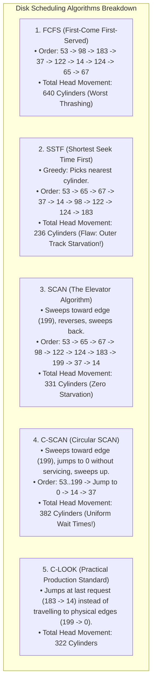
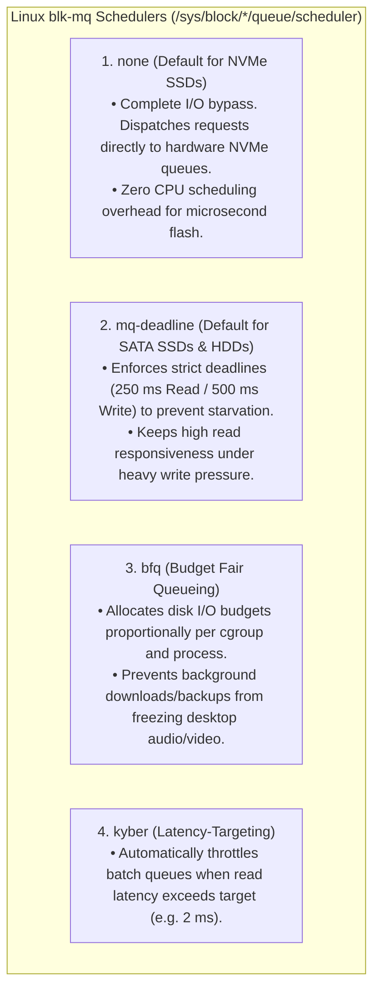

# Disk Scheduling Algorithms: SSTF, SCAN, C-SCAN

> [!abstract] Mental Model
> Disk scheduling is **the elevator logic of a 100-story skyscraper**:
> - If an elevator serviced passenger floor buttons strictly in the order they were pressed (**FCFS**), it would oscillate wildly between floor 2 and floor 98, wasting power and time (**Mechanical Head Thrashing**).
> - For mechanical hard disks (HDDs), seek time is the massive performance bottleneck:
>   $$\text{Total Access Time} = \text{Seek Time } (\sim 5\text{-}10\text{ ms}) + \text{Rotational Latency } (\sim 2\text{-}4\text{ ms}) + \text{Transfer Time } (< 0.1\text{ ms})$$
> - Disk Schedulers reorder pending I/O requests to **minimize physical actuator arm movement across disk cylinders**.

---

## Classical Scheduling Taxonomy & Mathematical Trace

Consider a disk with **$200$ cylinders ($0 \dots 199$)**, an initial head position at **cylinder $53$**, and a pending request queue:
$$\mathbf{[98,\; 183,\; 37,\; 122,\; 14,\; 124,\; 65,\; 67]}$$



---

## Visual Comparison: Sweep Trajectories

```mermaid
gantt
    title Disk Actuator Arm Sweep Trajectories across 200 Cylinders
    dateFormat X
    axisFormat %s

    section FCFS (Chaotic)
    53 to 98 : 0, 98
    98 to 183 : 98, 183
    183 to 37 : 37, 183
    37 to 122 : 37, 122
    122 to 14 : 14, 122

    section SCAN (Elevator)
    53 to 199 (Outward Sweep) : 53, 199
    199 to 14 (Inward Sweep) : 14, 199

    section C-SCAN (Circular)
    53 to 199 (Service Sweep) : 53, 199
    199 to 0 (Fast Return Jump) : 0, 199
    0 to 37 (Next Service Sweep) : 0, 37
```



---

## Comparison Matrix

| Algorithm | Total Head Movement | Starvation Risk? | Wait Time Distribution | Mechanical Wear |
| :--- | :--- | :--- | :--- | :--- |
| **FCFS** | $640\text{ cyl}$ (Catastrophic) | None (Fair) | High variance | Maximum |
| **SSTF** | $\mathbf{236\text{ cyl}}$ (Minimum) | **High (Outer/Inner Starvation)** | Skewed towards center | Low |
| **SCAN** | $331\text{ cyl}$ | None | Higher for recently visited tracks | Moderate |
| **C-SCAN** | $382\text{ cyl}$ | None | **Strictly Uniform** | Low |
| **C-LOOK** | $322\text{ cyl}$ | None | **Strictly Uniform & Optimal** | **Lowest** |

---

## Modern Linux Multi-Queue Block Layer (`blk-mq`)

On modern Solid State Drives (SSDs) and NVMe storage, **there are zero moving physical parts and zero mechanical seek latency**. Traditional elevator schedulers waste CPU cycles.

Linux implements modern multi-queue I/O schedulers:



---

## Production Diagnostics & Scheduler Tuning

```bash
# 1. Inspect active I/O scheduler for storage drives
cat /sys/block/sda/queue/scheduler
# [mq-deadline] none

cat /sys/block/nvme0n1/queue/scheduler
# [none] mq-deadline

# 2. Dynamically change scheduler to mq-deadline for SATA drive:
echo mq-deadline | sudo tee /sys/block/sda/queue/scheduler

# 3. Monitor real-time disk await (I/O latency) and queue size:
iostat -xz 1

# Output metrics to watch:
# r_await (read latency in ms), w_await (write latency in ms), %util (disk saturation)
```

---

## Active Recall & Interview Perspective

### Reasoning Prompts
1. *Why does Shortest Seek Time First (SSTF) cause severe starvation despite achieving the lowest total seek distance?*
   - **Answer**: SSTF greedily selects the pending request closest to the current head position. If a stream of continuous I/O requests arrives targeted at cylinders near the current head position (e.g. active database table queries in the middle cylinders), the head remains trapped servicing local requests, and requests queued for distant outer or inner tracks are starved indefinitely until the local stream halts.
2. *How does C-SCAN provide more uniform waiting times than standard bidirectional SCAN?*
   - **Answer**: In bidirectional SCAN, when the head reverses direction at the edge, cylinders immediately adjacent to the edge get serviced twice in rapid succession, while cylinders at the opposite end of the disk wait for an entire double-sweep. **C-SCAN (Circular SCAN)** services requests in only one direction (e.g., from inner to outer). Upon reaching the end, it immediately returns to the beginning without servicing requests on the return journey. As a result, every cylinder waits an identical period between sweeps, guaranteeing strictly uniform latency distribution.
3. *Why do NVMe SSDs default to the `none` I/O scheduler in Linux?*
   - **Answer**: NVMe drives have no mechanical actuator arm, head, or spinning platters; accessing any flash memory address takes roughly the same time ($\sim 10\text{ - }50\text{ }\mu\text{s}$). Furthermore, NVMe hardware controllers feature up to $64,000$ independent hardware submission/completion queues handling $64,000$ commands in parallel. Running software elevator sorting algorithms adds unnecessary CPU lock contention and context-switch latency without providing any mechanical seek savings. The **`none`** scheduler bypasses all software sorting and feeds requests directly into the NVMe hardware ring buffers.

---

## Key Takeaways
- **Rotational media (HDDs)** are bottlenecked by **mechanical seek time**; schedulers reorder queues to minimize head travel distance.
- **SCAN / C-SCAN / C-LOOK** prevent starvation by establishing unidirectional elevator sweeps.
- **NVMe / Flash SSDs** bypass elevator sorting using the **`none`** multi-queue scheduler to eliminate CPU overhead.

---

## Related Notes
- [[Operating System]] — Storage and I/O architecture.
- [[IO Hardware - Port-Mapped vs Memory-Mapped IO]] — Hardware controllers.
- [[Direct Memory Access - DMA]] — Direct hardware queue transfers.
- [[Polling vs Interrupt-Driven IO]] — I/O completion signaling.
- [[RAID Levels and Reliability]] — Disk arrays and throughput.
- [[Solid State Drives - Flash Memory, Wear Leveling, TRIM]] — Flash memory architecture.
- [[Operating Systems MOC]] — Master table of contents for Operating Systems.
