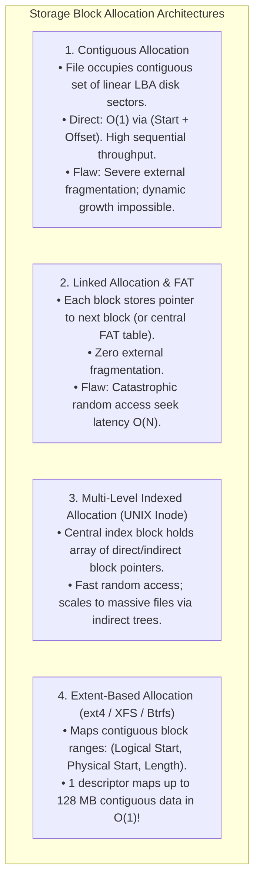
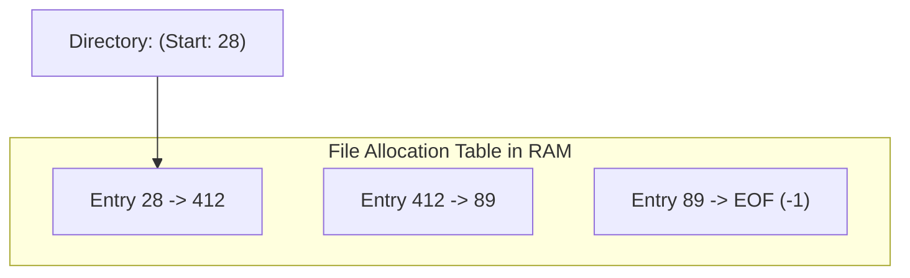
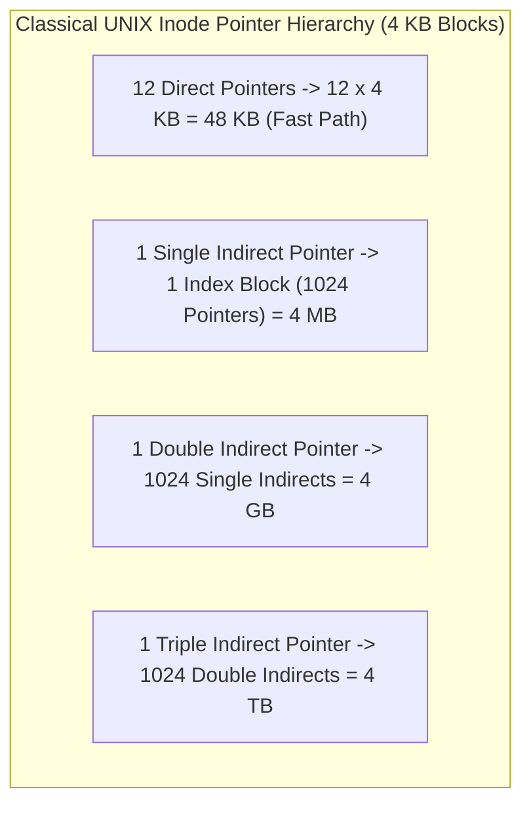
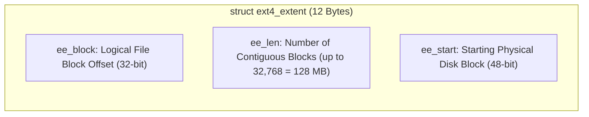
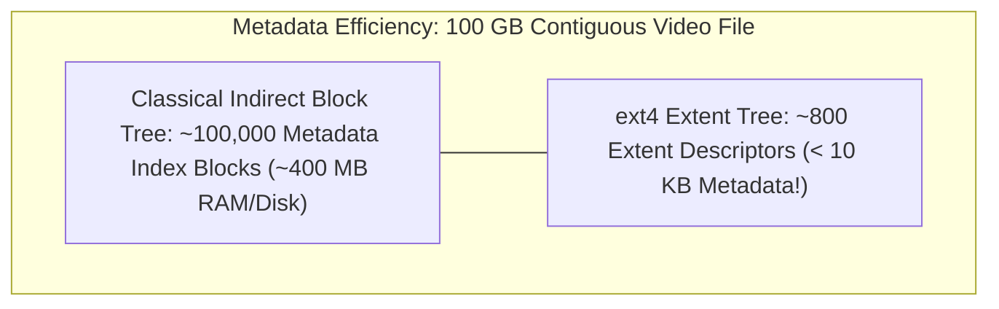

# File Allocation Methods: Contiguous, Linked, and Indexed

> [!abstract] Mental Model
> Physical block allocation is **urban real estate development**:
> - **Contiguous Allocation**: Buying an unbroken city block ($50$ consecutive plots). Perfect for high-speed drag racing (**Sequential Read/Write Speed**), but if a building needs an expansion later, you hit immovable neighboring buildings (**External Fragmentation**).
> - **Linked Allocation (FAT)**: A scavenger hunt across scattered vacant city lots. No land is wasted, but finding the 40th room requires walking through rooms $1 \to 39$ (**$O(N)$ Random Access Seek Penalty**).
> - **Indexed Allocation & Extents (UNIX / ext4)**: A central blueprint office (**Inode / Extent Tree**) holding direct GPS coordinates to all plots. Delivers instant $O(1)$ access anywhere.

---

## The Allocation Architecture Taxonomy

---

## 1. Contiguous Allocation

The directory entry stores only two fields: **Start Block** and **Length (in blocks)**:

- **Advantages**:
  - Unrivaled sequential I/O performance (HDD read heads don't seek; Flash controllers stream full NAND pages).
  - Direct Random Access is trivial: Address of block $k = \text{Start} + k$ in $O(1)$ time.
- **Fatal Production Flaws**:
  - Suffers from **External Fragmentation** (requires periodic disk compaction).
  - Cannot expand a file without reallocating the entire file to a larger contiguous hole.
- **Modern Deployments**: ISO 9660 (CD-ROMs/DVDs), high-throughput video recording swap buffers.

---

## 2. Linked Allocation & FAT (File Allocation Table)

### Pure Linked Allocation:
Every data block reserves its final 4 bytes to store the integer address of the next disk block:

- *Flaw*: Seeking to byte $500\text{ MB}$ requires $128,000$ sequential disk reads! A single corrupted pointer loses all downstream data.

---

### The Evolution: FAT (File Allocation Table - MS-DOS / FAT32)
Moves all block linkage pointers into a **single centralized table cached in RAM**:

- **Benefit**: Random access seeks occur purely in RAM by walking table indexes without issuing physical disk seeks.
- **Bottleneck**: Table size scales with disk capacity (A $2\text{ TB}$ disk requires large FAT tables permanently occupying RAM).

---

## 3. Indexed Allocation (UNIX Multi-Level Inodes)

Each file owns an **Inode** containing an array of **Direct, Single Indirect, Double Indirect, and Triple Indirect pointers**:

---

## 4. Modern Industry Standard: Extent-Based Allocation (`ext4`, `XFS`)

In modern file systems, single block pointers create excessive metadata bloat. A $100\text{ GB}$ file would require $26.2\text{ million}$ individual 4-byte block pointers!

**Extents** solve this by describing contiguous block ranges using a **12-byte Extent Descriptor**:

---

## Comprehensive Allocation Methods Comparison

| Feature | Contiguous | Pure Linked | FAT32 | UNIX Multi-Level Inode | Modern Extents (ext4/XFS) |
| :--- | :--- | :--- | :--- | :--- | :--- |
| **Sequential Read** | **Maximum** | Poor | Good | Excellent | **Maximum** |
| **Random Access** | $O(1)$ | $O(N)$ Disk Reads | $O(N)$ RAM Hops | $O(1)$ Tree Walk | **$O(1)$ B+ Tree Search** |
| **External Fragmentation** | **Severe** | None | None | None | Low (Buddy Allocator) |
| **File Growth** | Difficult | Trivial | Trivial | Trivial | Trivial |
| **Metadata Overhead** | **Zero** | 4B per block | Large table in RAM | Moderate | **Extremely Low** |

---

## Active Recall & Interview Perspective

### Reasoning Prompts
1. *Why does FAT32 exhibit dramatically better random-access read performance than pure linked allocation?*
   - **Answer**: In pure linked allocation, the pointer to the next block is physically embedded inside the payload of each on-disk data block. Traversing to block $N$ requires reading $N-1$ physical disk blocks across the storage bus. In FAT32, all pointer links are decoupled from storage blocks and aggregated into a single centralized **File Allocation Table (FAT)** that is cached in RAM. Finding block $N$ requires hopping through memory integers in nanoseconds, issuing only a single physical I/O read for the final destination block.
2. *How does ext4 Extent-based allocation drastically reduce metadata overhead for large sequential files compared to ext3 multi-level indirect blocks?*
   - **Answer**: ext3 used indirect block pointers where every single $4\text{ KB}$ data block required an individual $4$-byte pointer in an index block. A $100\text{ GB}$ file required millions of pointer entries taking up hundreds of megabytes of metadata disk blocks. ext4 replaces individual pointers with **Extents** ($\langle \text{logical\_block, length, physical\_block} \rangle$). A single extent descriptor can map up to $32,768$ contiguous blocks ($128\text{ MB}$) in just $12\text{ bytes}$, shrinking metadata requirements by over $99.9\%$.
3. *Why is Contiguous Allocation still utilized in optical media (ISO 9660) and specialized video streaming storage?*
   - **Answer**: Contiguous allocation provides the highest possible sustained read throughput and minimal latency because data sectors are physically adjacent, completely eliminating disk head seek times on HDDs and enabling maximal prefetching/burst transfers on flash NAND. Because optical media (CD/DVD) and pre-recorded video files are write-once and immutable, they do not suffer from dynamic file resizing or runtime external fragmentation, making contiguous allocation ideal.

---

## Key Takeaways
- **Contiguous Allocation** maximizes sequential speed but suffers from external fragmentation.
- **Linked / FAT Allocation** eliminates fragmentation but introduces random seek bottlenecks.
- **Modern filesystems (ext4, XFS, Btrfs)** use **Extent Trees** to combine the blazing sequential speed of contiguous blocks with dynamic $O(1)$ B-Tree scaling.

---

## Related Notes
- [[Operating System]] — Storage subsystem architecture.
- [[File Concept and File Attributes]] — Logical file properties.
- [[File Descriptors and File Tables]] — File handle operations.
- [[Directory Structures and Path Resolution]] — Directory parsing.
- [[Inodes and File System Metadata]] — Inode pointer structures.
- [[ext4 Architecture Overview]] — Extent tree implementation in ext4.
- [[Operating Systems MOC]] — Master table of contents for Operating Systems.
