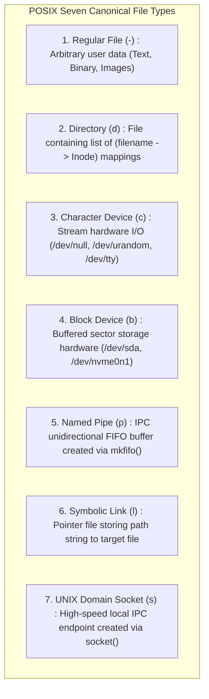
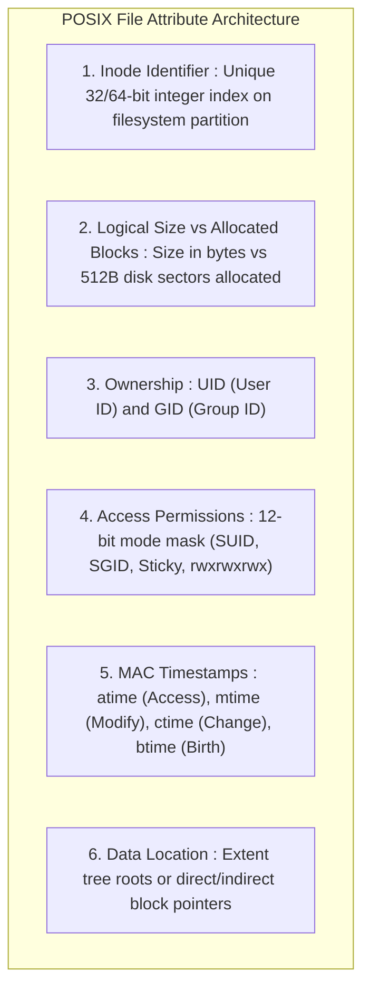
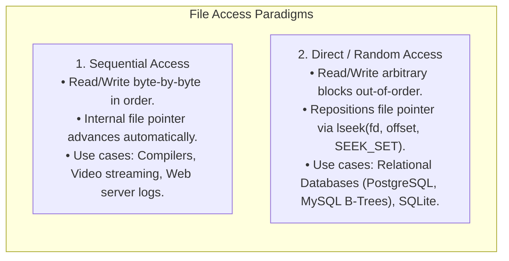
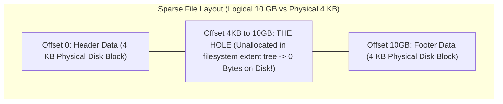

# File Concept and File Attributes

> [!abstract] Mental Model
> A file is a **persistent digital contract**:
> - To the application programmer, a file is a **seamless, contiguous stream of linear bytes** ($0 \dots N-1$) that survives power cuts and reboots.
> - To physical storage hardware (Flash NVMe / HDD), the device only understands **raw LBA sector blocks ($4\text{ KB}$)** scattered across silicon channels.
> - The **File System** bridges this divide: it maps the logical byte stream to physical media sectors while attaching rich metadata (**Attributes, Permissions, Timestamps, and Ownership**).

---

## File Abstraction & UNIX Seven File Types

In POSIX and UNIX systems, *"Everything is a file"*. The first character in `ls -l` reveals the kernel file type:



---

## File Type Identification: Magic Numbers

Unlike Windows, which relies on file extensions (`.exe`, `.png`), UNIX kernels and utilities determine file types using **Magic Numbers** stored in the file header bytes:

```mermaid
flowchart LR
    Header["First 4-8 Bytes of File"] --> Match{"Compare against /etc/magic database"}
    
    Match -->|0x7F 0x45 0x4C 0x46 (0x7F 'E' 'L' 'F')| ELF["Linux ELF Executable Binary"]
    Match -->|0x89 0x50 0x4E 0x47 (\x89 'P' 'N' 'G')| PNG["Portable Network Graphics Image"]
    Match -->|0x50 0x4B 0x03 0x04 ('P' 'K' 0x03 0x04)| ZIP["ZIP / JAR Archive"]
    Match -->|0x25 0x50 0x44 0x46 ('%' 'P' 'D' 'F')| PDF["Adobe PDF Document"]
```

---

## Canonical File Attributes (POSIX Metadata)

All metadata for a file (except its human-readable name) is stored inside the disk partition's **[[Inodes and File System Metadata|Inode]]**:



---

### The Three Classic Timestamps (MAC-Times):
- **`mtime` (Modification Time)**: Updated when the **content** of the file is modified (`write()`).
- **`ctime` (Change Time)**: Updated when file **metadata** (permissions, ownership, link count) or content changes. *(Cannot be manually forged via `utime()`!)*
- **`atime` (Access Time)**: Updated when the file is read (`read()`, `execve()`).
  - *Production Optimization*: High-frequency `atime` writes cause severe SSD wear. Modern Linux mounts filesystems with **`relatime`** (only updates `atime` once per 24 hours or if `atime < mtime`).

---

## File Access Methods



---

## Production Concept: Sparse Files & Hole Punching

A **Sparse File** contains large regions of unwritten zero bytes that consume **zero physical disk blocks**:



- **Production Utility**: Virtual machine disk images (`.qcow2`, `.vmdk`), database pre-allocations, and container layers.
- **System Call**: `fallocate(fd, FALLOC_FL_PUNCH_HOLE | FALLOC_FL_KEEP_SIZE, offset, len)` frees physical blocks while preserving logical file size.

---

## Production Diagnostics & File Inspection

```bash
# 1. Comprehensive POSIX file attribute inspection
stat /var/log/syslog

# Output:
#   File: /var/log/syslog
#   Size: 10485760   Blocks: 20480      IO Block: 4096   regular file
# Device: 0802       Inode:  1972411    Links: 1
# Access: (0640/-rw-r-----)  Uid: (  101/  syslog)   Gid: (    4/     adm)
# Access: 2026-08-18 12:00:00.000000000 +0530
# Modify: 2026-08-18 12:05:00.000000000 +0530
# Change: 2026-08-18 12:05:00.000000000 +0530
#  Birth: 2026-08-18 00:00:00.000000000 +0530

# 2. Inspect true MIME type and magic number regardless of extension
file --mime-type my_script.png
# (Detects if an attacker renamed a malicious .elf binary to .png!)
```

---

## Active Recall & Interview Perspective

### Reasoning Prompts
1. *Where is a file's filename stored in a POSIX filesystem (ext4, XFS)?*
   - **Answer**: A file's human-readable name is **NOT** stored inside the file itself or inside its Inode. The filename is stored exclusively as a directory entry (**dentry**) inside the **parent directory's data blocks**, mapping the string name (e.g., `"report.pdf"`) to the target **Inode Number** (e.g., `Inode #1972411`). This separation allows multiple directory entries across different folders to reference the exact same underlying Inode (**Hard Links**).
2. *What is the difference between `mtime` and `ctime` in Linux?*
   - **Answer**: **`mtime` (Modification Time)** records the timestamp when the actual *data payload/contents* of the file were last modified (e.g. via `write()`, `truncate()`). **`ctime` (Change Time)** records when the file's *metadata or inode properties* were changed (e.g., modifying permissions via `chmod`, changing ownership via `chown`, adding a hard link via `link()`, or modifying contents). `mtime` can be forged using the `utime()` syscall, but `ctime` is strictly updated by the kernel and cannot be set to an arbitrary past date.
3. *How does a Sparse File achieve a logical size of 100 GB while occupying only 4 KB of physical disk space?*
   - **Answer**: The filesystem's extent tree / block allocation table only allocates physical disk blocks for sectors that have explicitly been written with non-zero data. Unwritten regions between offsets are recorded as unallocated "holes" in the inode's metadata. When an application reads from an unallocated hole, the kernel Virtual File System (VFS) automatically synthesizes zeroes in RAM without accessing disk storage. Physical disk space is only consumed when non-zero bytes are written to those offsets.

---

## Key Takeaways
- A **File** is a contiguous logical byte stream abstraction mapped across physical storage sectors.
- POSIX defines **seven canonical file types**, identified by headers (**Magic Numbers**) rather than file extensions.
- All file attributes (size, permissions, ownership, MAC timestamps) reside in the **Inode**, while the filename resides in the **directory dentry**.

---

## Related Notes
- [[Operating System]] — File subsystem architecture.
- [[System Calls]] — File operations (`open`, `read`, `write`, `stat`, `lseek`).
- [[File Descriptors and File Tables]] — How running processes track open files.
- [[Directory Structures and Path Resolution]] — How pathnames resolve to inodes.
- [[File Allocation Methods - Contiguous, Linked, Indexed]] — How blocks are stored on disk.
- [[Inodes and File System Metadata]] — Deep dive into inode block trees.
- [[Hard Links vs Symbolic Links]] — Multiple filenames referencing one inode.
- [[Virtual File System - VFS]] — The kernel abstraction layer.
- [[Operating Systems MOC]] — Master table of contents for Operating Systems.
