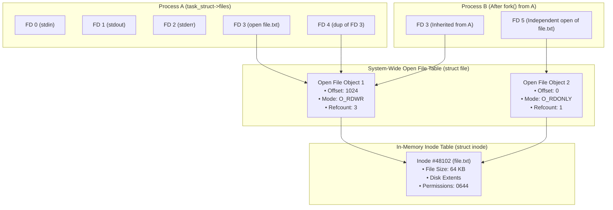
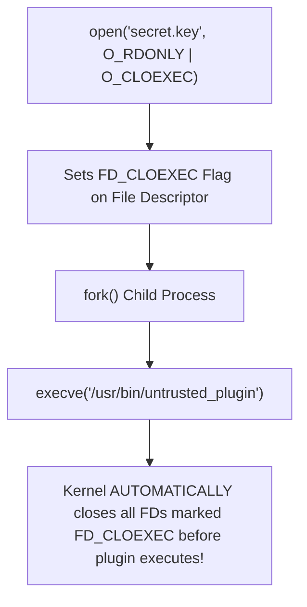

# File Descriptors and File Tables

> [!abstract] Mental Model
> Think of file access as a **three-tier coat check system**:
> - **File Descriptor (The Token)**: A tiny positive integer (`3`, `4`) given to the user application.
> - **Open File Table (The Coat Hanger Entry - `struct file`)**: Holds operational state—the **current file offset position** and read/write access mode. If two people share the same hanger (e.g. parent and child after `fork()`), moving the coat adjusts the position for both!
> - **Inode Table (The Physical Garment - `struct inode`)**: The physical disk entity itself on the storage partition.

---

## The Three-Tier Architecture of UNIX I/O



---

## Standard POSIX File Descriptors

Every standard POSIX process initializes with three pre-opened file descriptors:

| Descriptor Index | POSIX Constant | C Standard Stream | Default Device |
| :--- | :--- | :--- | :--- |
| **`0`** | `STDIN_FILENO` | `stdin` | Keyboard / Terminal Input (`/dev/tty`) |
| **`1`** | `STDOUT_FILENO` | `stdout` | Terminal Screen Display (`/dev/tty`) |
| **`2`** | `STDERR_FILENO` | `stderr` | Terminal Screen Display (Unbuffered) |

---

## The Three Fundamental File Sharing Scenarios

### Scenario 1: `dup()` / `dup2()` within the Same Process
```c
int fd1 = open("log.txt", O_RDWR);
int fd2 = dup(fd1); // Clones fd1 into lowest available FD
```
- `fd1` and `fd2` point to the **exact same `struct file`**.
- Calling `lseek(fd1, 100, SEEK_SET)` advances the offset to `100` for **both** `fd1` and `fd2`!

### Scenario 2: File Sharing Across `fork()`
- When Process $A$ forks Child $B$, the child inherits a duplicate copy of $A$'s file descriptor table.
- Parent's `FD 3` and Child's `FD 3` point to the **exact same `struct file` entry** in the kernel.
- **Consequence**: If Parent writes 50 bytes, Child's next `read()` starts at byte 50! This shared offset enables seamless output piping in shell command pipelines (`ls | grep`).

### Scenario 3: Independent `open()` by Two Separate Processes
```c
// Process A:
int fdA = open("shared.db", O_RDWR);
// Process B:
int fdB = open("shared.db", O_RDWR);
```
- Process A and Process B receive **separate `struct file` objects** with independent `f_pos` offsets.
- Both `struct file` entries point to the **same underlying `struct inode`**.
- Reads in Process A do **not** alter the read pointer of Process B.

---

## Linux Kernel Representation

```c
// 1. Per-Process File Descriptor Table (include/linux/fdtable.h)
struct files_struct {
    atomic_t count;
    struct fdtable *fdt;
    struct file *fd_array[NR_OPEN_DEFAULT]; // Array of pointers to struct file
};

// 2. System-Wide Open File Object (include/linux/fs.h)
struct file {
    loff_t f_pos;                     // Current file offset
    fmode_t f_mode;                   // Read/Write access flags
    atomic_long_t f_count;            // Reference count of open FDs pointing here
    const struct file_operations *f_op; // Syscall dispatch function table
    struct inode *f_inode;            // Pointer to in-memory inode
    struct path f_path;               // Dentry and mount information
};
```

---

## Crucial Production System Call: `fcntl()` and `FD_CLOEXEC`

When a privileged daemon (e.g., a web server or database) opens a sensitive file or socket and forks a child to execute untrusted code via `execve()`, the child inadvertently **inherits all open file descriptors**, creating a massive security vulnerability (File Descriptor Leakage).



```c
// Atomic open with close-on-exec to prevent race conditions:
int fd = open("/etc/shadow", O_RDONLY | O_CLOEXEC);

// Or via fcntl:
fcntl(fd, F_SETFD, FD_CLOEXEC);
```

---

## Production Diagnostics & File Descriptor Limits

```bash
# 1. View all active file descriptors for a running PID
ls -l /proc/<PID>/fd

# Output format:
# lrwx------ 1 app app 64 Aug 18 12:00 0 -> /dev/pts/1
# lrwx------ 1 app app 64 Aug 18 12:00 1 -> /dev/pts/1
# lr-x------ 1 app app 64 Aug 18 12:00 3 -> /var/log/app.log
# lrwx------ 1 app app 64 Aug 18 12:00 4 -> 'socket:[192841]'

# 2. Check maximum open file descriptors limit (ulimit)
ulimit -n
# (Production web servers like NGINX / HAProxy require ulimit -n 65535 or higher!)

# 3. System-wide open files consumption
cat /proc/sys/fs/file-nr
# Output: 14208 (allocated) 0 (free) 3254910 (system max)
```

---

## Active Recall & Interview Perspective

### Reasoning Prompts
1. *What happens to file offsets when a parent process forks a child, and why is this critical for UNIX shells?*
   - **Answer**: During `fork()`, the child receives a duplicate of the parent's file descriptor table, but both tables point to the **same underlying `struct file` entries** in the system-wide Open File Table. Because the `f_pos` file offset is stored inside `struct file` (not the per-process table), the parent and child share the exact same offset. When the parent writes to stdout, the offset advances for the child. This behavior is essential for shell pipelines (e.g. `(cmd1; cmd2) > file.txt`), allowing sequential sub-commands to append to the file consecutively without overwriting each other's output.
2. *What is the difference between `dup2(oldfd, newfd)` and `fcntl(oldfd, F_DUPFD, minfd)`?*
   - **Answer**: `dup2(oldfd, newfd)` duplicates `oldfd` specifically onto the descriptor number `newfd`; if `newfd` was already open, the kernel atomically closes it before performing the duplication. `fcntl(oldfd, F_DUPFD, minfd)` duplicates `oldfd` onto the *lowest available unallocated descriptor number* that is greater than or equal to `minfd`. Both create a new descriptor pointing to the same `struct file` object.
3. *Why does the error `EMFILE (Too many open files)` occur and how does it differ from `ENFILE`?*
   - **Answer**: `EMFILE` occurs when an individual process attempts to open a new file or socket but has reached its **per-process resource limit** (`RLIMIT_NOFILE`, configured via `ulimit -n`). `ENFILE` occurs when the entire operating system has exhausted its **global system-wide file allocation limit** (`/proc/sys/fs/file-max`), preventing *any* process on the machine from opening files until existing descriptors are closed.

---

## Key Takeaways
- A **File Descriptor** is a process-local index pointing to a **`struct file`** in the Open File Table, which points to a **`struct inode`**.
- File offsets (`f_pos`) are shared across **`fork()`** and **`dup2()`**, but independent across separate **`open()`** calls.
- **`FD_CLOEXEC`** is a vital security invariant preventing descriptor leaks across `execve()`.

---

## Related Notes
- [[Operating System]] — File subsystem architecture.
- [[Process Control Block]] — `task_struct->files` pointers.
- [[System Calls]] — `open`, `read`, `write`, `dup2`, `fcntl`.
- [[File Concept and File Attributes]] — File metadata foundations.
- [[Directory Structures and Path Resolution]] — Resolving paths to inodes.
- [[Inodes and File System Metadata]] — Inode table mechanics.
- [[Virtual File System - VFS]] — VFS `file_operations` dispatching.
- [[Operating Systems MOC]] — Master table of contents for Operating Systems.
