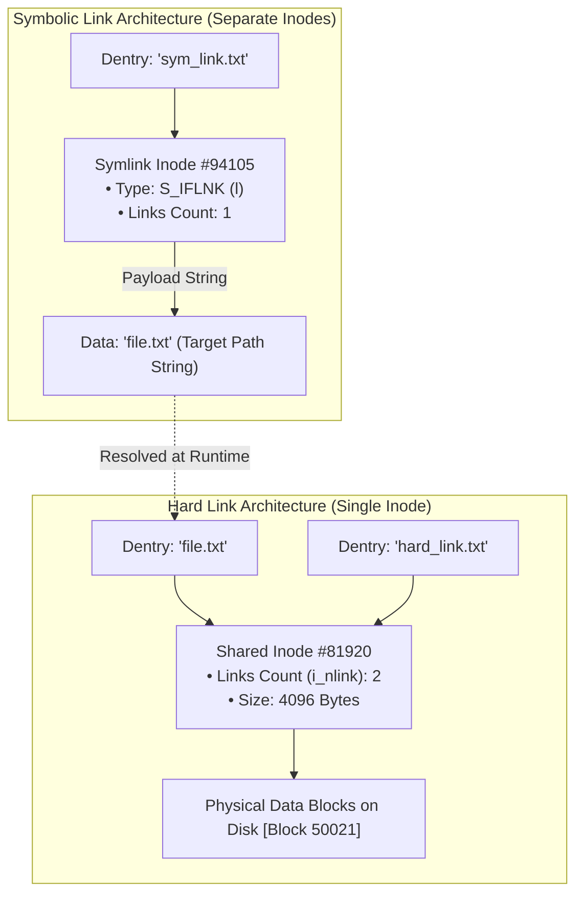
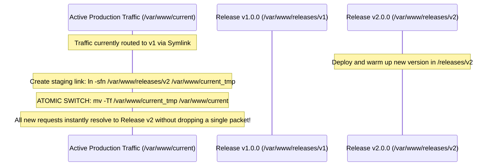

# Hard Links vs Symbolic Links

> [!abstract] Mental Model
> - **Hard Link (Multiple Door Keys to the Same Room)**: Two directory entries (**Dentries**) pointing directly to the **SAME Inode Number**. Both have equal ownership status. If you throw away one key, the room and the second key remain 100% functional. The room is only demolished when the **Link Count (`i_nlink`) hits 0**.
> - **Symbolic Link / Soft Link (A Sticky Note with an Address)**: A completely distinct file with its **OWN separate Inode**. The data payload of a symlink is simply a text string representing a pathname (*"../lib/libcrypto.so.3"*). If the target room is demolished, the sticky note remains in your hand, but now points to an empty lot (**Dangling Symlink**).

---

## Architectural Comparison Diagram



---

## Technical Comparison Matrix

| Feature | Hard Link (`ln target link`) | Symbolic Link (`ln -s target link`) |
| :--- | :--- | :--- |
| **Inode Number** | **Identical** to target Inode. | **Different** (Allocates a brand-new Inode). |
| **Storage Consumption** | **Zero** additional data blocks. | Stores path string (0-block inline if $\le 60\text{ B}$). |
| **Cross-Filesystem Spanning** | **FORBIDDEN** (Inodes are partition-local). | **ALLOWED** (Can point to any path/NFS mount). |
| **Directories Linking** | **FORBIDDEN** (Prevents filesystem DAG loops). | **ALLOWED** (`ln -s /var/log ./logs`). |
| **Target Deletion Impact** | Data **persists** (accessible via remaining link). | Becomes a **Dangling / Broken Symlink**. |
| **File Permissions** | Synchronized (shares same `i_mode`). | Independent (symlink perms `777` ignored by VFS). |

---

## Deletion Mechanics & `unlink()` Lifecycle

In POSIX operating systems, files are **never directly deleted**—they are **unlinked** via the `unlink()` system call:

```mermaid
flowchart TD
    Unlink["Call unlink('file.txt')"] --> DecLink["Kernel decrements Inode i_nlink by 1"]
    
    DecLink --> CheckLinks{"i_nlink == 0?"}
    
    CheckLinks -->|NO (Other hard links exist)| Done1["File data remains intact on disk"]
    
    CheckLinks -->|YES| CheckFD{"Any running process has file open?<br/>(struct file->f_count > 0)"}
    
    CheckFD -->|YES| Defer["DEFER DELETION<br/>File remains accessible to active processes until all FDs close!"]
    
    CheckFD -->|NO| FreeDisk["FREE ALLOCATION<br/>1. Return data blocks to Block Bitmap<br/>2. Return Inode to Inode Bitmap"]
```

---

## Production Optimization: Ext4 "Fast Symlinks"

When a symbolic link target path is short (e.g. `../lib/libssl.so`), allocating a full $4\text{ KB}$ disk data block to store a 20-character string would waste storage.

Linux ext4 implements **Fast Symlinks**:
- If the target path string is **$\le 60\text{ bytes}$**, the string is copied directly into the unused **`i_block[15]` array** inside the Inode itself.
- **Result**: Zero data blocks allocated on disk, zero disk I/O to read the link destination, and instantaneous VFS path resolution!

---

## Production DevOps Paradigm: Zero-Downtime Atomic Symlink Deployments

High-scale deployment platforms (Capistrano, Kubernetes, Envoy) perform zero-downtime application releases using atomic symlink rotation:



---

## Production Diagnostics & Link Commands

```bash
# 1. Create Hard Link and Symbolic Link
ln /etc/nginx/nginx.conf nginx_hard.conf
ln -s /etc/nginx/nginx.conf nginx_sym.conf

# 2. Inspect Inode numbers and link counts (-i flag)
ls -lai nginx*
# 104820 -rw-r--r-- 2 root root 2840 Aug 18 12:00 nginx_hard.conf  (Same Inode 104820, Links=2)
# 104820 -rw-r--r-- 2 root root 2840 Aug 18 12:00 nginx.conf       (Same Inode 104820, Links=2)
# 104990 lrwxrwxrwx 1 root root   21 Aug 18 12:05 nginx_sym.conf -> /etc/nginx/nginx.conf

# 3. Discover all broken/dangling symlinks in a directory
find /var/www -xtype l

# 4. Resolve absolute canonical path of a symlink
readlink -f nginx_sym.conf
```

---

## Active Recall & Interview Perspective

### Reasoning Prompts
1. *Why cannot Hard Links span across multiple filesystem partitions (e.g. from `/dev/sda1` to `/dev/sdb1`), while Symbolic Links can?*
   - **Answer**: A Hard Link is simply a directory entry that points directly to a raw integer **Inode Number**. Inode numbers are strictly local and unique *only within their specific disk partition's inode table*. Inode `#481` on `/dev/sda1` refers to a completely different physical file than Inode `#481` on `/dev/sdb1`. Pointing across partitions by inode integer is meaningless and causes corruption. Conversely, a Symbolic Link contains a high-level **Path String** (e.g., `"/mnt/data/file.txt"`), which the VFS path walker resolves through mount points at runtime across any boundary.
2. *Why does Linux prohibit non-root users from creating Hard Links to directories?*
   - **Answer**: Allowing arbitrary hard links to directories would transform the filesystem directory structure from a clean **Directed Acyclic Graph (DAG)** or Hierarchical Tree into a **General Graph containing cycles/loops**. Recursive directory traversal utilities (such as `find`, `du`, `rsync`, and the kernel's own path walker) would get trapped in infinite recursive loops, and reference-counted garbage collection of unlinked directories would become impossible without expensive cycle-detection algorithms.
3. *What happens when you delete a file while a running database process still has it open?*
   - **Answer**: Calling `rm` invokes the `unlink()` system call, which removes the directory entry (dentry) and decrements the Inode's `i_nlink` counter from `1` to `0`. However, the physical disk blocks and Inode are **NOT freed** because the running process maintains an open file descriptor (`struct file->f_count > 0`). The database continues reading and writing to disk normally. The kernel only deallocates the disk blocks when the database process closes its file descriptor or terminates.

---

## Key Takeaways
- **Hard Links** share the **exact same Inode**; data is only deleted when `i_nlink == 0` and `f_count == 0`.
- **Symbolic Links** are independent pointer files holding a path string; target deletion creates a **Dangling Link**.
- Atomic symlink switching (`mv -Tf`) enables **zero-downtime production deployments**.

---

## Related Notes
- [[Operating System]] — Storage architecture.
- [[File Concept and File Attributes]] — File metadata.
- [[File Descriptors and File Tables]] — File handle lifetimes.
- [[Directory Structures and Path Resolution]] — Path resolution and dentries.
- [[Inodes and File System Metadata]] — Inode link count mechanics.
- [[Virtual File System - VFS]] — VFS symlink handling.
- [[Operating Systems MOC]] — Master table of contents for Operating Systems.
