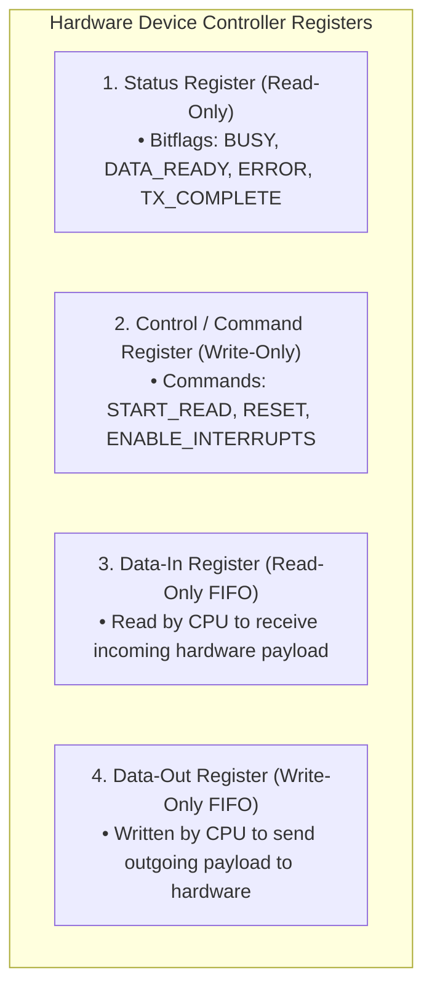
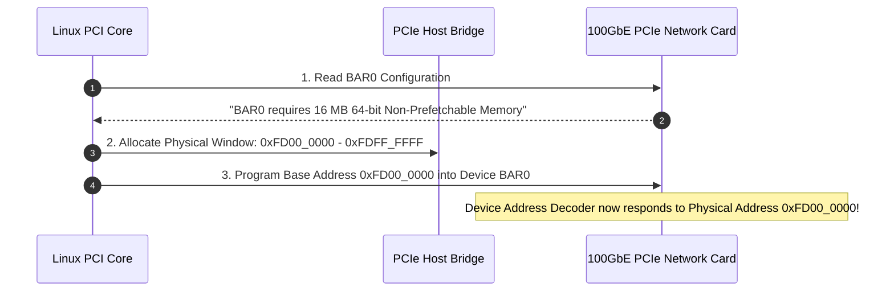

# I/O Hardware: Port-Mapped vs Memory-Mapped I/O

> [!abstract] Mental Model
> How does a CPU talk to physical hardware (NVMe controllers, Network cards, GPUs)?
> - **Port-Mapped I/O (PMIO - Isolated Mailboxes)**: A completely separate 16-bit address space ($0 \dots 65,535$) accessed only via specialized assembly instructions (**`in` / `out`**). Like walking into a private room of physical mailboxes.
> - **Memory-Mapped I/O (MMIO - Reserved Street Addresses)**: Device hardware registers are assigned physical memory addresses directly on the motherboard system bus. The CPU reads and writes to hardware registers using standard memory instructions (**`mov`, `ldr`, and C pointer dereferences**).

---

## The Device Controller Interface

Every peripheral hardware device connects to the system bus via a **Device Controller** exposing four canonical hardware registers:



---

## Architectural Comparison: PMIO vs MMIO

```mermaid
flowchart TD
    subgraph CPU_Bus ["CPU System Address Bus"]
        CPU["CPU Execution Engine"]
    end

    subgraph PMIO_Space ["Port-Mapped I/O (PMIO - x86 Exclusive Space)"]
        Port0["Port 0x60 (Keyboard Controller)"]
        Port1["Port 0x3F8 (COM1 Serial Port)"]
        Instr["Accessed strictly via: INB / OUTB / INW / OUTW"]
    end

    subgraph MMIO_Space ["Memory-Mapped I/O (MMIO - Unified Physical Address Space)"]
        DRAM["Physical DRAM (0x0000_0000 - 0x7FFF_FFFF)"]
        NVMe_BAR["NVMe Controller MMIO Window (0xFEB0_0000 - 0xFEB0_3FFF)"]
        GPU_VRAM["GPU VRAM Framebuffer (0xE000_0000 - 0xEFFF_FFFF)"]
        StandardMov["Accessed via standard assembly: MOV, LDR, STR"]
    end

    CPU -->|Special I/O Cycles (M/IO# pin = 0)| PMIO_Space
    CPU -->|Standard Memory Cycles (M/IO# pin = 1)| MMIO_Space
```

---

## Technical Comparison Matrix

| Feature | Port-Mapped I/O (PMIO) | Memory-Mapped I/O (MMIO) |
| :--- | :--- | :--- |
| **Address Space** | Separate 16-bit I/O Space ($64\text{ KB}$ max). | Integrated into standard Physical Address Space. |
| **CPU Instructions** | Specialized (`inb`, `outb`, `inw`, `outw`). | Universal (`mov`, `movq`, `ldr`, C pointers). |
| **Paging & Protection** | Controlled via x86 TSS I/O Permission Bitmap. | Protected via standard MMU Page Table permissions (`NX`, `R/W`, `Supervisor`). |
| **Caching Attribute** | Uncached by definition. | **Must be mapped as Strongly Uncached (`UC`) / Non-Prefetchable**. |
| **Modern Usage** | Legacy devices (x86 serial, RTC, PIC). | **All modern high-speed PCIe devices (NVMe, 100GbE NICs, GPUs)**. |

---

## PCIe Base Address Registers (BARs)

During system boot, the BIOS/UEFI scans the PCIe bus hierarchy (**PCI Enumeration**):
1. The kernel queries each device's PCIe configuration space.
2. The device advertises its memory needs inside a **Base Address Register (BAR)** (e.g. *"I need 64 MB of MMIO space"*).
3. The kernel assigns a collision-free physical memory window to that BAR and programs the device's address decoder.



---

## Linux Device Driver Implementation: `ioremap()` and Side-Effects

Physical MMIO addresses cannot be dereferenced directly in virtual memory mode. The driver maps physical device memory into kernel virtual address space using **`ioremap()`**:

```c
// 1. Map physical PCIe BAR into Kernel Virtual Address Space:
void __iomem *reg_base = ioremap(0xFD000000, 0x10000); // 64 KB window

// 2. Read Status Register:
uint32_t status = readl(reg_base + STATUS_OFFSET);

// 3. Write Command with Hardware Memory Barrier:
writel(CMD_START_DMA, reg_base + COMMAND_OFFSET);

// 4. Cleanup upon module unload:
iounmap(reg_base);
```

---

### The Danger of Compiler Optimizations and Volatility:
Hardware registers have **read/write side-effects** (e.g., reading the `Data-In` register automatically pops a byte from the device FIFO; writing to `Command` triggers a motor).

If a programmer writes standard C pointer code:
```c
// DANGEROUS CODE - DO NOT DO THIS!
while (*status_ptr == BUSY) { /* wait */ }
```
- The optimizing C compiler will assume memory never changes without software intervention and optimize the loop into a single register check: `while (r1 == BUSY);`—triggering an **infinite hang**!
- Linux drivers **NEVER** dereference raw pointers; they strictly use **`readl()` / `writel()` primitives**, which enforce compiler barriers (`volatile`) and CPU memory ordering instructions (`mfence` / `dmb`).

---

## Production Diagnostics & Hardware Inspection

```bash
# 1. Inspect Port-Mapped I/O allocations (PMIO)
cat /proc/ioports | head -n 15

# Output:
# 0060-0060 : keyboard
# 0064-0064 : keyboard
# 03f8-03ff : serial

# 2. Inspect Memory-Mapped I/O physical allocations (MMIO)
cat /proc/iomem | grep -E "nvme|eth"

# Output:
#   fe400000-fe403fff : 0000:01:00.0 (nvme0: NVMe Controller BAR0)
#   fd000000-fdffffff : 0000:03:00.0 (eth0: 100GbE NIC BAR0)

# 3. Inspect PCIe BAR configuration for a specific device
lspci -v -s 01:00.0
# Region 0: Memory at fe400000 (64-bit, non-prefetchable) [size=16K]
```

---

## Active Recall & Interview Perspective

### Reasoning Prompts
1. *Why must Memory-Mapped I/O (MMIO) regions be mapped as Uncacheable (`UC`) in the CPU Page Table?*
   - **Answer**: If an MMIO region were mapped as cacheable (Write-Back), the CPU would satisfy reads directly from the L1/L2 hardware CPU caches instead of issuing physical transactions on the system bus to the device controller. The CPU would never see updated device status flags (e.g. `DATA_READY`), and writes to command registers would remain trapped in CPU cache lines without reaching hardware. Mapping MMIO as **Uncacheable (`UC`)** forces the CPU to bypass all caches and broadcast every read/write directly across the PCIe bus.
2. *How does `ioremap()` differ from `kmalloc()` or `mmap()` in the Linux kernel?*
   - **Answer**: `kmalloc()` allocates *new* physical DRAM pages from the kernel buddy allocator. `mmap()` maps files or anonymous memory into user-space virtual memory. **`ioremap()`** does not allocate any RAM; it accepts an *already existing physical hardware bus address* (such as a PCIe BAR assigned to an NVMe card) and creates page table entries mapping it into the kernel's virtual address space, configuring the page attributes to Uncached MMIO.
3. *What is the purpose of PCIe Base Address Registers (BARs)?*
   - **Answer**: PCIe devices require memory addresses to communicate with the host CPU. Because motherboard configurations and attached devices vary across systems, devices cannot hardcode fixed physical memory addresses. A **BAR** allows a device to declare its required memory window size and alignment constraints during boot. The OS kernel PCIe subsystem inspects the BAR, dynamically allocates an unused chunk of the host physical address space, and writes that assigned base address back into the device's BAR register, configuring the device to listen on those addresses.

---

## Key Takeaways
- **PMIO** uses isolated 16-bit ports via assembly `in`/`out` instructions; **MMIO** maps device registers into physical address space.
- Modern high-performance devices (NVMe, GPUs, NICs) exclusively use **MMIO via PCIe BARs**.
- MMIO regions must be **Uncached (`UC`)**, and drivers must use **`readl()` / `writel()`** to prevent compiler reordering and cache stale data bugs.

---

## Related Notes
- [[Operating System]] — Storage and I/O architecture.
- [[Kernel Modules and Device Drivers]] — Driver development.
- [[Privilege Rings and CPU Modes]] — Ring 0 I/O privilege.
- [[Logical vs Physical Address Space]] — Physical address layout.
- [[Direct Memory Access - DMA]] — Offloading bulk data transfers.
- [[Polling vs Interrupt-Driven I/O]] — Receiving hardware events.
- [[Memory Ordering and Memory Barriers]] — Hardware memory barriers.
- [[Operating Systems MOC]] — Master table of contents for Operating Systems.
