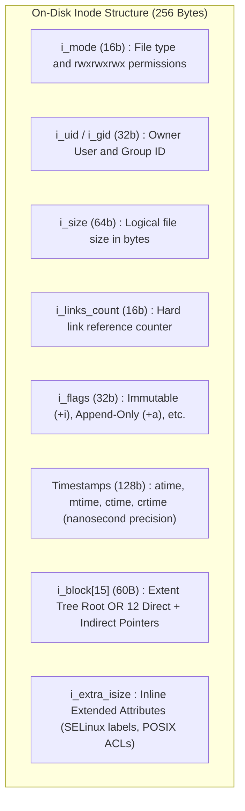
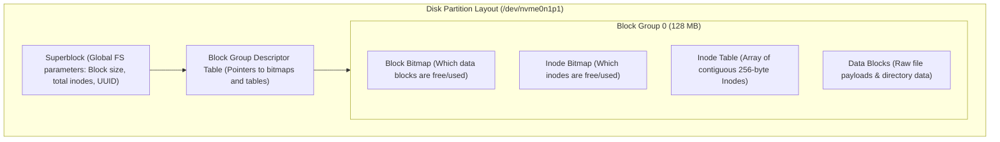
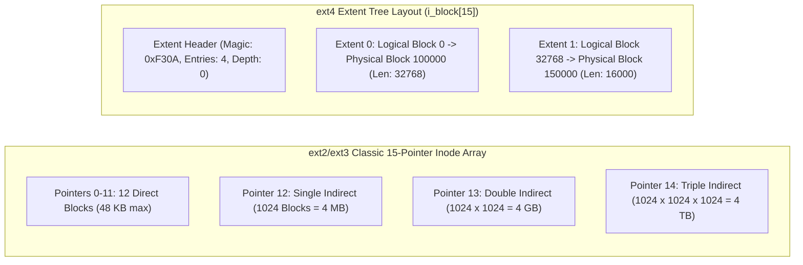
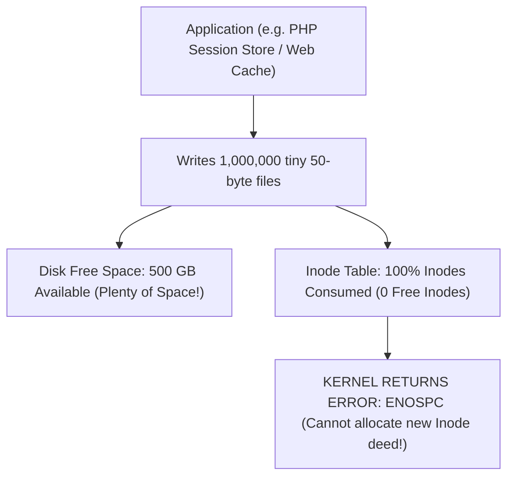

# Inodes and File System Metadata

> [!abstract] Mental Model
> An Inode is the **official property deed in the county records office**:
> - The directory entry is just the street sign (*"42 Ocean Drive"*).
> - The **Inode (Index Node)** is the official deed containing exact square footage (**File Size**), owner identity (**UID/GID**), building access permits (**Permissions**), timestamp seals (**atime/mtime/ctime**), and GPS property boundary coordinates to every brick (**Disk Blocks / Extent Tree**).

---

## The Linux Inode Anatomy (256-Byte `struct ext4_inode`)

In ext2/ext3/ext4 file systems, every file on disk is identified by a unique 32-bit integer (**Inode Number**) pointing to an entry in the on-disk **Inode Table**:



---

## File System Metadata Hierarchy: Superblocks & Block Groups

To prevent excessive disk head seeking across multi-terabyte drives, Linux file systems divide physical partitions into localized **Block Groups** (typically $128\text{ MB}$ each):



---

## Block Pointer Arithmetic: Classical Indirects vs Modern Extents



---

## Production Incident: Inode Exhaustion (`ENOSPC`)

A critical production disaster occurs when a high-capacity storage volume fails with **`No space left on device`**, even though the disk has hundreds of gigabytes of free capacity:



```bash
# Production Diagnostic Command:
df -i

# Output showing Inode Exhaustion:
# Filesystem      Inodes   IUsed   IFree IUse% Mounted on
# /dev/sda1      2621440 2621440       0  100% /var/sessions (OUT OF INODES!)
```

---

## Low-Level Debugging with `debugfs` and `stat`

```bash
# 1. Inspect Inode attributes via POSIX stat
stat /etc/passwd
#   File: /etc/passwd
#   Size: 2842        Blocks: 8          IO Block: 4096   regular file
# Inode: 1048577     Links: 1           Access: (0644/-rw-r--r--)

# 2. Raw low-level Inode dump from ext4 filesystem directly
sudo debugfs -R 'stat <1048577>' /dev/nvme0n1p1

# Raw Output:
# Inode: 1048577   Type: regular    Mode:  0644   Flags: 0x80000
# Generation: 3120491024    Version: 0x00000000:00000001
# User:     0   Group:     0   Size: 2842
# File ACL: 0
# Links: 1   Blockcount: 8
# Fragment:  Address: 0    Number: 0    Size: 0
# ctime: 0x66c19f20:00000000 -- Sun Aug 18 12:00:00 2026
# atime: 0x66c19f10:00000000 -- Sun Aug 18 11:59:44 2026
# mtime: 0x66c19f20:00000000 -- Sun Aug 18 12:00:00 2026
# EXTENTS:
# (0): 8392014
```

---

## Active Recall & Interview Perspective

### Reasoning Prompts
1. *Why is the filename omitted from the Inode data structure?*
   - **Answer**: Decoupling the filename from the Inode allows a single file entity (and its underlying storage blocks) to be referenced simultaneously by multiple filenames across different directory paths without duplicating data (**Hard Links**). The filename exists solely as a string-to-inode mapping inside directory data blocks (dentries), while the Inode contains only storage-level attributes, permissions, ownership, and block pointers.
2. *How does the kernel determine whether a file has reached End-Of-File (EOF) during a `read()` system call?*
   - **Answer**: The kernel compares the current file offset (`struct file->f_pos`) against the logical file size recorded in the **`i_size` field of the Inode** (`struct inode->i_size`). When `f_pos >= i_size`, the kernel stops issuing disk I/O requests and immediately returns `0` to the user application, signifying EOF.
3. *What is a Superblock, and why do filesystems store backup redundant copies of it across Block Groups?*
   - **Answer**: The **Superblock** is the foundational metadata block that contains critical parameters for the entire filesystem (geometry, total block/inode counts, block size, filesystem state flags, and feature compatibility bitmasks). If the primary superblock at offset `1024` is corrupted (e.g. bad sector), the operating system cannot mount the partition. Filesystems distribute redundant duplicate copies of the superblock across various block groups (e.g., Groups 0, 1, 3, 5, 7 in ext4) allowing recovery tools (`e2fsck -b <backup_block>`) to restore corrupted filesystems.

---

## Key Takeaways
- The **Inode** is the on-disk metadata record defining file attributes, permissions, ownership, and block locations.
- Partitions are segmented into **Block Groups** to keep metadata bitmaps, inode tables, and data blocks physically clustered for maximum performance.
- **`df -i`** is an essential production diagnostic to prevent silent filesystem failures due to **Inode Exhaustion**.

---

## Related Notes
- [[Operating System]] — Storage subsystem architecture.
- [[File Concept and File Attributes]] — File properties.
- [[File Descriptors and File Tables]] — How `struct file` links to `struct inode`.
- [[Directory Structures and Path Resolution]] — Dentry to Inode resolution.
- [[File Allocation Methods - Contiguous, Linked, Indexed]] — Pointer strategies.
- [[Hard Links vs Symbolic Links]] — Inode link count mechanics.
- [[Virtual File System - VFS]] — In-memory `struct inode` operations.
- [[Operating Systems MOC]] — Master table of contents for Operating Systems.
