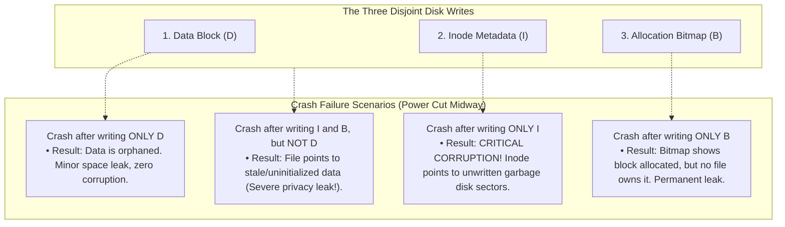
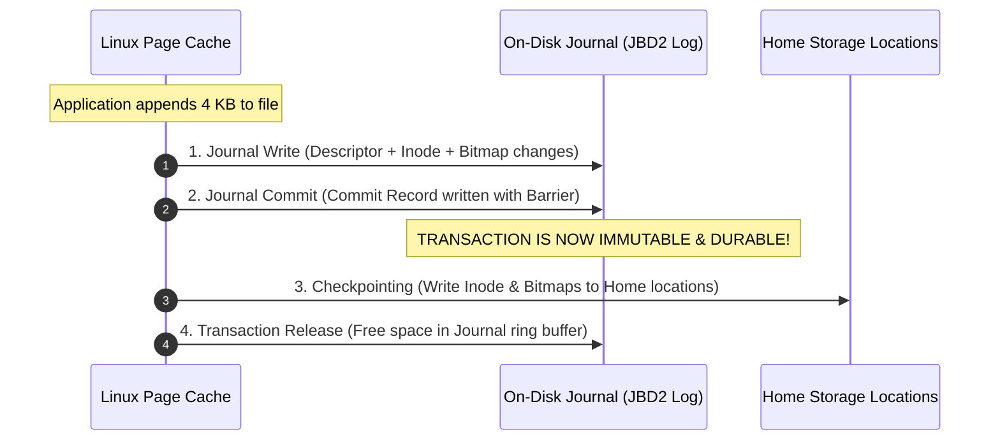
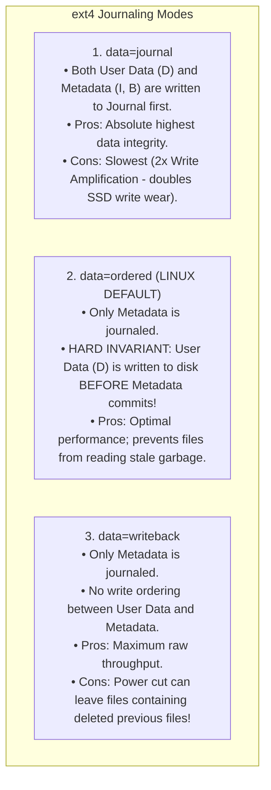
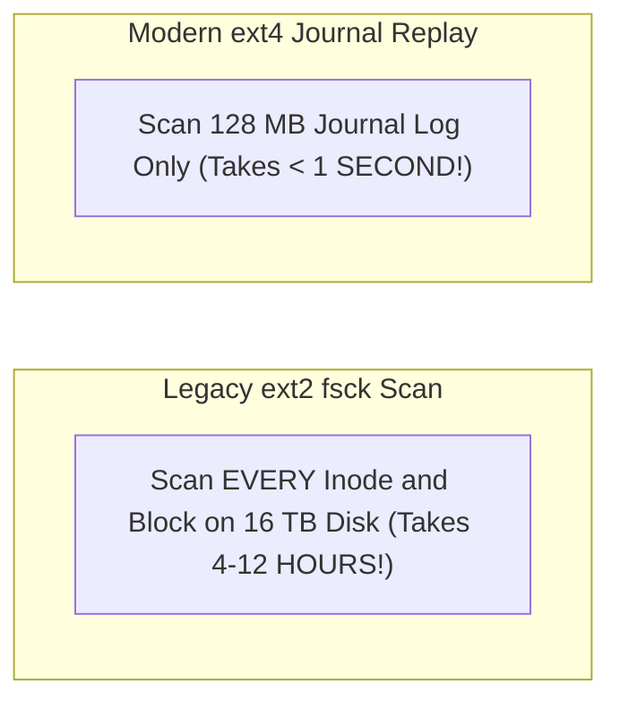

# Journaling File Systems and Crash Consistency

> [!abstract] Mental Model
> Journaling is **double-entry bookkeeping before committing a real estate transfer**:
> - Appending data to a file requires updating **three separate disk sectors**: the **Data Block ($D$)**, the **Inode ($I$)**, and the **Allocation Bitmap ($B$)**.
> - If power cuts out when only 2 of the 3 sectors are written, the disk is left in a corrupt, torn state (**The Crash Consistency Problem**).
> - A **Journaling File System** writes a pre-flight transaction receipt to a contiguous log (**The Journal / Write-Ahead Log**) *before* modifying the filesystem. If power dies, rebooting replays the journal in **$< 1\text{ second}$**, completely eliminating hours of destructive `fsck` scans.

---

## The Crash Consistency Problem: The 3-Write Dilemma

Appending a $4\text{ KB}$ block requires three distinct disk updates:
1. **$D$ (Data Block)**: The actual file payload data.
2. **$I$ (Inode)**: Updating `i_size` and adding the block pointer.
3. **$B$ (Data Bitmap)**: Marking the newly allocated block as `1` (used).



---

## Write-Ahead Logging (WAL) & The 5-Stage Journal Lifecycle

Linux filesystems (ext4 using the **JBD2 - Journaling Block Device 2** engine) solve this via a 5-step state machine:



---

### Crash Recovery Dynamics:
- **Crash before Step 2 (Commit)**: The transaction is incomplete. JBD2 discards the pending log on boot. Zero corruption.
- **Crash after Step 2 (Commit)**: The transaction is committed. JBD2 **replays the journal log**, writing the committed metadata directly to home storage blocks in $< 500\text{ ms}$ (**Journal Replay**).

---

## The Three Ext4 Journaling Modes

Controlled via mount option `mount -o data=<mode>`:



---

## Journaling Modes Comparison

| Journal Mode | Metadata Journaled? | Data Journaled? | Crash Guarantee | Performance |
| :--- | :--- | :--- | :--- | :--- |
| **`data=journal`** | **Yes** | **Yes** | No data or metadata loss. | **Slowest** ($2\times$ disk I/O) |
| **`data=ordered`** | **Yes** | **No** (Direct to home) | Consistent metadata; no stale data leaks. | **Optimal (Default)** |
| **`data=writeback`** | **Yes** | **No** (Unordered) | Consistent metadata; possible stale garbage. | **Fastest** |

---

## Production Focus: `fsck` vs Journal Replay

Before journaling existed (ext2 / classic UFS), any ungraceful shutdown forced a full **`fsck` (File System Consistency Check)** scan:



---

## Production Diagnostics & Storage Commands

```bash
# 1. Verify filesystem has an active journal enabled
sudo tune2fs -l /dev/nvme0n1p1 | grep -i "features"
# Filesystem features: has_journal ext_attr resize_inode dir_index filetype extent 64bit

# 2. Inspect active journaling mount mode
mount | grep ext4
# /dev/nvme0n1p1 on / type ext4 (rw,relatime,data=ordered)

# 3. Force non-destructive read-only filesystem integrity check
sudo e2fsck -fn /dev/nvme0n1p1
```

---

## Active Recall & Interview Perspective

### Reasoning Prompts
1. *Why does `data=ordered` mode enforce that user data blocks must be written to disk BEFORE the metadata transaction commits to the journal?*
   - **Answer**: If metadata (the Inode containing the updated file size and block pointers) were committed to the journal *before* the user data payload was physically written to disk, a power outage occurring immediately after the commit would leave the file pointing to uninitialized storage sectors. Upon reboot and journal replay, the file would successfully report its new size but its contents would expose **stale garbage data or previously deleted files from other users** (a catastrophic data privacy vulnerability). `data=ordered` guarantees that pointers only link to blocks that are already persisted on disk.
2. *What is the difference between Journal Checkpointing and Journal Commit?*
   - **Answer**: **Journal Commit** occurs when the transaction descriptor and dirty metadata blocks are written to the sequential on-disk *journal log* and sealed with a commit record and hardware barrier (`blkdev_issue_flush`), rendering the transaction durable. **Journal Checkpointing** is the subsequent background step where the committed metadata changes are copied from the journal into their permanent on-disk *home storage locations* (the actual Inode Table and Allocation Bitmaps). Once checkpointing completes, the transaction is evicted from the circular journal buffer.
3. *Why does Write-Ahead Logging (WAL) in databases operate nearly identically to filesystem journaling?*
   - **Answer**: Both address the fundamental problem of atomic multi-block disk updates in the presence of power crashes. Both convert random multi-location disk writes into a single, high-speed sequential write to an append-only log. In both systems, a transaction is considered officially committed the moment the sequential log record hits durable media, allowing expensive in-place data updates to be deferred to asynchronous background checkpointing workers.

---

## Key Takeaways
- Appending data requires updating **Data ($D$)**, **Inode ($I$)**, and **Bitmap ($B$)**; failure midway creates **Crash Inconsistency**.
- **Write-Ahead Logging (JBD2)** commits metadata transactions to a sequential log before modifying on-disk home blocks.
- **`data=ordered`** is the production sweet spot: journaling metadata while ordering data writes to prevent stale data leaks.

---

## Related Notes
- [[Operating System]] — Storage subsystem architecture.
- [[File Concept and File Attributes]] — File metadata.
- [[Inodes and File System Metadata]] — Inode structures and bitmaps.
- [[Virtual File System - VFS]] — VFS I/O dispatch.
- [[Page Cache and Buffer Cache]] — Dirty page writeback.
- [[ext4 Architecture Overview]] — Deep dive into ext4 JBD2 mechanics.
- [[XFS and ZFS Overview]] — Copy-on-Write alternative to journaling.
- [[Operating Systems MOC]] — Master table of contents for Operating Systems.
