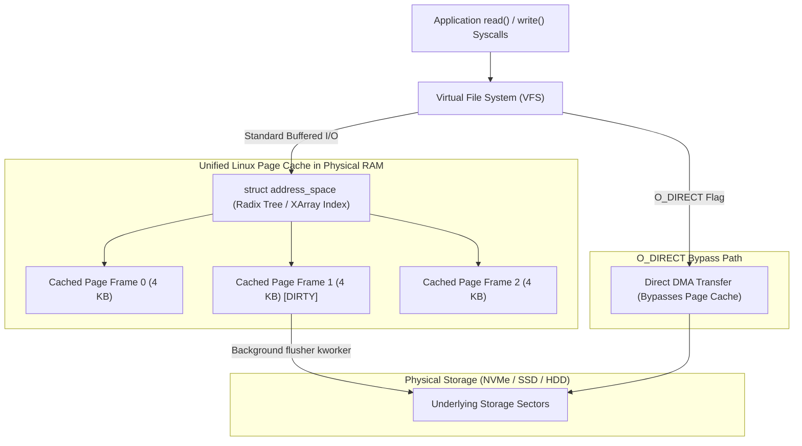
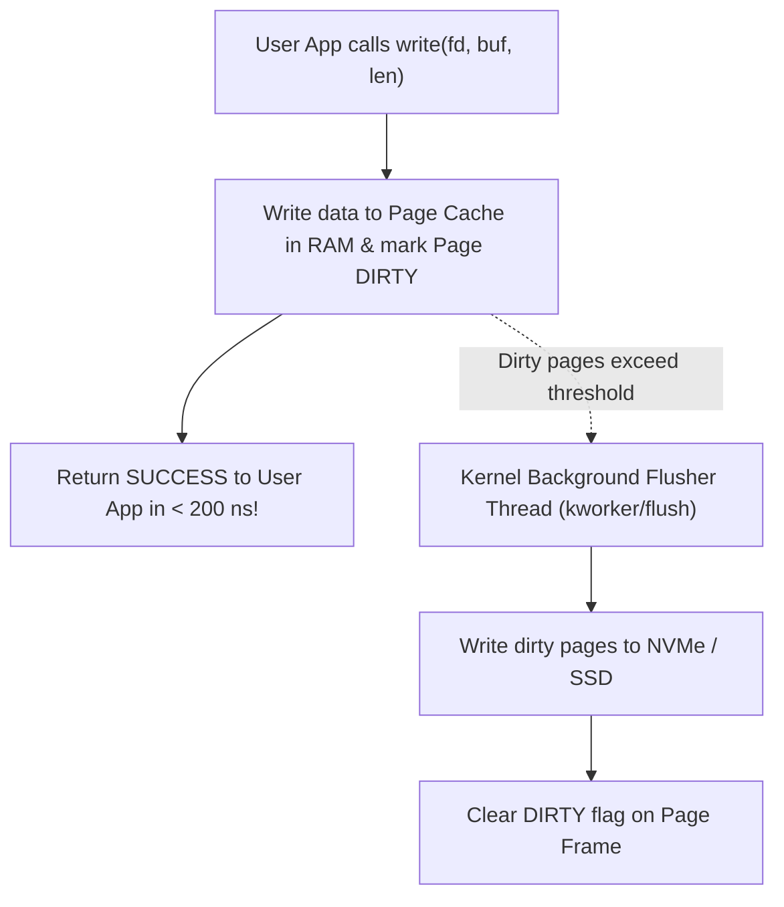
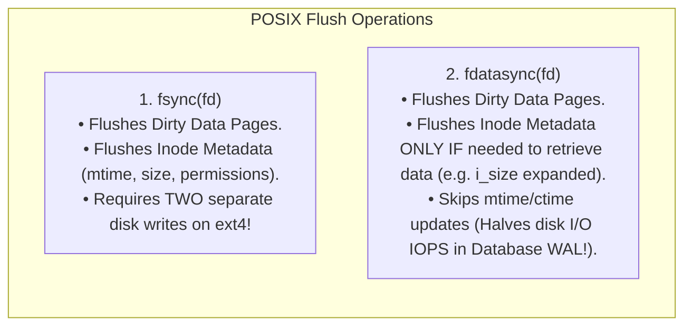

# Page Cache and Buffer Cache

> [!abstract] Mental Model
> The Page Cache is the **high-speed express shipping dock of the Operating System**:
> - Accessing DRAM takes $\sim 100\text{ nanoseconds}$; accessing an NVMe SSD takes $\sim 50\text{ microseconds}$ ($500\times$ slower); accessing a spinning HDD takes $\sim 10\text{ milliseconds}$ ($100,000\times$ slower).
> - The kernel eliminates this speed gap by **transparently caching all file reads and writes in spare physical RAM**.
> - Writes modify data in RAM in nanoseconds (marking pages **Dirty**); background kernel workers flush them to physical storage asynchronously (**Write-Back Caching**).

---

## The Unified Linux Page Cache Architecture

Historically (pre-Linux 2.4), kernels maintained two separate caches: the **Buffer Cache** (raw disk blocks) and the **Page Cache** (file page content), causing duplicate memory usage. Modern Linux unifies them:



---

## Internal Mechanics: `struct address_space` & Radix Tree

In the Linux kernel, every `struct inode` owns a `struct address_space`:

```c
// include/linux/fs.h
struct address_space {
    struct inode *host;              // Owner Inode
    struct xarray i_pages;           // Lockless radix tree of resident page frames
    const struct address_space_operations *a_ops; // readpage, writepage, bmap
    unsigned long nrpages;           // Total cached pages
    atomic_long_t nr_dirts;          // Count of dirty pages
};
```

- When `read(fd, buf, 4096)` is invoked, the kernel queries `inode->i_mapping->i_pages` using the file offset as the key.
- **Cache Hit**: Zero disk I/O; kernel copies data from page cache RAM directly to user buffer via `copy_to_user()`.
- **Cache Miss**: Allocates page frame in RAM, issues block I/O (`submit_bio`) with **Read-Ahead** heuristics (fetching subsequent pages anticipating sequential access).

---

## Dirty Page Write-Back Mechanics & Kernel Tunables



---

### Critical Production Kernel Tunables (`/proc/sys/vm/`):

| Tunable Parameter | Default | Production Function & Tuning Strategy |
| :--- | :--- | :--- |
| **`vm.dirty_background_ratio`** | `10%` | Percentage of RAM dirty before background `flusher` threads begin flushing to disk. |
| **`vm.dirty_ratio`** | `20%` | Hard ceiling: if dirty pages exceed this %, **user processes calling `write()` are blocked and forced to flush synchronously** (causing latency spikes). |
| **`vm.dirty_expire_centisecs`** | `3000` ($30\text{ s}$) | Time a dirty page can remain in RAM before it must be committed to disk. |
| **`vm.dirty_writeback_centisecs`** | `500` ($5\text{ s}$) | Interval at which kernel flushers wake up to check for expired dirty pages. |

---

## Synchronous Durability APIs: `fsync` vs `fdatasync`

Databases (PostgreSQL, MySQL, SQLite, etcd) cannot afford write-back data loss during power outages. They force physical disk synchronization:



---

## Bypassing the Page Cache: `O_DIRECT`

Relational databases (like PostgreSQL and MySQL InnoDB) maintain their own highly optimized in-memory buffer pool algorithms. Having the Linux Page Cache also cache those pages creates **Double-Buffering Waste**:

- Opening a file with **`O_DIRECT`** (`open("db.data", O_RDWR | O_DIRECT)`):
  - Completely bypasses the Linux Page Cache.
  - DMA transfers payload bytes directly between user-space application memory buffers and the storage controller.
  - Requires memory buffers to be aligned to $512\text{B} / 4096\text{B}$ disk sector boundaries.

---

## Production Diagnostics & Cache Control

```bash
# 1. Inspect System-Wide RAM and Cached File Memory
free -h

# Output format:
#               total        used        free      shared  buff/cache   available
# Mem:           62Gi       8.2Gi       1.1Gi       240Mi        53Gi        53Gi
# (Linux intentionally uses all spare RAM for buff/cache; it is freed instantly on demand!)

# 2. Inspect Dirty Page Volume Currently in RAM
cat /proc/meminfo | grep -i dirty
# Dirty:             4128 kB
# Writeback:            0 kB

# 3. Safely Drop Caches (Benchmarking only - NEVER run in production!):
sync; echo 3 | sudo tee /proc/sys/vm/drop_caches
```

---

## Active Recall & Interview Perspective

### Reasoning Prompts
1. *Why does Linux appear to have almost 0 MB of "free" RAM on busy production servers, and why is this desirable?*
   - **Answer**: Unused RAM is wasted silicon. Linux utilizes all available free memory as **Page Cache** to keep disk data and binary libraries hot in RAM, eliminating high-latency disk seeks on subsequent reads. If an application suddenly requests memory (e.g. via `malloc()`), the kernel automatically reclaims clean Page Cache frames in nanoseconds. The metric **`available`** in `free -h` represents the true memory available for application use without swapping.
2. *Why is `fdatasync()` significantly faster than `fsync()` for Database Write-Ahead Logs (WAL)?*
   - **Answer**: When appending to a pre-allocated log file, `fsync()` writes both the dirty data pages and the modified inode metadata (such as `mtime` and `ctime` timestamps). In journaling filesystems (ext4), writing inode metadata triggers a journal transaction commit, requiring **two separate disk write operations** at different disk sectors. `fdatasync()` only flushes inode metadata if the file length (`i_size`) has changed; if writing to existing file space, it only flushes the data sector, cutting physical storage disk writes in half.
3. *What causes a write latency spike when an application calls `write()` under heavy disk I/O load?*
   - **Answer**: When write activity is so intense that dirty pages exceed the **`vm.dirty_ratio`** threshold (default $20\%$ of system memory), the kernel's background `flusher` threads can no longer keep up. The kernel throttles the writing process, switching it from asynchronous buffered writing to **synchronous throttling**, forcing the user thread to block and physically write dirty pages to storage before `write()` returns, generating catastrophic p99 latency spikes.

---

## Key Takeaways
- The **Page Cache** bridges the speed chasm between physical RAM ($100\text{ ns}$) and NVMe storage ($50\text{ }\mu\text{s}$).
- Standard writes are **asynchronous (Write-Back)**; durability is enforced via **`fdatasync()`**.
- High-performance databases use **`O_DIRECT`** to prevent double-buffering and manage their own buffer pools.

---

## Related Notes
- [[Operating System]] — Storage subsystem.
- [[System Calls]] — `read`, `write`, `fsync`, `fdatasync`.
- [[Paging Architecture]] — Page frame allocation.
- [[Virtual Memory Architecture]] — Anonymous vs file-backed memory.
- [[File Descriptors and File Tables]] — File handle dispatch.
- [[Inodes and File System Metadata]] — Inode metadata persistence.
- [[Virtual File System - VFS]] — VFS caching layer.
- [[Journaling File Systems and Crash Consistency]] — Crash recovery and sync.
- [[Operating Systems MOC]] — Master table of contents for Operating Systems.
