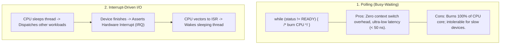
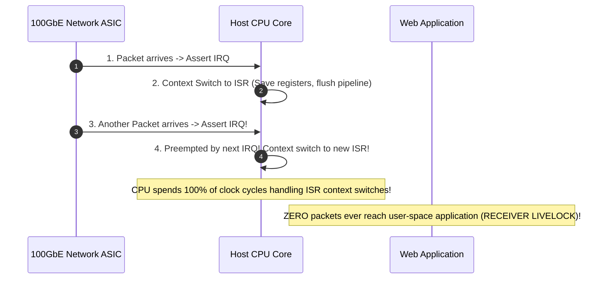
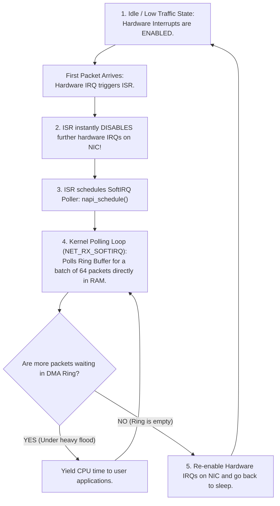
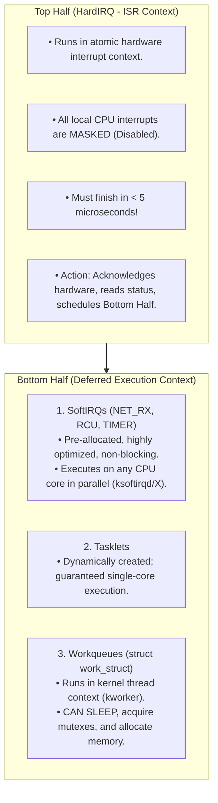

# Polling vs Interrupt-Driven I/O

> [!abstract] Mental Model
> - **Polling (Busy-Waiting - The Impatient Stare)**: The CPU sits in a tight loop reading the device status register: *"Are you ready? Are you ready? Are you ready?"* It achieves sub-microsecond latency for ultra-fast devices, but consumes $100\%$ CPU cycles when devices are slow.
> - **Interrupt-Driven I/O (The Notification Chime)**: The CPU commands the hardware, immediately puts the thread to sleep, and switches to another user process. When the device completes I/O, it pulses a physical interrupt line on the CPU's Interrupt Controller (APIC), waking the kernel via an **Interrupt Service Routine (ISR)**.
> - **The Modern Hybrid (Linux NAPI - Adaptive Polling)**: Use interrupts when traffic is light; dynamically switch to high-speed batch polling under heavy flood to prevent **Receiver Livelock**.

---

## Architectural Comparison Matrix



| Feature | Polling (Busy-Waiting) | Interrupt-Driven I/O | Hybrid Adaptive (NAPI) |
| :--- | :--- | :--- | :--- |
| **CPU Efficiency (Low Load)** | Terribly wasteful ($100\%$ core usage) | **Optimal (CPU sleeps until signaled)** | Optimal (Uses interrupts) |
| **CPU Efficiency (High Load)** | **Maximum Throughput** (Zero IRQ thrash) | Collapses into **Interrupt Storms** | **Maximum Throughput** |
| **Minimum Latency** | **$< 50\text{ ns}$** (Immediate register poll) | $1\text{ - }5\text{ }\mu\text{s}$ (Context switch & vectoring) | Dynamically tuned ($< 1\text{ }\mu\text{s}$) |
| **Ideal Workload** | Ultra-low-latency FPGA trading, DPDK | Disks, Keyboards, Mouse, Serial ports | **Enterprise 100GbE NICs, NVMe queues** |

---

## The Fatal Failure Mode: Interrupt Storms & Receiver Livelock

On a $100\text{ GbE}$ network card receiving $14,000,000$ packets per second:



---

## The Linux Solution: NAPI (New API) Adaptive Polling

Linux solves receiver livelock using an adaptive state machine inside the network subsystem (`net/core/dev.c`):



---

## Linux Interrupt Architecture: Top Half vs Bottom Half

Because hardware interrupts disable other CPU interrupts, kernels split processing into two phases:



---

## Production Diagnostics & Kernel Inspection

```bash
# 1. Inspect Per-CPU Hardware Interrupt Distribution (Look for IRQ imbalance across cores)
cat /proc/interrupts | head -n 15

# Output format:
#            CPU0       CPU1       CPU2       CPU3
#  32:    4910291          0          0          0   PCI-MSI 524288-edge   nvme0q1
#  33:          0    8291041          0          0   PCI-MSI 524289-edge   eth0-TxRx-0

# 2. Inspect SoftIRQ Load (Check if NET_RX is dominating a core)
cat /proc/softirqs | grep -E "NET_RX|SCHED|RCU"
#       NET_RX:   92104921   1049102   1204910   1492019
#        SCHED:   49102910  48910219  49102941  49019283

# 3. View and tune Network Card Interrupt Moderation / Coalescing:
sudo ethtool -c eth0
# Adaptive RX: on  RX usecs: 60  RX frames: 32
# (Limits IRQ frequency by buffering packets for 60 us or 32 frames before interrupting!)
```

---

## Active Recall & Interview Perspective

### Reasoning Prompts
1. *What is Receiver Livelock and how does it bring high-performance network servers to an absolute halt?*
   - **Answer**: Under extreme network packet ingress rates (e.g. 10 to 100 Gbps), incoming packets generate millions of hardware interrupts per second. Each interrupt forces the CPU to save user registers, switch execution context, execute the top-half ISR, and restore context. If the rate of incoming interrupts exceeds the CPU's ability to process the packets, the CPU spends $100\%$ of its cycles servicing interrupt overhead, leaving zero CPU time for user-space applications or even the bottom-half network stack to drain the packet queues. The system locks up in **Receiver Livelock**, dropping every incoming packet despite the CPU running at maximum load.
2. *Why can a Linux Top-Half Interrupt Handler (HardIRQ) NEVER call `sleep()`, `msleep()`, or allocate memory with `GFP_KERNEL`?*
   - **Answer**: The Top-Half ISR runs in **interrupt context**, which is completely detached from any process control block (`struct task_struct`). There is no schedulable thread identity to place onto a wait queue or restore later. Furthermore, hardware interrupts are disabled on the executing CPU. If an ISR attempted to sleep or block on a mutex, the CPU scheduler would have no context to switch back to, resulting in an immediate kernel panic (**Fatal Exception: Scheduling while atomic**). Any operation that might sleep must be deferred to a **Workqueue** bottom-half.
3. *How does hardware Interrupt Coalescing (Moderation) balance latency and throughput on high-speed NICs?*
   - **Answer**: Without coalescing, every single incoming network frame fires an immediate hardware interrupt. **Interrupt Coalescing** programs the hardware NIC controller to delay asserting an interrupt until either a minimum timer expires (e.g. $50\text{ microseconds}$) or a minimum number of frames arrive (e.g. $32\text{ packets}$). This aggregates dozens of packets into a single hardware interrupt, drastically reducing CPU context switches and boosting throughput at the cost of a microsecond-scale increase in packet latency.

---

## Key Takeaways
- **Polling** delivers minimum latency ($< 50\text{ ns}$) at high CPU cost; **Interrupts** allow CPU multiplexing at the risk of **Receiver Livelock**.
- **Linux NAPI** dynamically transitions between interrupts (low load) and batch polling (high load).
- Linux splits interrupt execution into an atomic **Top Half (HardIRQ)** and deferred **Bottom Halves (SoftIRQs, Workqueues)**.

---

## Related Notes
- [[Operating System]] — Storage and I/O architecture.
- [[Interrupts and Interrupt Handling]] — Core interrupt mechanisms and vectoring.
- [[IO Hardware - Port-Mapped vs Memory-Mapped IO]] — Hardware register access.
- [[Direct Memory Access - DMA]] — Offloading bulk packet streaming.
- [[Disk Scheduling Algorithms - SSTF, SCAN, C-SCAN]] — I/O request queues.
- [[Zero-Copy IO - sendfile, splice, io_uring]] — Ring buffer asynchronous polling (`io_uring_enter`).
- [[Operating Systems MOC]] — Master table of contents for Operating Systems.
