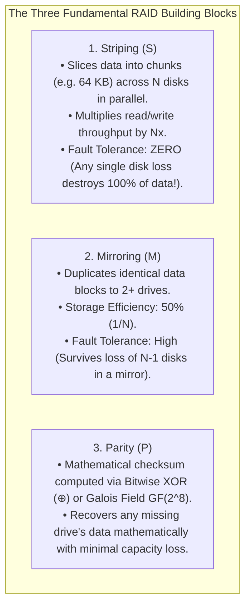
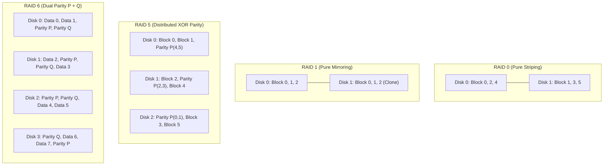
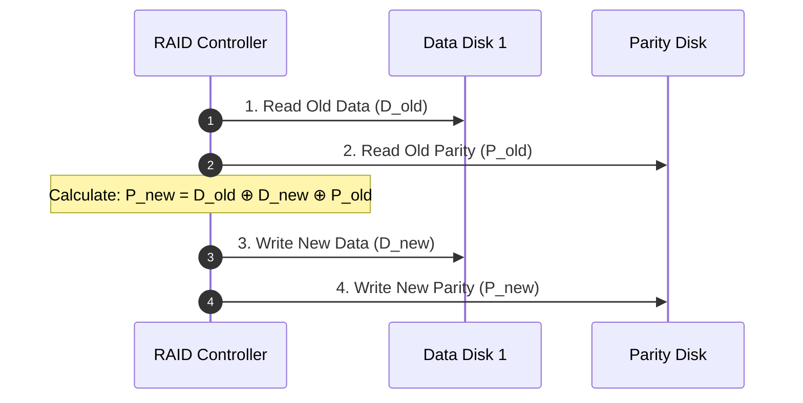
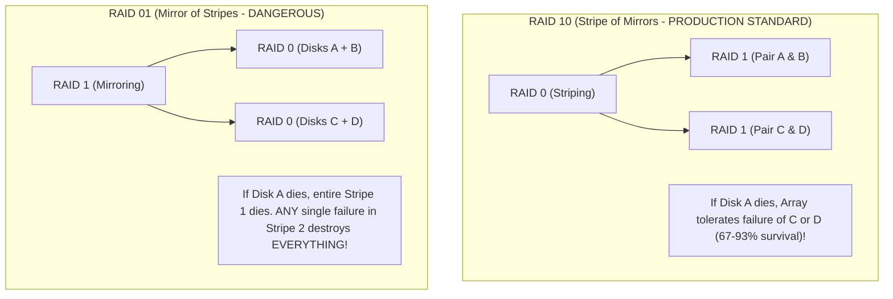
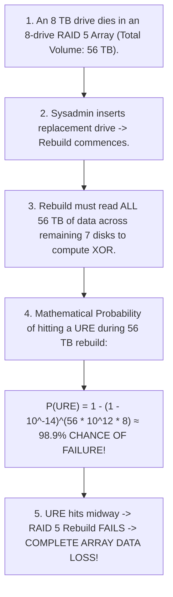

# RAID Levels and Reliability

> [!abstract] Mental Model
> RAID is **a coordinated fleet of cargo ships moving in formation**:
> - Individual hard disk drives fail unpredictably ($MTBF \approx 1,000,000\text{ hours}$; in an enterprise datacenter with $10,000$ drives, a drive dies every 4 days!).
> - **RAID (Redundant Array of Independent Disks)** combines multiple physical disks into a single logical block device to deliver **Extreme Parallel Throughput (Striping)**, **Fault Tolerance (Mirroring)**, or **Algorithmic Recovery (Parity)**.

---

## Fundamental Pillars: Striping, Mirroring, and Parity



---

## Comprehensive RAID Architectural Taxonomy



---

## Technical Comparison & Mathematical Matrix

| RAID Level | Min Disks | Usable Capacity | Fault Tolerance | Read IOPS | Write IOPS | Random Write Penalty |
| :--- | :--- | :--- | :--- | :--- | :--- | :--- |
| **RAID 0** | 2 | $N \times C$ ($100\%$) | **$0$ Disks** | $N \times X$ | $N \times X$ | **$1$ (None)** |
| **RAID 1** | 2 | $1 \times C$ ($50\%$) | $N - 1$ Disks | $N \times X$ | $1 \times X$ | **$2$ writes** |
| **RAID 5** | 3 | $(N - 1) \times C$ | **$1$ Disk** | $(N - 1) \times X$ | Bottlenecked by parity | **$4$ I/O ops (Read-Mod-Write)** |
| **RAID 6** | 4 | $(N - 2) \times C$ | **$2$ Disks** | $(N - 2) \times X$ | Heavy CPU Galois math | **$6$ I/O ops** |
| **RAID 10** | 4 | $(N / 2) \times C$ ($50\%$) | **$1$ disk per mirror pair** | $N \times X$ | $(N / 2) \times X$ | **$2$ writes (Fastest database RAID)** |

---

## Parity Mathematics & The RAID 5 Write Penalty

### XOR Parity Math:
For three data blocks $D_1, D_2, D_3$, parity is calculated as:
$$P = D_1 \oplus D_2 \oplus D_3$$

- If Disk 2 dies, its data is recovered on-the-fly via:
  $$D_2 = D_1 \oplus D_3 \oplus P$$

---

### The 4-I/O Write Penalty (Read-Modify-Write Cycle):
Updating a single $4\text{ KB}$ block ($D_{\text{old}} \to D_{\text{new}}$) in RAID 5 cannot simply write the data block—it must update the parity block without reading all other disks:

$$P_{\text{new}} = D_{\text{old}} \oplus D_{\text{new}} \oplus P_{\text{old}}$$


> Every single random write generates **4 physical disk I/O operations**!

---

## Nested RAID: RAID 10 vs RAID 01



---

## The Production Storage Catastrophe: The URE Rebuild Hazard

Modern enterprise HDDs have an advertised **Unrecoverable Read Error (URE)** rate of **$1\text{ error per } 10^{14}\text{ bits read}$** ($\sim 12.5\text{ TB}$).



> [!CAUTION] Production Warning: Why RAID 5 is Dead
> For drives larger than $2\text{ TB}$, **RAID 5 must never be used in production**. Enterprise infrastructure mandates **RAID 6 (tolerates 2 drive failures and UREs during rebuild)**, **RAID 10**, or **ZFS RAID-Z2**.

---

## Production Diagnostics & Software RAID (`mdadm`)

```bash
# 1. Inspect Linux Software RAID Status and Active Rebuild Progress
cat /proc/mdstat

# Output format:
# Personalities : [raid1] [raid10] [raid6] [raid5]
# md0 : active raid6 nvme0n1p1[0] nvme1n1p1[1] nvme2n1p1[2] nvme3n1p1[3]
#       7813770240 blocks super 1.2 level 6, 512k chunk, algorithm 2 [4/4] [UUUU]

# 2. Inspect Detailed Health of a RAID Array
sudo mdadm --detail /dev/md0
# State : clean
# Active Devices : 4
# Working Devices : 4
# Failed Devices : 0
# Spare Devices : 0

# 3. Simulate Drive Failure and Hot-Swap Replacement
sudo mdadm --manage /dev/md0 --fail /dev/nvme3n1p1
sudo mdadm --manage /dev/md0 --remove /dev/nvme3n1p1
sudo mdadm --manage /dev/md0 --add /dev/nvme4n1p1
```

---

## Active Recall & Interview Perspective

### Reasoning Prompts
1. *Why does RAID 10 have significantly higher reliability and rebuild survival rates than RAID 01?*
   - **Answer**: In RAID 10 (a stripe of mirror pairs), if Disk 0 fails, only its mirror partner Disk 1 is critical; the array can tolerate subsequent failures of any disk in the *other* mirror pairs (Disks 2 or 3). In RAID 01 (a mirror of two striped sets), a failure of Disk 0 knocks out the entire first striped sub-array. The entire array is now running on a single non-redundant stripe; any single read error or disk failure on *any* disk in the remaining stripe causes total, unrecoverable catastrophic array loss.
2. *Explain the "RAID 5 Write Penalty" and why random writes are expensive on parity arrays.*
   - **Answer**: When writing a random $4\text{ KB}$ block to a single disk in RAID 5, the corresponding parity block must also be updated to maintain mathematical consistency. To calculate the new parity without reading all other $N-1$ disks in the stripe, the RAID controller must perform the **Read-Modify-Write cycle**: (1) Read the old data block, (2) Read the old parity block, (3) Compute the new parity via XOR difference ($P_{\text{new}} = D_{\text{old}} \oplus D_{\text{new}} \oplus P_{\text{old}}$), (4) Write the new data block, and (5) Write the new parity block. This turns 1 logical write into **4 physical disk I/O operations**.
3. *Why does an Unrecoverable Read Error (URE) during a RAID 5 rebuild result in total data loss?*
   - **Answer**: In a degraded RAID 5 array where one disk has already failed, there is zero remaining redundancy. To reconstruct the missing disk onto a replacement drive, the controller must read every single sector across all remaining drives to compute XOR parity. If even a single sector on any remaining drive encounters a hardware URE (a common occurrence when reading tens of terabytes on modern large drives), the mathematical XOR reconstruction fails for that block. Most standard RAID controllers abort the entire rebuild, marking the array as failed and causing complete data loss.

---

## Key Takeaways
- **Striping (RAID 0)** maximizes speed; **Mirroring (RAID 1)** duplicates data; **Parity (RAID 5/6)** provides mathematical redundancy.
- **RAID 5** suffers a **4-I/O Write Penalty** and is obsolete for drives $> 2\text{ TB}$ due to the **98%+ URE Rebuild Hazard**.
- High-performance databases use **RAID 10** for maximum IOPS and fast, safe rebuilds.

---

## Related Notes
- [[Operating System]] — Storage subsystem architecture.
- [[IO Hardware - Port-Mapped vs Memory-Mapped IO]] — Hardware controllers.
- [[Disk Scheduling Algorithms - SSTF, SCAN, C-SCAN]] — I/O queue management.
- [[Solid State Drives - Flash Memory, Wear Leveling, TRIM]] — SSD arrays and wear.
- [[XFS and ZFS Overview]] — Software RAID-Z and self-healing.
- [[Operating Systems MOC]] — Master table of contents for Operating Systems.
