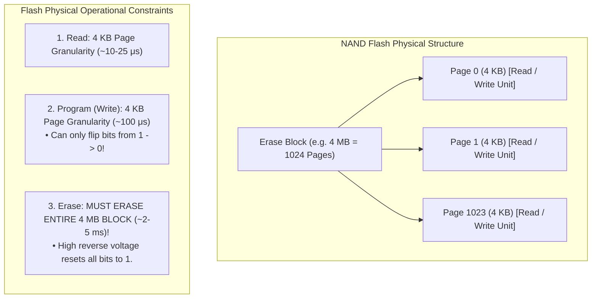
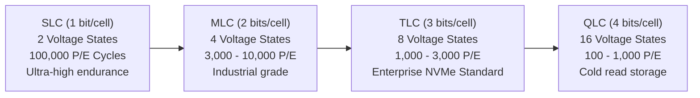
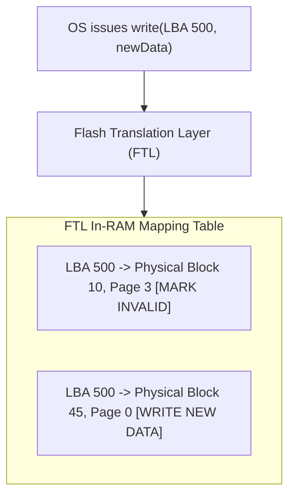
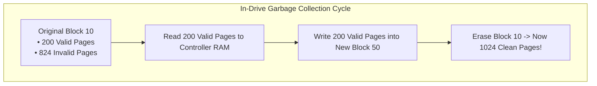
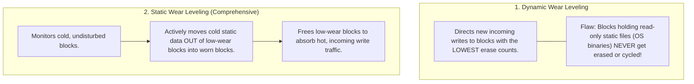
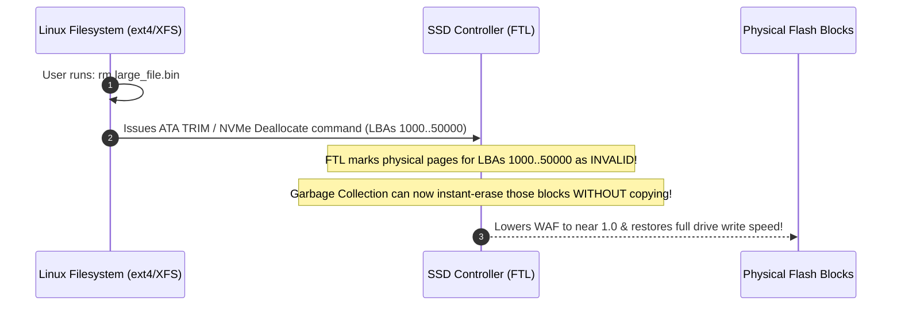

# Solid State Drives: Flash Memory, Wear Leveling, TRIM

> [!abstract] Mental Model
> NAND Flash memory is **writing in permanent ink on an Etch-a-Sketch**:
> - You can write words on individual lines (**$4\text{ KB}$ Page Programming**).
> - But you **cannot erase a single word**—you can only shake the entire Etch-a-Sketch clean (**$4\text{ MB}$ Block Erase**).
> - Because flash memory cannot overwrite in-place, SSDs run an internal embedded operating system—the **Flash Translation Layer (FTL)**—which handles out-of-place writes, **Garbage Collection**, **Wear Leveling**, and relies on the **TRIM command** to avoid self-destructive write amplification.

---

## The Fundamental Asymmetry of NAND Flash



> **The In-Place Write Prohibition**: To update 1 byte in Page 0, the controller **cannot rewrite Page 0 directly**. It must write the new data to an unused empty Page, update its internal mapping table, and mark old Page 0 as **Invalid (Dead Data)**.

---

## NAND Flash Cell Taxonomy & Endurance



---

## The Flash Translation Layer (FTL) & Out-of-Place Writes

The **FTL** is an embedded controller running firmware inside the SSD that presents a virtual flat disk interface (LBA) to the host OS:



---

## Garbage Collection & Write Amplification Factor (WAF)

When free empty blocks run out, the FTL must perform **Garbage Collection (GC)**:
1. Select a block filled with mixed valid and invalid pages.
2. Read the valid pages into SSD internal RAM.
3. Write (re-program) valid pages into a new clean block.
4. Issue a high-voltage erase to the entire original block.



---

### Write Amplification Factor (WAF):
$$\mathbf{\text{WAF} = \frac{\text{Total Bytes Written to NAND Flash}}{\text{Total Bytes Written by Host OS}}}$$

- **Ideal WAF = 1.0**: For every 1 GB written by OS, 1 GB hits NAND.
- **Pathological WAF = 5.0 to 10.0**: Under random-write database loads on a nearly full SSD, moving valid pages during GC multiplies write volume by $10\times$, destroying SSD IOPS and burning through silicon endurance in months!

---

## Wear Leveling: Dynamic vs Static

Because each NAND flash block degrades physically after a fixed number of **Program/Erase (P/E) cycles** (due to oxide layer breakdown), the FTL distributes writes uniformly:



---

## The TRIM / NVMe Deallocate Command

### Why Standard File Deletion Destroys SSDs:
When a user deletes a $10\text{ GB}$ file (`rm video.mp4`), the OS filesystem only clears the Inode bitmap in OS RAM. The OS **never issues an I/O write to the storage controller** to say the data is dead. The SSD still thinks those LBAs contain critical data, and continues endlessly copying dead data during Garbage Collection!

### The TRIM Solution:



---

## Production Diagnostics & Flash Monitoring

```bash
# 1. Inspect NVMe Health, Wear Level, and Spare Capacity
sudo nvme smart-log /dev/nvme0n1

# Output metrics:
# critical_warning                    : 0
# temperature                         : 38 C
# available_spare                     : 100%
# percentage_used                     : 3% (Drive has consumed 3% of total rated lifespan)
# data_units_written                  : 48,192,014 (approx 24.6 TB written)

# 2. Trigger On-Demand Online TRIM across all mounted filesystems:
sudo fstrim -av

# Output:
# /: 42.1 GiB (45210291200 bytes) trimmed on /dev/nvme0n1p1
# /data: 110.8 GiB (118921004032 bytes) trimmed on /dev/nvme1n1p1

# 3. Check SSD Over-Provisioning and SMART attributes on SATA SSD:
sudo smartctl -A /dev/sda | grep -E "Wear_Range_Delta|Used_Rsvd_Blk_Cnt_Tot"
```

---

## Active Recall & Interview Perspective

### Reasoning Prompts
1. *What is the Flash Translation Layer (FTL) and why does an SSD require it while a mechanical hard drive does not?*
   - **Answer**: Mechanical hard drives allow random overwrites directly in-place at sector granularity ($512\text{B} / 4096\text{B}$). NAND flash memory physically *cannot overwrite data in-place*—it can only write at the Page level ($4\text{ KB}$) and erase at the Block level ($4\text{ MB}$). The **Flash Translation Layer (FTL)** is an embedded microcontroller subsystem that translates logical OS block addresses (LBA) to dynamic physical flash pages (PPA), performing out-of-place writes, tracking invalid pages, executing background garbage collection, and balancing cell wear leveling transparently to the host operating system.
2. *Why is Static Wear Leveling superior to Dynamic Wear Leveling?*
   - **Answer**: **Dynamic Wear Leveling** only selects blocks with low erase counts when writing *new incoming data*. If a portion of the drive stores static, read-only data (such as OS system files or game assets), those blocks remain untouched with near-zero erase counts, while the remainder of the drive absorbs all write traffic and wears out prematurely. **Static Wear Leveling** detects blocks containing cold, unwritten data, relocates that static data into heavily-worn blocks, and frees up the pristine, low-wear blocks to participate in active write cycles, ensuring $100\%$ of flash cells degrade at an identical rate.
3. *What is the TRIM / NVMe Deallocate command and what happens to SSD performance if it is disabled?*
   - **Answer**: When an OS deletes a file, it only updates filesystem metadata; it sends zero write requests to the underlying storage sectors. Without **TRIM**, the SSD controller cannot distinguish between active user files and deleted file sectors. During background Garbage Collection, the SSD dutifully copies all dead, deleted pages into new blocks before erasing old blocks, driving the **Write Amplification Factor (WAF)** to extreme levels ($5\times \dots 10\times$). This causes write performance to collapse to single-digit megabytes per second and exhausts the drive's P/E endurance cycles prematurely. TRIM notifies the FTL that deleted LBA ranges are dead, allowing GC to skip copying them and erase blocks instantly.

---

## Key Takeaways
- Flash memory has an intrinsic asymmetry: **Read/Program at $4\text{ KB}$ Page size**, but **Erase at $4\text{ MB}$ Block size**.
- The **FTL** handles out-of-place writes, mapping tables, and **Static Wear Leveling**.
- **TRIM / NVMe Deallocate** informs the controller of deleted blocks, minimizing **Write Amplification (WAF)** and preserving SSD lifespan.

---

## Related Notes
- [[Operating System]] — Storage subsystem architecture.
- [[IO Hardware - Port-Mapped vs Memory-Mapped IO]] — NVMe PCIe BARs.
- [[Direct Memory Access - DMA]] — High-throughput NVMe DMA queues.
- [[Disk Scheduling Algorithms - SSTF, SCAN, C-SCAN]] — `blk-mq` `none` scheduler.
- [[RAID Levels and Reliability]] — SSD array wear and rebuilds.
- [[ext4 Architecture Overview]] — Ext4 extent allocation on flash.
- [[Operating Systems MOC]] — Master table of contents for Operating Systems.
