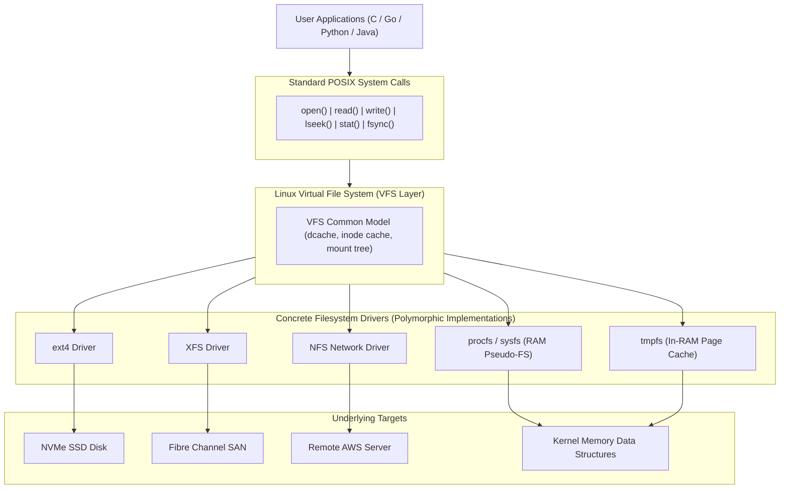
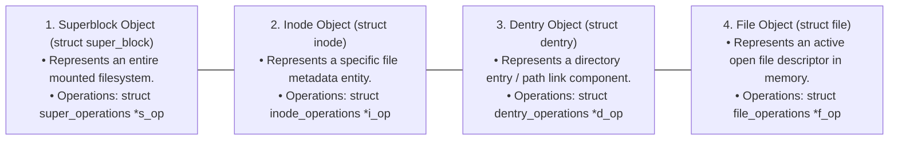
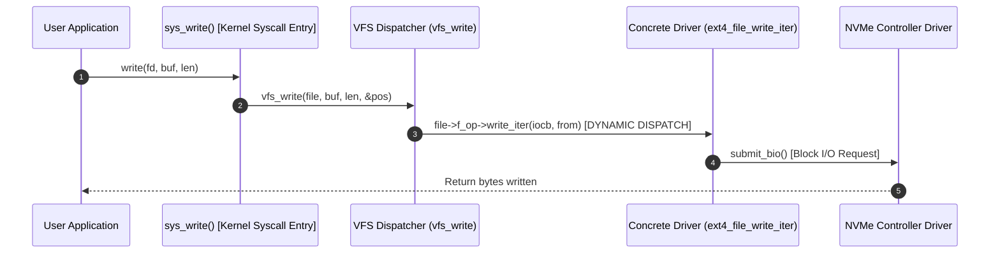
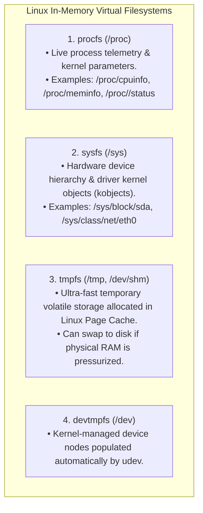

# Virtual File System (VFS)

> [!abstract] Mental Model
> The VFS is the **Universal Polymorphic Plug-and-Play Adapter of the Operating System**:
> - An application calls `read(fd, buf, 1024)`. It does not know—and should not care—whether `fd` points to an **ext4 NVMe drive**, an **XFS storage array**, an **NFS network share in Germany**, a **FAT32 USB stick**, or a virtual kernel telemetry file (**`/proc/cpuinfo`**).
> - The **Virtual File System (VFS)** is the kernel's object-oriented abstraction layer that translates uniform POSIX system calls into filesystem-specific drivers via **C function pointer dispatch tables**.

---

## VFS Architectural Placement



---

## The Four Primary VFS Object Types

The VFS implements an Object-Oriented design pattern in pure C (`include/linux/fs.h`) structured around four core objects:



---

## Polymorphic Dynamic Dispatching: `struct file_operations`

When an application calls `write(fd, buffer, count)`, the VFS resolves the open descriptor to its `struct file` and dispatches through its function table:

```c
// include/linux/fs.h
struct file_operations {
    loff_t (*llseek) (struct file *, loff_t, int);
    ssize_t (*read) (struct file *, char __user *, size_t, loff_t *);
    ssize_t (*write) (struct file *, const char __user *, size_t, loff_t *);
    int (*mmap) (struct file *, struct vm_area_struct *);
    int (*open) (struct inode *, struct file *);
    int (*fsync) (struct file *, loff_t, loff_t, int datasync);
    long (*unlocked_ioctl) (struct file *, unsigned int, unsigned long);
};
```



---

## Pseudo / Virtual Filesystems in VFS

Because VFS abstracts all I/O as files, the kernel exposes internal subsystem state through **Virtual Filesystems** that exist purely in RAM:



---

## Filesystem Registration and Mounting

1. **Registration**: When a kernel module (e.g. `ext4.ko`) loads, it calls:
   ```c
   register_filesystem(&ext4_fs_type);
   ```
2. **Mounting**: When `mount -t ext4 /dev/sdb1 /data` is executed:
   - VFS locates `ext4_fs_type` in the registered filesystem linked list.
   - Invokes `ext4_mount()` to read the on-disk superblock and instantiate the in-memory `struct super_block`.
   - Creates a `struct vfsmount` linking the target directory dentry (`/data`) to the child filesystem root dentry.

---

## Production Diagnostics & VFS Inspection

```bash
# 1. View all filesystem types currently supported and registered in kernel
cat /proc/filesystems

# Output:
# nodev sysfs
# nodev rootfs
# nodev ramfs
# nodev proc
# nodev tmpfs
#       ext4
#       xfs
#       btrfs

# 2. Inspect filesystem type and mount options for any file or directory
findmnt -T /var/log/syslog
# TARGET SOURCE    FSTYPE OPTIONS
# /      /dev/sda1 ext4   rw,relatime,errors=remount-ro

# 3. View global VFS open file allocation count
cat /proc/sys/fs/file-nr
```

---

## Active Recall & Interview Perspective

### Reasoning Prompts
1. *How does the VFS implement Object-Oriented polymorphism in C without class inheritance?*
   - **Answer**: The VFS uses structures containing **tables of function pointers** (such as `struct file_operations`, `struct inode_operations`, and `struct super_operations`). Each generic VFS object holds a pointer to its concrete filesystem operation table. When a system call like `read()` or `mkdir()` is executed, the VFS simply invokes `file->f_op->read(...)` or `dir->i_op->mkdir(...)`. Each filesystem driver (ext4, XFS, NFS) populates these function pointers with its own custom functions at initialization time, achieving classic runtime polymorphism.
2. *What is the difference between `struct inode_operations` and `struct file_operations`?*
   - **Answer**: **`struct inode_operations`** manages operations that manipulate the *metadata and directory namespace* of a file (e.g., `lookup()`, `create()`, `link()`, `unlink()`, `mkdir()`, `rename()`, `permission()`). **`struct file_operations`** manages operations performed on the *data stream and open instances* of a file (e.g., `read()`, `write()`, `llseek()`, `mmap()`, `fsync()`, `unlocked_ioctl()`).
3. *Why do files in `/proc` (e.g. `/proc/meminfo`) report a file size of 0 bytes in `ls -l`, yet return kilobytes of data when read with `cat`?*
   - **Answer**: `/proc` is a virtual in-memory filesystem (procfs) that has no physical disk backing. The files do not contain stored data blocks, so `struct inode->i_size` is initialized to `0`. When an application calls `read()` on `/proc/meminfo`, the VFS invokes procfs's custom `read()` handler, which dynamically interrogates kernel memory telemetry data structures in real-time, formats the output as ASCII text, and copies it directly into the user application buffer.

---

## Key Takeaways
- The **Virtual File System (VFS)** provides a uniform POSIX abstraction over heterogeneous local and network filesystems.
- The 4 core VFS objects are **Superblock**, **Inode**, **Dentry**, and **File**, each driven by C function pointer operation tables.
- **procfs**, **sysfs**, and **tmpfs** leverage VFS to expose kernel runtime telemetry as standard files.

---

## Related Notes
- [[Operating System]] — Storage subsystem architecture.
- [[System Calls]] — Standard I/O syscalls.
- [[File Concept and File Attributes]] — File abstraction.
- [[File Descriptors and File Tables]] — Open file objects (`struct file`).
- [[Directory Structures and Path Resolution]] — Dentry caching (`dcache`).
- [[Inodes and File System Metadata]] — Inode operations.
- [[Page Cache and Buffer Cache]] — In-memory caching engine.
- [[Operating Systems MOC]] — Master table of contents for Operating Systems.
