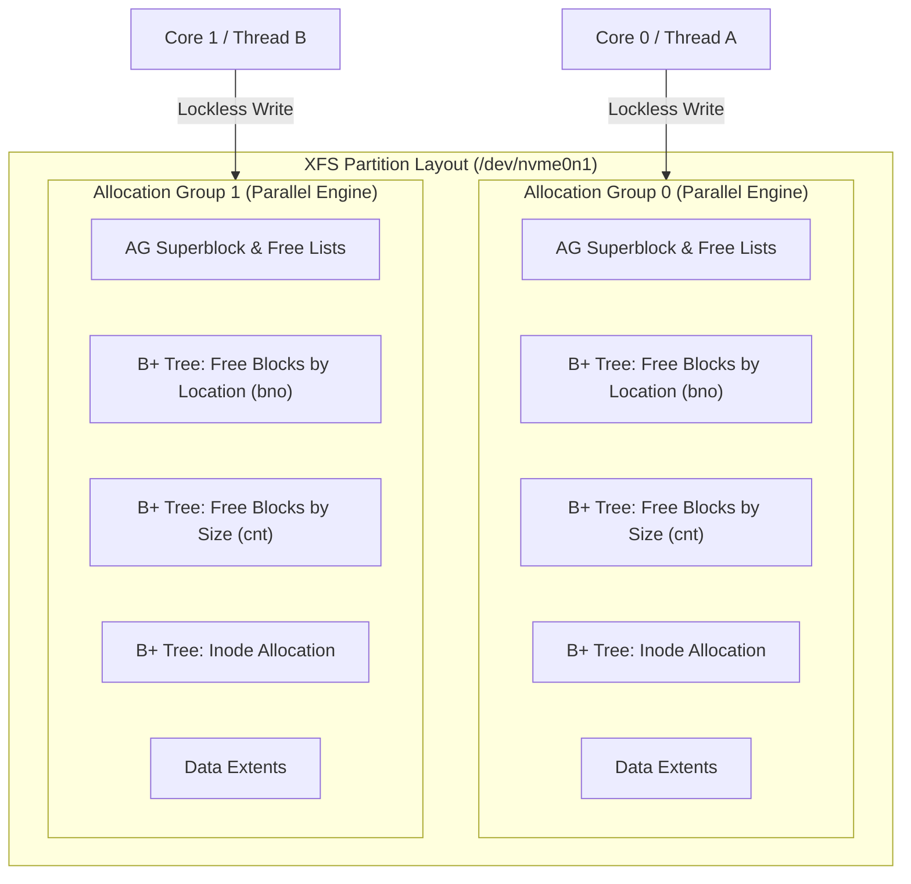
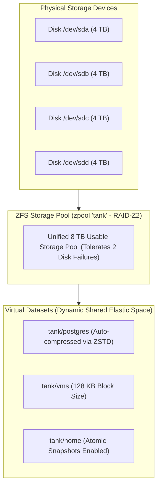
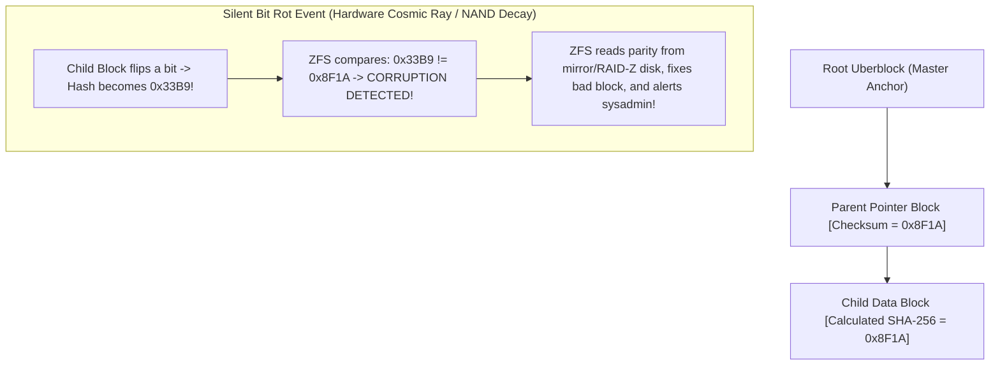
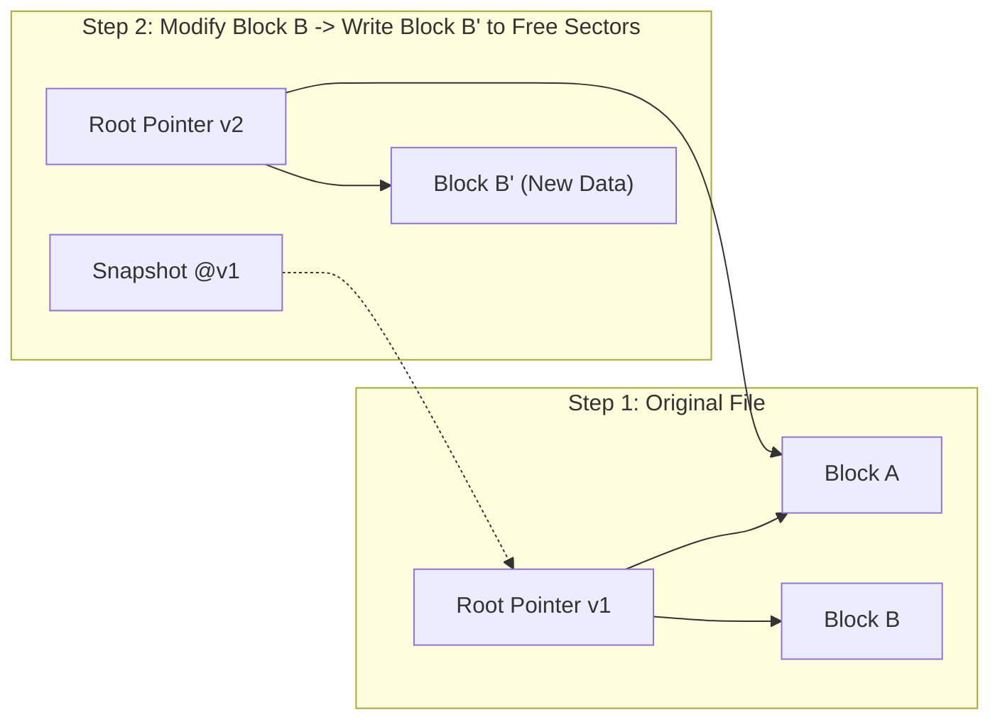
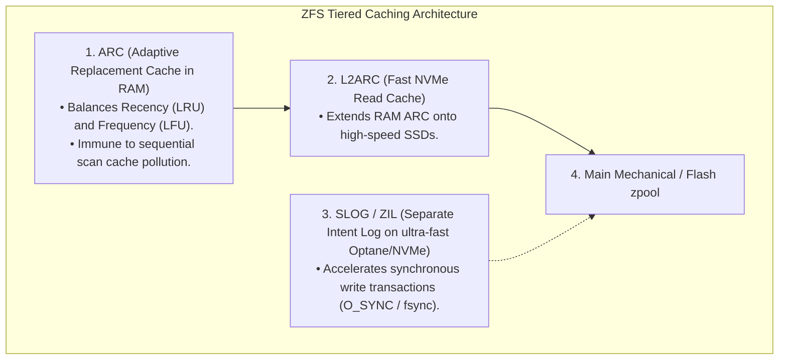

# XFS and ZFS Overview

> [!abstract] Mental Model
> - **XFS (The 128-Lane Industrial Superhighway)**: Created by Silicon Graphics (SGI) for massive media streaming and high-concurrency databases. It splits the disk into **Allocation Groups (AGs)**—independent parallel mini-filesystems—enabling hundreds of CPU cores to write simultaneously without lock contention.
> - **ZFS (The Self-Healing Fortress Citadel)**: Created by Sun Microsystems with a revolutionary philosophy: *“Volume managers and filesystems should never be separate layers.”* It combines pooled storage (**`zpools`**), pure **Copy-on-Write (CoW)** transactional writes, **Merkle Tree Cryptographic Checksumming** for automatic self-healing bit-rot repair, and **ARC (Adaptive Replacement Cache)**.

---

## Architectural Comparison Matrix

| Feature | ext4 | XFS | OpenZFS |
| :--- | :--- | :--- | :--- |
| **Primary Design Goal** | General-purpose Linux standard | Extreme parallel throughput & large files | Absolute data integrity & unified volume management |
| **Max Volume Size** | $1\text{ EiB}$ | $8\text{ EiB}$ | **$256\text{ ZiB}$** ($256\times 10^{21}\text{ B}$) |
| **Volume Model** | Partition-bound | Partition-bound | **Pooled Storage (`zpool` across all disks)** |
| **Concurrency Engine** | Global block group locking | **Allocation Groups (Lockless Parallel AGs)** | Transaction Groups (TXGs) |
| **Write Model** | In-place update + JBD2 Journal | In-place update + Metadata Journal | **Pure Copy-on-Write (CoW)** |
| **Bit-Rot Protection** | None (Relies on disk drive) | None (Metadata CRC32 only) | **Cryptographic Merkle Tree Self-Healing** |
| **RAM Cache** | Linux Page Cache | Linux Page Cache | **Adaptive Replacement Cache (ARC)** |
| **Native RAID** | No (Requires `mdadm`) | No (Requires `mdadm`) | **Native RAID-Z1, RAID-Z2, RAID-Z3** |

---

## 1. XFS Architecture: Allocation Groups (AGs)

To prevent lock contention on multi-core database servers (e.g. Red Hat Enterprise Linux / CentOS where XFS is default), XFS segments storage into **Allocation Groups (typically 4 to 64 AGs)**:



- **B+ Trees for Everything**: XFS replaces linear bitmaps with dual B+ Trees per AG, ensuring free block searches execute in $O(\log N)$ time regardless of volume size.
- **Online Growth**: XFS filesystems can be expanded live while mounted via `xfs_growfs`.

---

## 2. ZFS Architecture: Pooled Storage & Merkle Trees

### The Unified Storage Pool (`zpool`)
ZFS completely discards partition tables, volume managers (LVM), and software RAID (`mdadm`):



---

### End-to-End Cryptographic Merkle Tree Self-Healing:
Every parent block pointer contains the **cryptographic SHA-256 checksum** of its child block:



---

## ZFS Copy-on-Write (CoW) & Instant Snapshots

ZFS never overwrites data in-place; new writes are allocated to fresh empty sectors:



- **Atomic Snapshots**: Taking a snapshot (`zfs snapshot tank/db@12pm`) simply freezes the root pointer in memory. It takes **$< 1\text{ millisecond}$** and consumes **0 bytes of additional disk space**.

---

## In-Memory Caching: ZFS ARC vs Linux Page Cache



---

## Production Diagnostics & Storage Commands

```bash
# 1. Inspect XFS filesystem geometry and Allocation Groups
xfs_info /data
# isize=512    agcount=16, agsize=6553600 blks
# data         = bsize=4096   blocks=104857600, imaxpct=25
# log          = internal     bsize=4096   blocks=52172

# 2. Check ZFS Storage Pool Health and Parity Status
zpool status

# Output format:
#   pool: tank
#  state: ONLINE
#   scan: scrub repaired 0B in 02:14:05 with 0 errors on Sun Aug 18 04:00:00 2026
# config:
#         NAME        STATE     READ WRITE CKSUM
#         tank        ONLINE       0     0     0
#           raidz2-0  ONLINE       0     0     0
#             sda     ONLINE       0     0     0
#             sdb     ONLINE       0     0     0
#             sdc     ONLINE       0     0     0
#             sdd     ONLINE       0     0     0

# 3. Create zero-cost instantaneous snapshot in ZFS
zfs snapshot tank/data@backup_20260818
```

---

## Active Recall & Interview Perspective

### Reasoning Prompts
1. *How does XFS's Allocation Group (AG) architecture eliminate CPU lock contention compared to ext4?*
   - **Answer**: In ext4, certain metadata operations (such as resizing and journal locking) require coarse-grained synchronization across block groups. In XFS, the filesystem is partitioned into multiple **Allocation Groups (AGs)**, each functioning as a completely self-contained, independent mini-filesystem with its own separate B+ Trees for free space indexing and inode allocation. Multi-threaded processes running on 64-core or 128-core servers can perform simultaneous parallel allocations in different AGs with zero lock contention.
2. *Why does ZFS not require a journal or `fsck` utility?*
   - **Answer**: ZFS uses a pure **Copy-on-Write (CoW)** transactional model. It never modifies active on-disk data blocks in-place; instead, all modifications (data and metadata) are written to newly allocated empty disk sectors. Once all child blocks are safely written, the root **Uberblock** is atomically updated to point to the new tree version. Because the on-disk state transitions atomically from one valid state to another, the filesystem is never in an inconsistent half-written state, eliminating the need for a journal log or crash recovery `fsck` scan.
3. *What is "Silent Data Corruption" (Bit Rot) and how does ZFS prevent it while ext4 and XFS cannot?*
   - **Answer**: Silent Data Corruption occurs when disk hardware, cosmic rays, or controller firmware subtly flip bits on physical media without returning an I/O error to the OS. Traditional filesystems (ext4/XFS) read the corrupted sector and unknowingly return garbage data to the application. ZFS builds a **hierarchical Merkle Tree** where every parent pointer contains the cryptographic hash of its child block. Upon reading, ZFS recalculates the hash; if a mismatch occurs, it detects the corruption and uses redundant parity blocks (from RAID-Z or Mirrors) to **automatically repair the corrupted block on-the-fly**.

---

## Key Takeaways
- **XFS** scales to extreme parallel workloads and multi-terabyte files using **Allocation Groups (AGs)** and dual B+ Trees.
- **ZFS** merges volume management and filesystem layers into unified **`zpools`**, using **Copy-on-Write (CoW)** and **Merkle Tree Checksumming** for automated self-healing.
- **ZFS ARC** provides adaptive recency/frequency in-memory caching superior to simple LRU queues.

---

## Related Notes
- [[Operating System]] — Storage subsystem architecture.
- [[File Concept and File Attributes]] — File metadata.
- [[File Allocation Methods - Contiguous, Linked, Indexed]] — Allocation techniques.
- [[Inodes and File System Metadata]] — Metadata trees.
- [[Virtual File System - VFS]] — VFS integration.
- [[Journaling File Systems and Crash Consistency]] — Journaling vs Copy-on-Write.
- [[ext4 Architecture Overview]] — Linux standard filesystem.
- [[Operating Systems MOC]] — Master table of contents for Operating Systems.
