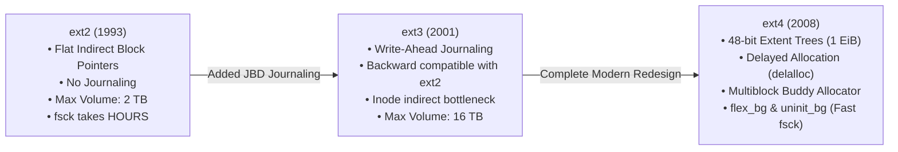
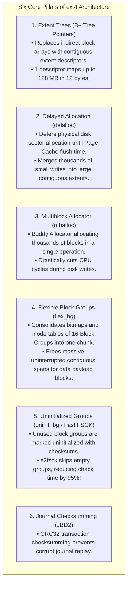
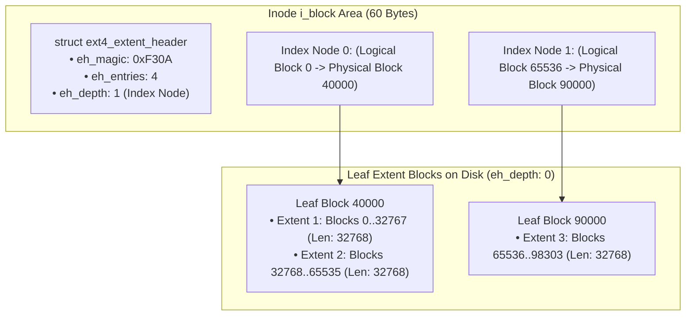
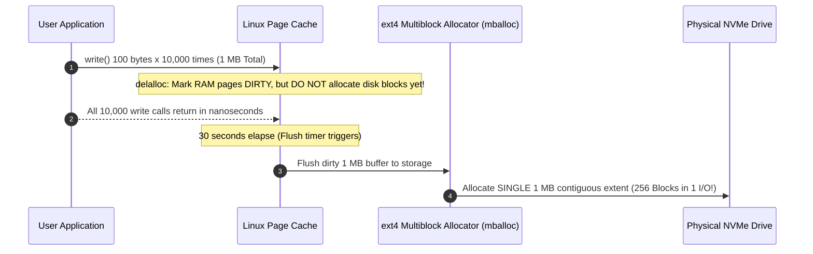
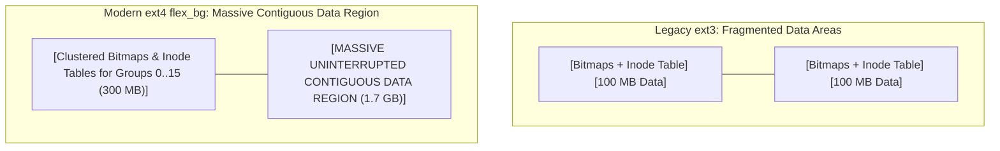

# ext4 Architecture Overview

> [!abstract] Mental Model
> ext4 is the **workhorse industrial shipping warehouse of Linux**:
> - Evolving from the venerable ext2 and ext3 filesystems, **ext4 (Fourth Extended Filesystem)** is the battle-tested, high-throughput default filesystem across enterprise Linux distributions.
> - It combines **48-bit physical block addressing** (supporting $1\text{ Exbibyte}$ volumes) with **Extent Trees**, **Delayed Allocation (`delalloc`)**, **Flexible Block Groups (`flex_bg`)**, and **Multiblock Buddy Allocation (`mballoc`)** to deliver exceptional sequential I/O and near-zero fragmentation.

---

## Architectural Evolution: ext2 vs ext3 vs ext4



---

## The Core Innovations of ext4



---

## Ext4 Extent Tree Hierarchy (`struct ext4_extent`)

For files larger than $512\text{ MB}$, ext4 builds an in-inode B+ Tree rooted in the 60-byte `i_block` field:



---

## Delayed Allocation (`delalloc`) Mechanics

How ext4 eliminates fragmentation during rapid append workloads:



---

## Flexible Block Groups (`flex_bg`)

In legacy ext3, every individual $128\text{ MB}$ Block Group had its metadata bitmaps and inode table placed at the start of its block range, fragmenting free data space every $128\text{ MB}$.

**`flex_bg`** combines multiple Block Groups (e.g. 16 groups = $2\text{ GB}$) and clusters all their metadata together:



---

## Production Diagnostics & Storage Inspection

```bash
# 1. Inspect ext4 Superblock Parameters & Enabled Features
sudo tune2fs -l /dev/nvme0n1p1

# Key Output:
# Filesystem volume name:   root
# Filesystem features:      has_journal ext_attr resize_inode dir_index filetype extent 64bit flex_bg uninit_bg
# Block size:               4096
# Blocks per group:         32768
# Flex block group size:    16

# 2. Dump Extent Tree for a specific file via debugfs
sudo debugfs -R 'extents <197204>' /dev/nvme0n1p1
# Level Entries Numbers        Range            Length
#  0/ 0   1/ 1   197204   0 - 32767: 8492032 - 8524799 (32768)

# 3. Check ext4 online fragmentation score
sudo e4defrag -c /var/log/syslog
# <Total extents> / <Total files> Fragmentation Score: [0/100] (0 = Zero fragmentation)
```

---

## Active Recall & Interview Perspective

### Reasoning Prompts
1. *How does Delayed Allocation (`delalloc`) in ext4 dramatically improve SSD lifespan and reduce disk fragmentation?*
   - **Answer**: Under traditional allocation (ext3), when an application writes data in small chunks (e.g. 50-byte logger writes), the filesystem immediately assigns physical disk blocks for each chunk, leading to scattered, non-contiguous disk blocks (severe fragmentation) and frequent metadata updates. With **Delayed Allocation**, ext4 buffers the writes in RAM and defers assigning physical disk sectors until the Page Cache flushes to disk. When flushing occurs, ext4 knows the total file size and assigns a single, massive, contiguous disk extent via `mballoc`, reducing write amplification and maximizing SSD sequential throughput.
2. *What is `flex_bg` in ext4 and what problem does it solve?*
   - **Answer**: In standard ext2/ext3, every $128\text{ MB}$ Block Group contains its own local Superblock backup, block bitmap, inode bitmap, and inode table at its starting sectors, creating an unmovable barrier of metadata every $128\text{ MB}$. **`flex_bg` (Flexible Block Groups)** bundles multiple block groups (e.g. 16 groups = $2\text{ GB}$) and clusters all their metadata into the first group, leaving the remaining groups completely free of metadata. This creates massive multi-gigabyte contiguous data regions, allowing massive files (such as database datafiles or VM disk images) to be stored without interruption.
3. *Why did `e2fsck` take hours on ext3 but completes in seconds on ext4?*
   - **Answer**: ext3 forced `fsck` to scan every single Inode entry in the Inode Table and every single bit in the block bitmaps across the entire multi-terabyte drive, regardless of whether those inodes or blocks were actually in use. ext4 introduced **`uninit_bg` (Uninitialized Block Groups)**: block groups that contain zero allocated inodes or data blocks are flagged as uninitialized in their group descriptor and sealed with a CRC16 checksum. During boot checks, `e2fsck` verifies the checksum and immediately skips scanning those empty block groups.

---

## Key Takeaways
- **ext4** scales Linux storage to $1\text{ EiB}$ volumes using **48-bit block addressing** and **Extent Trees**.
- **Delayed Allocation (`delalloc`)** and **Multiblock Allocator (`mballoc`)** minimize fragmentation by batching sector reservations.
- **`flex_bg`** clusters metadata to create multi-gigabyte uninterrupted data zones; **`uninit_bg`** accelerates `fsck` scans by $95\%$.

---

## Related Notes
- [[Operating System]] — Storage subsystem.
- [[File Concept and File Attributes]] — File metadata.
- [[File Allocation Methods - Contiguous, Linked, Indexed]] — Extent architectures.
- [[Inodes and File System Metadata]] — Ext4 inode structure.
- [[Virtual File System - VFS]] — VFS ext4 driver dispatch.
- [[Journaling File Systems and Crash Consistency]] — Ext4 JBD2 journaling.
- [[XFS and ZFS Overview]] — Comparison with next-generation enterprise filesystems.
- [[Operating Systems MOC]] — Master table of contents for Operating Systems.
