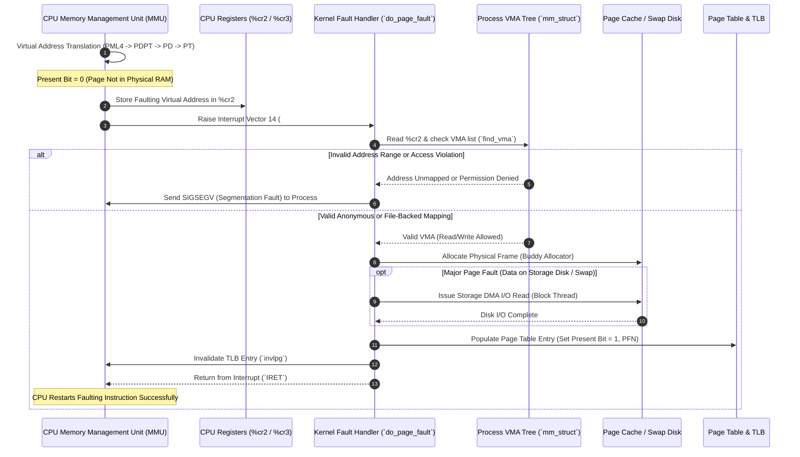
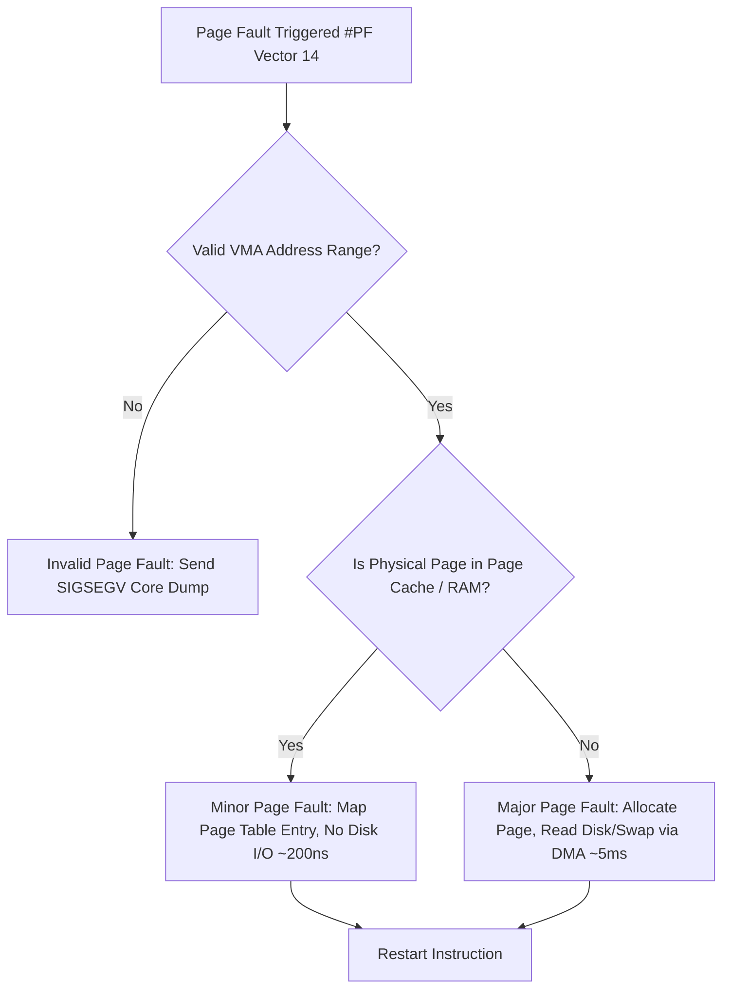
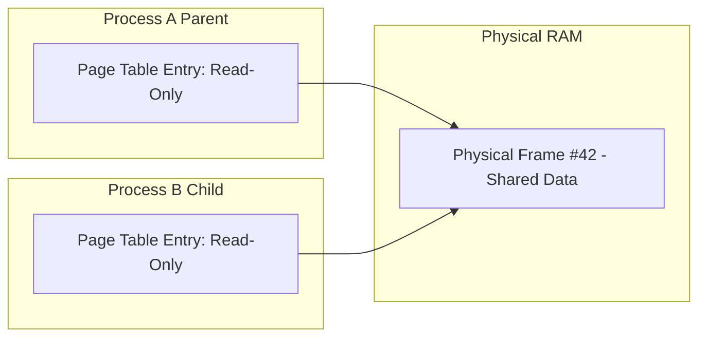

# What Happens During a Page Fault

> [!abstract] Mental Model
> A page fault occurs when an executing CPU instruction references a virtual memory address whose page table entry (PTE) is either not present in physical RAM (Present bit = 0) or lacks the required protection permissions (Read/Write/Execute). The Memory Management Unit (MMU) halts instruction execution, hardware-saves the faulting virtual address to the `%cr2` CPU register, generates Interrupt Vector 14 (`#PF`), and transfers control to the operating system kernel's page fault handler (`do_page_fault`) to resolve the memory mapping transparently or issue a `SIGSEGV` segmentation fault.

---

## 1. Page Fault Resolution Workflow



---

## 2. Classification of Page Faults

### Major vs Minor vs Invalid Page Faults



| Type | Cause | Disk I/O Required? | Typical Latency |
| :--- | :--- | :--- | :--- |
| **Minor Page Fault** | Page is in physical memory (e.g. shared library page, copy-on-write page, allocated zeroed page) but not mapped in current process page table. | No | ~200 nanoseconds |
| **Major Page Fault** | Page is not in physical memory; must be read from file storage (e.g., executable binary, `mmap` file) or fetched from swap partition. | Yes (DMA storage read) | ~1-10 milliseconds |
| **Invalid Page Fault** | Address falls outside valid Virtual Memory Areas (VMA) or violates access permissions (e.g., writing to read-only text segment). | No | N/A (Triggers `SIGSEGV`) |

---

## 3. Copy-on-Write (CoW) Handling Mechanics

When a process invokes `fork()`, parent and child processes share the same physical RAM pages marked as **Read-Only** in their respective page tables.



1. **Write Attempt**: Process B attempts to modify a CoW page: `MOV [0x7fff1000], 0x42`.
2. **Trap**: MMU detects write attempt on Read-Only page $\rightarrow$ triggers Page Fault.
3. **Handler Action**: `do_wp_page()` verifies page is marked CoW. It allocates a new physical frame (Frame #99), copies the 4KB data from Frame #42 to Frame #99, updates Process B's PTE to point to Frame #99 with Read-Write permissions, invalidates TLB, and resumes execution.

---

## 4. Linux Kernel Code Path & System Observability

### Kernel Execution Flow
```text
asm_exc_page_fault
  └─► exc_page_fault()
        └─► do_user_addr_fault()
              ├─► read_cr2()  [Extract faulting address]
              ├─► find_vma()  [Lookup virtual memory area]
              ├─► handle_mm_fault()
                    └─► __handle_mm_fault()
                          ├─► handle_pte_fault()
                                ├─► do_anonymous_page()  [Demand paging]
                                ├─► do_fault()           [File-backed mmap]
                                └─► do_swap_page()        [Swap file fetch]
```

### Inspecting Page Fault Statistics
```bash
# View process page fault counts (min_flt = minor, maj_flt = major)
ps -o pid,comm,min_flt,maj_flt -p <PID>

# Real-time page fault monitoring using perf
perf stat -e page-faults,minor-faults,major-faults -- ./my_application
```

---

## Failure Modes & Performance Bottlenecks

1. **Thrashing**: When system physical RAM is completely exhausted, the kernel continuously evicts pages to swap and reads them back via major page faults. Disk I/O queue saturates, CPU spends 99% of time in `iowait`, and application responsiveness collapses.
2. **Stack Overflow**: When a recursive function exhausts the allocated stack VMA size and attempts to access memory below the stack boundary, the page fault handler fails to expand the stack VMA, emitting `SIGSEGV`.

---

## Active Recall & Self-Assessment

1. **Question**: Which hardware register holds the faulting virtual address during a page fault on x86-64?
   - *Answer*: CPU register `%cr2` (Control Register 2).
2. **Question**: What is the key difference in latency between a Minor Page Fault and a Major Page Fault?
   - *Answer*: A minor page fault requires no disk I/O and resolves in ~200 nanoseconds, whereas a major page fault requires reading data from disk/SSD via DMA, incurring milliseconds of I/O blocking.
3. **Question**: How does Copy-on-Write (CoW) optimize process creation during `fork()`?
   - *Answer*: `fork()` duplicates only page table entries marked read-only instead of copying physical RAM memory. Memory frames are copied lazily only when a process attempts to write to a page.

---

## Related Notes
- [[Operating System|01 - Operating Systems]]
- [[Virtual Memory Architecture|Virtual Memory Architecture]]
- [[Page Tables and Multi-Level Page Tables|Page Tables]]
- [[Demand Paging and Page Faults|Demand Paging]]
- [[Translation Lookaside Buffer - TLB|TLB]]
- [[Copy-on-Write - CoW|Copy-on-Write]]
- [[Working Set Model and Thrashing|Thrashing]]
