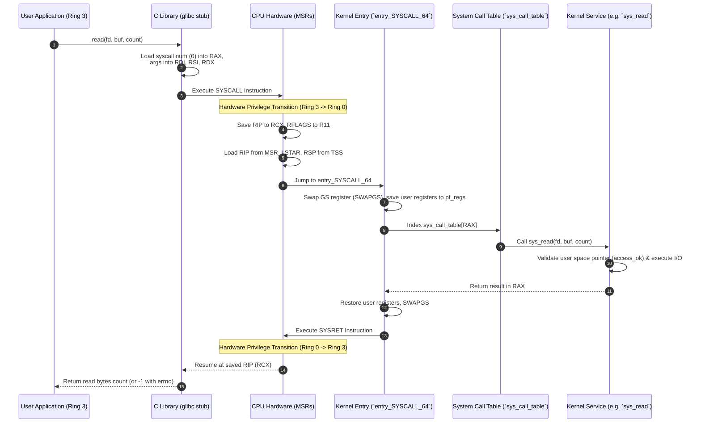

# What Happens During a System Call

> [!abstract] Mental Model
> A system call is the controlled, secure doorway through which a user-space application requests services from the privileged operating system kernel. It transitions execution from Ring 3 (User Mode) to Ring 0 (Kernel Mode) via specialized hardware assembly instructions (`SYSCALL` / `SYSRET` on x86-64), swapping stack pointers, validating memory buffers, saving CPU registers, indexing the System Call Table (`sys_call_table`), executing kernel logic, and returning results.

---

## 1. System Call Step-by-Step Execution Sequence



---

## 2. Low-Level Mechanics & x86-64 Architecture Details

### Hardware Registers & Model Specific Registers (MSRs)
On x86-64 Linux, system calls use the `SYSCALL` and `SYSRET` instructions, which rely on hardware Model Specific Registers (MSRs) configured at OS boot:
- **`IA32_LSTAR` (0xC0000082)**: Contains the 64-bit virtual memory address of the kernel entry point handler (`entry_SYSCALL_64`).
- **`IA32_STAR` (0xC0000081)**: Contains the target Ring 0 Code Segment (CS) selector and Ring 3 return CS selector.
- **`IA32_FMASK` (0xC0000084)**: Contains RFLAGS mask bits to clear during syscall entry (e.g. disabling hardware interrupts by clearing IF).

### Register Passing Conventions (x86-64 ABI)

| Parameter | User Register | Description |
| :--- | :--- | :--- |
| **Syscall Number** | `%rax` | Identifies specific syscall (e.g., `0` = read, `1` = write, `57` = fork) |
| **Argument 1** | `%rdi` | First parameter (e.g., file descriptor `fd`) |
| **Argument 2** | `%rsi` | Second parameter (e.g., pointer to memory buffer `buf`) |
| **Argument 3** | `%rdx` | Third parameter (e.g., buffer size `count`) |
| **Argument 4** | `%r10` | Fourth parameter (*Note*: `%rcx` is clobbered by CPU to store user `RIP`) |
| **Argument 5** | `%r8` | Fifth parameter |
| **Argument 6** | `%r9` | Sixth parameter |
| **Return Value** | `%rax` | Non-negative integer on success; negative error code (`-EFAULT`, `-EBADF`) on failure |

---

## 3. Kernel Memory Validation & Security Controls

```c
/* Simplified Linux Kernel sys_read implementation */
SYSCALL_DEFINE3(read, unsigned int, fd, char __user *, buf, size_t, count)
{
    struct fd f = fdget(fd);
    ssize_t ret = -EBADF;

    if (f.file) {
        loff_t pos = file_pos_read(f.file);
        // Security check: verify user buffer is in user space address bounds
        if (access_ok(buf, count)) {
            ret = vfs_read(f.file, buf, count, &pos);
            file_pos_write(f.file, pos);
        } else {
            ret = -EFAULT; // Invalid pointer (Segfault prevention)
        }
        fdput(f);
    }
    return ret;
}
```

---

## 4. Performance Implications & VDSO Optimization

### Virtual Dynamic Shared Object (vDSO)
Executing a full `SYSCALL` instruction incurs ~100-200 CPU cycles due to register saving, stack swapping, and cache invalidations.
For time-critical read-only system calls (e.g., `gettimeofday`, `clock_gettime`, `time`), Linux maps a kernel memory page (`[vdso]`) directly into user process space. The libc wrapper executes time queries entirely in Ring 3 without triggering a privilege context switch.

```mermaid
flowchart LR
    subgraph Ring 3 [User Mode (Ring 3)]
        App[Application] --> LibC[glibc clock_gettime]
        LibC --> VDSO{Is Syscall vDSO eligible?}
        VDSO -- Yes --> VDSO_Page[Read Shared Memory vdso Page]
        VDSO_Page --> ReturnTime[Return Time Instantly ~5ns]
    end
    subgraph Ring 0 [Kernel Mode (Ring 0)]
        VDSO -- No --> HardwareSyscall[Full SYSCALL Instruction Transition ~100ns]
    end
```

---

## Failure Modes & Security Vulnerabilities

1. **Meltdown / Spectre (Side-Channel Attacks)**: Kernel Page Table Isolation (KPTI) was introduced to unmap kernel memory from user page tables during Ring 3 execution, mitigating speculative execution memory leaks at the cost of additional TLB flushes on syscall entry/exit.
2. **Buffer Overflows / Malicious User Pointers**: If the kernel fails to call `access_ok()` or `copy_from_user()` / `copy_to_user()`, a rogue user app could pass a kernel address as `buf`, tricking the kernel into overwriting kernel data structures.

---

## Active Recall & Self-Assessment

1. **Question**: Why does x86-64 use `%r10` instead of `%rcx` for the 4th system call parameter?
   - *Answer*: The `SYSCALL` assembly instruction automatically overwrites `%rcx` with the user process's instruction pointer (`RIP`) so the kernel knows where to resume execution upon `SYSRET`.
2. **Question**: What is the function of the `SWAPGS` instruction during system call entry?
   - *Answer*: `SWAPGS` atomically swaps the user-mode `GS` segment register with the Kernel `GS` base MSR, giving the kernel immediate access to its per-CPU data structures and kernel stack pointer.
3. **Question**: How does vDSO improve application performance for `clock_gettime()`?
   - *Answer*: It maps a read-only page of kernel timing data into user space, allowing the C library to read timestamps in Ring 3 without paying the performance penalty of a kernel trap and context switch.

---

## Related Notes
- [[Operating System|01 - Operating Systems]]
- [[System Calls|System Calls]]
- [[User Mode vs Kernel Mode|User Mode vs Kernel Mode]]
- [[Privilege Rings and CPU Modes|Privilege Rings and CPU Modes]]
- [[Interrupts and Interrupt Handling|Interrupt Handling]]
- [[Process Control Block|Process Control Block]]
