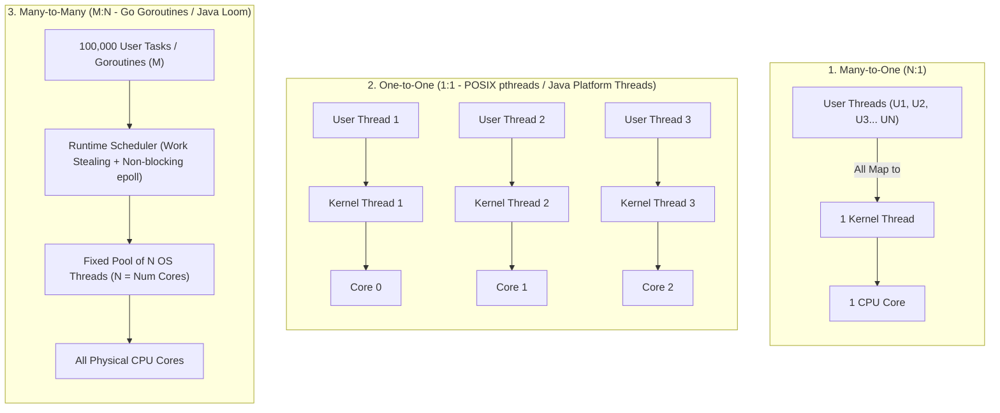
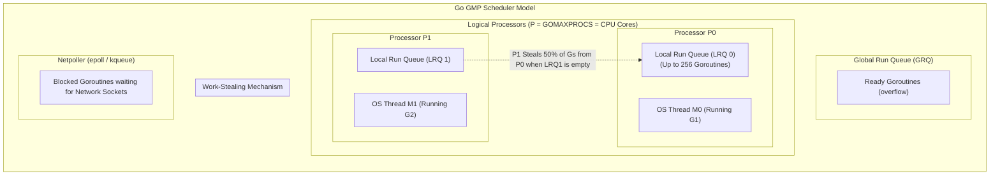
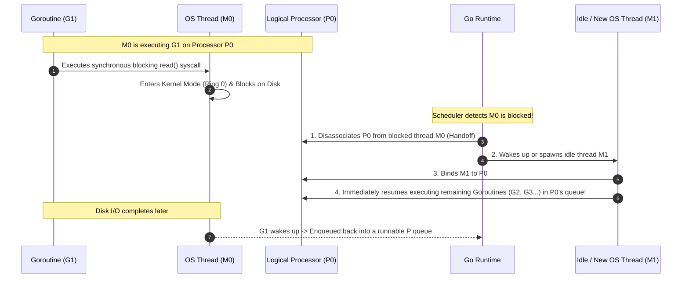

# Multithreading Models: 1:1, N:1, and M:N

> [!abstract] Mental Model
> Multithreading models define the **mathematical mapping ratio** between the application's user-space execution streams (Tasks, Coroutines, Virtual Threads) and the operating system's kernel dispatch units (OS Native Threads / `task_struct`).
> - **$N:1$ (Many-to-One)**: Many user threads share 1 OS thread (Fast, but no multi-core parallelism).
> - **$1:1$ (One-to-One)**: Every user thread is backed by 1 OS thread (True hardware parallelism, but high memory & context switch tax).
> - **$M:N$ (Many-to-Many)**: Millions of user green threads are dynamically multiplexed over a small pool of $N$ OS threads (The modern high-throughput standard).

---

## Architectural Comparison of Multithreading Models

---

## Exhaustive Mapping Comparison Matrix

| Dimension | Many-to-One ($N:1$) | One-to-One ($1:1$) | Many-to-Many ($M:N$) |
| :--- | :--- | :--- | :--- |
| **User : Kernel Ratio** | $N$ User Threads $\rightarrow 1$ OS Thread | $1$ User Thread $\rightarrow 1$ OS Thread | $M$ User Threads $\rightarrow N$ OS Threads ($M \gg N$) |
| **Multi-Core Parallelism**| **NO** (Locked to 1 Core) | **YES** (True hardware parallelism)| **YES** (Parallel across all $N$ cores) |
| **Blocking Syscall Impact**| **Fatal**: Freezes all $N$ user threads | **Safe**: Only the 1 calling thread blocks| **Safe**: Runtime detaches or uses non-blocking I/O |
| **Max Concurrent Units** | Millions (Limited only by heap) | ~5,000–20,000 (RAM/stack bound) | **Millions (1,000,000+)** |
| **Memory per Unit** | $\approx 2\text{ KB}$ | **$1\text{ MB} - 8\text{ MB}$** | **$\approx 2\text{ KB} - 4\text{ KB}$** (Dynamically sized) |
| **Context Switch Cost** | $< 20\text{ ns}$ (User Space only) | ~100–300 ns (Ring 0 mode switch) | $\approx 20\text{ ns}$ (User Space work stealing) |
| **Modern Canonical Use**| GNU Portable Threads, Python Greenlet | Linux NPTL, C++ `std::thread`, Rust | **Go (Goroutines), Java 21 (Loom), Erlang** |

---

## Deep Dive: The Go Runtime $M:N$ Scheduler (The GMP Model)

The Go programming language's runtime is the gold standard of modern $M:N$ scheduler engineering:

### The Three Core Entities of GMP:
1. **`G` (Goroutine)**: The lightweight user-space thread. Starts with a tiny **2 KB dynamic stack** that grows and shrinks in heap memory on demand.
2. **`M` (Machine / OS Thread)**: A native kernel thread created via `clone()`, scheduled by the OS kernel onto a physical CPU core.
3. **`P` (Processor)**: A logical execution context representing a resource token needed to execute Go code. The number of `P` instances is fixed to `GOMAXPROCS` (default: number of logical CPU cores).

---

## Advanced $M:N$ Mechanics: Work Stealing & Syscall Handling

### 1. The Work-Stealing Algorithm
To eliminate lock contention on a global queue, each Logical Processor `P` maintains its own lock-free **Local Run Queue (LRQ)** holding up to 256 Goroutines:
1. An OS Thread `M` pulls runnable `G` tasks from its local `P` queue without taking global locks.
2. If `P`'s local queue is empty:
   - It checks the Global Run Queue.
   - It checks the Network Poller (`epoll`).
   - If still empty, it **steals 50% of the runnable Goroutines from another processor's local queue**! This guarantees optimal multi-core load balancing with zero core starvation.

---

### 2. Handling Blocking System Calls (Handoff Mechanism)

What happens when a Goroutine must execute a synchronous, blocking syscall (e.g., reading a local file from disk)?

---

## Active Recall & Interview Perspective

### Reasoning Prompts
1. *Why does the $1:1$ multithreading model fail when scaling to 100,000 concurrent network connections (the C100K problem)?*
   - **Answer**: In a $1:1$ model, 100,000 concurrent connections require 100,000 OS kernel threads. With a minimum stack size of 1 MB per thread plus 32 KB kernel `task_struct` overhead, the server requires over **100 GB of RAM** just for stack allocations before processing any data. Furthermore, juggling 100,000 OS threads across 16 CPU cores triggers catastrophic **context switch thrashing**, consuming 80%+ of CPU cycles in kernel scheduling rather than application logic.
2. *How does the Go runtime's Netpoller eliminate OS thread blocking on network operations?*
   - **Answer**: When a Goroutine calls `net.Conn.Read()`, the runtime sets the underlying socket to non-blocking mode (`O_NONBLOCK`) and registers the file descriptor with the OS kernel's I/O event notification engine (`epoll` on Linux, `kqueue` on macOS). The runtime parks the Goroutine in the **Netpoller** queue and immediately assigns the active OS thread (`M`) to run another Goroutine. When the kernel signals that socket data is ready, the Netpoller wakes the Goroutine and places it back into a ready queue.
3. *What is the difference between Cooperative and Preemptive scheduling in user-level thread runtimes?*
   - **Answer**: In cooperative scheduling, a user thread runs indefinitely until it explicitly yields CPU control (e.g., via `yield()` or I/O). If a thread enters a tight compute loop (`for {}`), it monopolizes the OS thread forever. In preemptive runtimes (like Go 1.14+), a background monitor thread (`sysmon`) tracks execution times; if a Goroutine runs for $>10\text{ ms}$ without yielding, the runtime sends a POSIX signal (`SIGURG`) to the OS thread, forcing the Goroutine to pause and yield execution.

---

## Key Takeaways
- **$N:1$** is fast but lacks multi-core parallelism; **$1:1$** provides true hardware parallelism but is memory-heavy; **$M:N$** combines the speed of green threads with multi-core hardware scaling.
- Modern $M:N$ engines (Go, Java Loom) use **Work-Stealing schedulers** and **Non-Blocking I/O (`epoll`)** to run millions of concurrent tasks on a tiny fixed pool of native OS threads.

---

## Related Notes
- [[Operating System]] — Resource virtualization.
- [[Thread]] — Core thread data structures.
- [[Process vs Thread]] — Architecture comparisons.
- [[User-Level Threads vs Kernel Threads]] — Fundamental mechanics of green vs OS threads.
- [[Thread Pools and Worker Queues]] — Managing OS thread capacities.
- [[CPU Scheduler and Dispatcher]] — Kernel scheduling algorithms.
- [[Operating Systems MOC]] — Master table of contents for Operating Systems.
