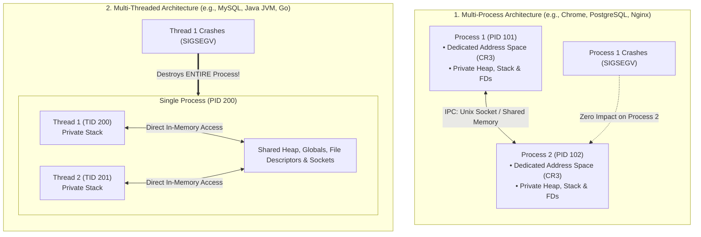
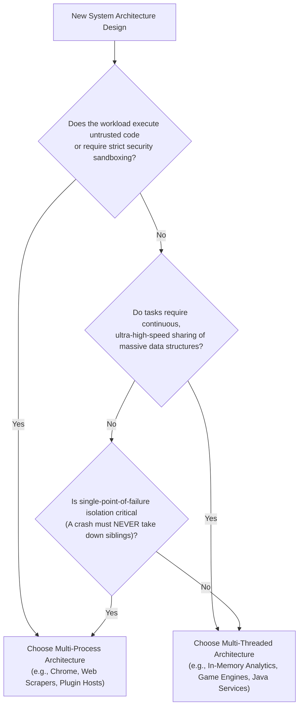

# Process vs Thread

> [!abstract] Mental Model
> The decision between Processes and Threads is the classic systems trade-off between **Isolation** and **Efficiency**:
> - **Processes** are **isolated nations**: each has its own guarded borders (Virtual Address Space), currency, and laws. If one nation suffers a catastrophe, adjacent nations are completely unharmed, but trade (IPC) requires passing through border customs checkpoints.
> - **Threads** are **coworkers in the same open-plan office**: they share all office supplies, whiteboard notes, and coffee (Shared Heap and Globals) with zero trade latency, but if one coworker spills hazardous chemicals (a memory corruption or `SIGSEGV`), the entire office is evacuated immediately.

---

## Architectural Comparison: Process vs Thread

---

## Exhaustive Dimension-by-Dimension Matrix

| Dimension | Process | Thread |
| :--- | :--- | :--- |
| **Definition** | An independent executing program instance with dedicated system resources. | The smallest unit of CPU dispatching within a parent process. |
| **Address Space** | **Isolated**: Has its own independent page table and 128 TB virtual address space. | **Shared**: All threads share the exact same virtual address space (`mm_struct`). |
| **Creation Cost** | **Heavy**: Must allocate PCB, `mm_struct`, page table entries, and duplicate file tables (~1–2 ms). | **Lightweight**: Allocates a small stack and register state (~50–100 $\mu\text{s}$; **$10\times$–$20\times$ faster**). |
| **Context Switch Overhead** | **Heavy (~1–5 $\mu\text{s}$)**: Reloads `CR3`, invalidates/pollutes CPU TLB cache, evicts L1/L2 cache lines. | **Lightweight (~100–300 ns)**: `CR3` is untouched; TLB remains valid; minor cache displacement. |
| **Inter-Unit Communication** | **Slow**: Requires IPC (Pipes, Sockets, or Shared Memory + IPC sync). | **Ultra-Fast**: Direct reading/writing of shared heap variables and pointers at DRAM speeds. |
| **Failure Blast Radius** | **Isolated**: If Process A crashes (`SIGSEGV`), Process B continues running unharmed. | **Fatal**: If Thread A crashes (`SIGSEGV`), the **entire process and all other threads die immediately**. |
| **Security & Sandboxing** | **High**: Can be sandboxed with `seccomp`, namespaces, and OS permissions (`chroot`). | **None**: Any thread can inspect or overwrite any memory location belonging to another thread. |
| **Scaling Capability** | Can scale across **Multiple CPU Cores AND Multiple Physical Machines (Distributed)**. | Strictly confined to a **Single Physical Host / Shared RAM**. |

---

## Production Case Studies: Industrial Architectural Choices

### 1. Why Google Chrome Uses Multi-Process Architecture
In the early web, browsers were single-process multi-threaded applications. If a single tab executed malformed JavaScript or crashed a flash plugin, the entire browser with all 30 open tabs vanished.
- **Chrome's Architecture**: Each browser tab, extension, and GPU renderer is an independent **Process**:
  - **Fault Isolation**: A crash in Tab 1 leaves Tab 2 and the browser frame completely unaffected.
  - **Sandboxing**: Renderer processes run in a heavily restricted `seccomp` sandbox with zero file system or direct network access, communicating with the Master Browser process via IPC.

### 2. Why PostgreSQL Uses Multi-Process vs MySQL Multi-Threading
- **PostgreSQL (Multi-Process)**: Forks a dedicated backend process for every client connection. Connections share memory via **Shared Buffers (`shm`)**. If a client query triggers a memory bug in a third-party C extension, only that client connection dies; the main database remains fully operational.
- **MySQL / InnoDB (Multi-Threaded)**: Spawns a lightweight thread per connection. Threads share the single `innodb_buffer_pool` directly with zero IPC overhead, achieving higher query throughput on low-memory servers, but a single segmentation fault kills the entire database server.

---

## Architectural Decision Framework: When to Choose Which?

---

## Active Recall & Interview Perspective

### Reasoning Prompts
1. *Why are threads called "Lightweight Processes" (LWPs)?*
   - **Answer**: In the Linux kernel, both processes and threads are represented identically by `struct task_struct` and scheduled by the same CFS scheduler. A thread is simply a "lightweight" task because its `clone()` invocation set the `CLONE_VM`, `CLONE_FS`, and `CLONE_FILES` flags, allowing it to borrow its parent's existing virtual address space and file tables rather than allocating new ones.
2. *Why is it easier to write bug-free multi-process code than multi-threaded code?*
   - **Answer**: Memory isolation. In a multi-process model, processes cannot accidentally mutate each other's memory, eliminating entire categories of concurrency bugs such as **data races, race conditions, torn reads, and memory corruption**. Data exchange is explicit across defined IPC boundaries. In multi-threading, all memory is implicitly shared, requiring disciplined locking to prevent race conditions and deadlocks.
3. *Can a multi-threaded application scale across multiple physical server nodes?*
   - **Answer**: No. Threads rely fundamentally on shared physical RAM and hardware memory bus access. To scale across multiple physical servers, an application must use a **Multi-Process / Distributed Architecture**, communicating over network protocols (TCP/UDP, gRPC, REST, Message Queues).

---

## Key Takeaways
- **Processes** provide strict hardware memory isolation and fault containment at the cost of higher context-switch and IPC overhead.
- **Threads** provide ultra-fast shared-memory concurrency and lightweight context switching at the cost of shared failure risk and complex synchronization requirements.
- Enterprise systems choose architectures based on the trade-off: **Chrome & PostgreSQL favor Process Isolation; MySQL & Java favor Thread Efficiency**.

---

## Related Notes
- [[Operating System]] — Resource allocation models.
- [[Program vs Process]] — Process creation and execution boundaries.
- [[Process Address Space]] — Virtual address space isolation.
- [[Process Control Block]] — `task_struct` representation.
- [[Thread]] — Dedicated thread memory models and TLS.
- [[User-Level Threads vs Kernel Threads]] — Green threads vs OS threads.
- [[Context Switching]] — Quantitative cost analysis of process vs thread switching.
- [[Inter-Process Communication - IPC]] — Cross-process data bridges.
- [[Operating Systems MOC]] — Master table of contents for Operating Systems.
