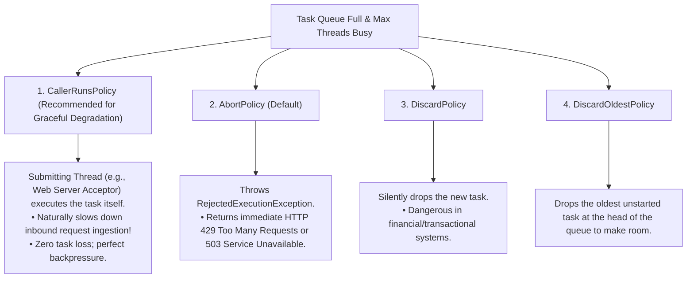

# Thread Pools and Worker Queues

> [!abstract] Mental Model
> Spawning a new OS thread for every incoming HTTP request is like **hiring and firing a new full-time employee for every individual customer who walks into a store**. A **Thread Pool** maintains a pre-allocated, warm team of permanent worker threads sleeping on a shared task queue. When work arrives, an idle worker wakes up, executes the task, and returns to the queue—eliminating thread creation latency, bounding RAM consumption, and preventing [[Context Switching|Context Switch Thrashing]].

---

## Why Thread Pools Are Mandatory in Production

Without thread pooling (the naive "Thread-Per-Request" model):
1. **Thread Creation Latency**: Calling `pthread_create()` or `new Thread()` requires a `clone()` system call, allocating a $1\text{ MB}$ stack, and kernel PCB creation (~50–100 $\mu\text{s}$ per request).
2. **Out of Memory (OOM) Crashes**: 20,000 concurrent requests trigger 20,000 OS threads $\rightarrow$ **20 GB of RAM allocated to thread stacks alone**, crashing the server.
3. **Context Switch Collapse**: When thousands of threads compete for 16 CPU cores, the kernel spends 80%+ of its time performing involuntary context switches instead of executing application code.

A Thread Pool acts as a **critical concurrency limiter and backpressure valve**.

---

## Core Architecture of a Production Thread Pool

```mermaid
graph TB
    subgraph ClientLayer ["Client / Request Layer"]
        R1["Request 1"]
        R2["Request 2"]
        R3["Request 3"]
    end

    subgraph ThreadPool ["Production Thread Pool (ThreadPoolExecutor)"]
        direction TB
        
        Queue["Bounded Blocking Task Queue (Capacity: 1000)<br/>• LinkedBlockingQueue / ArrayBlockingQueue"]
        
        subgraph Workers ["Worker Thread Pool (Fixed / Dynamic)"]
            direction LR
            W1["Worker Thread 1 (Core)"]
            W2["Worker Thread 2 (Core)"]
            W3["Worker Thread 3 (Core)"]
            W4["Worker Thread 4 (Max)"]
        end

        Rejection["Rejection Handler (Backpressure Policy)<br/>• CallerRunsPolicy / AbortPolicy / DiscardOldest"]
    end

    R1 -->|submit(task)| Queue
    R2 -->|submit(task)| Queue
    R3 -->|submit(task)| Queue
    
    Queue -->|Pulls Task| W1
    Queue -->|Pulls Task| W2
    Queue -->|Pulls Task| W3
    Queue -->|Pulls Task| W4
    
    Queue -.->|Queue Full & Workers at Max| Rejection
```

---

## The Mathematical Formulas for Thread Pool Sizing

One of the most frequent senior engineering interview questions: *"How many threads should you configure in your thread pool?"*

### 1. CPU-Bound Workloads (Compression, Cryptography, JSON parsing, ML inference)
In compute-intensive tasks, threads are actively burning CPU cycles with zero I/O wait:

$$\mathbf{N_{\text{threads}} = N_{\text{CPU}} + 1}$$

- $N_{\text{CPU}}$: Number of logical CPU cores.
- The **$+1$ extra thread** provides a spare worker to immediately utilize the core if an active thread experiences an occasional page fault or OS context preemption.
- *Configuring 100 threads for a CPU-bound task on an 8-core CPU will only degrade performance through context-switch cache pollution.*

---

### 2. I/O-Bound Workloads (Database queries, REST/gRPC microservice calls, Disk reads)
In I/O-heavy services, threads spend 90%+ of their lifecycle blocked waiting for external responses:

$$\mathbf{N_{\text{threads}} = N_{\text{CPU}} \times \left(1 + \frac{W}{C}\right)}$$

- **$W$ (Wait Time)**: Time spent blocked on I/O (e.g., waiting for PostgreSQL query response).
- **$C$ (Compute Time)**: Time spent actively computing on the CPU (e.g., parsing the SQL result set).

#### Realistic Production Example:
- Server has **16 CPU Cores**.
- Profiling shows average database query wait time $W = 90\text{ ms}$.
- Average CPU processing time per request $C = 10\text{ ms}$.
$$\frac{W}{C} = \frac{90}{10} = 9$$
$$\text{Optimal Thread Pool Size} = 16 \times (1 + 9) = \mathbf{160\text{ Threads}}$$

---

### 3. Little's Law for Queue Sizing & Capacity Planning

$$\mathbf{L = \lambda \times W}$$

- $L$: Average number of concurrent requests in the system.
- $\lambda$: Inbound request arrival rate (Requests Per Second - RPS).
- $W$: Average request latency (seconds).

*Example*: If your API receives **2,000 RPS** and the p99 response time is **50 ms (0.05 s)**, your service must be capable of holding $2000 \times 0.05 = \mathbf{100\text{ concurrent in-flight tasks}}$ across your active threads and queue buffer.

---

## Production Rejection Policies (Backpressure Handling)

When the task queue is full and all maximum worker threads are busy, how should the thread pool handle subsequent tasks?



> [!important] The Power of `CallerRunsPolicy`
> Under extreme traffic spikes, `CallerRunsPolicy` forces the web server's listening/acceptor thread to execute the incoming request itself. While doing so, the listener cannot accept new TCP connections, causing the OS TCP listen backlog queue to fill up and forcing clients to back off. This provides **automatic, self-throttling backpressure**.

---

## Advanced Architecture: Work-Stealing Pools (ForkJoinPool)

In traditional thread pools, all worker threads compete for tasks from a single central queue, creating **severe lock contention** on high-core servers (64+ cores).

**Work-Stealing Pools** (used in Java's `ForkJoinPool`, Go's GMP scheduler, and Rust's `Tokio` runtime) solve this with decentralized queues:

```text
Work-Stealing Deque Architecture:
+-------------------------------------------------------------------------------+
| Worker Thread 1 (Core 0)        | Worker Thread 2 (Core 1 - IDLE)            |
| Local Deque: [T1, T2, T3, T4]   | Local Deque: [EMPTY]                       |
|   | (Pushes/Pops from TAIL)     |   |                                        |
|   v                             |   v (STEALS from HEAD of Worker 1's Deque!)|
| Executes Task 4 (LIFO Cache Hot)| Executes Task 1 (FIFO Fairness)            |
+-------------------------------------------------------------------------------+
```

- Each worker thread maintains its own **Double-Ended Queue (Deque)**.
- A worker pushes and pops subtasks from the **tail** of its own deque in LIFO order (maximizing L1/L2 CPU cache locality).
- When a worker runs out of work, it **steals a task from the head** of another worker's deque in FIFO order.

---

## Fatal Production Failure Modes

| Failure Mode | Root Cause | Symptoms | Mitigation |
| :--- | :--- | :--- | :--- |
| **Unbounded Queue Memory Leak** | Using an unbounded queue (`new LinkedBlockingQueue()`) with slow workers. | Tasks buffer infinitely during a spike; JVM/Node heap reaches 100% $\rightarrow$ **Crash with `OutOfMemoryError`**. | **Always use Bounded Queues** (e.g., capacity 1,000) with a defined rejection policy. |
| **Thread Pool Self-Deadlock** | Tasks executing inside the thread pool submit sub-tasks to the *same* pool and synchronously wait for their completion (`future.get()`). | All worker threads block waiting for sub-tasks that are stuck in the queue $\rightarrow$ **Total System Freeze**. | Use separate thread pools for parent tasks and child tasks, or use a Work-Stealing pool. |
| **Thread Leak via Unhandled Exception** | A task throws an unhandled `RuntimeException` inside `run()`, causing the worker thread to die without replacement. | Active worker thread count drops to zero; processing stops permanently. | Wrap task execution in `try / catch(Throwable t)` and log exceptions. |

---

## Production Diagnostics & Observability Commands

```bash
# 1. Inspect live thread pool metrics in Java via JMX / jcmd
jcmd <PID> Thread.print | grep "java.lang.Thread.State" | sort | uniq -c

# 2. Monitor thread count and context switch rates for a backend service
pidstat -w -t -p <PID> 1

# 3. Key Metrics to Export to Prometheus / Datadog:
#   - threadpool.active.threads (Current workers running tasks)
#   - threadpool.queue.depth   (Tasks waiting in queue - Alarm if > 80% capacity)
#   - threadpool.rejected.count (Total tasks rejected by backpressure policy)
```

---

## Active Recall & Interview Perspective

### Reasoning Prompts
1. *Why is an unbounded task queue dangerous in a production backend service?*
   - **Answer**: An unbounded queue (like `LinkedBlockingQueue` with default `Integer.MAX_VALUE` capacity) can accept millions of tasks when incoming request rates exceed processing capacity. Because the queue never fills up, the thread pool will never scale up its workers beyond the core pool size, and it will never trigger backpressure rejection policies. Inbound tasks accumulate in heap memory until the process exhausts physical RAM, causing the operating system or runtime to crash with an unrecoverable Out of Memory (OOM) error.
2. *Why is `CallerRunsPolicy` considered the most resilient backpressure mechanism for web APIs?*
   - **Answer**: When the thread pool queue is saturated, `CallerRunsPolicy` executes the submitted task on the thread that called `submit()` (such as the HTTP acceptor thread). Because the acceptor thread is busy processing a business task, it stops pulling new connections off the OS socket backlog. This propagates natural backpressure upstream to the client or load balancer, preventing the server from collapsing under load without dropping in-flight data.
3. *How does a Work-Stealing thread pool minimize lock contention compared to a traditional fixed thread pool?*
   - **Answer**: Traditional thread pools use a single shared blocking queue that all worker threads lock on every task fetch, creating severe lock contention on high-core CPUs. A work-stealing pool assigns a dedicated double-ended queue (deque) to each worker thread. Workers access their own deque lock-free from the tail; they only acquire a lock when stealing work from the head of a remote worker's deque when their own queue is completely empty.

---

## Key Takeaways
- **Thread Pools** eliminate thread creation latency, enforce concurrency limits, and prevent context-switch thrashing.
- Size pools mathematically: **$N_{\text{CPU}} + 1$** for CPU-bound tasks; **$N_{\text{CPU}} \times (1 + W/C)$** for I/O-bound tasks.
- Always use **Bounded Task Queues** and resilient backpressure policies (**`CallerRunsPolicy`**) to prevent heap memory exhaustion.

---

## Related Notes
- [[Operating System]] — CPU and memory resource management.
- [[Thread]] — Core thread data structures.
- [[Process vs Thread]] — Context switch cost trade-offs.
- [[Multithreading Models - 1-1, N-1, M-N|Multithreading Models - 1:1, N:1, M:N]] — Mapping green threads to thread pools.
- [[Thread Safety and Reentrancy]] — Synchronizing shared resources inside worker threads.
- [[CPU Scheduler and Dispatcher]] — Kernel thread scheduling.
- [[Operating Systems MOC]] — Master table of contents for Operating Systems.
