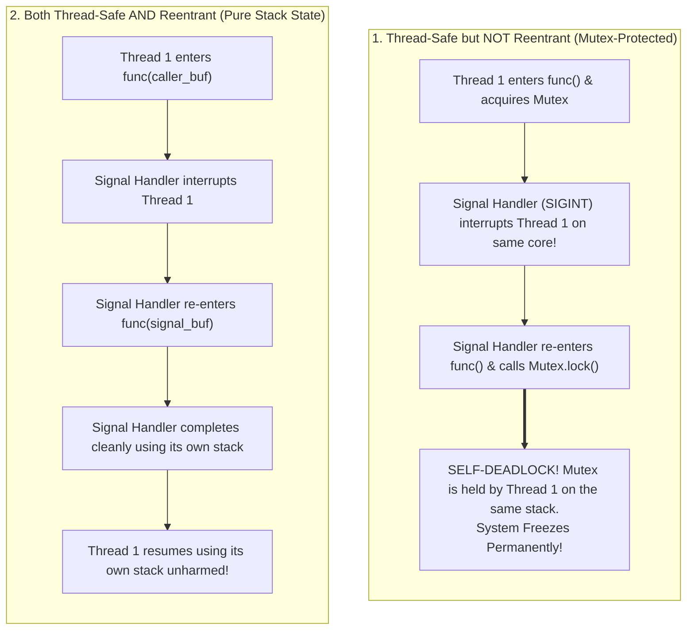
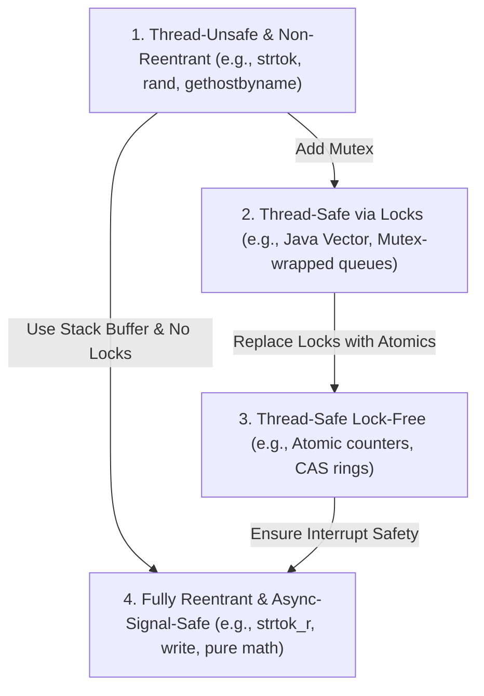

# Thread Safety and Reentrancy

> [!abstract] Mental Model
> - **Thread Safety** guarantees that a function can be **called simultaneously by multiple CPU threads** without causing data races, memory corruption, or inconsistent state.
> - **Reentrancy** is a **much stricter mathematical property**: a function is reentrant if its execution can be **interrupted halfway through** (by a hardware interrupt, OS signal handler, or recursive call), re-entered and executed from scratch by the interrupting handler, and then safely resumed from the exact point of interruption without any state corruption.
> - *The Golden Rule*: **All reentrant functions are thread-safe (when operating on distinct caller state), but NOT all thread-safe functions are reentrant!**

---

## Architectural Comparison: Thread-Safe vs Reentrant



---

## The Four Levels of Concurrency Safety



---

## What Makes a Function Reentrant?

A function is guaranteed to be reentrant if and only if it adheres to these strict rules:
1. **Zero Static or Global Mutable State**: It holds no `static` variables, global variables, or singleton memory.
2. **Zero Internal Pointer Returns**: It never returns a pointer to internal static buffers (e.g., `strtok()`).
3. **Caller-Owned Buffers**: All state and scratch memory is passed in explicitly by the caller on the **call stack** (e.g., `strtok_r()`).
4. **Zero Non-Recursive Locks**: It never acquires a `pthread_mutex_t`, spinlock, or semaphore (which would self-deadlock if interrupted).
5. **Calls Only Other Reentrant Functions**: Calling even a single non-reentrant function (like `malloc()`) renders the entire caller non-reentrant.

---

## Canonical POSIX Comparison: Unsafe vs Reentrant (`_r`)

POSIX systems suffix reentrant versions of legacy C standard library functions with **`_r`**:

| Legacy Non-Reentrant Function | Modern Reentrant Replacement | Fatal Flaw in Legacy Function |
| :--- | :--- | :--- |
| `char *strtok(char *str, const char *delim)` | `char *strtok_r(char *str, const char *delim, char **saveptr)` | Stores string parsing position in an **internal `static` pointer**, causing concurrent callers to corrupt each other's tokens. |
| `int rand(void)` | `int rand_r(unsigned int *seedp)` | Mutates a hidden global seed variable across all threads. |
| `struct tm *localtime(const time_t *timep)` | `struct tm *localtime_r(const time_t *timep, struct tm *result)` | Overwrites a single **static global `struct tm` buffer**; concurrent calls return corrupted dates. |
| `char *asctime(const struct tm *tm)` | `char *asctime_r(const struct tm *tm, char *buf)` | Returns a pointer to a shared static 26-byte ASCII array. |
| `struct hostent *gethostbyname(const char *name)` | `int getaddrinfo(...)` | Uses static DNS resolution buffers. |

---

## Why `malloc()` and `printf()` Cause Deadlocks in Signal Handlers

A classic production crash in C/C++ backend daemons:

```c
// DANGEROUS ANTI-PATTERN: Never call printf or malloc in a signal handler!
void sigint_handler(int signo) {
    printf("Caught signal %d!\n", signo); // CRASH HAZARD / DEADLOCK!
}
```

### The Root Cause:
1. `printf()` and `malloc()` use internal **thread-safe mutexes** (e.g., standard I/O buffer lock, glibc arena heap locks).
2. Suppose Thread 1 calls `malloc(1024)`. It acquires the glibc heap arena lock.
3. While Thread 1 is holding the heap lock, an OS signal (`SIGINT` or `SIGALRM`) interrupts the CPU core.
4. The kernel forces Thread 1's stack to execute `sigint_handler()`.
5. The signal handler calls `printf()`, which internally calls `malloc()`.
6. `malloc()` attempts to acquire the heap arena lock... **which is currently held by Thread 1 on the exact same thread!**
7. **Result**: The thread deadlocks with itself, hanging the entire process forever.

> [!danger] POSIX Async-Signal-Safe Rule
> Inside signal handlers, you may ONLY invoke functions explicitly certified as **Async-Signal-Safe** by POSIX (such as `write()`, `_exit()`, `read()`, `sigaction()`). Never call `printf()`, `malloc()`, `free()`, or C++ `new`.

---

## Concrete Code Comparison: Three Implementations

```c
// ============================================================================
// 1. NEITHER Thread-Safe NOR Reentrant (Broken for Concurrency & Signals)
// ============================================================================
int counter_unsafe(int delta) {
    static int total = 0; // Shared static variable
    total += delta;
    return total;
}

// ============================================================================
// 2. Thread-Safe but NOT Reentrant (Deadlocks if Interrupted by Signal)
// ============================================================================
pthread_mutex_t lock = PTHREAD_MUTEX_INITIALIZER;

int counter_thread_safe(int delta) {
    pthread_mutex_lock(&lock);
    static int total = 0;
    total += delta;
    pthread_mutex_unlock(&lock);
    return total; // Safe across threads, but DEADLOCKS if called in SIGINT!
}

// ============================================================================
// 3. BOTH Thread-Safe AND Reentrant (Pure Stack & Caller-Allocated State)
// ============================================================================
int counter_reentrant(int delta, int *caller_state) {
    // Zero global state, zero static memory, zero mutex locks!
    *caller_state += delta;
    return *caller_state; // Safe for threads, recursion, and signal handlers!
}
```

---

## Active Recall & Interview Perspective

### Reasoning Prompts
1. *Why is a function protected by a standard mutex considered thread-safe, but NOT reentrant?*
   - **Answer**: A mutex ensures that only one thread can execute the critical section at a time, guaranteeing thread safety. However, if a thread holding the mutex is interrupted halfway through by a software interrupt (signal handler) that re-enters the same function, the signal handler will attempt to acquire the mutex. Because the interrupted thread cannot resume until the signal handler returns, the thread enters an unrecoverable **self-deadlock**.
2. *How does `strtok()` differ from `strtok_r()` in memory allocation mechanics?*
   - **Answer**: `strtok()` maintains an internal `static char *` pointer in the data segment to remember where parsing left off between successive calls. This shared pointer is corrupted if called concurrently by two threads or recursively. `strtok_r()` requires the caller to provide a pointer (`char **saveptr`) allocated on the caller's private thread stack, eliminating shared static memory and making the function fully reentrant.
3. *What tools can you use in CI/CD pipelines to detect thread-safety violations automatically?*
   - **Answer**: Modern compilers include **ThreadSanitizer (TSan)** (`clang -fsanitize=thread` or `gcc -fsanitize=thread`), which instruments memory accesses and lock acquisitions to detect data races, lock inversions, and synchronization errors at runtime with negligible false-positive rates.

---

## Key Takeaways
- **Thread Safety** allows simultaneous execution across multiple threads (often achieved via locks or atomics).
- **Reentrancy** allows safe interruption and nested execution within the *same* thread without locks or static state.
- In signal handlers, only use **Async-Signal-Safe** system calls (`write()`, `_exit()`); never invoke lock-acquiring functions (`printf()`, `malloc()`).

---

## Related Notes
- [[Operating System]] — Concurrency primitives.
- [[Interrupts and Interrupt Handling]] — Hardware interrupt preemption.
- [[Thread]] — Thread execution streams.
- [[Process Address Space]] — Stack vs Heap memory ownership.
- [[Multithreading Models - 1-1, N-1, M-N|Multithreading Models - 1:1, N:1, M:N]] — Concurrency engines.
- [[Thread Pools and Worker Queues]] — Worker thread synchronization.
- [[Operating Systems MOC]] — Master table of contents for Operating Systems.
