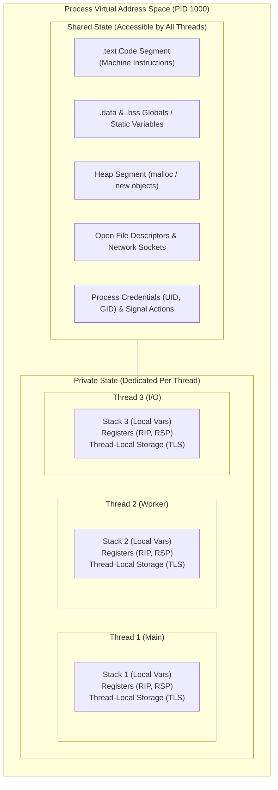
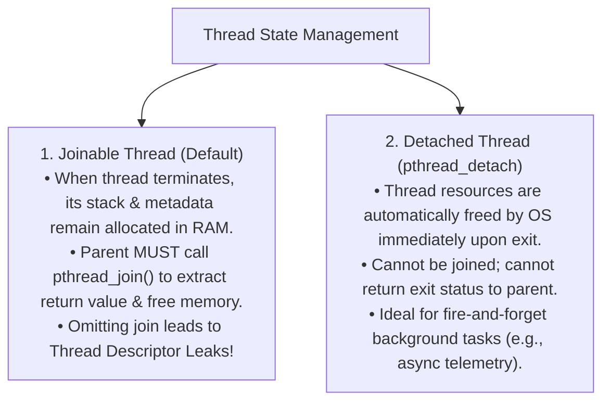

# Thread

> [!abstract] Mental Model
> A **Thread is the smallest schedulable unit of CPU execution**. If a [[Process Control Block|Process]] is an entire house (owning the land, deed, and plumbing), threads are the individual people living inside the house: they freely share the common living areas (Heap, Global Variables, Open Sockets, and File Descriptors), but each person carries their own private backpack and thought stream (Stack, Program Counter, and CPU Registers).

---

## Why Threads Exist

Prior to multithreading, achieving concurrency required spawning separate processes (`fork()`):
1. **High Creation Overhead**: Spawning a process requires duplicating page tables, memory descriptors (`mm_struct`), and file tables.
2. **Expensive Communication**: Sharing data between processes mandates complex [[Inter-Process Communication - IPC|IPC channels]] (pipes, sockets, shared memory).
3. **Slow Context Switching**: Switching between processes requires updating `CR3`, which flushes the [[Translation Lookaside Buffer - TLB|TLB]] and pollutes CPU caches.

Threads solve this by providing **lightweight, parallel execution streams inside a single shared virtual address space**.

---

## Thread Memory Architecture: Shared vs Private State



### 1. What Threads Share:
- **Virtual Memory Address Space**: Heap, BSS, Data, Text, and memory-mapped files.
- **Operating System Resources**: Open file descriptors, listening sockets, working directory (`cwd`), and file locks.
- **Process Metadata**: Process ID (`PID`), Parent PID (`PPID`), User/Group credentials, and custom signal actions (`sigaction`).

### 2. What Each Thread Owns Exclusively:
- **Thread ID (`TID` / `pthread_t`)**: Unique identifier within the thread group.
- **CPU Register Context**: Program Counter (`RIP`), Stack Pointer (`RSP`), Base Pointer (`RBP`), and General Purpose Registers.
- **Dedicated Thread Stack**: Allocated in the `mmap` region (typically **2 MB to 8 MB** in Linux; 1 MB on Windows).
- **Thread-Local Storage (TLS)**: Private global variables declared with `__thread` or `thread_local`, referenced in hardware via the `FS` or `GS` segment registers.
- **Signal Mask**: Blocked signal sets specific to that thread.

---

## POSIX Threads (`pthreads`) in C/C++

The standard multithreading API in Unix/Linux:

```c
#include <stdio.h>
#include <stdlib.h>
#include <pthread.h>
#include <unistd.h>

// Shared global state
long global_counter = 0;
pthread_mutex_t counter_mutex = PTHREAD_MUTEX_INITIALIZER;

// Thread entry function
void* worker_thread(void* arg) {
    long thread_id = (long)arg;
    
    for (int i = 0; i < 100000; i++) {
        pthread_mutex_lock(&counter_mutex);
        global_counter++; // Safe synchronized increment
        pthread_mutex_unlock(&counter_mutex);
    }
    
    printf("Thread %ld finished execution.\n", thread_id);
    return NULL;
}

int main() {
    pthread_t t1, t2;

    // 1. Create two concurrent threads executing worker_thread
    pthread_create(&t1, NULL, worker_thread, (void*)1);
    pthread_create(&t2, NULL, worker_thread, (void*)2);

    // 2. Join threads: Block main thread until worker threads complete
    pthread_join(t1, NULL);
    pthread_join(t2, NULL);

    printf("Final Global Counter: %ld (Expected: 200000)\n", global_counter);
    pthread_mutex_destroy(&counter_mutex);
    return 0;
}
```

---

## Joined vs Detached Threads

Every thread is created in one of two states:



---

## Critical Failure Modes & Concurrency Hazards

| Failure Mode | Mechanism | Symptoms | Mitigation |
| :--- | :--- | :--- | :--- |
| **Process Crash on Single Thread Fault** | A single thread dereferences a NULL pointer or overflows its stack. | The hardware MMU fires `#PF` $\rightarrow$ Kernel sends `SIGSEGV` to the **entire process**, instantly killing all other threads! | Strict memory safety, isolated worker processes for high-risk parsing. |
| **Data Races / Torn Reads** | Two threads read/write the same non-atomic variable concurrently without synchronization. | Silent data corruption, inconsistent state, non-deterministic bugs. | Use Mutexes, Read-Write Locks, or Atomic Operations (`stdatomic.h` / `std::atomic`). |
| **Thread Descriptor Leak** | Spawning millions of joinable threads without ever calling `pthread_join()`. | Memory in `mmap` region leaks; `pthread_create` eventually fails with `EAGAIN` (`Cannot allocate memory`). | Always join threads or mark them detached (`pthread_detach(pthread_self())`). |
| **Thread Stack Overflow** | Deep recursion or allocating large arrays inside a thread function. | Crashes with `SIGSEGV` when `RSP` hits the thread stack guard page. | Tune stack size with `pthread_attr_setstacksize()`; allocate large buffers on the heap. |

---

## Production Diagnostics & Observability Commands

```bash
# 1. List all running threads (LWPs - Light Weight Processes) for a specific process
ps -T -p <PID>

# Example Output:
#   PID   LWP TTY          TIME CMD
#  1042  1042 ?        00:00:05 java (Main Thread: PID == LWP)
#  1042  1043 ?        00:00:12 java (Worker Thread 1)
#  1042  1044 ?        00:00:08 java (GC Thread)

# 2. Monitor per-thread CPU utilization in real time using top
top -H -p <PID>

# 3. View total thread count of a process
cat /proc/<PID>/status | grep Threads

# 4. Attach GDB to inspect thread backtraces across all active threads
sudo gdb -p <PID> -ex "info threads" -ex "thread apply all bt" -ex "quit"
```

---

## Active Recall & Interview Perspective

### Reasoning Prompts
1. *Why does a `SIGSEGV` (Segmentation Fault) in a single worker thread terminate the entire multi-threaded application?*
   - **Answer**: Because all threads in a process share the same virtual address space (`mm_struct`). A segmentation fault means an illegal memory write occurred, which could have corrupted shared heap data, global variables, or page tables. Because the operating system cannot determine whether the shared memory space is safe, the POSIX standard delivers `SIGSEGV` to the process as a whole, terminating all threads to prevent silent data corruption.
2. *What is Thread-Local Storage (TLS) and how does the CPU access it in $O(1)$ time?*
   - **Answer**: TLS is a dedicated memory region containing private variables for each thread. Rather than performing a hash table lookup using Thread IDs, x86-64 uses the `FS` segment register (and ARM uses `TPIDR_EL0`) to point directly to the base address of the active thread's TLS block. Accessing a `thread_local` variable is compiled into a single CPU instruction with a fixed segment offset (e.g., `mov %fs:0x10, %rax`), achieving instant $O(1)$ performance.
3. *What is the difference between a joinable thread and a detached thread in `pthreads`?*
   - **Answer**: A joinable thread retains its thread stack and exit status in memory even after it terminates, waiting for another thread to call `pthread_join()`. If `pthread_join()` is never called, the thread's memory is permanently leaked. A detached thread (`pthread_detach()`) signals the OS that its resources must be automatically and immediately deallocated the instant its execution function returns.

---

## Key Takeaways
- A **Thread** is a lightweight execution stream sharing the **Heap, Globals, and File Descriptors** of its parent process while retaining a private **Stack, Registers, and Thread-Local Storage (TLS)**.
- Thread creation is **$10\times$ faster** than process creation, and thread context switches do not require TLB flushing.
- Shared memory concurrency requires strict synchronization (locks, atomics) to prevent **data races**, and unjoined threads lead to memory leaks.

---

## Related Notes
- [[Operating System]] — CPU scheduling abstractions.
- [[Program vs Process]] — Process boundaries and resource ownership.
- [[Process Address Space]] — Virtual memory segments shared by threads.
- [[Process Control Block]] — `task_struct` representation of threads (LWPs).
- [[Process vs Thread]] — In-depth architectural trade-off comparison.
- [[Multithreading Models - 1-1, N-1, M-N]] — Mapping user threads to kernel threads.
- [[Thread Safety and Reentrancy]] — Writing safe concurrent code.
- [[Operating Systems MOC]] — Master table of contents for Operating Systems.
