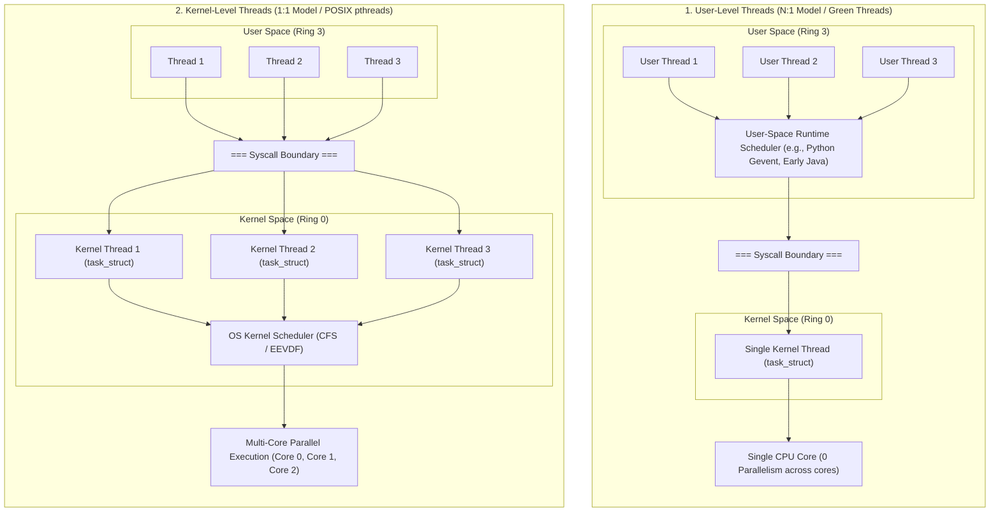
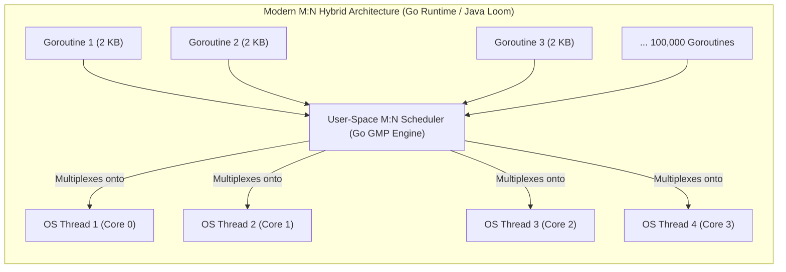

# User-Level Threads vs Kernel Threads

> [!abstract] Mental Model
> The difference between User-Level Threads and Kernel-Level Threads comes down to **who controls the scheduler**:
> - **User-Level Threads (ULT / Green Threads)** are **theater actors managed by a user-space director**: the OS kernel in [[Privilege Rings and CPU Modes|Ring 0]] is completely blind to them, seeing only a single monolithic process. Switching actors is instantaneous inside the theater (User Space), but if one actor gets locked in a room (blocking I/O), the entire play freezes.
> - **Kernel-Level Threads (KLT / OS Threads)** are **civil servants managed by the government (Kernel)**: the kernel explicitly schedules each thread onto physical CPU cores, handles blocking I/O independently, but requires expensive government paperwork (Ring 0 mode switches) to swap workers.

---

## Architectural Comparison: ULT vs KLT



---

## Detailed Dimension-by-Dimension Matrix

| Feature | User-Level Threads (ULT / Green Threads) | Kernel-Level Threads (KLT / Native OS Threads) |
| :--- | :--- | :--- |
| **Managed By** | User-space runtime library (e.g., Go runtime, Erlang VM, Node.js libuv). | Operating System Kernel scheduler (Ring 0). |
| **Kernel Awareness** | **None**: The kernel sees only 1 process/thread. | **Full**: Every thread has its own `task_struct` in kernel memory. |
| **Creation Latency** | **Extremely Fast (~10–50 ns)**: Simple user heap memory allocation. | **Moderate (~10–50 $\mu\text{s}$)**: Syscall `clone()` + kernel stack allocation. |
| **Stack Memory Footprint** | **Tiny (e.g., 2 KB to 4 KB in Go/Erlang)** (Grows dynamically). | **Large (e.g., 1 MB to 8 MB)** (Pre-allocated in `mmap` region). |
| **Context Switch Latency** | **$< 20\text{ ns}$**: Pure user-space register swap; **Zero Syscalls / No Ring Switch**. | **~100–300 ns**: Requires trap to Ring 0 and kernel stack swap. |
| **Multi-Core Parallelism** | **Cannot utilize multiple cores** unless mapped to multiple kernel threads. | **True Hardware Parallelism**: Scheduled across all available CPU cores. |
| **Blocking System Call Hazard**| **Fatal**: If 1 thread blocks on disk I/O, the **entire process freezes**. | **Safe**: If 1 thread blocks, the kernel schedules other threads seamlessly. |

---

## The Fatal Flaw of Pure User-Level Threads

In early multithreading implementations (e.g., early Java Green Threads, GNU Portable Threads):
1. Thread A in a 100-thread user runtime executes a synchronous file read: `read(fd, buf, 1024)`.
2. Because the OS kernel only knows about the single parent process, the kernel puts the **entire process into `TASK_UNINTERRUPTIBLE` / `TASK_INTERRUPTIBLE` sleep**.
3. **Catastrophe**: The other 99 user threads—which were ready to compute mathematical calculations or render UI—are completely frozen until the disk read finishes!

```text
How Pure ULT Freezes Concurrency on Blocking Syscalls:
User Thread 1 (Wants to read disk) ----\
User Thread 2 (Ready to calculate math) -> [User Runtime] -> [1 OS Kernel Thread] -> Blocked on Disk I/O!
User Thread 3 (Ready to parse JSON) ---/                             |
                                                       Entire Process Suspended by OS!
```

---

## The Modern Renaissance: The M:N Hybrid Model

Modern high-concurrency systems (such as **Go Goroutines, Java Project Loom Virtual Threads, Erlang BEAM, and Rust Tokio async**) resurrected User-Level Threads by combining them with **Non-Blocking Asynchronous Kernel I/O (`epoll` / `io_uring`)**:



### How Modern Runtimes Prevent Blocking Hazards:
1. **Network I/O**: When a Goroutine calls `net.Conn.Read()`, the Go runtime intercepts the call, registers the socket file descriptor with the kernel's non-blocking **`epoll` / `kqueue` engine**, suspends *only that Goroutine*, and immediately runs another Goroutine on the same OS thread!
2. **Blocking System Calls**: When a Goroutine must execute an un-pollable blocking syscall (like synchronous disk I/O), the Go scheduler **disassociates the OS thread (`M`) from the logical processor (`P`)**, allowing other Goroutines to continue executing on a newly spawned OS worker thread.

---

## Performance Comparison: Spawning 100,000 Threads

```text
Resource Consumption for 100,000 Concurrent Tasks:

1. Using Kernel-Level OS Threads (1:1 Model - Java Threads / C pthreads):
   - Memory per thread: 1 MB minimum virtual stack + 32 KB kernel task_struct
   - Total Memory: 100,000 * 1 MB = 100 GIGABYTES of RAM!
   - Result: Instant Crash / Out-of-Memory.

2. Using User-Level Green Threads (M:N Model - Go Goroutines / Java Loom):
   - Memory per goroutine: 2 KB dynamic stack
   - Total Memory: 100,000 * 2 KB = 200 MEGABYTES of RAM!
   - Result: Runs effortlessly on a modest developer laptop.
```

---

## Active Recall & Interview Perspective

### Reasoning Prompts
1. *Why did Java abandon Green Threads in Java 1.2 in favor of Native OS Threads, only to re-introduce Virtual Threads 20 years later in Project Loom?*
   - **Answer**: In Java 1.2, pure Green Threads (N:1) could not utilize multi-core SMP processors and blocked the entire JVM on any synchronous I/O call. As multi-core CPUs became standard, Java switched to 1:1 Native OS Threads. However, as cloud microservices scaled to millions of concurrent network connections, the 1 MB stack and context-switch overhead of OS threads became the bottleneck. Java introduced Project Loom (Virtual Threads) as an M:N model, multiplexing millions of 2 KB virtual threads over a small pool of native carrier threads using non-blocking I/O.
2. *What is a Scheduler Activation in operating systems theory?*
   - **Answer**: Scheduler Activations is an OS-kernel communication mechanism designed to solve the blocking I/O problem of user-level threads. When a user thread blocks in the kernel, the kernel sends an **upcall** to the user-space runtime library, notifying it of the block and providing a new virtual CPU context so the user-space scheduler can immediately schedule another ready green thread.
3. *Why is the context switch of a User-Level Thread faster than a Kernel-Level Thread?*
   - **Answer**: A user-level thread context switch executes entirely in **User Mode (Ring 3)**. It only saves and restores a handful of general-purpose registers to user heap memory and swaps the stack pointer (`RSP`). It requires **zero `SYSCALL` instructions, zero CPU privilege transitions, zero kernel stack swaps, and zero TLB/page-table adjustments**, completing in $\approx 10–20$ nanoseconds.

---

## Key Takeaways
- **User-Level Threads (ULT)** are lightweight ($2\text{ KB}$ stack, $<20\text{ ns}$ context switch) and managed in User Mode, but traditionally suffered from blocking I/O freezes and single-core bottlenecks.
- **Kernel-Level Threads (KLT)** are managed by the OS in Ring 0, supporting true multi-core hardware parallelism at the cost of larger memory footprints ($1–8\text{ MB}$) and syscall context-switch overhead.
- Modern architectures (Go, Java Loom, Rust Tokio) use **M:N hybrid models**, multiplexing millions of lightweight user green threads over a fixed pool of native OS threads.

---

## Related Notes
- [[Operating System]] — CPU resource multiplexing.
- [[User Mode vs Kernel Mode]] — Privilege boundaries governing thread scheduling.
- [[Thread]] — Thread memory structures and thread-local storage.
- [[Process vs Thread]] — Comprehensive trade-off analysis.
- [[Multithreading Models - 1-1, N-1, M-N]] — Mathematical and architectural mappings.
- [[Thread Pools and Worker Queues]] — Managing OS thread capacity.
- [[Operating Systems MOC]] — Master table of contents for Operating Systems.
