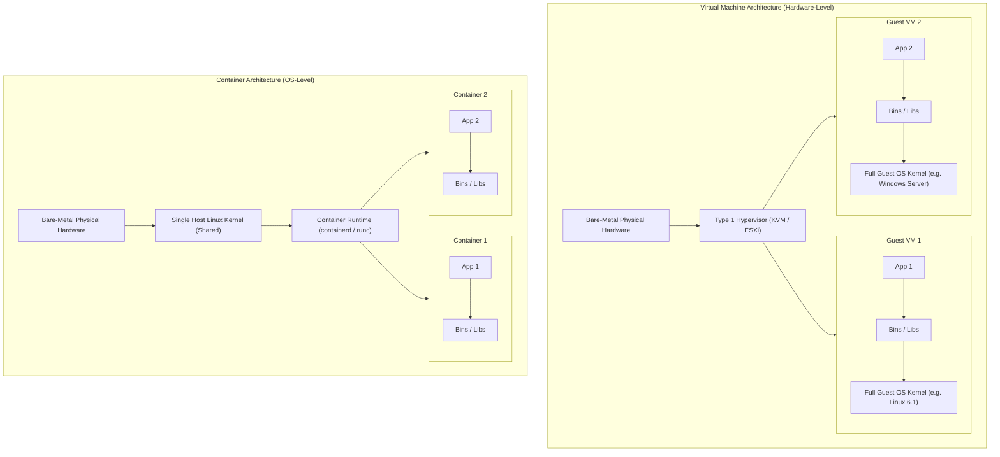
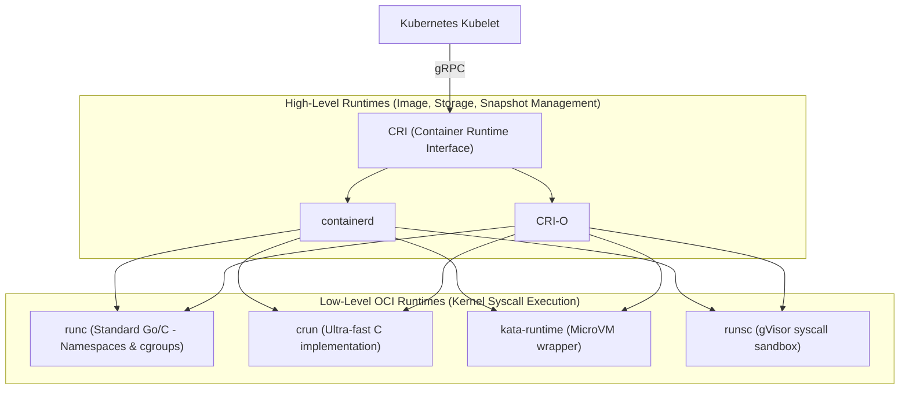
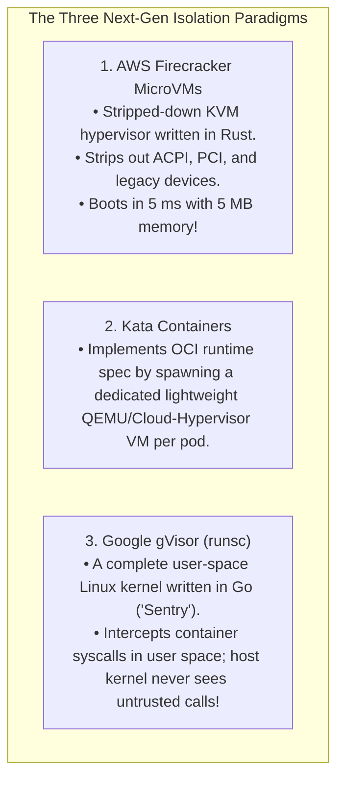

# Containers vs Virtual Machines

> [!abstract] Mental Model
> - **Virtual Machine (The Single-Family Suburban House)**: A VM builds a complete standalone structure with its own independent foundation (Hypervisor emulation), private plumbing (Guest OS Kernel), and dedicated electrical wiring (Guest device drivers). High isolation and independence, but heavy construction overhead ($30\text{ s}$ boot, gigabytes of RAM).
> - **Container (The Luxury Studio Apartment)**: An individual apartment inside a single high-rise building. It shares the central building HVAC, water main, and structural frame (the **Shared Host Linux Kernel**), but has its own keycard and private interior walls (**Namespaces + cgroups**). Instant occupancy ($50\text{ ms}$ boot) and extreme density, but if the main building foundation cracks (Kernel exploit), every apartment is compromised.

---

## Architectural Comparison Diagram



---

## Technical Comparison Matrix

| Architectural Dimension | Virtual Machines (VMs) | Containers (OCI) | MicroVMs (Firecracker / Kata) |
| :--- | :--- | :--- | :--- |
| **Virtualization Boundary** | **Hardware / Hypervisor Level** (Intel VT-x) | **OS Kernel Level** (Namespaces & cgroups) | **Minimalist Hardware Sandbox** (KVM MicroVM) |
| **Kernel Instances** | $N$ separate Guest Kernels | **$1$ Shared Host Kernel** | $N$ stripped-down Guest Kernels |
| **OS Heterogeneity** | Can run Windows, Linux, BSD on same host | **Strictly Linux on Linux** (or Windows on Windows) | Single minimal Linux kernel |
| **Startup Latency** | $10\text{ - }60\text{ seconds}$ | **$10\text{ - }100\text{ milliseconds}$** | **$< 10\text{ milliseconds}$** |
| **Memory Footprint** | $512\text{ MB} - 4\text{ GB}+$ base overhead | **$\sim 10\text{ MB}$** (Zero guest kernel) | **$\sim 5\text{ MB}$** |
| **I/O Overhead** | Two-dimensional EPT / SLAT + VirtIO | **$0\%$ (Native bare-metal syscalls)** | Near-zero (vhost-user / virtio-fs) |
| **Security Isolation** | **Hardware-enforced hypervisor boundary** | **Software-enforced kernel syscall filters** | **Hardware-enforced hypervisor boundary** |

---

## Security Boundaries & Attack Surface Analysis

```mermaid
flowchart TD
    subgraph ContainerAttack ["Container Security Model: Shared Kernel Risk"]
        CtrApp["Malicious / Compromised Container App"]
        Syscall["Direct Syscall (e.g. io_uring, eBPF, perf_event)"]
        HostKernel["Shared Host Linux Kernel"]
        RootBreakout["KERNEL EXPLOIT -> FULL HOST TAKEOVER!"]

        CtrApp --> Syscall --> HostKernel --> RootBreakout
    end

    subgraph VMAttack ["VM Security Model: Hypervisor Hardware Boundary"]
        VMApp["Compromised VM App"]
        GuestK["Guest OS Kernel (Hacked)"]
        Trap["Attempted Hardware Access -> Triggers VM-Exit"]
        HypIsolation["Hypervisor / EPT blocks access to Host Memory"]

        VMApp --> GuestK --> Trap --> HypIsolation
    end
```



### Container Hardening Invariants in Production:
To approach VM-level security, production containers enforce:
1. **Linux Capabilities**: Dropping root capabilities (`cap_drop: [ALL]`, adding only `NET_BIND_SERVICE`).
2. **Seccomp BPF**: Filtering out dangerous system calls (disabling $300+$ of Linux's $450+$ syscalls).
3. **AppArmor / SELinux**: Mandatory Access Control (MAC) enforcing explicit filesystem path permissions.

---

## The Modern OCI Container Runtime Hierarchy



---

## The Modern Compromise: MicroVMs & Sandboxed Containers

In multi-tenant serverless environments (e.g. AWS Lambda, Google Cloud Run), neither traditional VMs (too slow/heavy) nor standard containers (weak security isolation) suffice:



---

## Production Diagnostics & Container Auditing

```bash
# 1. Inspect System-Wide Cgroup Hierarchy across VMs and Containers
systemd-cgls

# 2. Inspect real-time CPU, Memory, and Network I/O of all running containers:
docker stats --no-stream

# Output format:
# CONTAINER ID   NAME         CPU %     MEM USAGE / LIMIT     MEM %     NET I/O          BLOCK I/O
# 4f8a12901b2a   nginx-prod   0.12%     24.1MiB / 512MiB      4.71%     1.2MB / 8.4MB    0B / 4.1kB

# 3. Audit Seccomp syscall filtering for a running container process:
grep Seccomp /proc/$(pgrep -f nginx)/status
# Seccomp: 2 (2 = Seccomp BPF filtering active; 0 = Disabled/Vulnerable)
```

---

## Active Recall & Interview Perspective

### Reasoning Prompts
1. *Why can you NOT run a Windows kernel container on a standard Linux host OS, but you CAN run a Windows VM on Linux?*
   - **Answer**: Virtual Machines virtualize the underlying *hardware* (using Intel VT-x to expose virtual CPUs, MMU, and storage controllers), allowing any operating system with an x86 bootloader (Windows, Linux, FreeBSD) to execute its own independent kernel. Containers do not virtualize hardware; they virtualize the *operating system kernel* by slicing global kernel data structures via Namespaces and cgroups. Because container processes issue system calls directly to the host's running kernel, a Linux host kernel can only execute Linux binaries compiled for the Linux system call ABI.
2. *What is a "Container Breakout" vulnerability and why are VMs fundamentally less vulnerable?*
   - **Answer**: In a container, all applications share a single monolithic Linux kernel. If an attacker exploits a privilege escalation bug in any kernel subsystem (such as memory management, eBPF, or `io_uring`), they gain Ring 0 execution on the host CPU, immediately compromising the host and all other collocated containers. In contrast, a Virtual Machine executes within hardware-enforced **VMX Non-Root mode** and **Extended Page Tables (EPT)**; exploiting the guest kernel only compromises that specific VM's private address space, while the host hypervisor remains isolated in VMX Root mode.
3. *How do MicroVMs (like AWS Firecracker) bridge the gap between VMs and Containers for Serverless computing?*
   - **Answer**: Traditional hypervisors (like QEMU) emulate dozens of legacy PC devices (IDE controllers, floppy drives, ACPI tables, PCI buses), causing multi-second boot times and large memory overheads. **Firecracker** strips away all legacy hardware emulation, implementing only 4 minimal VirtIO devices (net, block, vsock, balloon) in a secure Rust codebase on top of KVM. This reduces VM initialization time from 30 seconds to **under 5 milliseconds** and memory footprint to **5 MB**, providing true hardware hypervisor security boundaries with container-like ephemeral agility.

---

## Key Takeaways
- **VMs** virtualize hardware via **Hypervisors & EPT**; **Containers** virtualize the OS via **Namespaces & cgroups**.
- Containers deliver **instant boot ($50\text{ ms}$)** and **zero I/O overhead**, but share the host kernel attack surface.
- **MicroVMs (Firecracker / Kata)** combine hardware hypervisor security with sub-millisecond container startup.

---

## Related Notes
- [[Operating System]] — Core architectural models.
- [[Privilege Rings and CPU Modes]] — Ring 0 vs VMX Root modes.
- [[Virtualization and Hypervisors - Type 1 vs Type 2]] — Bare-metal vs hosted hypervisors.
- [[OS-Level Virtualization - Linux Namespaces and cgroups]] — Low-level container primitives.
- [[eBPF Architecture and Observability]] — In-kernel observability across containers.
- [[Operating Systems MOC]] — Master table of contents for Operating Systems.
