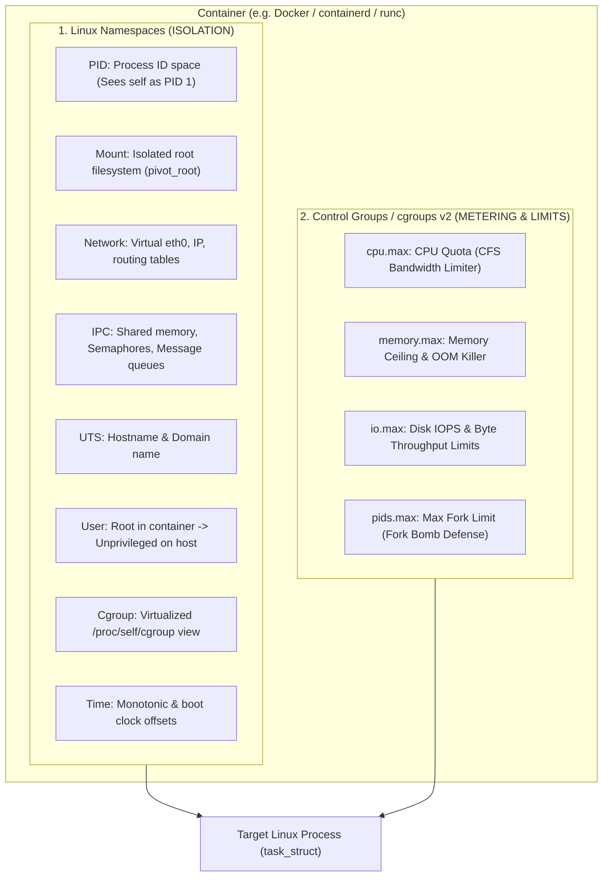
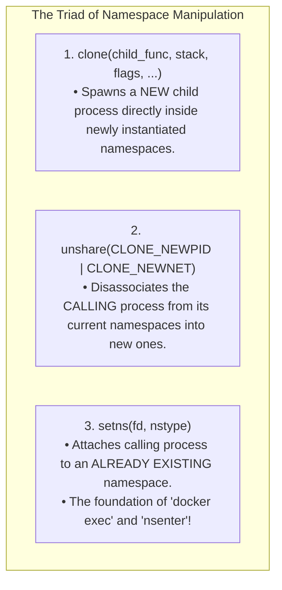
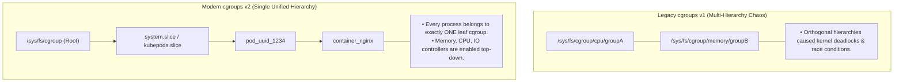
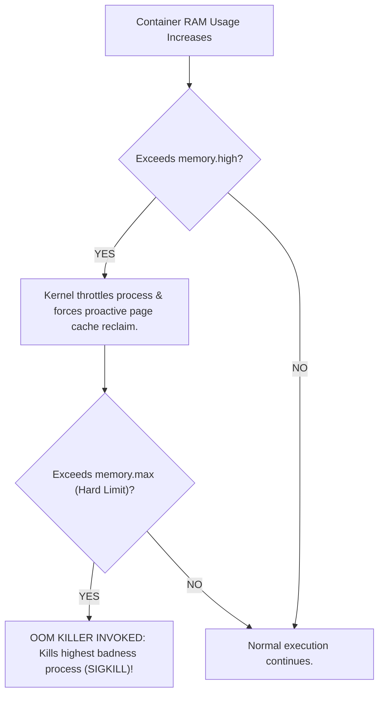

# OS-Level Virtualization: Linux Namespaces and cgroups

> [!abstract] Mental Model
> A Linux Container is **an ordinary process wearing virtual reality goggles and a straitjacket**:
> - There is no "container" object in the Linux kernel codebase.
> - **Namespaces (The VR Goggles - What a process can SEE)**: Partitions kernel global resources so that a process believes it is running on a dedicated machine (isolated PIDs, network interfaces, mount points).
> - **Control Groups / cgroups (The Straitjacket - What a process can USE)**: Enforces hard resource budgets on CPU time, physical memory limits, I/O bandwidth, and process fork limits.

---

## The Dual Pillars of Modern Containers



---

## The 8 Linux Namespaces Explained

| Namespace | `clone()` Flag | Isolated Global Kernel Resource |
| :--- | :--- | :--- |
| **Mount (mnt)** | `CLONE_NEWNS` | Mount points and filesystem hierarchy (allows container custom rootfs). |
| **Process ID (pid)** | `CLONE_NEWPID` | Process IDs (container main process is PID 1; host sees real PID 49102). |
| **Network (net)** | `CLONE_NEWNET` | IP addresses, routing tables, port bindings, `iptables`/`nftables` rules. |
| **IPC** | `CLONE_NEWIPC` | System V IPC identifiers, POSIX message queues, and shared memory segments. |
| **UTS** | `CLONE_NEWUTS` | Hostname and NIS domain name (`hostname container-web-01`). |
| **User (user)** | `CLONE_NEWUSER` | UID/GID mappings (UID 0 inside container maps to unprivileged UID 100000 on host). |
| **Control Group (cgroup)** | `CLONE_NEWCGROUP`| Virtualizes the cgroup hierarchy visible in `/proc/self/cgroup`. |
| **Time** | `CLONE_NEWTIME` | Independent system boot and monotonic clocks (useful for time-travel testing). |

---

## The Three Namespace System Calls: `clone`, `unshare`, `setns`



---

## Control Groups: cgroups v1 vs Unified cgroups v2



---

## cgroups v2 Resource Controllers in Production

### 1. CPU Limiting (`cpu.max`):
Uses the Linux CFS Bandwidth Controller:
```bash
# Set limit: Max 1.5 CPU cores (150,000 microseconds per 100,000 microsecond period):
echo "150000 100000" > /sys/fs/cgroup/my_container/cpu.max
```

---

### 2. Memory Limiting (`memory.max` & `memory.high`):


---

### 3. Fork-Bomb Defense (`pids.max`):
```bash
# Restrict container to at most 100 concurrent threads/processes:
echo "100" > /sys/fs/cgroup/my_container/pids.max
```

---

## Production Diagnostics & Namespace Inspection

```bash
# 1. Inspect all 8 active namespace inode IDs for a running process
ls -l /proc/49102/ns/

# Output:
# lrwxrwxrwx 1 root root 0 Aug 18 12:00 cgroup -> 'cgroup:[4026531835]'
# lrwxrwxrwx 1 root root 0 Aug 18 12:00 ipc -> 'ipc:[4026532289]'
# lrwxrwxrwx 1 root root 0 Aug 18 12:00 mnt -> 'mnt:[4026532287]'
# lrwxrwxrwx 1 root root 0 Aug 18 12:00 net -> 'net:[4026532292]'
# lrwxrwxrwx 1 root root 0 Aug 18 12:00 pid -> 'pid:[4026532290]'
# lrwxrwxrwx 1 root root 0 Aug 18 12:00 user -> 'user:[4026531837]'
# lrwxrwxrwx 1 root root 0 Aug 18 12:00 uts -> 'uts:[4026532288]'

# 2. Enter a running container without Docker using nsenter:
sudo nsenter -t 49102 -m -u -i -n -p /bin/bash

# 3. Check container cgroup memory consumption and OOM events:
cat /sys/fs/cgroup/system.slice/docker-*.scope/memory.current
cat /sys/fs/cgroup/system.slice/docker-*.scope/memory.events
# oom 1 (Indicates OOM killer triggered once in this cgroup!)
# oom_kill 1
```

---

## Active Recall & Interview Perspective

### Reasoning Prompts
1. *Why does User Namespace (`CLONE_NEWUSER`) provide crucial security containment for root processes inside containers?*
   - **Answer**: Without User Namespaces, if a container process runs as UID 0 (root), it is the exact same cryptographic UID 0 on the host kernel. If the process exploits a kernel vulnerability or breaks out via a misconfigured volume mount, it has full root privileges over the entire physical host. **User Namespaces** allow UID 0 *inside* the container to be mapped to an unprivileged UID (e.g. UID 100000) *outside* on the host. Even if the process escapes the container, the host kernel treats it as an unprivileged user with zero administrative capabilities.
2. *What is the difference between `memory.high` and `memory.max` in cgroups v2?*
   - **Answer**: **`memory.max`** is the absolute hard ceiling: if memory usage hits this limit and the kernel cannot reclaim enough clean page cache frames, the kernel **immediately invokes the OOM Killer** to terminate processes in that cgroup. **`memory.high`** is a protective soft throttle threshold placed below `memory.max`: when crossed, the kernel does not kill the process; instead, it throttles the process's CPU time and forces it to asynchronously flush and reclaim its own cached pages, preventing sudden OOM killer termination during transient memory bursts.
3. *How does `setns()` enable tools like `docker exec` or `kubectl exec`?*
   - **Answer**: When you run `docker exec -it <container_id> /bin/bash`, the Docker daemon identifies the PID of the primary container process on the host. It opens file descriptors to that process's namespace symlinks in `/proc/<pid>/ns/` (such as `net`, `mnt`, `pid`), and invokes the **`setns(fd, nstype)`** system call for each. This switches the calling process into the target container's namespaces, allowing the newly spawned bash shell to see the container's private filesystem, network ports, and process tree.

---

## Key Takeaways
- Containers are built from **Namespaces (Isolation / Visibility)** and **Control Groups (Resource Budgets)**.
- The 8 Linux namespaces isolate **PID, Mount, Network, IPC, UTS, User, Cgroup, and Time**.
- **cgroups v2** provides a unified hierarchy controlling **CPU quotas (`cpu.max`)**, **Memory ceilings (`memory.max`)**, and **Fork limits (`pids.max`)**.

---

## Related Notes
- [[Operating System]] — Core OS abstractions.
- [[Process Address Space]] — Virtual memory layout.
- [[Process Creation and Termination - fork, exec, wait, exit]] — Process spawning.
- [[Linux CFS - Completely Fair Scheduler]] — CFS CPU bandwidth quotas.
- [[Virtualization and Hypervisors - Type 1 vs Type 2]] — VM vs container virtualization.
- [[Containers vs Virtual Machines]] — Direct performance and security trade-offs.
- [[Operating Systems MOC]] — Master table of contents for Operating Systems.
