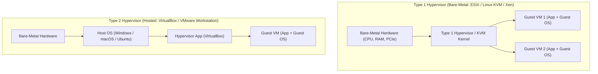

# Virtualization and Hypervisors: Type 1 vs Type 2

> [!abstract] Mental Model
> Virtualization is **running an independent operating system inside a hardware sandbox**:
> - **Type 1 Hypervisor (Bare-Metal - The Apartment Complex)**: The hypervisor *is* the operating system running directly on raw physical silicon (e.g. VMware ESXi, Linux KVM). It partitions physical CPU, RAM, and PCIe hardware with sub-microsecond overhead.
> - **Type 2 Hypervisor (Hosted - The Subletter)**: Runs as an ordinary application inside a host OS (e.g. VirtualBox, VMware Workstation). Every I/O operation traverses two complete OS kernel stacks, incurring severe context-switch and CPU scheduling penalties.

---

## Architectural Comparison: Type 1 vs Type 2



---

## The Popek-Goldberg Virtualization Requirements & x86 Flaw

In 1974, Gerald Popek and Robert Goldberg established the fundamental theorem of virtualization:
> **Popek-Goldberg Condition**: A CPU architecture is fully virtualizable if and only if **all sensitive instructions are a strict subset of privileged instructions**.

### The Classic x86 Virtualization Hole:
Classic x86 contained **17 sensitive, unprivileged instructions** (such as `POPF`, `PUSHF`, `SMSW`, `LAR`). When executed inside a guest OS in User Mode (Ring 1/3), they **failed silently or modified host state without trapping to the hypervisor**, making secure x86 virtualization impossible without slow binary translation (invented by VMware in 1998).

---

## Hardware-Assisted Virtualization (Intel VT-x / AMD-V)

In 2005, Intel and AMD solved this by introducing **hardware-assisted CPU virtualization modes**:

```mermaid
flowchart TD
    subgraph VMX_Root ["VMX Root Operation (Hypervisor / Host KVM)"]
        Root0["Ring 0: Hypervisor Core Engine"]
        Root3["Ring 3: Management Daemons (QEMU / libvirt)"]
    end

    subgraph VMX_NonRoot ["VMX Non-Root Operation (Guest Virtual Machine)"]
        Guest0["Guest Ring 0: Guest OS Kernel (Linux / Windows)"]
        Guest3["Guest Ring 3: Guest User Applications"]
    end

    Root0 -->|VMLAUNCH / VMRESUME (VM-Entry)| Guest0
    Guest0 -->|Privileged Trap / MMIO (VM-Exit)| Root0
```

---

### The VMCS (Virtual Machine Control Structure):
A $4\text{ KB}$ hardware memory structure per vCPU configured by the hypervisor:
- **Guest-State Area**: Hardware snapshot of Guest registers (RIP, RSP, CR0, CR3, CR4, Segment registers).
- **Host-State Area**: Hardware snapshot of Hypervisor registers to restore upon exit.
- **VM-Execution Control Fields**: Dictates which specific guest instructions trigger a **VM-Exit** (e.g. `CPUID`, `INVD`, `CR3` reload, external interrupts).
- **VM-Exit Information Fields**: Explains the exact reason for the trap (exit qualification, faulting physical address).

---

## Two-Dimensional Paging: Extended Page Tables (EPT / SLAT)

Guest OS kernels manage virtual memory using their own Guest Page Tables. Translating a memory access requires **Two-Dimensional Address Translation**:

```mermaid
flowchart LR
    GVA["Guest Virtual Address (GVA)"] 
    -->|Guest Page Table (CR3)| GPA["Guest Physical Address (GPA)"]
    -->|Extended Page Table (EPTP / SLAT)| HPA["Host Physical Address (HPA in True DRAM)"]
```

- **Hardware Acceleration**: The hardware MMU traverses both page tables simultaneously.
- **TLB Virtualization**: Hardware tags TLB entries with **VPID (Virtual Processor ID)**, preventing expensive TLB flushes on every VM-Exit / VM-Entry!

---

## Paravirtualization & I/O Performance: VirtIO vs SR-IOV

Emulating legacy hardware controllers (e.g. Intel e1000 NIC) in software requires thousands of VM-Exits per second. Modern systems eliminate this:

```mermaid
flowchart TD
    subgraph VirtIO ["1. VirtIO Paravirtualization (Standard Cloud Default)"]
        V_Guest["Guest VirtIO Driver"]
        V_Ring["Shared In-RAM Circular vring Descriptors"]
        V_Host["Host KVM / QEMU Backend"]
        V_Guest <-->|Lockless Shared DMA Ring (Zero VM-Exits on fast path)| V_Ring <--> V_Host
    end

    subgraph SRIOV ["2. SR-IOV (Single Root I/O Virtualization - Bare-Metal Speed)"]
        SR_HW["Physical PCIe 100GbE NIC ASIC"]
        VF0["Virtual Function 0 (Mapped directly to VM via IOMMU)"]
        VF1["Virtual Function 1 (Mapped directly to VM via IOMMU)"]
        SR_HW --> VF0 & VF1
    end
```

---

## Production Diagnostics & KVM Inspection

```bash
# 1. Verify CPU Hardware Virtualization Support
egrep -c '(vmx|svm)' /proc/cpuinfo
# (Returns > 0 if Intel VT-x [vmx] or AMD-V [svm] is enabled in BIOS)

# 2. Check KVM Hypervisor Kernel Module Loading
kvm-ok
# INFO: /dev/kvm exists
# KVM acceleration can be used

# 3. Monitor Real-Time VM-Exit Frequency and Bottlenecks:
sudo perf kvm stat live

# Key output metrics to audit:
# Reason                  Count      Time (ps)
# EPT_VIOLATION           49,201     12.4 ms   (Page fault / memory allocation)
# IO_INSTRUCTION          18,910      4.2 ms   (Legacy PMIO hardware access)
# HLT                     82,041     24.1 ms   (Guest CPU idling)
```

---

## Active Recall & Interview Perspective

### Reasoning Prompts
1. *Why was binary translation necessary to virtualize x86 operating systems prior to Intel VT-x?*
   - **Answer**: The classic x86 architecture violated the Popek-Goldberg virtualization condition because it contained 17 sensitive instructions (like `POPF` and `SMSW`) that were not strictly privileged (i.e. they could be executed in user mode without generating a hardware trap). When a Guest OS running in user mode executed these instructions, the CPU silently ignored the privileged modifications or altered host state without notifying the hypervisor. Prior to Intel VT-x, hypervisors like VMware had to dynamically inspect, rewrite, and replace these sensitive machine code instructions on-the-fly (**Binary Translation**), incurring significant CPU overhead.
2. *What is a VM-Exit, and why are excessive VM-Exits the primary performance bottleneck in virtualized cloud environments?*
   - **Answer**: A **VM-Exit** is a hardware-enforced CPU context transition from VMX Non-Root operation (Guest VM) back to VMX Root operation (Host Hypervisor). It occurs whenever the guest attempts an operation that requires hypervisor intervention (such as MMIO device access, hardware interrupt handling, or modifying control registers). Each VM-Exit forces the CPU hardware to serialize execution, write hundreds of bytes of guest processor state into the **VMCS**, and flush CPU pipelines, costing hundreds of CPU clock cycles. High VM-Exit frequencies destroy CPU cache locality and induce microsecond-level latency spikes.
3. *How does Extended Page Tables (EPT / SLAT) eliminate the need for Shadow Page Tables?*
   - **Answer**: In software-only virtualization, the hypervisor maintained **Shadow Page Tables** that directly mapped Guest Virtual Addresses (GVA) to Host Physical Addresses (HPA). This required the hypervisor to intercept every single page table modification in the guest by marking guest page tables read-only, triggering a costly VM-Exit on every page allocation. **EPT** provides hardware support for two-dimensional paging: the guest manages its own page tables (GVA $\to$ GPA) in hardware, while the physical CPU MMU uses an EPT base pointer (`EPTP`) to translate GPA $\to$ HPA in silicon without trapping to the hypervisor.

---

## Key Takeaways
- **Type 1 Hypervisors** run on bare-metal silicon; **Type 2 Hypervisors** run hosted on a parent OS.
- **Intel VT-x / AMD-V** introduces **VMX Root (Hypervisor)** and **VMX Non-Root (Guest)** modes, controlled via the **VMCS**.
- **EPT / SLAT** enables hardware two-dimensional paging; **VirtIO / SR-IOV** eliminates I/O VM-Exit bottlenecks.

---

## Related Notes
- [[Operating System]] — Core architecture.
- [[Privilege Rings and CPU Modes]] — Ring 0 vs VMX modes.
- [[Paging Architecture]] — Virtual memory structures.
- [[Translation Lookaside Buffer - TLB]] — VPID hardware tagging.
- [[IO Hardware - Port-Mapped vs Memory-Mapped IO]] — Device emulation.
- [[Direct Memory Access - DMA]] — IOMMU guest pass-through.
- [[OS-Level Virtualization - Linux Namespaces and cgroups]] — Lightweight container virtualization.
- [[Containers vs Virtual Machines]] — Comprehensive comparison.
- [[Operating Systems MOC]] — Master table of contents for Operating Systems.
