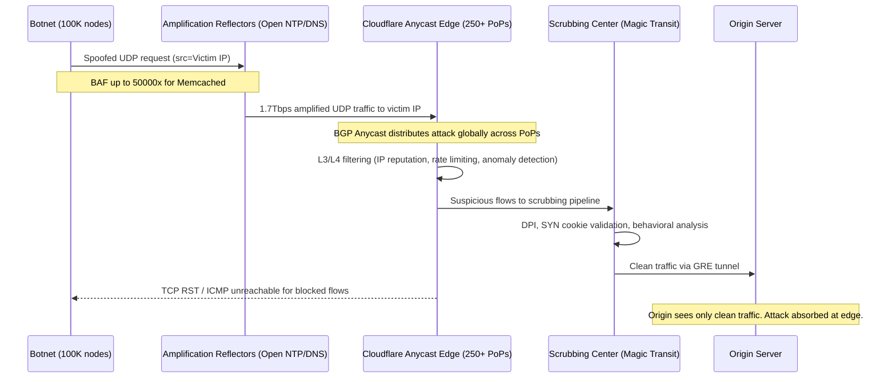
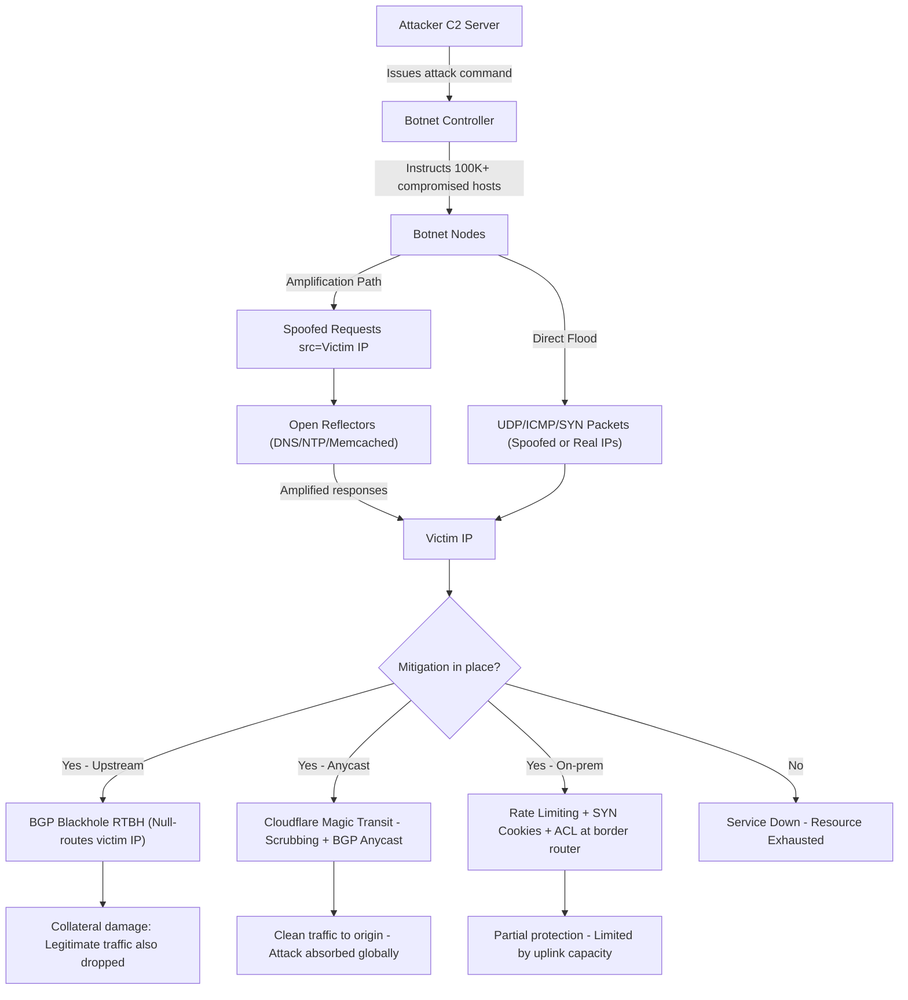

---
title: "Distributed Denial of Service - DDoS Attack Vectors and Mitigations"
subject: "Computer Networks"
module: "07 - Network Security & Cryptography"
difficulty: "Advanced"
prerequisites:
  - "IP Addressing and Subnetting"
  - "TCP - Three-Way Handshake, Flow Control, Congestion Control"
  - "UDP - Connectionless Transport"
  - "DNS - Resolution, Records, and Caching"
related:
  - "Man-in-the-Middle - MitM, ARP Spoofing, DNS Cache Poisoning"
  - "Firewalls - Packet Filtering, Stateful Inspection, NGFW"
  - "Transport Layer Security - TLS 1.2 vs TLS 1.3 Handshake"
  - "Zero Trust Network Architecture - Microsegmentation, mTLS"
aliases:
  - "DDoS"
  - "Distributed Denial of Service"
  - "Volumetric attacks"
  - "Amplification attacks"
tags:
  - network-security
  - ddos
  - attack-vectors
  - mitigation
  - amplification
  - botnet
  - anycast
  - bgp-blackholing
  - syn-cookies
  - cloudflare
  - aws-shield
status: "complete"
---

# Distributed Denial of Service (DDoS) — Attack Vectors and Mitigations

## Mental Model

Think of a DDoS attack like a coordinated traffic jam engineered by thousands of remote-controlled cars (botnet nodes). The attacker does not need to be physically present — they just send a signal and the bots flood every lane leading to your restaurant (server). Even if your restaurant is world-class, nobody can get through the gridlock. The **attacker goal is resource exhaustion**, not data theft — bandwidth, connection state, CPU cycles, or application thread pools are all valid targets. Defenses work by either **redirecting traffic to a scrubbing center** (like a detour that filters out remote-controlled cars) or **proving at the network edge** that each car is legitimate before letting it through.

---

## Core Concepts / Architecture

### DDoS Attack Taxonomy

| Layer | Category | Examples | Target Resource |
|-------|----------|----------|-----------------|
| L3/L4 Volumetric | Bandwidth flooding | UDP Flood, ICMP Flood, NTP Amplification | ISP uplink bandwidth |
| L3/L4 Protocol | State exhaustion | SYN Flood, ACK Flood, Fragmentation | Firewall/LB connection table |
| L7 Application | App-layer | HTTP Slow Loris, GET/POST Flood, DNS Query Flood | Web server threads, DB connections |
| Amplification | Reflection+Amplification | DNS amp, NTP amp, Memcached amp, SSDP amp | Victim bandwidth |

### Amplification Bandwidth Amplification Factor (BAF)

```
BAF = Response_size_bytes / Request_size_bytes
```

| Protocol | Request Size | Response Size | BAF | Max Observed Attack |
|----------|-------------|---------------|-----|---------------------|
| DNS (ANY query) | 40 bytes | ~3,000 bytes | 75x | 300+ Gbps |
| NTP (monlist) | 234 bytes | 48,000 bytes | 206x | 400 Gbps |
| Memcached (UDP) | 15 bytes | ~750,000 bytes | 50,000x | 1.7 Tbps (2018, GitHub) |
| SSDP | 30 bytes | 3,000 bytes | 30x | 100+ Gbps |
| CLDAP | 52 bytes | 3,646 bytes | 70x | Observed in wild |
| CharGen | 1 byte | 460 bytes | 358x | Historical |

---

## Visual Diagram

### Volumetric DDoS with Anycast Scrubbing (Cloudflare Model)



### Attack Phase Flow



---

## Deep Dive

### 1. Volumetric Attacks

#### UDP Flood
- Attacker sends large UDP datagrams to random ports on victim
- Victim responds with ICMP "Destination Unreachable" for each datagram
- No connection state needed — trivial to generate at Tbps scale
- **Spoofing**: Source IPs are randomized; BCP38 ingress filtering partially defeats it
- **Target**: ISP uplink saturation; firewall connection tracking CPU

#### ICMP Flood (Smurf Attack)
- Classic Smurf: spoofed ICMP echo to broadcast address — entire subnet replies to victim
- Modern: Direct ICMP flood from botnet
- Largely mitigated by modern ISPs dropping directed broadcasts

#### NTP Monlist Amplification (CVE-2013-5211)

```bash
# Attacker sends 234-byte monlist request (spoofed src = victim IP):
# NTP server returns up to 600 records of recent clients
# Each response packet ~482 bytes; 100 packets possible
# Total response ~48,000 bytes => BAF = 205x

# Fix: Disable monlist in ntp.conf
# restrict default noquery
# disable monitor
```

#### Memcached UDP Amplification (2018 GitHub Attack — 1.7 Tbps)

```bash
# Attacker pre-loads large value in misconfigured public Memcached servers:
# Spoofed request: 15 bytes (src=victim IP)
# Response: up to 1MB per server => BAF = 50,000x
# Attack used 2,967 Memcached servers => 1.7Tbps at GitHub

# Fix: Memcached must NEVER listen on public UDP:
# /etc/memcached.conf
# -U 0        # Disable UDP
# -l 127.0.0.1  # Bind to loopback only
```

---

### 2. Protocol Attacks (State Exhaustion)

#### SYN Flood — TCP Half-Open Connection Exhaustion

```
TCP three-way handshake creates state on the server:

Client  →  Server:  SYN          (Server allocates TCB entry ~1.5KB RAM each)
Server  →  Client:  SYN-ACK      (Server waits for ACK; default 75s timeout)
Client  →  Server:  ACK          (Connection => ESTABLISHED)

Attack: Attacker sends millions of SYNs from SPOOFED IPs.
        Server allocates TCB for each; ACK never arrives.
        SYN backlog queue fills up (default 128-1024 entries).
        New legitimate connections dropped with ECONNREFUSED.
```

```bash
# Check Linux SYN backlog defaults:
cat /proc/sys/net/ipv4/tcp_max_syn_backlog   # Default: 128 (older kernels)
cat /proc/sys/net/ipv4/tcp_syncookies        # 0=disabled, 1=on-overflow, 2=always
```

**SYN Cookies Defense** (RFC 4987):
- Server does NOT allocate TCB on SYN arrival
- ISN (Initial Sequence Number) encodes connection params via HMAC:
  ```
  ISN = Hash(src_ip, src_port, dst_ip, dst_port, timestamp, secret) || timestamp || MSS
  ```
- When ACK arrives with ISN+1, server recomputes hash to validate — only then allocates TCB
- **Tradeoff**: TCP options (SACK, Window Scale, Timestamps) cannot be negotiated since SYN is not buffered

#### ACK Flood
- Sends massive ACK packets without established connections
- Stateless firewalls pass ACKs; stateful firewalls must check connection table — CPU exhaustion

#### IP Fragmentation Attack (Teardrop)
- Sends overlapping IP fragments with invalid offsets
- Old OSes crash on reassembly; modern systems drop overlapping fragments
- Modern variant: Fragment flood exhausts reassembly buffer (mem alloc per partial datagram)

---

### 3. Application-Layer Attacks (L7)

#### HTTP Slow Loris

```python
# Slow Loris: Opens many connections, sends partial HTTP headers, never completes.
# Each connection holds a server thread/worker indefinitely.

import socket, time
sockets = []
for i in range(500):
    s = socket.socket()
    s.connect(("target.com", 80))
    s.send(b"GET / HTTP/1.1\r\nHost: target.com\r\n")
    sockets.append(s)

while True:
    for s in sockets:
        s.send(b"X-Custom-Header: keep-alive\r\n")  # Prevent server timeout
    time.sleep(15)  # Apache default timeout: 300s
```

**Defense**:
```nginx
# nginx mitigation:
client_header_timeout  10s;    # Close connections not sending headers within 10s
client_body_timeout    10s;    # Close connections not sending body within 10s
keepalive_timeout      15s;    # Close idle keep-alive connections after 15s
```

#### HTTP GET/POST Flood
- Millions of valid HTTP requests to resource-intensive endpoints (search, auth, DB-heavy pages)
- Cached pages absorbed by CDN; dynamic endpoints overwhelm application tier
- Detection: Identical User-Agent strings, same URL pattern, high RPM from narrow ASN

#### DNS Query Flood

```bash
# Attacker floods authoritative DNS with random nonexistent subdomains:
# random-abc123.victim.com => NXDOMAIN (cache miss on each query)
# Resolver CPU pegged doing recursive lookups for garbage names

# Defense: Response Rate Limiting (RRL) in BIND9:
# rate-limit {
#     responses-per-second 5;
#     window 5;
#     slip 2;   # Send TC= flag to retry over TCP (legitimate resolvers will retry)
# };
```

---

### 4. Distributed Reflection DDoS (DRDoS) Math

```
Attack volume formula:
  Attacker_bandwidth x BAF x Number_of_reflectors = Attack_volume_at_victim

Example (NTP monlist attack):
  10 Gbps attacker bandwidth
  x 206 BAF (NTP monlist)
  x 50 open NTP reflectors
  = ~103 Tbps theoretical maximum

Example (GitHub 2018 Memcached attack):
  ~340 Mbps attacker bandwidth
  x 50,000 BAF (Memcached UDP)
  x 2,967 Memcached servers
  = ~1.7 Tbps observed

DRDoS Requirements:
  1. Protocol with spoofable UDP source IP (connectionless)
  2. Protocol responds with MUCH larger reply than request
  3. Reflectors not BCP38 filtered (spoofed source accepted by ISP)
```

---

## Production Example: Cloudflare Magic Transit — Handling a 1.7 Tbps Attack

### Step 1 — BGP Anycast Advertisement

```bash
# Customer onboards prefix to Cloudflare Magic Transit:
# Cloudflare announces customer /24 from 250+ PoPs via BGP Anycast.
# Anycast = same IP prefix announced from many locations simultaneously.
# Internet routing selects NEAREST Cloudflare PoP per source region.

# Before Magic Transit:
#   Attacker traffic -> Customer ISP -> Origin (saturates single uplink)
# After Magic Transit:
#   Attacker traffic -> BGP Anycast -> Nearest CF PoP (distributed globally)

# BGP communities for traffic engineering:
# 13335:4000 = announce to all peers
# 13335:1000 = withdraw prefix (emergency removal)
```

### Step 2 — Attack Detection and Auto-Mitigation

```bash
# Cloudflare flow telemetry (sFlow/IPFIX from border routers) detects:
#   - UDP/11211 volume: 2.5 Tbps (vs near-zero baseline)
#   - Packets per second: >100Mpps
#   - Source IP entropy: HIGH (reflection from many reflectors)
#   - Destination: single /32

# Threshold trigger:
#   pps > 10Mpps OR bps > 10Gbps sustained for 30s => Auto-mitigation

# Mitigation rule pushed globally via Quicksilver (Cloudflare distributed KV):
# Rule reaches all 250+ PoPs in < 1 second
```

### Step 3 — XDP Line-Rate Packet Filtering

```bash
# Cloudflare uses Linux XDP (eXpress Data Path) for line-rate filtering
# XDP runs eBPF programs at NIC driver level, BEFORE kernel networking stack
# Can process >20Mpps per CPU core with <1 microsecond latency

# Conceptual iptables equivalent of what XDP enforces:
iptables -I INPUT -p udp --dport 11211 \
  -m hashlimit --hashlimit-above 100/sec --hashlimit-burst 50 \
  --hashlimit-mode srcip --hashlimit-name memcached \
  -j DROP

# AWS Shield equivalent (Security Group + NACLs):
aws ec2 create-network-acl-entry \
  --network-acl-id acl-12345678 \
  --ingress \
  --rule-number 90 \
  --protocol 17 \
  --port-range From=11211,To=11211 \
  --cidr-block 0.0.0.0/0 \
  --rule-action deny
```

### Step 4 — GRE Tunnel for Clean Traffic Forwarding

```bash
# Clean (scrubbed) traffic forwarded to origin via GRE tunnel:
ip tunnel add gre1 mode gre \
  remote <CF_scrubber_IP> \
  local <origin_IP> \
  ttl 255
ip link set gre1 up
ip addr add <customer_prefix>/24 dev gre1

# IMPORTANT: Set MTU to 1476 to avoid fragmentation (GRE adds 24-byte header):
ip link set gre1 mtu 1476

# Asymmetric routing: return traffic from origin goes directly to Internet
# (no need to traverse Cloudflare for egress traffic)
```

### Step 5 — SYN Cookie Configuration on Origin

```bash
# Linux kernel SYN cookie defense (always-on mode):
sysctl -w net.ipv4.tcp_syncookies=2        # 2=always on, 1=only when backlog full
sysctl -w net.ipv4.tcp_max_syn_backlog=65536
sysctl -w net.core.somaxconn=65536
sysctl -w net.ipv4.tcp_synack_retries=2    # Fail faster, free state sooner

# Persist in /etc/sysctl.conf:
echo "net.ipv4.tcp_syncookies=2" >> /etc/sysctl.conf
echo "net.ipv4.tcp_max_syn_backlog=65536" >> /etc/sysctl.conf
```

### Step 6 — BGP Remote-Triggered Blackhole (RTBH) as Last Resort

```bash
# When attack saturates uplink before scrubbing can engage,
# announce victim /32 with BLACKHOLE community to upstream ISP.
# ISP null-routes ALL traffic to victim IP (attack + legitimate users).

# Cisco IOS BGP config:
router bgp 65001
  neighbor 203.0.113.1 remote-as 1234

  ! Tag /32 for blackhole
  ip route 198.51.100.10 255.255.255.255 Null0
  
  route-map BLACKHOLE permit 10
    match ip address prefix-list BLACKHOLE-TARGETS
    set community 65535:666   ! RFC 7999 BLACKHOLE well-known community
    set local-preference 50
  
  neighbor 203.0.113.1 route-map BLACKHOLE out

# After attack subsides (minutes to hours), withdraw the /32:
no ip route 198.51.100.10 255.255.255.255 Null0
```

### AWS Shield Standard vs Advanced Comparison

| Feature | Shield Standard | Shield Advanced |
|---------|----------------|-----------------|
| Cost | Free (all AWS customers) | $3,000/month |
| L3/L4 mitigation | Automatic | Automatic + enhanced |
| L7 mitigation | No | Yes (WAF integration) |
| DDoS cost protection | No | Yes (bill credits) |
| 24/7 DRT access | No | Yes (DDoS Response Team) |
| Attack visibility | Limited | Full (Flow logs + reports) |
| Global threat intelligence | No | Yes |

```bash
# Enable AWS Shield Advanced:
aws shield create-protection \
  --name "MyWebApp" \
  --resource-arn "arn:aws:elasticloadbalancing:us-east-1:123456789012:loadbalancer/app/my-lb/abc"

# Enable proactive engagement (SRT contacts you automatically):
aws shield enable-proactive-engagement
```

---

## Failure Modes / Trade-offs

1. **BGP Blackholing Kills Legitimate Traffic**
   - Problem: RTBH null-routes the victim IP entirely — attack AND legitimate users blocked
   - Mitigation: Use RTBH only as last resort; prefer Anycast scrubbing; apply blackhole at attacker source /24, not victim /32

2. **Anycast Scrubbing Adds Latency**
   - Problem: Routing through scrubbing centers adds 5-30ms RTT; GRE tunnel reduces effective MTU by 24 bytes
   - Mitigation: Use PoPs geographically close to users; set GRE tunnel MTU=1476; enable ECMP load balancing

3. **SYN Cookies Degrade TCP Performance**
   - Problem: When SYN cookies active, server cannot store SYN options (SACK, Window Scale, Timestamps) — throughput degrades ~10-20%
   - Mitigation: tcp_syncookies=1 (only on overflow); tune tcp_max_syn_backlog to reduce activation threshold

4. **Your Infrastructure Becomes a Reflector**
   - Problem: Open resolvers, misconfigured NTP, public Memcached UDP — you become an amplifier in others attacks
   - Mitigation: BCP38 ingress filtering; disable open DNS recursion; firewall UDP/11211, UDP/161, UDP/123 from public internet

5. **L7 Attacks Bypass L3/L4 Mitigations**
   - Problem: HTTP floods from legitimate IPs (residential proxies, botnets with valid IPs) pass IP-based ACLs entirely
   - Mitigation: CAPTCHAs (Cloudflare Turnstile, hCaptcha); JS fingerprinting challenges; WAF per-session rate limiting

6. **False Positives from Behavioral Scrubbing**
   - Problem: Load testing tools, CDN pre-fetching, monitoring systems resemble attack traffic and get blocked
   - Mitigation: Allowlist CDN IP ranges and monitoring probe IPs; tune rate limits using P99 traffic baseline

7. **Scrubbing Infrastructure State Exhaustion**
   - Problem: Connection tracking on scrubbers themselves can be exhausted by state-heavy volumetric attacks
   - Mitigation: Stateless L4 filtering (XDP/DPDK) for initial drop before stateful inspection layer

---

## Active-Recall Prompts

1. **An attacker sends 15-byte UDP packets to 3,000 misconfigured Memcached servers with your IP spoofed as source. Each returns 500KB. How much traffic hits your IP per attack burst?**
   *(Answer: 3,000 servers x 500KB = ~1.5GB per burst. At 1M spoofed requests per second: ~1.5 Tbps. BAF = 500,000 / 15 ≈ 33,333x.)*

2. **Explain exactly why SYN Cookies defeat SYN Flood without allocating server memory per connection. What TCP feature is sacrificed and why?**
   *(Answer: Server encodes connection params into ISN via HMAC(src_ip, src_port, dst_ip, dst_port, timestamp, secret). No TCB allocated until ACK+1 validates the cookie. SACK / Window Scale / Timestamps TCP options are lost because the SYN packet is never buffered, so options cannot be echoed back in SYN-ACK from stored state.)*

3. **What is the difference between BGP Anycast scrubbing and RTBH? When would you choose each strategy?**
   *(Answer: Anycast = traffic globally distributed to nearest PoP, scrubbed, clean traffic forwarded to origin; service remains UP. RTBH = null-routes ALL traffic to victim IP, dropping attack AND legitimate users; service goes DOWN. Choose Anycast when you want service continuity under attack. Choose RTBH only when attack saturates scrubbing capacity and keeping the IP alive is impossible.)*

4. **How does HTTP Slow Loris differ from a volumetric DDoS, and why do traditional volumetric defenses fail against it?**
   *(Answer: Slow Loris is low-bandwidth but high-connection-count. It exploits the server thread/worker pool limit by opening hundreds of connections and sending partial HTTP headers forever. Volumetric defenses (RTBH, upstream rate limiting by Gbps, SYN cookies) do not help because Slow Loris sends very few packets and completes the TCP handshake. Defense requires connection timeout tuning, per-IP connection limits, and thread-less server architectures like nginx event-loop.)*

---

## Related Notes

- [[Man-in-the-Middle - MitM, ARP Spoofing, DNS Cache Poisoning]]
- [[Firewalls - Packet Filtering, Stateful Inspection, NGFW]]
- [[Transport Layer Security - TLS 1.2 vs TLS 1.3 Handshake]]
- [[Zero Trust Network Architecture - Microsegmentation, mTLS]]
- [[Transmission Control Protocol - TCP Header, Features, and Invariants]]
- [[Domain Name System - DNS Hierarchy, Recursive Resolution, EDNS, DNSSEC]]

---

> **Interview Question**: *Your SaaS application is under a 500 Gbps UDP amplification attack. Walk through your incident response and mitigation strategy step by step.*
>
> **Model Answer**: (1) **Detect** — Network flow telemetry (IPFIX/sFlow) triggers anomaly alert: UDP traffic 500x baseline, high pps rate to single /32 destination. (2) **Classify** — Sample packets with tcpdump; identify source ports (UDP/123=NTP, UDP/11211=Memcached, UDP/53=DNS) to confirm amplification vector. (3) **Triage** — Check if uplink saturated. If yes, upstream mitigation required immediately. (4) **Activate anycast scrubbing** — Enable Cloudflare Magic Transit, AWS Shield Advanced, or Akamai Prolexic; BGP Anycast re-routes attack traffic globally across 250+ PoPs. (5) **Apply source ACLs** — Push null-route BGP communities (RTBH) to upstream ISP targeting top attacking source /24 prefixes (not victim /32). (6) **Protocol-specific fix** — Block UDP/11211 at border; apply NTP rate limiting; audit own infrastructure for open reflectors. (7) **L7 protection** — Enable WAF rate limiting for application endpoints. (8) **Post-incident** — Implement BCP38 ingress filtering on your AS; subscribe to anycast CDN for permanent protection; automate netflow-based mitigation triggers for next time.

---
*Last updated: 2026-08-18 | Status: Complete | Module 7 — Network Security & Cryptography*
