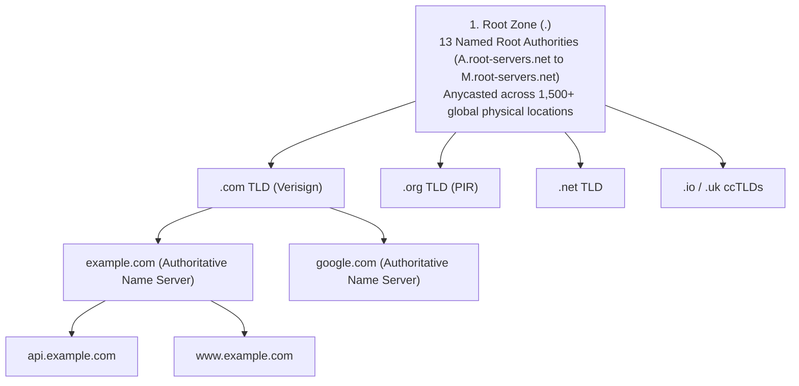
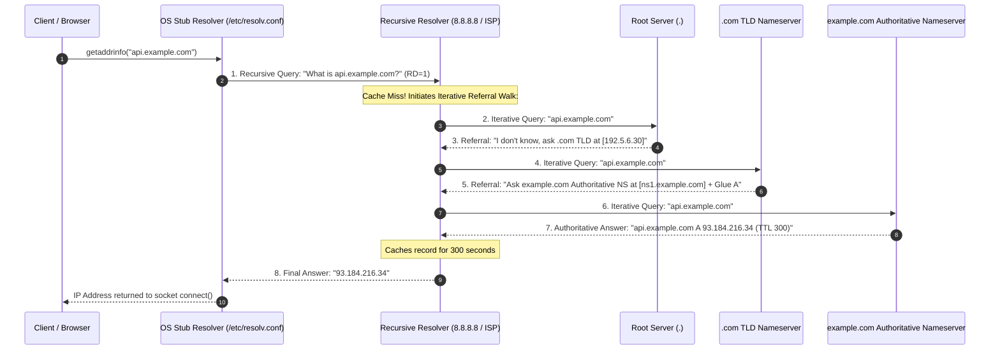
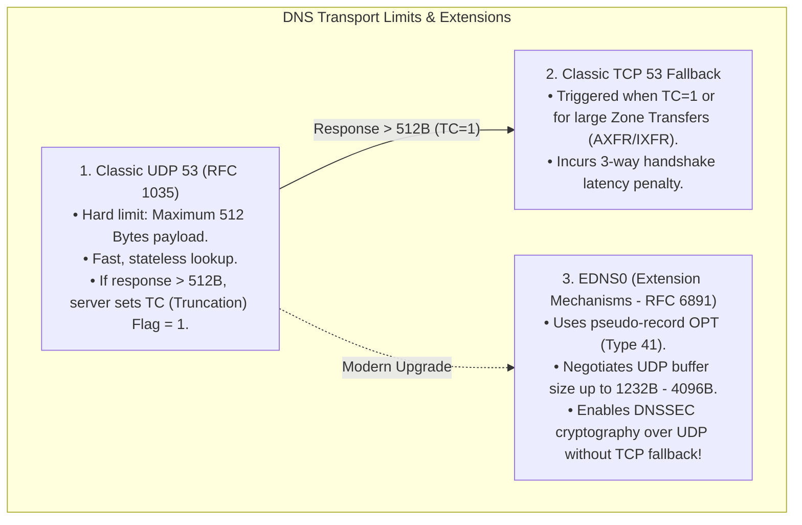
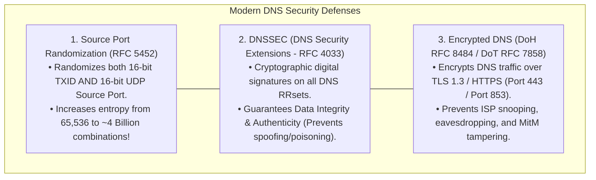
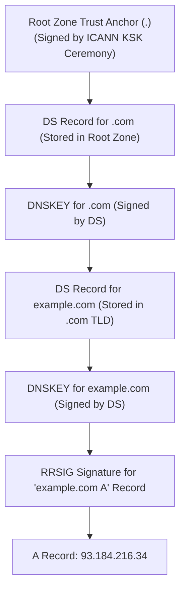

# Domain Name System (DNS): Hierarchy, Resolution Mechanics, EDNS0, and DNSSEC

> [!abstract] Mental Model
> - **The Globally Distributed Federated Phonebook**: Network routing operates exclusively on binary IP addresses, whereas human cognition requires semantic labels (`example.com`).
> - **DNS (RFC 1034 / 1035 / 6891 / 4033)** is a globally distributed, hierarchical, eventually consistent database processing trillions of lookups per second across UDP/TCP port 53. It uses a **delegated referral walk**, aggressive caching TTLs, and cryptographic **DNSSEC trust chains** to bind human names to machine addresses securely.

---

## 1. The Distributed Hierarchical Tree Structure



---

## 2. The 8-Step Recursive vs Iterative Resolution Walk



---

## 3. Core Resource Record (RR) Taxonomy

A DNS record is defined by the standard tuple: `[Name] [TTL] [Class: IN] [Type] [RDATA]`.

| Record Type | Description & Semantic Function | Critical Production Invariants |
| :--- | :--- | :--- |
| **`A`** | Host IPv4 mapping ($32\text{-bit}$ address). | Primary routing target for IPv4 traffic. |
| **`AAAA`** | Host IPv6 mapping ($128\text{-bit}$ address). | Quad-A record; preferred by modern dual-stack stacks. |
| **`CNAME`** | Canonical Name alias (maps one name to another). | **RFC 1912 Restriction**: Cannot coexist with any other record type at the zone apex (`@`)! |
| **`ALIAS / ANAME`** | Virtual record synthesized by DNS providers (Cloudflare/Route53). | Flattens CNAMEs at the apex to return `A/AAAA` records dynamically. |
| **`MX`** | Mail Exchange routing for domain. | Includes 16-bit priority integer (lower number = higher preference). |
| **`TXT`** | Human/machine-readable arbitrary text. | Houses **SPF**, **DKIM public keys**, and domain verification tokens. |
| **`PTR`** | Pointer record for Reverse DNS lookups. | Maps IP to name in `in-addr.arpa` (IPv4) or `ip6.arpa` (IPv6). |
| **`NS`** | Authoritative Name Server delegation. | Specifies which nameservers hold authority over the zone. |
| **`SOA`** | Start of Authority metadata. | Zone Serial number, Primary master, Refresh/Retry timers, and **Negative Caching TTL (RFC 2308)**. |
| **`SRV`** | Generic Service Locator. | Defines `_service._proto.name TTL IN SRV priority weight port target` (used in Consul, Kubernetes, SIP). |

---

## 4. Transport Mechanics: UDP 53 vs TCP 53 & EDNS0



---

## 5. Security Architecture: Cache Poisoning & DNSSEC

### The Threat: Kaminsky DNS Cache Poisoning (2008)
An attacker floods a recursive resolver with fake answers for a victim domain (`bank.com`), attempting to guess the **16-bit Transaction ID (TXID)** before the legitimate authoritative server responds.



---

### The DNSSEC Chain of Trust



- **`RRSIG`**: Cryptographic digital signature covering an RRset.
- **`DNSKEY`**: Public key used to verify `RRSIG`.
- **`DS` (Delegation Signer)**: SHA-256 hash of child's `DNSKEY` published in parent zone.
- **`NSEC / NSEC3`**: Authenticated cryptographic denial-of-existence (proves a name does *not* exist without leaking zone records via zone walking).

---

## Production Diagnostics & Resolution Inspection

```bash
# 1. Trace the Full Hierarchical Referral Walk from Root to Leaf:
dig +trace +nodnssec api.example.com

# Output:
# .                   518400  IN  NS  a.root-servers.net.
# com.                172800  IN  NS  a.gtld-servers.net.
# example.com.        172800  IN  NS  ns1.example.com.
# api.example.com.    300     IN  A   93.184.216.34

# 2. Inspect DNSSEC Signatures and Key Records:
dig +dnssec example.com A

# Output:
# example.com.        300  IN  A      93.184.216.34
# example.com.        300  IN  RRSIG  A 13 2 300 20260825000000 20260810000000 34521 example.com. ...

# 3. Perform a Reverse DNS PTR Lookup:
dig -x 8.8.8.8 +short
# dns.google.

# 4. Check SOA Serial and Timers:
dig SOA example.com +short
# ns1.example.com. hostmaster.example.com. 2026081801 7200 3600 1209600 300
```

---

## Active Recall & Interview Perspective

### Reasoning Prompts
1. *Why does the DNS specification (RFC 1912) forbid placing a CNAME record at the zone apex (`@` / `example.com`), and how do cloud providers bypass this?*
   - **Answer**: The DNS specification mandates that if a `CNAME` record exists for a node, no other data records may exist for that same name. However, the **zone apex** (`example.com`) is fundamentally required to hold other records—namely `SOA` (Start of Authority) and `NS` (Name Server) records for zone delegation and authority. Placing a `CNAME` at `@` violates this exclusivity rule and breaks DNS delegation. Cloud providers bypass this via proprietary **CNAME Flattening / ALIAS / ANAME records**: the nameserver intercepts the lookup, resolves the target CNAME dynamically in backend recursive memory, and serves the resulting `A` or `AAAA` IP addresses directly at the apex.
2. *What is the difference between a Recursive DNS Resolver and an Authoritative Nameserver?*
   - **Answer**: A **Recursive Resolver** (e.g. `8.8.8.8`, `1.1.1.1`, or an ISP resolver) is a client-facing intermediary that possesses no original zone data of its own. When queried by a stub resolver, it performs the complete multi-step referral walk across the internet hierarchy (Root $\to$ TLD $\to$ Authoritative), caches the responses according to TTL, and returns the final resolved IP. In contrast, an **Authoritative Nameserver** (e.g. `ns1.example.com`) is the authoritative source of truth for a specific delegated domain zone; it holds the original Resource Records configured by the domain owner and returns authoritative answers (or delegation referrals) directly to recursive resolvers.
3. *How does DNSSEC provide end-to-end cryptographic trust, and why does it not protect user privacy?*
   - **Answer**: DNSSEC creates an unbroken **Chain of Trust** from the ICANN Root Trust Anchor down to individual DNS records. Every Resource Record Set (RRset) is cryptographically signed by a Zone-Signing Key into an **`RRSIG`** record. The corresponding public keys are published in **`DNSKEY`** records, whose cryptographic hashes are registered in the parent zone as **`DS (Delegation Signer)`** records. A validating resolver verifies every link in this chain up to the root anchor, guaranteeing **data integrity** and **authenticity** (preventing cache poisoning). However, DNSSEC **does NOT encrypt DNS payloads**: queries and responses remain plaintext UDP/TCP packets readable by intermediate ISPs and network eavesdroppers. True privacy requires transport encryption such as **DoH (DNS over HTTPS)** or **DoT (DNS over TLS)**.

---

## Key Takeaways
- DNS is a **Distributed Hierarchical Database** (`Root -> TLD -> Authoritative`).
- **Recursive Resolvers** execute iterative referral walks on behalf of stub clients.
- **EDNS0 (RFC 6891)** expands UDP buffers beyond 512 bytes for DNSSEC.
- **DNSSEC** guarantees **Authenticity and Integrity** via `RRSIG`, `DNSKEY`, and `DS` chains of trust.
- **DoH / DoT** provide **Privacy / Confidentiality** via TLS encryption.

---

## Related Notes
- [[Computer Networks MOC]] — Master table of contents for Computer Networks.
- [[User Datagram Protocol - UDP Architecture and Checksum]] — DNS UDP transport mechanics.
- [[Transmission Control Protocol - TCP Header, Features, and Invariants]] — TCP fallback on truncation (`TC=1`).
- [[Hypertext Transfer Protocol - HTTP 1.0, 1.1, Pipelining, Persistent Connections]] — Web requests initiated via DNS.
- [[Dynamic Routing of Web Traffic - Anycast, CDN Architecture, Edge Computing]] — DNS-based load balancing and Anycast root servers.
- [[Transport Layer Security - TLS 1.2 vs TLS 1.3 Handshake]] — Foundation of DoH and DoT.
