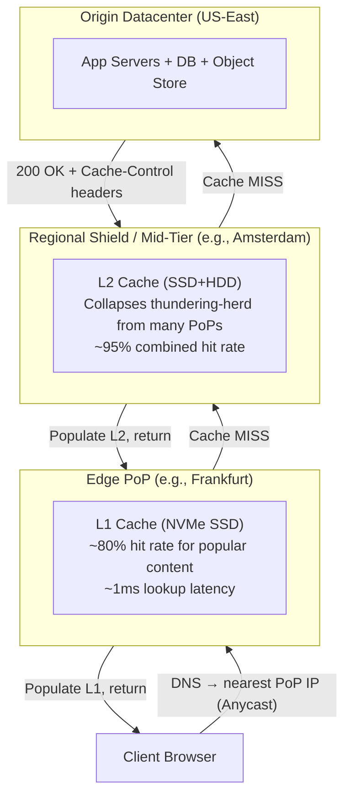
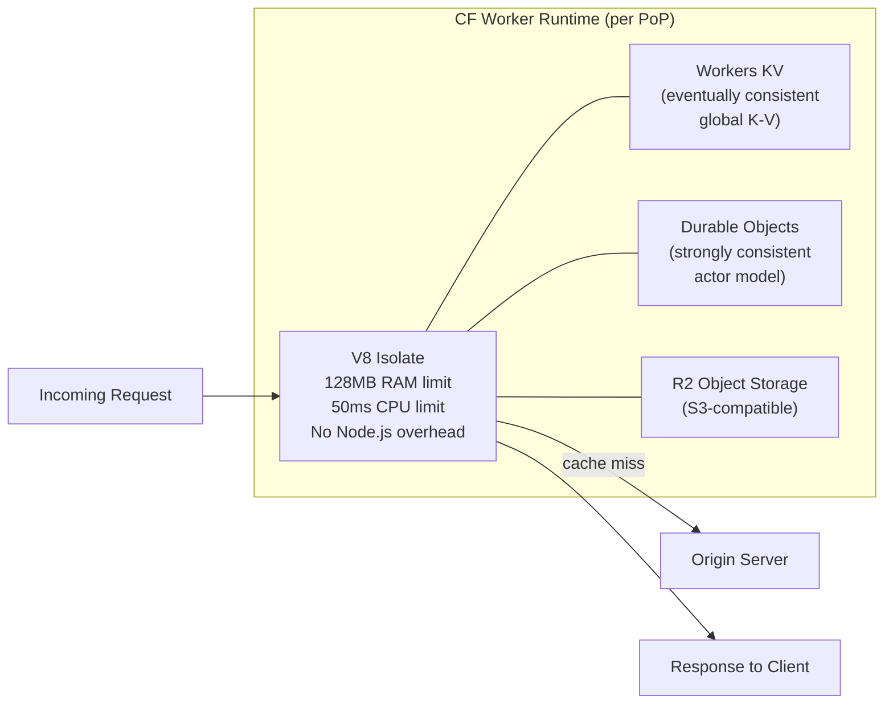
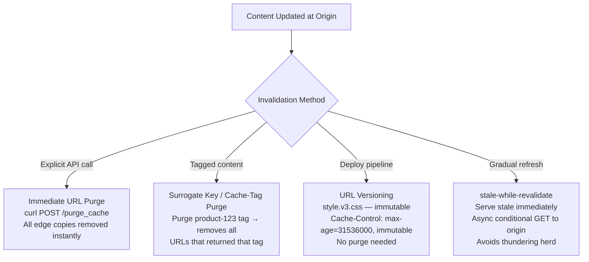
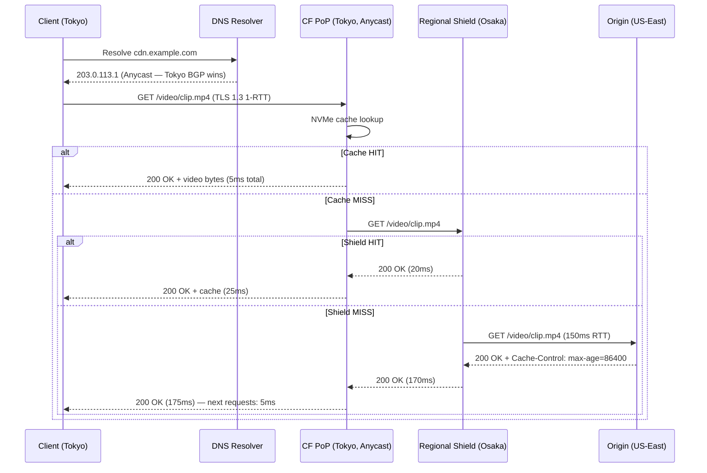

# Dynamic Routing of Web Traffic — Anycast, CDN Architecture, Edge Computing

## Mental Model

Think of the Internet as a courier network where every post office (Point of Presence / PoP) holds **identical packages** (cached content). When you mail a request, the postal routing system (BGP) automatically forwards it to the **nearest post office** that holds a copy — not the headquarters in a distant city. This is **Anycast**: one IP address, many geographic servers, BGP picks the winner.

A **CDN** extends this by adding a **tiered caching hierarchy**: edge PoPs cache content from regional mid-tier caches, which cache from the origin. Your video frame is served from 5 ms away instead of 200 ms from the origin datacenter.

**Edge Computing** takes this further: instead of just serving static cached bytes, the post office can actually *run code* — route requests, personalize responses, enforce auth — before a packet ever reaches the origin.

---

## 1. Anycast Mechanics — Deep Dive

### BGP Anycast Prefix Announcement

Multiple PoPs simultaneously announce the same IP prefix into global BGP. Every ISP router selects one winner per its own best-path calculation, so **different parts of the Internet converge on different PoPs** — geographic proximity emerges naturally from IGP metric differences.

```
Single Anycast Prefix: 203.0.113.0/24
Announced simultaneously from:
  ├── AS64512  Frankfurt PoP
  ├── AS64513  Singapore PoP
  └── AS64514  São Paulo PoP

European client → Frankfurt wins (lowest IGP metric to AS64512 peer)
Asian client    → Singapore wins (lowest IGP metric to AS64513 peer)
```

### BGP Best-Path Selection for Anycast

| Step | Attribute | Winner Logic |
|------|-----------|--------------|
| 1 | **Weight** (Cisco-local) | Highest wins |
| 2 | **Local Preference** | Highest wins |
| 3 | **AS Path Length** | Shortest wins |
| 4 | **Origin** | IGP < EGP < Incomplete |
| 5 | **MED** | Lowest wins (same AS only) |
| 6 | **eBGP vs iBGP** | eBGP preferred |
| 7 | **IGP metric to next-hop** | **Lowest wins — drives geo-proximity** |
| 8 | **Router ID** | Tie-break |

> In anycast, steps 1–6 tie. Step 7 (IGP cost to reach the BGP peer) is what routes European traffic to Frankfurt and Asian traffic to Singapore.

### Anycast Failover and BGP Convergence

When a PoP fails → its BGP speakers send **WITHDRAW** messages upstream.

| Scope | Convergence Time |
|-------|-----------------|
| iBGP within AS (route reflectors) | 1–5 seconds |
| eBGP across IXPs (peered ISPs) | 5–30 seconds |
| Full Internet convergence | 30–180 seconds (MRAI timer limited) |

**Acceleration techniques**: BFD (Bidirectional Forwarding Detection) detects link failure in < 1s; ExaBGP health-check scripts trigger WITHDRAW instantly on app failure.

---

## 2. CDN Architecture — Tiered Cache Hierarchy



### Request Latency Budget

| Phase | Description | Latency |
|-------|-------------|---------|
| DNS | Client resolves CDN hostname (Anycast or GeoDNS) | 10–50ms (cached: ~0) |
| TCP/TLS to PoP | Handshake to nearest PoP | 10–60ms RTT |
| Edge cache HIT | NVMe SSD lookup + response | +0.5–2ms |
| Edge MISS → Shield | PoP fetches from regional shield | +5–20ms |
| Shield MISS → Origin | Shield fetches from origin | +50–300ms |

### Cache-Control Semantics for CDN

```
Cache-Control: public, max-age=86400, stale-while-revalidate=3600
  └── public          → CDN may cache
  └── max-age=86400   → Fresh for 24h
  └── stale-while-revalidate=3600 → Serve stale for 1h while async revalidation runs

Cache-Control: private        → CDN MUST NOT cache (user-specific content)
Cache-Control: no-store       → Nobody caches
Vary: Accept-Encoding         → CDN caches separate copies per encoding variant
Surrogate-Key: product-123    → Fastly/Varnish tag for bulk purge
Cache-Tag: product-123        → Cloudflare tag for bulk purge
```

---

## 3. Edge Computing — V8 Isolates and Serverless at the PoP

### Execution Model Comparison

| Model | Location | Cold Start | State | Use Cases |
|-------|----------|------------|-------|-----------|
| **Origin server** | 1–3 DCs | None | Full DB | Complex business logic |
| **CDN Edge Function** (CF Workers) | 300+ PoPs | ~1ms (V8 isolate) | KV store | Auth, routing, A/B tests |
| **Edge Container** (Fastly Compute) | 30+ PoPs | ~50ms | KV + Object Store | Image transforms, heavier logic |

### Cloudflare Workers — V8 Isolate Model



### Production Edge Function — JWT Auth + A/B Routing

```javascript
// Cloudflare Worker: edge auth + A/B experiment + personalized caching
export default {
  async fetch(request, env, ctx) {
    const url = new URL(request.url);

    // 1. Auth enforcement at edge — before origin ever sees the request
    const token = request.headers.get('Authorization')?.replace('Bearer ', '');
    if (!token && url.pathname.startsWith('/api/')) {
      return new Response('Unauthorized', { status: 401 });
    }

    // 2. Stable A/B assignment (consistent hash per user ID)
    const userId = request.headers.get('X-User-ID') ?? 'anon';
    const bucket = parseInt(userId.slice(-4), 16) % 100; // 0-99
    const variant = bucket < 20 ? 'v2-experiment' : 'control';

    // 3. Construct personalized cache key
    const cacheKey = new Request(`${url.origin}${url.pathname}?variant=${variant}`, {
      method: 'GET',
      headers: { 'Accept-Language': request.headers.get('Accept-Language') ?? 'en' }
    });

    // 4. Cache lookup
    const cache = caches.default;
    let response = await cache.match(cacheKey);
    if (response) return response; // Cache HIT

    // 5. Fetch from origin with variant header
    const originReq = new Request(request.url, request);
    originReq.headers.set('X-AB-Variant', variant);
    response = await fetch(originReq);

    // 6. Store in edge cache (non-blocking via waitUntil)
    if (response.status === 200) {
      const cacheable = new Response(response.body, response);
      cacheable.headers.set('Cache-Control', 'public, max-age=60');
      ctx.waitUntil(cache.put(cacheKey, cacheable.clone()));
    }

    return response;
  }
};
```

---

## 4. GeoDNS vs Anycast

| Dimension | Anycast | GeoDNS |
|-----------|---------|--------|
| **Mechanism** | BGP routing (IP layer) | DNS response varies by resolver geo |
| **Granularity** | BGP topology-based | Resolver IP → geo DB lookup |
| **Failover speed** | 30–180s (BGP convergence) | TTL-bounded (30–300s) |
| **DDoS absorption** | Excellent — traffic spread across all announcing PoPs | Moderate — still concentrates per DNS response |
| **Accuracy** | High (follows actual routing) | Medium (resolver geo ≠ client geo, CGNAT, VPNs distort) |
| **Used by** | Cloudflare, Google 8.8.8.8, Fastly | AWS Route 53 latency routing, Akamai GTM |

**Modern CDNs use both**: Anycast for IP routing to the nearest PoP cluster; GeoDNS as a coarse-grained load balancer between PoP clusters in different continents.

---

## 5. Cache Invalidation Strategies



---

## 6. Full Request Lifecycle — Sequence Diagram



---

## 7. Production Diagnostics

```bash
# Check CDN cache headers for a URL
curl -sI https://cdn.example.com/assets/app.js \
  | grep -i 'cache\|cf-cache\|x-cache\|age\|etag'
# cf-cache-status: HIT
# Age: 3621           ← seconds since this edge copy was cached
# ETag: "abc123"

# Cloudflare: purge single URL
curl -X POST "https://api.cloudflare.com/client/v4/zones/${ZONE_ID}/purge_cache" \
  -H "Authorization: Bearer ${CF_TOKEN}" \
  --data '{"files":["https://example.com/assets/app.js"]}'

# Cloudflare: purge by Cache-Tag (Enterprise)
curl -X POST "https://api.cloudflare.com/client/v4/zones/${ZONE_ID}/purge_cache" \
  -H "Authorization: Bearer ${CF_TOKEN}" \
  --data '{"tags":["product-123","homepage"]}'

# Varnish: live cache stats
varnishstat -f cache_hit,cache_miss,backend_conn,backend_fail

# ExaBGP health-check: withdraw anycast prefix on app failure
#!/bin/bash
if ! curl -sf --max-time 2 http://127.0.0.1/health; then
    echo "withdraw route 203.0.113.0/24 next-hop self"
else
    echo "announce route 203.0.113.0/24 next-hop self"
fi
```

---

## 8. Failure Modes and Trade-offs

1. **BGP Convergence Lag** — PoP failure takes 30–180s to propagate globally. *Mitigation*: BFD for sub-second detection + ExaBGP health scripts; pre-drain PoP gracefully before maintenance.

2. **Cache Stampede / Thundering Herd** — Popular TTL expires simultaneously → millions of requests miss to origin. *Mitigation*: `stale-while-revalidate`; probabilistic early expiry (XFetch); Origin Shield collapses misses to 1 per PoP.

3. **Cache Poisoning** — Unkeyed HTTP headers (Host, X-Forwarded-Host) injected into cache key via HTTP request smuggling → malicious response served globally. *Mitigation*: strict cache key normalization, strip unkeyed headers, HRS defenses (HTTP/2 with no smuggling surface).

4. **Anycast + Long-Lived TCP** — Mid-session BGP reroute shifts the PoP → TCP RST. *Mitigation*: Anycast for connection establishment only (ECMP-stable within PoP); QUIC connection migration via Connection ID routing.

5. **Edge Function CPU Limits** — 50ms CPU cap (CF Workers free tier) can truncate heavy operations. *Mitigation*: offload to Durable Objects or origin; use streaming `TransformStream` for large bodies; upgrade to paid tier for 30s limit.

6. **Stale Data in Dynamic Apps** — Over-caching user-specific or frequently-changing content (stock quotes, shopping cart). *Mitigation*: `private` or `no-store` for user content; short TTLs (1–5s) with `stale-while-revalidate` for semi-dynamic; surrogate-key event-driven purge.

7. **Origin Shield Single Point of Failure** — Regional shield outage causes all edge PoPs in that region to miss to origin simultaneously. *Mitigation*: dual shield (primary + fallback); circuit breaker at edge to return stale rather than overwhelming origin.

---

## Active-Recall Prompts

1. **Why does Anycast work well for stateless UDP (DNS) but create problems for long-lived TCP sessions, and how does QUIC connection migration address this?**
2. **Explain the "thundering herd" problem at CDN TTL expiry and describe three concrete mitigation strategies.**
3. **Your CDN cache hit ratio drops from 95% to 40% overnight. Walk through your diagnostic process — what headers, metrics, and logs do you check?**
4. **Compare cache invalidation via TTL expiry, surrogate-key purge, and URL versioning — what are the latency, consistency, and operational trade-offs?**

---

## Related Notes

- [[Border Gateway Protocol - BGP, AS, BGP Peering, Path Attributes]]
- [[Domain Name System - DNS Hierarchy, Recursive Resolution, EDNS, DNSSEC]]
- [[Distributed Denial of Service - DDoS Attack Vectors and Mitigations]]
- [[HTTP-3 and QUIC - UDP-Based Transport, Head-of-Line Blocking Elimination]]
- [[Transport Layer Security - TLS 1.2 vs TLS 1.3 Handshake]]

> **Interview style question:** *"Design a globally-available video streaming CDN for 10M concurrent users. Walk through your Anycast PoP topology, tiered cache hierarchy, cache key strategy, origin shield design, edge compute for personalization, and failure-mode handling for a PoP outage during peak traffic."*

---
