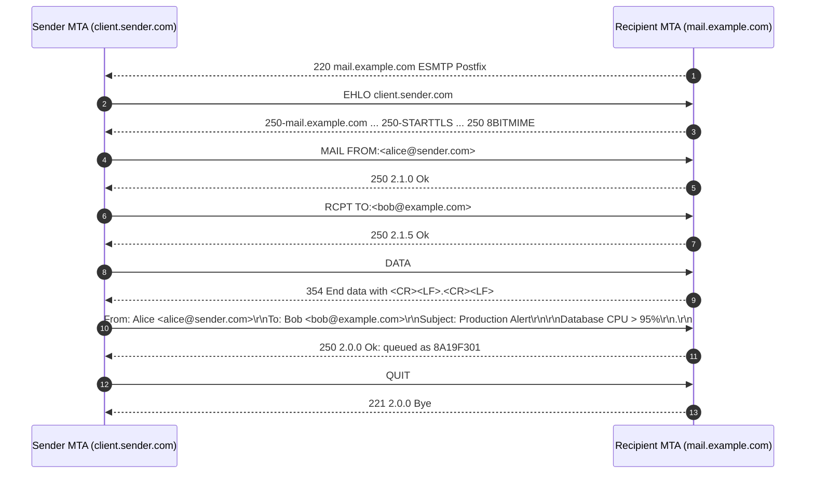
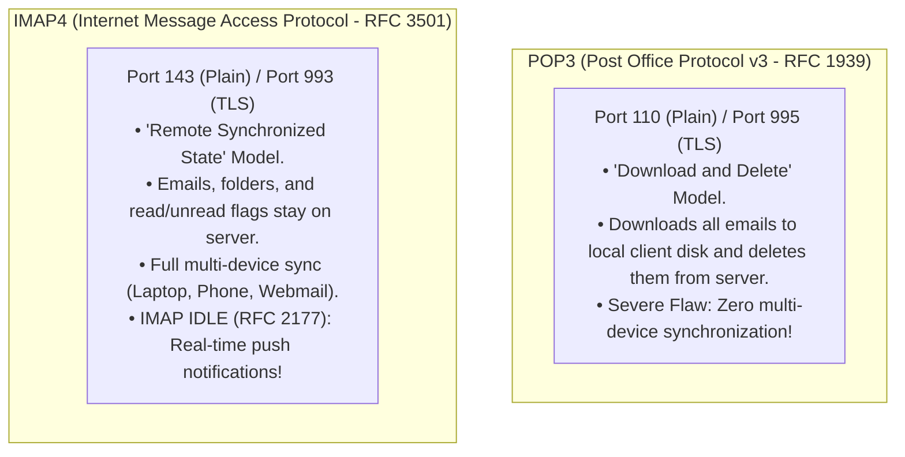
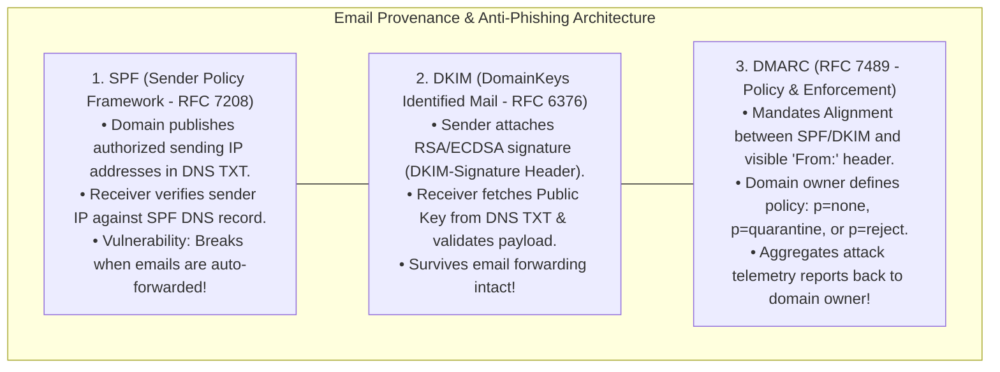

# Email Protocols: SMTP, IMAP, POP3, and the Security Triad (SPF, DKIM, DMARC)

> [!abstract] Mental Model
> - **The Global Asynchronous Store-and-Forward Post Office**: Unlike synchronous web protocols, email is fundamentally **decoupled and asynchronous**—messages are relayed across intermediate mail servers even if the recipient host is offline.
> - **SMTP (RFC 5321)** pushes messages across the internet via **DNS MX routing**, while **POP3 (RFC 1939)** and **IMAP4 (RFC 3501)** pull messages into user inboxes. The anti-spoofing security triad (**SPF, DKIM, DMARC**) establishes cryptographic provenance over an inherently unauthenticated 1980s substrate.

---

## 1. The Distributed Email Lifecycle & Actor Roles

```mermaid
flowchart LR
    MUA_Send["Sender MUA<br/>(Thunderbird / Outlook)"]
    -->|1. SMTP Submission<br/>Port 587 (STARTTLS)| MSA["Sender MSA / MTA<br/>(e.g. Postfix / Google)"]
    
    MSA -->|2. Resolves DNS MX Records| DNS["DNS Server<br/>(Queries 'example.com MX')"]
    
    MSA -->|3. SMTP Relay<br/>Port 25 (STARTTLS)| MTA_Recv["Recipient MTA / MDA<br/>(e.g. Postfix + Dovecot)"]
    
    MTA_Recv -->|4. Writes to Local Mailbox Storage<br/>(Maildir / mbox)| Mailbox[("Server Disk Storage<br/>/var/mail/bob")]
    
    MUA_Recv["Recipient MUA<br/>(Bob's Phone / Laptop)"]
    -->|5. IMAP4 Sync (Port 993 TLS)<br/>or POP3 Pull (Port 995 TLS)| MTA_Recv
```

### Protocol Actor Definitions:
- **MUA (Mail User Agent)**: Client software used to compose, read, and manage email.
- **MSA (Mail Submission Agent)**: Edge server receiving outbound email from authenticated MUAs on **Port 587**.
- **MTA (Mail Transfer Agent)**: Core server routing and relaying messages across the internet on **Port 25**.
- **MDA (Mail Delivery Agent)**: Local server component saving delivered messages into local storage formats (**Maildir** / **mbox**).

---

## 2. SMTP (Simple Mail Transfer Protocol - RFC 5321)

SMTP is an ASCII-based, push-only protocol operating over TCP:



---

## 3. Mailbox Access Protocols: POP3 vs IMAP4



---

## 4. The Anti-Spoofing Security Triad: SPF, DKIM, and DMARC

Because legacy SMTP contains zero origin authentication (any client can claim `MAIL FROM: ceo@bank.com`), the industry mandates three complementary cryptographic DNS mechanisms:



---

### DNS Configuration Syntax for Email Defenses:

```dns
; 1. SPF Record (Only 198.51.100.4 and Google Apps may send for domain):
example.com.  300  IN  TXT  "v=spf1 ip4:198.51.100.4 include:_spf.google.com -all"

; 2. DKIM Record (Public Key for Selector 's2026'):
s2026._domainkey.example.com.  300  IN  TXT  "v=DKIM1; k=rsa; p=MIIBIjANBgkqhkiG9w0BAQEFAAOCAQ8A..."

; 3. DMARC Record (Strictly Reject Spoofed Emails & Send Reports):
_dmarc.example.com.  300  IN  TXT  "v=DMARC1; p=reject; sp=reject; pct=100; rua=mailto:dmarc-reports@example.com"
```

---

## Production Diagnostics & Email CLI Inspection

```bash
# 1. Inspect DNS MX Records for a Domain:
dig MX google.com +short
# 10 smtp.google.com.

# 2. Verify SPF, DKIM, and DMARC Records via dig:
dig TXT example.com +short
# "v=spf1 include:_spf.google.com ~all"

dig TXT _dmarc.example.com +short
# "v=DMARC1; p=reject; rua=mailto:dmarc-rua@example.com"

# 3. Test SMTP TLS Handshake & STARTTLS via OpenSSL:
openssl s_client -connect smtp.gmail.com:587 -starttls smtp -crlf
```

---

## Active Recall & Interview Perspective

### Reasoning Prompts
1. *Why does SPF validation fail when an email is legitimately forwarded (such as via a mailing list), and how does DKIM solve this?*
   - **Answer**: SPF validates the authenticity of an email by comparing the physical **IP address of the connecting SMTP server** against the list of authorized IPs published in the sender domain's DNS SPF record. When User A (`alice@sender.com`) sends an email to a mailing list (`list@forwarder.com`), which forwards it to User B (`bob@receiver.com`), the final delivery connection is initiated by the forwarder's IP address (`forwarder.com`). The recipient MTA checks `sender.com`'s SPF record, sees that `forwarder.com`'s IP is not listed, and flags the email as an SPF `Fail`. **DKIM (RFC 6376)** solves this by creating a cryptographic signature across the email body and headers using the sender's private key, attaching the signature in the `DKIM-Signature` header. Because the public key is hosted in `sender.com`'s DNS and forwarding does not modify the message body, the signature remains mathematically valid regardless of how many intermediate MTAs or forwarders relay the email.
2. *What is the architectural difference between the SMTP Envelope (`MAIL FROM` / `RCPT TO`) and the message MIME Headers (`From:` / `To:`)?*
   - **Answer**: The **SMTP Envelope** (`MAIL FROM` and `RCPT TO` commands emitted during the SMTP dialogue) represents the transport routing layer consumed by Mail Transfer Agents to deliver the message to the correct destination mailbox, analogous to the address written on a physical paper envelope. The **MIME Message Headers** (the text block inside the `DATA` command such as `From:`, `To:`, `Subject:`) represent the application-layer presentation layer rendered to the human user in their email client. The two can be completely different: for example, in **Blind Carbon Copy (BCC)**, the recipient's address appears in the envelope `RCPT TO` so the MTA can deliver it, but is completely omitted from the MIME `To:` header so other recipients cannot see who was BCC'd. Attackers exploit this decoupling to spoof visible `From:` headers while using their own throwaway domains in `MAIL FROM`, which **DMARC alignment** was explicitly designed to prevent.
3. *Why has IMAP completely displaced POP3 in modern enterprise environments?*
   - **Answer**: POP3 operates on a primitive "Download and Delete" paradigm where messages are fetched from the server and saved locally onto a single client device. If a user reads or deletes an email on their laptop, those changes are completely invisible to their mobile phone. **IMAP4** maintains a **persistent synchronized server-side state**: all emails, nested folder structures, flags (read, replied, flagged), and search indexes reside on the server. Multiple MUAs across laptops, smartphones, and webmail clients maintain identical views in real-time. Furthermore, IMAP supports **`IMAP IDLE` (RFC 2177)**, which keeps a persistent TCP connection open so the mail server can push instantaneous notifications to mobile devices the millisecond a new email arrives without battery-draining polling.

---

## Key Takeaways
- **SMTP (Port 25/587)** pushes mail between servers; **IMAP4 (Port 993)** synchronizes remote mailboxes.
- **Envelope vs Header**: Routing relies on `MAIL FROM / RCPT TO`; display relies on `From: / To:`.
- **SPF**: IP-based sender authorization (fails on forwarding).
- **DKIM**: Cryptographic digital signature (survives forwarding).
- **DMARC**: Strict alignment enforcement and policy rejection (`p=reject`).

---

## Related Notes
- [[Computer Networks MOC]] — Master table of contents for Computer Networks.
- [[Transmission Control Protocol - TCP Header, Features, and Invariants]] — L4 transport substrate.
- [[Domain Name System - DNS Hierarchy, Recursive Resolution, EDNS, DNSSEC]] — MX, SPF, DKIM, DMARC lookups.
- [[Transport Layer Security - TLS 1.2 vs TLS 1.3 Handshake]] — STARTTLS and SMTPS encryption.
- [[PKI, X.509 Certificates, and Certificate Authorities]] — Certificate chains for mail servers.
- [[Man-in-the-Middle - MitM, ARP Spoofing, DNS Cache Poisoning]] — Threat vector against unencrypted SMTP.
